# Brainstorming
### 🌳 Serene: Product Vision Brief

**Serene** is an evidence-based mental wellness ecosystem for students, delivered via mobile and web apps. It is designed to move students from a state of _languishing_ to _flourishing_ by providing two distinct, integrated toolkits:

1. **A Reactive Toolkit** for managing acute, in-the-moment distress.
    
2. **A Proactive Toolkit** for building long-term resilience, connection, and well-being.
    

### 📱 Platform Strategy: The "Optimized Experience" Model

Serene will have **100% feature access** on both mobile and web, but the design of each platform will be **optimized** for its specific use case. This ensures a user can access any tool they need, but the experience is never cramped or frustrating.

1. The Mobile App (The "In-the-Moment" Companion)
    
    This is the Reactive and Daily Check-in tool. It's personal, private, and always accessible.
    
    - **Primary Use:** Immediate symptom relief, daily logging, and proactive social "nudges."
        
    - **Key Features:**
        
        - **"The Anchor" Panic Button:** The one-touch crisis tool. This _must_ be on mobile for immediate access during a panic attack.
            
        - **Daily Mood Tracker:** Quick, simple check-ins. When a negative mood is logged, the app immediately offers a productive tool (e.g., "Thought Reframer").
            
        - **"The 'Nod' Challenge":** Uses push notifications to deliver proactive social challenges.
            
        - **The "Companion" Home Screen:** The user's self-care "mirror" is front and center.
            
2. The Web App (The "Deep Work" Dashboard)
    
    This is the Proactive and Reflective tool. It provides the space and focus needed for deeper cognitive work.
    
    - **Primary Use:** Weekly planning, in-depth journaling, and reviewing long-term progress.
        
    - **Key Features:**
        
        - **"Thought Reframer" Diary:** The full-screen interface makes it easier to type out and work through the 6-step cognitive restructuring process.
            
        - **"The Proactive Planner":** Ideal for desktop use, allowing students to set SMART goals and manage academic stress alongside their wellness goals.
            
        - **Progress Dashboard:** A larger-format view for visualizing mood trends, completed activities, and journal entries.
            
        - **Journal & Prompt Library:** A quiet, focused writing environment.
            

### 🧭 Core Feature Pillars (The Dual-Track Toolkit)

This is how we organize the features from your notes into a clear user experience.

#### Pillar 1: The Reactive Toolkit (For Acute Distress)

- **Feature: "The Anchor"**
    
    - A single, large button on the mobile app's home screen (and a persistent header button on web).
        
    - Pressing it gives two immediate choices:
        
        1. **"I need a Distraction"** (Launches a cognitive grounding game, e.g., "Name 5 states...").
            
        2. **"I need a Technique"** (Launches a guided 5-4-3-2-1 audio exercise).
            

#### Pillar 2: The Proactive Toolkit (For Long-Term Flourishing)

- **Cognitive Skills: "Thought Reframer"**
    
    - A guided CBT journal to challenge negative thoughts.
        
    - Guides the user through: Situation $\rightarrow$ Emotion $\rightarrow$ Automatic Thought $\rightarrow$ Challenge $\rightarrow$ Balanced Thought $\rightarrow$ Re-rate Emotion.
        
- **Behavioral Skills: "Activity Scheduler"**
    
    - A simple planner prompting users to schedule and check off "pleasurable activities" and "tasks" (a core part of Behavioral Activation for depression).
        
- **Social Skills: "The 'Nod' Challenge"**
    
    - Proactively sends small social challenges (e.g., "Text a classmate 'thank you'").
        
    - Includes a "Reflection" prompt to help reframe the anxiety of reaching out.
        

### 💖 The Ethical Engagement Model

This is Serene's "secret sauce," designed to build trust and intrinsic motivation.

- **The "Companion" (Instead of a Pet):**
    
    - The home screen features a plant, animal, or abstract shape.
        
    - It **mirrors the user's self-care**. When the user completes a "Thought Reframer" or a meditation, the Companion flourishes.
        
    - It **never gets sick, dies, or looks sad**. If the user is inactive, the Companion simply waits. This eliminates shame and pressure.
        
- **"Shame-Free Streaks":**
    
    - The app celebrates momentum but allows for free "pauses" for exams or weekends.
        
    - This avoids punishing users for being busy or unwell, which is a key "dark pattern" to avoid.
        
- **Privacy-First:**
    
    - All journal entries and mood logs are private, encrypted, and never shared. This trust is fundamental.

```mermaid
erDiagram
    %% ---
    %% This is the central entity for the entire app.
    %% ---
    User {
        string userId PK "Primary Key"
        string email "User's login (or other auth ID)"
        string goals "Array of initial goals"
        string companionType "e.g., 'plant', 'fox', 'orb'"
        timestamp createdAt
    }

    %% ---
    %% This tracks the user's daily mood.
    %% ---
    MoodLog {
        string moodLogId PK
        string userId FK "Links to User"
        string mood "e.g., 'Sad', 'Anxious', 'Calm'"
        string triggers "Optional array of triggers"
        timestamp timestamp
    }

    %% ---
    %% This is the core 'Thought Reframer' (CBT) feature.
    %% ---
    ThoughtReframerEntry {
        string entryId PK
        string userId FK "Links to User"
        string situation
        string initialEmotion
        int initialRating "1-10"
        string automaticThought
        string challenge "User's challenge to the thought"
        string balancedThought
        int finalRating "1-10"
        timestamp createdAt
    }

    %% ---
    %% This is for the private 'Journal & Prompt Library'.
    %% ---
    JournalEntry {
        string journalEntryId PK
        string userId FK "Links to User"
        string content "Encrypted journal text"
        string promptId "Optional: links to a library of prompts"
        timestamp createdAt
    }

    %% ---
    %% This powers the 'Proactive Planner' & 'Activity Scheduler'.
    %% ---
    ScheduledActivity {
        string activityId PK
        string userId FK "Links to User"
        string title
        string type "Enum: ACADEMIC, PLEASURE, TASK"
        string smartGoalId "Optional: groups tasks under one SMART goal"
        timestamp scheduledFor
        boolean isCompleted
    }

    %% ---
    %% This logs entries for 'The Nod Challenge'.
    %% ---
    NodChallengeLog {
        string nodLogId PK
        string userId FK "Links toVUser"
        string challengeId "Links to a library of challenges"
        string reflection "User's reflection after completing"
        boolean isCompleted
        timestamp sentAt
    }

    %% ---
    %% This tracks the 'Companion' state, which mirrors self-care.
    %% ---
    Companion {
        string companionId PK
        string userId FK "Links 1:1 to User"
        int flourishLevel "Calculated from user's self-care activities"
        timestamp lastActivityAt "Used to update flourish state"
    }

    %% ---
    %% Defining the relationships between the tables
    %% ---
    User ||--o{ Companion : "has one"
    User ||--|{ MoodLog : "has many"
    User ||--|{ ThoughtReframerEntry : "has many"
    User ||--|{ JournalEntry : "has many"
    User ||--|{ ScheduledActivity : "has many"
    User ||--|{ NodChallengeLog : "has many"
```

