# Chapter 10 Economics  
  
# What Is Money, and Why Do We Need It?  
**LO 10.1** **Define money and discuss the four functions of money.**  
Could an economy function without money? There are historical examples of economies in which people traded goods for other goods rather than use money. For example, Canada’s Indigenous people historically traded furs for European products without using money. Most economies, though, use money. The economic definition of **++[money](https://plus.pearson.com/epub/bronte/BRNT-SITHABGCXI/v12/OPS/xhtml/glossary.xhtml#key-c95259de-1fd7-5981-8dae-f8f1dc4bd64f)++** is any asset that people are generally willing to accept in exchange for goods and services or for payment of debts. Recall that an **++[asset](https://plus.pearson.com/epub/bronte/BRNT-SITHABGCXI/v12/OPS/xhtml/glossary.xhtml#key-05fac943-80a7-5241-b237-80e7aef62b19)++** is anything of value owned by a person or a firm. There are many possible kinds of money: In West Africa, at one time, cowrie shells served as money. During World War II, Allied prisoners of war in German POW camps used cigarettes as money.  
## Barter and the Invention of Money  
To understand the importance of money, let’s consider further the situation in economies that do not use money. Economies in which goods and services are traded directly for other goods and services are called *barter economies*. Barter economies have a major shortcoming. To illustrate this shortcoming, consider a farmer on the recently settled prairies. Suppose the farmer needed a cow and proposed trading a spare plow to a neighbour for one of the neighbour’s cows. If the neighbour did not want the plow, the trade would not happen. For a barter trade to take place between two people, each person must want what the other one has. Economists refer to this requirement as a *double coincidence of wants*. The farmer who wants the cow might eventually be able to obtain one if he first trades with some other neighbour for something the neighbour with the cow wants. But it may take several trades before the farmer is ultimately able to trade for what the neighbour with the cow wants. Locating several trading partners and making several intermediate trades can take considerable time and effort.  
To avoid the problems with barter, societies have an incentive to identify a product that most people will accept in exchange for what they have to trade. For example, in colonial times, animal skins were very useful in making clothing. The European demand for beaver fur meant that beaver pelts often traded as money among settlers and Indigenous groups. A good used as money that also has value independent of its use as money is called **++[commodity money](https://plus.pearson.com/epub/bronte/BRNT-SITHABGCXI/v12/OPS/xhtml/glossary.xhtml#key-d8101684-231a-547c-b608-2f28b665b9b7)++**. Historically, once a good became widely accepted as money, even people who did not have an immediate use for it would be willing to accept it. Early settlers or members of an Indigenous group might not really want a beaver pelt, but they would take it knowing that it could be traded for something they really did want.  
Buying and selling goods and services is much easier when money becomes available. People only need to sell what they have for money and then use the money to buy what they want. If our fictitious farmer could find someone to buy his plow, he could use the money to buy the cow he wanted. The neighbour with the cow would accept the money because he knew he could use it to buy what he wanted. When money is available, people are more likely to specialize and less likely to produce everything or nearly everything they need themselves.  
Most people in modern economies are highly specialized. They do only one thing—work as a nurse, an accountant, or an engineer—and use the money they earn to buy everything else they need. As we discussed in Chapter 2, Section 2.2, people become much more productive by specializing because they can pursue their *comparative advantage*. The high income levels in modern economies are based on the specialization that money makes possible. So, the answer to the question “Why do we need money?” is that *by making exchange easier, money allows people to specialize, become more productive, and earn higher incomes*.  
  
  
## The Functions of Money  
Anything used as money—whether a beaver pelt, a cowrie seashell, cigarettes, or a dollar bill—must serve four key functions in the economy:  
1. It must act as a medium of exchange.  
2. It must serve as a unit of account.  
3. It must serve as a store of value.  
4. It must provide a standard of deferred payment.  
## Medium of Exchange  
Money serves as a medium of exchange when sellers are willing to accept it in exchange for goods or services. When the local supermarket accepts your $5 bill in exchange for bread and milk, the $5 bill is serving as a medium of exchange. With a medium of exchange, people can sell goods and services for money and use the money to buy what they want. An economy is more efficient when people accept a single good as a medium of exchange.  
## Unit of Account  
In a barter system, each good has many prices. A cow may be worth two plows, 20 bushels of wheat, or six axes. When only one good is used as money, each good has a single price rather than many prices. This function of money gives buyers and sellers a *unit of account*, a way of measuring value in the economy in terms of money. Because the Canadian economy uses dollars as money, each good has a price in terms of dollars.  
## Store of Value  
Money allows people to easily store value: If you do not use all your dollars to buy goods and services today, you can hold the rest to use in the future. Money is not the only store of value, however. Any asset—shares of Facebook stock, Canada bonds, real estate, or Renoir paintings, for example—represents a store of value. *Financial assets*, such as stocks and bonds, offer an important benefit relative to holding money because they pay a higher rate of interest or may increase in value in the future. Other assets also have advantages relative to money because they provide services. A house, for example, offers you a place to sleep.  
Why, then, do people hold any money? The answer has to do with *liquidity*, or the ease with which people can convert an asset into the medium of exchange. Because money is the medium of exchange, it is the most liquid asset. If you want to buy something and you need to sell an asset to do so, you are likely to incur a cost. For example, if you want to buy a car and need to sell bonds or stocks to do so, you will have to pay a commission. To avoid such costs, people are willing to hold some of their wealth in the form of money, even though other assets offer greater returns as stores of value.  
## Standard of Deferred Payment  
Money is useful because it can provide a standard of deferred payment in borrowing and lending. It can facilitate exchange at a *given point in time* by providing a medium of exchange and unit of account. Money can facilitate exchange *over time* by providing a store of value and a standard of deferred payment. For example, Dell, a computer manufacturer, may buy hard drives from Western Digital in exchange for the promise of making payment in 60 days.  
How important is it that money be a reliable store of value and standard of deferred payment? People care about how much food, clothing, and other goods and services their dollars will buy. In other words, the value of money depends on its *purchasing power*, which is its ability to buy goods and services. Inflation causes a decline in purchasing power because with rising prices, a given amount of money can purchase fewer goods and services. When inflation reaches very high levels, money is no longer a reliable store of value or standard of deferred payment.  
  
## What Can Serve as Money?  
Having a medium of exchange helps make transactions easier, which allows the economy to work more efficiently. But what can serve as money? That is, which assets can be used as the medium of exchange? We saw earlier that to serve as money, an asset must, at a minimum, be generally accepted as payment. In practical terms, however, it must be even more. These five criteria make an asset suitable for use as a medium of exchange:  
1. The asset must be *acceptable* to (that is, usable by) most people.  
2. It should be of *standardized quality* so that any two units are identical.  
3. It should be *durable* so that value is not lost by its quickly wearing out.  
4. It should be *valuable* relative to its weight so that amounts large enough to be useful in trade can be easily transported.  
5. It should be *divisible* so that it can be used in purchases of both low-priced and high-priced goods.  
Dollar bills meet all these criteria. What determines the acceptability of dollar bills as a medium of exchange? Basically, it is through self-fulfilling expectations: You value something as money only if you believe that others will accept it from you as payment. A society’s willingness to use paper dollars as money is what makes them an acceptable medium of exchange.  
## Commodity Money  
Commodity money has value independent of its use as money. Gold, for example, was a common form of money in the 1800s and early 1900s because it was a medium of exchange, a unit of account, a store of value, and a standard of deferred payment. But using gold as money involves a significant problem: The money supply is difficult for the government to control because it depends partly on unpredictable discoveries of new gold fields.  
## Fiat Money  
It can be inefficient for an economy to rely only on gold or other precious metals for its money supply. What if you had to transport bars of gold to settle your transactions? Doing so would be difficult and costly, and you would run the risk of being robbed. To avoid this problem, beginning around the year 1500 in Europe, governments and private firms—early banks—began to store gold and issue paper certificates that could be redeemed for gold. As long as people had confidence that the gold was available if they demanded it, the paper certificates would circulate as a medium of exchange. In effect, paper currency had been invented. In modern economies, paper currency is generally issued by a *central bank*, which is an agency of the government that regulates the money supply. The **++[Bank of Canada](https://plus.pearson.com/epub/bronte/BRNT-SITHABGCXI/v12/OPS/xhtml/glossary.xhtml#key-175c6fff-bdba-541d-9da4-d692d4db48ad)++** is the central bank of Canada. Today, no government in the world issues paper currency that can be redeemed for gold. Paper currency has no value unless it is used as money, and it is therefore not a commodity money. Instead, paper currency is a **++[fiat money](https://plus.pearson.com/epub/bronte/BRNT-SITHABGCXI/v12/OPS/xhtml/glossary.xhtml#key-b131e4e8-6376-5cee-ac1c-392c06fa9df5)++**, which has no value except as money. If paper currency has no value except as money, why do consumers and firms use it?  
Canadian dollars are fiat money, so the Bank of Canada is not required to give you gold or silver for your dollar bills. Bank of Canada currency is *legal tender* in Canada, which means the federal government requires that it be accepted in payment of debts and requires that cash or cheques denominated in dollars be used in payment of taxes. Despite being legal tender, dollar bills would not be a good medium of exchange and could not serve as money if people didn’t usually accept them. The key to this acceptance is that *households and firms have confidence that if they accept paper dollars in exchange for goods and services, the dollars will not lose much value during the time they hold them*. Without this confidence, dollar bills would not serve as a medium of exchange.  
  
___  
  
# How Is Money Measured in Canada Today?  
**LO 10.2** **Discuss the definitions of the money supply used in Canada today.**  
People are interested in the money supply because, as we will see, changes in the money supply can affect other economic variables, including employment, gross domestic product (GDP), and inflation. If the only function of money was to serve as a medium of exchange, then a narrow definition of the money supply should include only currency and chequing account deposits because households and firms can easily use these assets to buy goods and services. A broader definition of the money supply would include other assets that can be used as a medium of exchange even though they are not as liquid as currency or chequing account deposits. For example, you can’t directly buy goods or services with funds in a bank savings (non-chequable) account, but it is easy to withdraw funds from your savings account and then use those funds to buy goods and services.  
  
The Bank of Canada has conducted several studies to determine the appropriate definition of *money*. The job of defining the money supply has become more difficult during the past two decades, as innovation in financial markets and institutions has created new substitutes for traditional chequing account deposits. The Bank of Canada uses six different definitions of the money supply:  
, and M3.  
Next, we will look more closely at the Bank of Canada’s definitions of the money supply. Central banks outside of Canada use similar measures.  
  
  
## The M1+ and M1++ Definitions of the Money Supply  
Panel (a) of ++[Figure 10.1](https://plus.pearson.com/epub/bronte/BRNT-SITHABGCXI/v12/OPS/xhtml/02a4a620-7c31-11ed-8817-007b52d0b44f.xhtml#edad2790254cf6ffe4a9ed186167156d)++ illustrates the narrow definitions of the money supply in Canada. The narrowest definition is called **++[M1+](https://plus.pearson.com/epub/bronte/BRNT-SITHABGCXI/v12/OPS/xhtml/glossary.xhtml#key-5bba27f5-ceeb-583e-bba9-62b7e6a80bae)++**. It includes the following:  
**Figure 10.1**  
**Components of the Money Supply**  
  
The Bank of Canada uses six different definitions of the money supply: M‍1+,M‍1++,M‍2,M‍2+,M‍2++, and M3. M‍1+ is the narrowest definition of the money supply and M‍2++ is the broadest.  
  
  
  
  
  
  
  
1. *Currency,* which is all the paper money and coins held by households and firms (not including currency held by banks)  
2. The value of all chequable deposits at chartered banks, trust and mortgage loan companies (TMLs), and credit unions and *caisses populaires* (CUCPs)  
These assets are all extremely liquid because they can be turned into cash quickly at very little cost. A broader definition of the money supply is **++[M1++](https://plus.pearson.com/epub/bronte/BRNT-SITHABGCXI/v12/OPS/xhtml/glossary.xhtml#key-58d54990-e120-52d4-aa3a-93eb194c3753)++**. As panel (a) of ++[Figure 10.1](https://plus.pearson.com/epub/bronte/BRNT-SITHABGCXI/v12/OPS/xhtml/02a4a620-7c31-11ed-8817-007b52d0b44f.xhtml#edad2790254cf6ffe4a9ed186167156d)++ shows,  
includes everything that is in  
as well as all non- chequable deposits at chartered banks, TMLs, and CUCPs.  
## The M2, M2+, and M2++ Definitions of the Money Supply  
As panel (b) of ++[Figure 10.1](https://plus.pearson.com/epub/bronte/BRNT-SITHABGCXI/v12/OPS/xhtml/02a4a620-7c31-11ed-8817-007b52d0b44f.xhtml#edad2790254cf6ffe4a9ed186167156d)++ shows, the **++[M2](https://plus.pearson.com/epub/bronte/BRNT-SITHABGCXI/v12/OPS/xhtml/glossary.xhtml#key-32d332da-761f-54df-b959-e5887b6b94cb)++** money supply includes currency, personal deposits at chartered banks, non-personal demand and notice deposits at chartered banks, and fixed-term deposits. The **++[M2+](https://plus.pearson.com/epub/bronte/BRNT-SITHABGCXI/v12/OPS/xhtml/glossary.xhtml#key-7e8d3130-95a2-5144-9086-30ca68521ad6)++** money supply includes everything that is in M2 as well as deposits at TMLs, deposits at CUCPs, life insurance company individual annuities, personal deposits at government-owned savings institutions, and money market mutual funds. **++[M2++](https://plus.pearson.com/epub/bronte/BRNT-SITHABGCXI/v12/OPS/xhtml/glossary.xhtml#key-85e9f608-8229-5c83-9032-d716d4f6799a)++** is the broadest definition of the money supply in Canada and includes everything that is in  
as well as other retail instruments and non-money market mutual funds.  
## The M3 Definition of the Money Supply  
Another definition of the money supply is  
. As panel (c) of ++[Figure 10.1](https://plus.pearson.com/epub/bronte/BRNT-SITHABGCXI/v12/OPS/xhtml/02a4a620-7c31-11ed-8817-007b52d0b44f.xhtml#edad2790254cf6ffe4a9ed186167156d)++ shows, **++[M3](https://plus.pearson.com/epub/bronte/BRNT-SITHABGCXI/v12/OPS/xhtml/glossary.xhtml#key-862a51f8-b629-5a4b-8729-a7c5c929bfd6)++** includes everything that is in M2 as well as non-personal term deposits at chartered banks and foreign currency deposits of residents at chartered banks.  
In the discussion that follows, we will use the  
definition of the money supply because it corresponds most closely to money as a medium of exchange. However, there are two key points to keep in mind about the money supply:  
1. The money supply consists of *both* currency and chequing and non-chequing account deposits.  
2. Because balances in chequing and non-chequing account deposits are included in the money supply, banks play an important role in the way the money supply increases and decreases.  
* We will discuss this second point further in the next section.   
  
## Don’t Let This Happen to You  
## DON’T CONFUSE MONEY WITH INCOME OR WEALTH  
According to *Forbes*, in 2021, Amazon CEO Jeff Bezos’s wealth of $181 billion made him the richest person in the world. He also has a very large income, but how much money does he have? Your *wealth* is equal to the value of your assets minus the value of any debts you have. Your *income* is equal to your earnings during the year. Jeff Bezos has very large investment earnings. But his *money* is just equal to what he has in currency and chequing accounts. Only a small proportion of Bezos’s $181 billion in wealth is likely to be in currency or chequing accounts. Most of his wealth is invested in Amazon stock and other financial assets that are not included in the definition of money in the United States.  
In everyday conversation, we often describe someone who is wealthy or who has a high income as “having a lot of money.” But when economists use the word *money*, they are usually referring to currency plus chequing account deposits. It is important to keep straight the differences between wealth, income, and money.  
Just as money and income are not the same for a person, they are not the same for the whole economy. Gross domestic product in Canada was equal to $2.5 trillion in the third quarter of 2021. The money supply in the third quarter of 2021 was $1.5 trillion (using the  
measure). There is no reason a country’s income should equal the country’s money supply, and an increase in a country’s money supply will not necessarily increase the country’s income.  
For more practice, do related ++[Problems 2.5](https://plus.pearson.com/epub/bronte/BRNT-SITHABGCXI/v12/OPS/xhtml/043669b0-7c31-11ed-8dc6-975bddb38225.xhtml#814c3b4bd926f9250ee41ba7b853fb05)++ and ++[2.6](https://plus.pearson.com/epub/bronte/BRNT-SITHABGCXI/v12/OPS/xhtml/043669b0-7c31-11ed-8dc6-975bddb38225.xhtml#65d630a53591b399d50d7aa3ea2647f6)++ at the end of this chapter.  
## Solved Problem 10.1  
## THE DEFINITIONS OF M1+ AND M2++  
Suppose that you decide to withdraw $2000 from your chequing account and use the money to buy a mutual fund. Briefly explain how this will affect  
and  
.  
## Solving the Problem  
**Step 1: Review the chapter material.** This problem is about the definitions of the money supply, so you may want to review the section “How Is Money Measured in Canada Today?”  
**Step 2: Use the definitions of**  
**and to answer the problem.** Funds in chequable deposit accounts are included in both and . Funds in non-chequable deposit accounts are included only in . It is tempting to answer this problem by saying that shifting $2000 from a chequable deposit account to a non-chequable deposit account reduces by $2000 and increases by $2000, but the $2000 in your chequable deposit account was already counted in . So, the correct answer is that your action reduces by $2000 but leaves  
unchanged.  
For more practice, do related ++[Problems 2.7](https://plus.pearson.com/epub/bronte/BRNT-SITHABGCXI/v12/OPS/xhtml/043669b0-7c31-11ed-8dc6-975bddb38225.xhtml#9bfd54e418435ff2ba01b1abd41ba24b)++ and ++[2.8](https://plus.pearson.com/epub/bronte/BRNT-SITHABGCXI/v12/OPS/xhtml/043669b0-7c31-11ed-8dc6-975bddb38225.xhtml#e7c83b2984bc72505dfa4ebfbb98846b)++ at the end of this chapter.  
## What about Credit Cards and Debit Cards?  
Many people buy goods and services with credit cards, but the Bank of Canada doesn’t include the balances on credit cards (or the available credit on the cards) in any definition of the money supply. The reason is that when you buy something with a credit card, you are in effect taking out a loan from the bank that issued the credit card. The transaction is complete only when you pay your credit card bill at the end of the month—often with a cheque or an electronic transfer from your chequing account. In contrast, with a debit card, the funds to make the purchase are taken directly from your chequing account. In either case, the cards themselves do not represent money.  
  
Figure 10.1:  
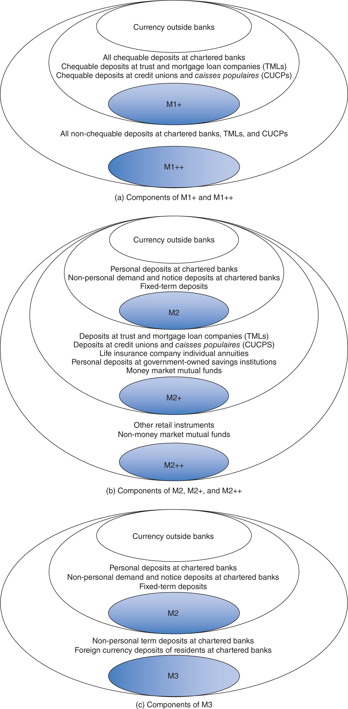  
  
___  
  
  
# How Do Banks Create Money?  
**LO 10.3** **Explain how banks create money.**  
We have seen that chequing and savings deposits in banks are important components of the money supply. To understand the role money plays in the economy, we need to look more closely at how banks operate. Banks are profit-making private businesses, much like department stores and supermarkets. Some banks are quite small, with just a few branches, and do business in a limited area. Others are among the largest corporations in Canada, with hundreds of branches across the country. Banks and near banks (trust and loan companies and credit unions and *caisses populaires*) play an important role in the economy by accepting deposits and making loans. By taking these actions, banks fulfill a key function in the *money supply process* by which central banks control the money supply.  
## Bank Balance Sheets  
To understand how banks create money, we need to briefly examine a typical bank balance sheet. On a balance sheet, a firm’s assets are listed on the left, and its liabilities and stockholders’ equity are listed on the right. Assets are the value of anything owned by a firm, liabilities are the value of anything a firm owes, and stockholders’ equity is the difference between the total value of assets and the total value of liabilities. Stockholders’ equity represents the value of the firm if it were closed, all its assets were sold, and all its liabilities were paid off. A corporation’s stockholders’ equity is also called its *net worth*. A bank’s stockholders’ equity or net worth is also called its *capital*.  
++[Figure 10.2](https://plus.pearson.com/epub/bronte/BRNT-SITHABGCXI/v12/OPS/xhtml/02de7ad0-7c31-11ed-877f-eabf4c0b33f6.xhtml#95a51937ec35393cb5f33dc2fe73ec3e)++ shows a typical balance sheet for a large bank. The key assets on a bank’s balance sheet are its *reserves*, loans, and holdings of securities, such as Canada bonds. **++[Reserves](https://plus.pearson.com/epub/bronte/BRNT-SITHABGCXI/v12/OPS/xhtml/glossary.xhtml#key-05227046-7431-531d-a109-ff214b0be04a)++** are deposits that a bank has retained rather than loaned out or invested. Banks keep reserves either physically within the bank, as *vault cash*, or on deposit with the Bank of Canada. Banks desire to keep a fraction of their deposits as reserves: In 2021, banks kept about 5 percent of their deposits as reserves. These reserves are called **++[desired reserves](https://plus.pearson.com/epub/bronte/BRNT-SITHABGCXI/v12/OPS/xhtml/glossary.xhtml#key-132df694-c6f9-5d60-8614-af65124c13f3)++**. The minimum fraction of deposits that banks desire to keep as reserves is called the **++[desired reserve ratio](https://plus.pearson.com/epub/bronte/BRNT-SITHABGCXI/v12/OPS/xhtml/glossary.xhtml#key-338bcdcc-ed20-5fa6-8a8a-8ea26a174392)++**. We can abbreviate the desired reserve ratio as  
. Any reserves that banks hold over and above the desired amounts are called **++[excess reserves](https://plus.pearson.com/epub/bronte/BRNT-SITHABGCXI/v12/OPS/xhtml/glossary.xhtml#key-05b6cfcc-ec7a-5169-ac4d-f3ec86d257db)++**. The balance sheet in ++[Figure 10.2](https://plus.pearson.com/epub/bronte/BRNT-SITHABGCXI/v12/OPS/xhtml/02de7ad0-7c31-11ed-877f-eabf4c0b33f6.xhtml#95a51937ec35393cb5f33dc2fe73ec3e)++ shows that loans are this bank’s largest asset, which is true for most banks.  
  
**Figure 10.2 Balance Sheet for Royal Bank, September 30, 2021**  
The entries on a bank’s balance sheet that are of greatest economic importance are its reserves, loans, and deposits. Notice that the difference between the value of this bank’s total assets and its total liabilities is equal to its stockholders’ equity. As a consequence, the left side of the balance sheet always equals the right side.  

| Asset (in billions) |       | Liabilities and Shareholders’ Equity (in billions) |       |
| ------------------- | ----- | -------------------------------------------------- | ----- |
| Reserves            | $199  | Deposits                                           | $1082 |
| Loans               | 950   | Borrowing                                          | 24    |
| Securities          | 282   | Other liabilities                                  | 531   |
| Other assets        | 302   |                                                    |       |
|                     |       | Total liabilities                                  | $1637 |
|                     |       | Shareholders’ equity                               | 96    |
| Total assets        | $1733 | Total liabilities and shareholders’ equity         | $1733 |
  
**SOURCE:** http://www.osfi-bsif.gc.ca/Eng/Pages/default.aspx (accessed on December 9, 2021).
*NOTE*: Some entries on a typical bank’s balance sheet have been combined to simplify the presentation.  
The balance sheet in ++[Figure 10.2](https://plus.pearson.com/epub/bronte/BRNT-SITHABGCXI/v12/OPS/xhtml/02de7ad0-7c31-11ed-877f-eabf4c0b33f6.xhtml#95a51937ec35393cb5f33dc2fe73ec3e)++ shows that loans are typically a bank’s largest asset. Banks make *consumer loans* to households and *commercial loans* to firms. A loan is an asset to a bank because it represents a promise by the person taking out the loan to make certain specified payments to the bank. A bank’s reserves and its holdings of securities are also assets because they are things of value the bank owns.  
## Apply the Concept  
**Help for Young Borrowers: Fintech or Ceilings on Interest Rates?**  
  
  
Play  
  
  
  
For more practice, do related ++[Problems 3.5](https://plus.pearson.com/epub/bronte/BRNT-SITHABGCXI/v12/OPS/xhtml/043669b0-7c31-11ed-8dc6-975bddb38225.xhtml#4ac8b72a4eadff3579e0f84de9967290)++ and ++[3.6](https://plus.pearson.com/epub/bronte/BRNT-SITHABGCXI/v12/OPS/xhtml/043669b0-7c31-11ed-8dc6-975bddb38225.xhtml#af7cdd457435bfa8dbe8ed2973f61532)++ at the end of this chapter.  
Deposits are a typical bank’s largest liability. Deposits include chequing accounts, savings accounts, and certificates of deposit. Deposits are liabilities to banks because they are owed to the households or firms that have deposited the funds. If you deposit $100 in your chequing account, the bank owes you the $100, and you can withdraw it at any time. So, your chequing account is an asset to you, and it is a liability to the bank. Banks also borrow short term from other banks and from the Bank of Canada and borrow long term by selling bonds to investors. These *borrowings* are also liabilities.  
## Using T-accounts to Show How a Bank Can Create Money  
It is easier to show how banks create money by using a T-account than by using a balance sheet. A T-account is a stripped-down version of a balance sheet that shows only how a transaction *changes* a bank’s balance sheet. Suppose you deposit $1000 in currency into an account at Bank of Montreal. This transaction raises the total deposits at Bank of Montreal by $1000 and also raises its reserves by $1000. We show this result on the following T-account:  
  
  
Remember that the total value of all the entries on the right side of a balance sheet must always equal the total value of all the entries on the left side of the balance sheet. Any transaction that increases (or decreases) one side of a balance sheet must also increase (or decrease) the other side of the balance sheet. In this case, the T-account shows that we increased both sides of the balance sheet by $1000.  
Initially, this transaction does not increase the money supply. The currency component of the money supply declines by $1000 because the $1000 you deposited is no longer in circulation and, therefore, is not counted in the money supply. But the decrease in currency is offset by a $1000 increase in the chequing account deposit component of the money supply.  
Canadian banks are not required to hold reserves against their chequing account deposits. Also, as of March 2020, the Fed in the United States eliminated the reserve requirement by setting it equal to 0 percent of a bank’s chequing account deposits. Although the Fed has the authority to reimpose a reserve requirement, it stated at that time that it had no plans to do so. In practice, though, banks still hold substantial reserves for reasons we will discuss in Chapter 11, Section 11.3. For simplicity, we’ll assume that banks always voluntarily maintain reserves equal to 10 percent of their chequing account deposits. Note that banks have an incentive to loan out or buy securities with deposits above this 10 percent level so that they can earn interest on these funds. In this example, we’ll assume that at the time of your deposit, Bank of Montreal is holding exactly 10 percent of the value of all its chequing account deposits as reserves. In that case, Bank of Montreal will keep $100 of your deposit as reserves and loan out the other $900. We will label reserves above 10 percent as “excess reserves” even though, technically, *all* reserves banks hold are excess reserves. Assume that Bank of Montreal loans out the $900 to someone to buy a very inexpensive used car. Bank of Montreal could give the $900 to the borrower in currency, but usually banks make loans by increasing the borrower’s chequing account. We can show this transaction with another T-account:  
  
  
  
Notice that *by making this $900 loan, Bank of Montreal has increased the money supply by $900*. The initial $1000 in currency you deposited into your chequing account has been turned into $1900 in chequing account deposits—a net increase in the money supply of $900.  
The story does not end here. The person who took out the $900 loan did so to buy a used car. To keep things simple, let’s suppose they buy the car for exactly $900 and pay by writing a cheque on their account at Bank of Montreal. The seller of the used car will now deposit the cheque in their bank. That bank may also be a branch of Bank of Montreal, but in most cities, there are many banks, so let’s assume that the seller of the car has their account at a branch of Royal Bank. Once they deposit the cheque, Royal Bank will send it to Bank of Montreal to *clear* the cheque and collect the $900. We show the result in the following T-accounts:  
  
  
  
  
  
  
After the car buyer’s cheque clears, Bank of Montreal has lost $900 in deposits—the amount loaned to the car buyer—and $900 in reserves—the amount it had to pay Royal Bank when Royal Bank sent Bank of Montreal the car buyer’s cheque. Royal Bank has an increase in chequing account deposits of $900—the deposit of the car seller—and an increase in reserves of $900—the amount it received from Bank of Montreal.  
Royal Bank has 100 percent reserves against this new $900 deposit, but it wants to hold only 10 percent reserves. The bank has an incentive to keep $90 as reserves and to loan out the excess reserves: the other $810. If Royal Bank does this, we can show the change in its balance sheet by using another T-account:  
  
  
In loaning out the $810 in excess reserves, Royal Bank creates a new chequing account deposit of $810. The initial deposit of $1000 in currency into Bank of Montreal has now resulted in the creation of  
in chequing account deposits. The money supply has increased by  
.  
The process is still not finished. The person who borrows the $810 will spend it by writing a cheque against their account. Whoever receives the $810 will deposit it in their bank, which could be a Bank of Montreal branch or a Royal Bank branch or a branch of some other bank. That new bank—if it’s not Royal Bank—will send the cheque to Royal Bank and will receive $810 in new reserves. That new bank will have an incentive to loan out 90 percent of these reserves—keeping 10 percent, which we are assuming is the fraction of reserves that all banks choose to hold—and the process will go on. At each stage, the additional loans being made and the additional deposits being created are shrinking by 10 percent because each bank keeps that amount of new deposits as reserves. We can use a table to show the total increase in chequing account deposits started by your initial deposit of $1000. The dots in the table represent additional rounds in the money supply process:  

| Bank             | Increase in Chequing Account Deposits |
| ---------------- | ------------------------------------- |
| Bank of Montreal | $1000                                 |
| Royal Bank       |                                       |
  

|            |  |
| ---------- | - |
| Third Bank |  |
  

|             |  |
| ----------- | - |
| Fourth Bank |  |
  

|  |
| - |
|  |
  

|  |  |
| - | - |
  

|  |
| - |
|  |
  

|  |  |
| - | - |
  

|  |
| - |
|  |
  

|  |  |
| - | - |
  

|                                           |  |
| ----------------------------------------- | - |
| Total change in chequing account deposits |  |
  

|  |
| - |
  
****The Simple Deposit Multiplier****  
Your initial deposit of $1000 increased the reserves of the banking system by $1000 and led to a total increase in chequing account deposits of $10 000. The ratio of the amount of deposits created by banks to the amount of new reserves is called the **++[simple deposit multiplier](https://plus.pearson.com/epub/bronte/BRNT-SITHABGCXI/v12/OPS/xhtml/glossary.xhtml#key-c1db8f6d-1d4c-5d1e-a6b3-8b2021e9bc8a)++**. In this case, the simple deposit multiplier is equal to  
. Why 10? How do we know that your initial $1000 deposit ultimately leads to a total increase in deposits of $10 000?  
  
There are two ways to answer this question. First, each bank in the money supply process is keeping reserves equal to 10 percent of its deposits. For the banking system as a whole, the total increase in reserves is $1000—the amount of your original currency deposit. Therefore, the system as a whole will end up with $10 000 in deposits because $1000 is 10 percent of $10 000.  
A second way to answer the question is by deriving an expression for the simple deposit multiplier. The total increase in deposits equals  
  
  
  
  
or  
  
  
  
  
or  
  
  
  
  
The rules of algebra tell us that an expression like the one in the parentheses sums to  
  
  
  
  
Simplifying further, we have  
  
  
  
  
So,  
  
  
  
  
As we’ve noted, Canadian banks are not required to hold reserves, but they choose to. Earlier, we used  
to stand for the desired reserve ratio.  
  
  
  
  
This formula shows that the larger the desired reserve ratio, the smaller the simple deposit multiplier. With a desired reserve ratio of 10 percent, the simple deposit multiplier is 10. If the desired reserve ratio were 20 percent, the simple deposit multiplier would fall to  
, or 5.  
We can use this formula to calculate the total increase in chequing account deposits from an increase in bank reserves due to, for instance, currency being deposited in a bank:  
  
  
  
  
For example, if $100 000 in currency is deposited in a bank and the desired reserve ratio is 10 percent, then  
  
  
  
  
## Don’t Let This Happen to You  
## DON’T CONFUSE ASSETS AND LIABILITIES  
Consider the following reasoning: “How can chequing account deposits be a liability to a bank? After all, they are something of value that is in the bank. Therefore, chequing account deposits should be counted as a bank *asset* rather than as a bank liability.”  
This statement is incorrect. The balance in a chequing account represents something the bank *owes* to the owner of the account. Therefore, it is a liability to the bank, although it is an asset to the owner of the account. Similarly, your car loan is a liability to you—because it is a debt you owe to the bank—but it is an asset to the bank.  
For more practice, do related ++[Problem 3.10](https://plus.pearson.com/epub/bronte/BRNT-SITHABGCXI/v12/OPS/xhtml/043669b0-7c31-11ed-8dc6-975bddb38225.xhtml#fb62922b879ab0d7b308b88658b97d0e)++ at the end of this chapter.  
  
## Solved Problem 10.2  
## SHOWING HOW BANKS CREATE MONEY  
Suppose you deposit $5000 in currency into your chequing account at a branch of Royal Bank. Assume that Royal Bank and other banks are voluntarily holding a ratio of reserves to chequing account deposits equal to 0.10 and that at the time you make your deposit, Royal Bank holds no reserves above that ratio. That is, Royal Bank holds no excess reserves as we used that term earlier.  
* Use a T-account to show the initial effect of this transaction on Royal Bank’s balance sheet.  
* Suppose that Royal Bank makes the maximum loan it can from the funds you deposited. Use a T-account to show the initial effect on Royal Bank’s balance sheet from granting the loan. Also include in this T-account the transaction from part (a).  
* Now suppose that whoever took out the loan in part (b) writes a cheque for this amount and that the person receiving the cheque deposits it in Bank of Montreal. Show the effect of these transactions on the balance sheets of Royal Bank and Bank of Montreal *after the cheque has cleared*. On the T-account for Royal Bank, include the transactions from parts (a) and (b).  
* What is the maximum increase in chequing account deposits that can result from your $5000 deposit? What is the maximum increase in the money supply that can result from your deposit? Explain.  
## Solving the Problem  
* **Step 1: Review the chapter material.** This problem is about how banks create chequing account deposits, so you may want to review the section “Using T-accounts to Show How a Bank Can Create Money.”  
* **Step 2: Answer part (a) by using a T-account to show the effect of the deposit.** Keeping in mind that T-accounts show only the changes in a balance sheet that result from the relevant transaction and that assets are on the left side of the account and liabilities are on the right side, we have  
  
  
* Because the bank now has your $5000 in currency in its vault, its reserves (and, therefore, its assets) have risen by $5000. This transaction also increases your chequing account balance by $5000. Because the bank owes you this money, the bank’s liabilities have also risen by $5000.  
* **Step 3: Answer part (b) by using a T-account to show the effect of the loan.** The problem tells you to assume that Royal Bank currently has no excess reserves above the 10 percent ratio of reserves to deposits that the bank chooses to hold. If the bank’s chequing account deposits go up by $5000, the bank wants to keep $500 as reserves and loans out the remaining $4500. Remembering that new loans usually take the form of setting up or increasing a chequing account for the borrower, we have  
  
  
* The first line of the T-account shows the transaction from part (a). The second line shows that Royal Bank has loaned out $4500 by increasing the chequing account of the borrower by $4500. The loan is an asset to Royal Bank because it represents the borrower’s promise to make certain payments spelled out in the loan agreement.  
* **Step 4: Answer part (c) by using T-accounts for Royal Bank and Bank of Montreal to show the effect of the cheque clearing.** We now show the effect of the borrower having spent the $4500 they received as a loan from Royal Bank. The person who received the $4500 cheque deposits it in their account at Bank of Montreal. The two actions are shown in these T-accounts:  
  
  
  
  
* Look first at the T-account for Royal Bank. Once Bank of Montreal sends the cheque written by the borrower to Royal Bank, Royal Bank loses $4500 in reserves, and Bank of Montreal gains $4500 in reserves. The $4500 is also deducted from the account of the borrower. Royal Bank is now satisfied with the result. It received a $5000 deposit in currency from you. When that money was sitting in the bank vault, it wasn’t earning any interest for Royal Bank. Now $4500 of the $5000 has been loaned out and is earning interest. These interest payments allow Royal Bank to cover its costs, which it has to do to remain in business.  
* Bank of Montreal now has an increase in deposits of $4500, resulting from the cheque being deposited, and an increase in reserves of $4500. Bank of Montreal is in the same situation as Royal Bank was in part (a): As a result of this transaction, it has more reserves than it wants to hold and a strong incentive to lend out these reserves.  
* **Step 5: Answer part (d) by using the simple deposit multiplier formula to calculate the maximum increase in chequing account deposits and the maximum increase in the money supply.** Remember that   
* is the symbol we are using to represent the banks’ desired ratio of reserves to deposits. The simple deposit multiplier expression is  
  
  
  
  
* In this case, bank reserves rose by $5000 as a result of your initial deposit, and the desired reserve ratio is 0.10, so  
  
  
  
  
* Because chequing account deposits are part of the money supply, it is tempting to say that the money supply has also increased by $50 000. Remember, though, that your $5000 in currency was counted as part of the money supply while you had it, but it is not counted when it is sitting in a bank vault. Therefore,  
  
  
  
  
* or  
  
  
  
  
For more practice, do related ++[Problem 3.11](https://plus.pearson.com/epub/bronte/BRNT-SITHABGCXI/v12/OPS/xhtml/043669b0-7c31-11ed-8dc6-975bddb38225.xhtml#e8e1b7e7e73601a9ed9b0c02dfb4f55b)++ at the end of this chapter.  
  
## The Simple Deposit Multiplier versus the Real-World Deposit Multiplier  
This story of the money supply process relies on two key assumptions:  
1. *Banks always want to hold the same ratio of reserves to deposits.* We assumed that when you deposited $1000 in currency into your chequing account at Bank of Montreal, it loaned out $900 and kept only the $100 in reserves. Since the financial crisis that began in 2007, banks have kept substantial reserves because the Bank of Canada is paying banks interest on their reserve deposits and because tighter regulation of banks has led them to hold more reserves. The more reserves banks keep, the smaller the deposit multiplier. Imagine an extreme case in which Bank of Montreal kept your entire $1000 as reserves and loaned out none of it. In this case, the process we described earlier won’t happen; there won’t be any loans leading to the creation of new deposits, leading to the making of additional loans, and so on. The $1000 increase in reserves will lead to just a $1000 increase in deposits, and the deposit multiplier will be   
2. , not 10.  
3. *The whole amount of every cheque is deposited in a bank; no one takes any of it out as currency.* In reality, households and firms keep roughly constant the amount of currenc y they hold relative to the value of their chequing account balances. So, we would expect to see people increasing the amount of currency they hold as the balances in their chequing accounts rise. Once again, think of the extreme case. Suppose that when Bank of Montreal makes the initial $900 loan to the borrower who wants to buy a used car, the seller of the car cashes the cheque instead of depositing it. In that case, Royal Bank does not receive any new reserves and does not make any new loans. Once again, the $1000 increase in your chequing account at Bank of Montreal is the only increase in deposits, and the deposit multiplier is 1.  
The effect of these two simplifications is to reduce the real-world deposit multiplier. However, although the story of the deposit multiplier can be complicated, the key point to bear in mind is that the most important part of the money supply is the chequing account and savings account component. When banks make loans, they increase chequing account balances, and the money supply expands. Banks make new loans when they gain reserves. The whole process can also work in reverse: If banks lose reserves, they reduce their outstanding loans and deposits, and the money supply contracts.  
We can summarize these important conclusions:  
1. When banks gain reserves, they make new loans, and the money supply expands.  
2. When banks lose reserves, they reduce their loans, and the money supply contracts.  
  
  
Figure 10.2:  
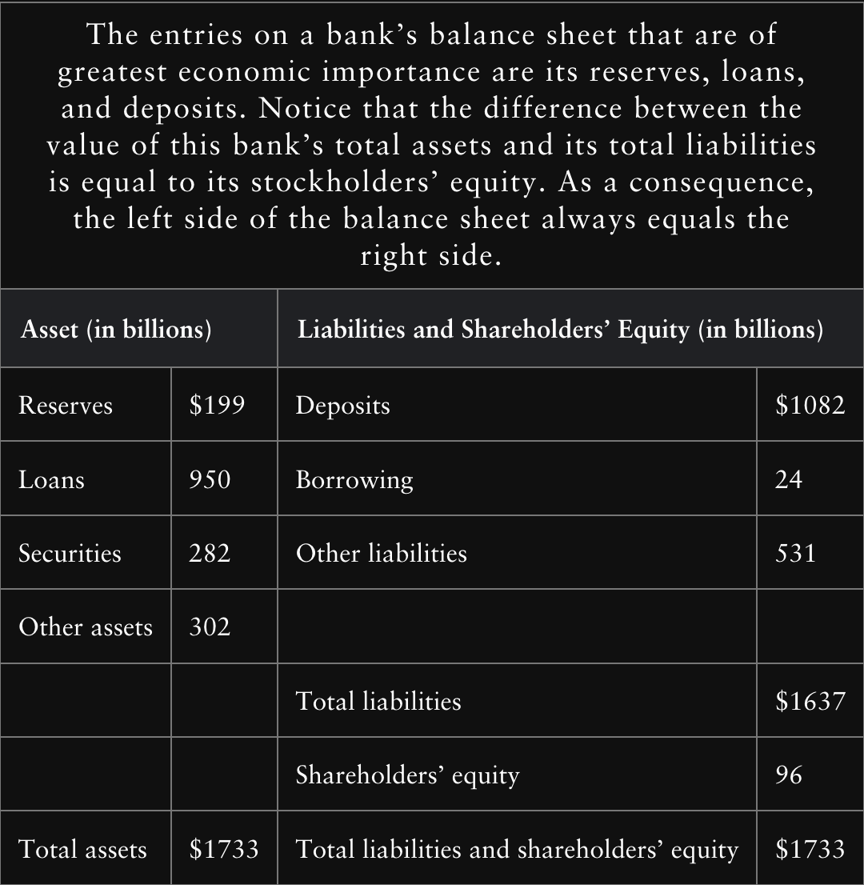  
  
  
  
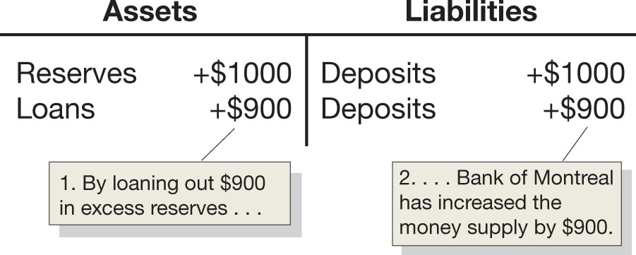  
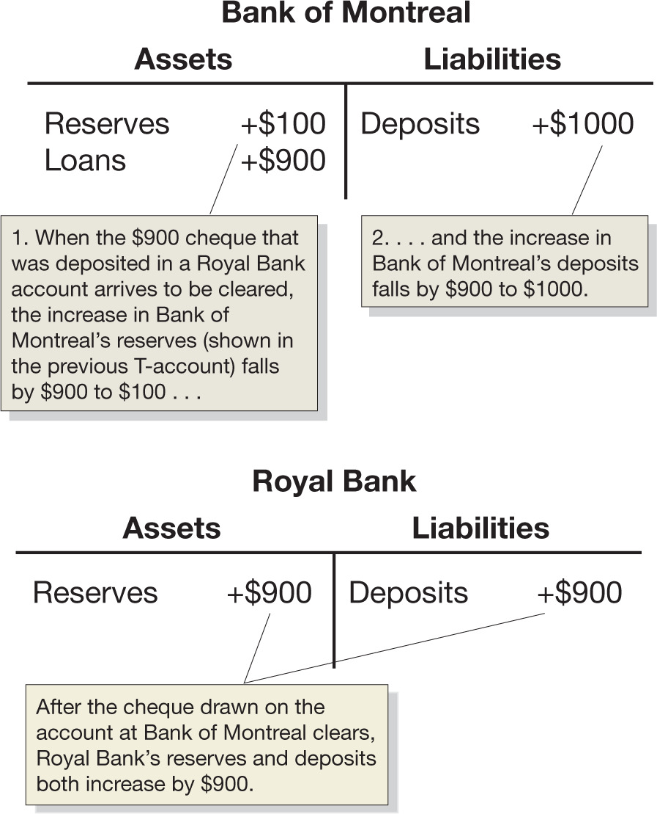  
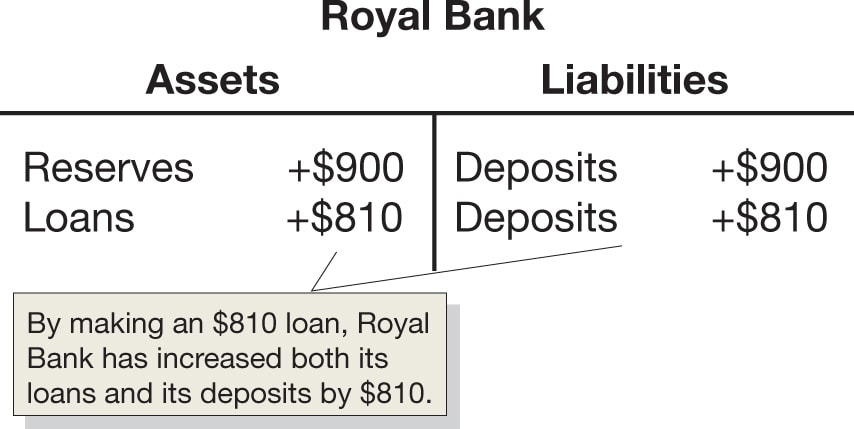  
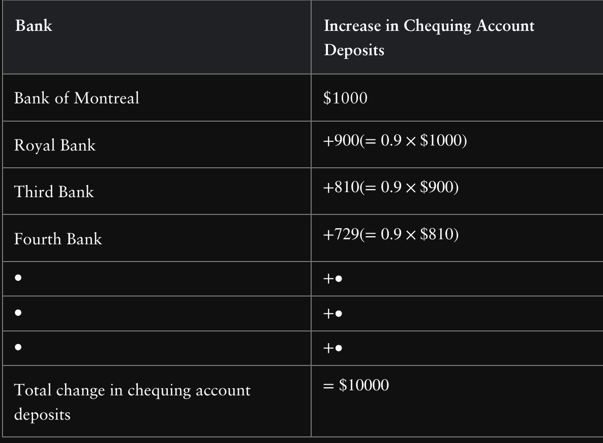  
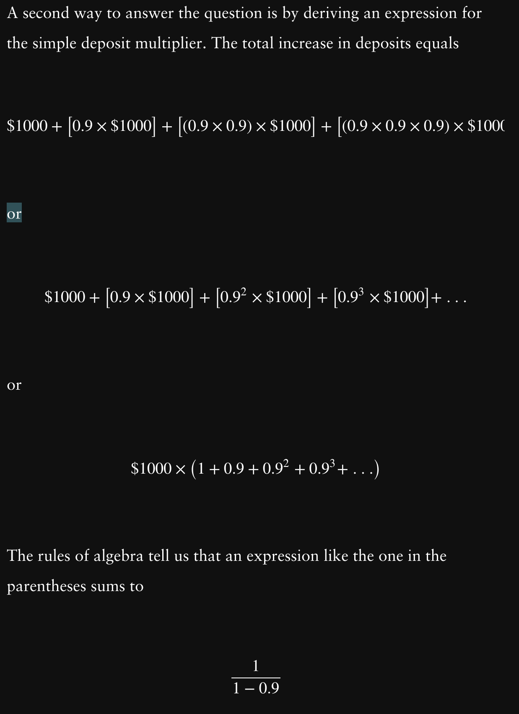  
  
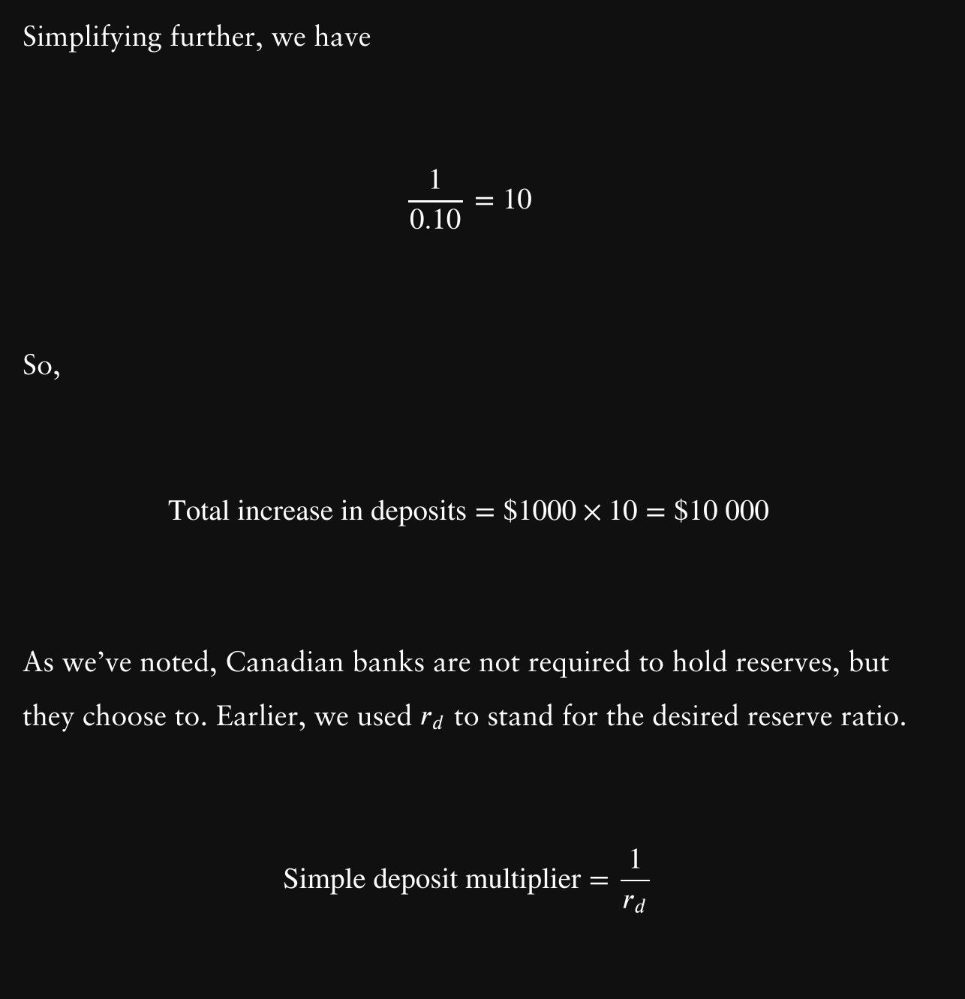  
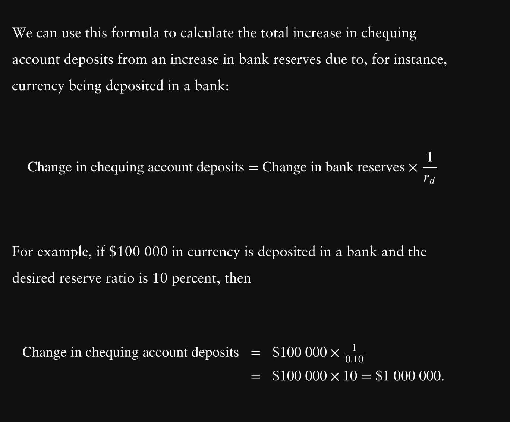  
___  
  
# The Bank of Canada  
**LO 10.4** **Describe how the Bank of Canada manages the money supply.**  
Many people are surprised to learn that banks do not keep locked away in their vaults all the funds that are deposited in chequing accounts. Canada, like nearly all other countries, has a **++[fractional reserve banking system](https://plus.pearson.com/epub/bronte/BRNT-SITHABGCXI/v12/OPS/xhtml/glossary.xhtml#key-dc3e6d96-ab4d-547a-8e20-41ed0a942542)++**, which means that banks keep less than 100 percent of deposits as reserves. When people deposit money in a bank, the bank loans most of the money to someone else. What happens if depositors want their money back? Depositors withdrawing money would seem to be a problem because banks have loaned out most of the money and can’t easily get it back.  
In practice, withdrawals are usually not a problem for banks. On a typical day, about as much money is deposited as is withdrawn. If a small amount more is withdrawn than deposited, banks can cover the difference from their excess reserves or by borrowing from other banks. Sometimes depositors lose confidence in a bank when they question the value of the bank’s underlying assets, particularly its loans. Often, the reason for a loss of confidence is bad news about the loans the bank has made, whether the news is accurate or not. When many depositors simultaneously decide to withdraw their money from a bank, there is a **++[bank run](https://plus.pearson.com/epub/bronte/BRNT-SITHABGCXI/v12/OPS/xhtml/glossary.xhtml#key-cf0b682d-82d5-52db-b195-10f43947276d)++**. If many banks experience runs at the same time, the result is a **++[bank panic](https://plus.pearson.com/epub/bronte/BRNT-SITHABGCXI/v12/OPS/xhtml/glossary.xhtml#key-0b06537f-2d10-5eab-930a-ccafbaa652cd)++**. It is possible for one bank to handle a run by borrowing from other banks, but if many banks simultaneously experience runs, the banking system may be in trouble.  
  
A *central bank*, like the Bank of Canada, can help stop a bank panic by acting as a *lender of last resort*, by making loans to banks that cannot borrow funds elsewhere. The banks can use these loans to pay off depositors. When the panic ends and the depositors put their money back in their accounts, the banks can repay the loans to the central bank.  
## The Establishment of the Bank of Canada  
The Bank of Canada plays a central role in the Canadian economy. It conducts monetary policy, designs and issues currency, promotes a stable financial system, manages the funds of the federal government, and even engages in important economic research. Given its important role in the Canadian economy, you might be surprised to learn that the Bank of Canada is less than 100 years old. It was created after a Royal Commission in 1933 and came into being in 1934.  
The overall responsibility for the operation of the Bank of Canada rests with a **++[board of directors](https://plus.pearson.com/epub/bronte/BRNT-SITHABGCXI/v12/OPS/xhtml/glossary.xhtml#key-01859a53-8a95-5225-b6df-66745f6e601d)++**, which consists of 15 members—the governor, the senior deputy governor, the deputy minister of finance, and 12 outside directors. The board appoints the governor and senior deputy governor, with the government’s approval, for a renewable term of seven years. The outside directors are appointed by the minister of finance, with Cabinet approval, for a three-year term, and they are required to come from all regions of Canada and represent a variety of occupations with the exception of banking. The governor of the Bank of Canada is the chief executive officer and chair of the board of directors. Currently, the governor of the Bank of Canada is Tiff Macklem, appointed in June 2020 for a term of seven years.  
In 1994, the board of directors made some changes to the internal organization of the Bank of Canada. The most prominent change was the establishment of a new senior decision-making authority within the Bank of Canada called the **++[governing council](https://plus.pearson.com/epub/bronte/BRNT-SITHABGCXI/v12/OPS/xhtml/glossary.xhtml#key-b50a1c17-653c-51c1-9a5c-208ac87e4afc)++**. The governing council is chaired by the governor and is composed of the senior deputy governor and four deputy governors. Since this change, the six members of the governing council collectively assume responsibility for the Bank of Canada’s quarterly *Monetary Policy Report that presents the Bank of Canada’s projections for inflation and growth and its assessment of risks in the Canadian economy*. This system of “collective responsibility” ensures that the Bank of Canada’s governor is not personally identified with the Bank of Canada’s policy.  
The Bank of Canada is responsible for **++[monetary policy](https://plus.pearson.com/epub/bronte/BRNT-SITHABGCXI/v12/OPS/xhtml/glossary.xhtml#key-f658eba0-194e-5c91-bb32-e2bf148f2495)++** in Canada, but the objectives of monetary policy are determined jointly by the Bank of Canada and the minister of finance, with the latter acting on behalf of the federal government. In fact, the governor of the Bank of Canada and the minister of finance consult regularly, and, in the event of a serious disagreement over the conduct of monetary policy, the government has the right to override the Bank of Canada’s decisions. In particular, the minister of finance can issue a directive to the Bank of Canada indicating the specific policy changes that the Bank of Canada must follow. However, the directive must be published, indicating not only the new policy that the Bank of Canada is supposed to undertake but also the period during which it is to apply.  
Hence, the ultimate responsibility for monetary policy rests with the democratically elected government, with the Bank of Canada having instrumental independence but not goal independence. However, because of the consequences of issuing a directive, it is unlikely that such a directive would be issued, and none has been issued to date. (For more information on monetary policy, see Chapter 11.)  
  
## The Bank of Canada’s Operating Band for the Overnight Interest Rate  
The Bank of Canada signals its stance on monetary policy by announcing a target for the **++[overnight interest rate](https://plus.pearson.com/epub/bronte/BRNT-SITHABGCXI/v12/OPS/xhtml/glossary.xhtml#key-d0c474ec-91da-56fd-85be-855dec8395fe)++**. The target for the overnight interest rate, known as the **++[key policy rate](https://plus.pearson.com/epub/bronte/BRNT-SITHABGCXI/v12/OPS/xhtml/glossary.xhtml#key-87865f41-2cc7-5f72-82f6-f22b522ac367)++** (or *policy rate*, for short), is the Bank of Canada’s main tool for conducting monetary policy. This rate refers to **++[collateralized transactions](https://plus.pearson.com/epub/bronte/BRNT-SITHABGCXI/v12/OPS/xhtml/glossary.xhtml#key-f224497b-36d2-540c-8f2b-42cccc4ffa70)++** in the overnight interbank market. (For more information on the overnight interest rate, see Chapter 11.)  
In normal times, the Bank of Canada’s operational objective is to keep the overnight interest rate within an **++[operating band](https://plus.pearson.com/epub/bronte/BRNT-SITHABGCXI/v12/OPS/xhtml/glossary.xhtml#key-b774a620-53ad-57a3-a23d-77883b57d832)++** (also known as a *channel* or *corridor*) of 50 basis points (half of 1 percent). This channel/corridor system for setting the overnight interest rate is also used by the Reserve Bank of Australia, the Bank of England, the European Central Bank, the Bank of Japan, the Reserve Bank of New Zealand, Norges Bank of Norway, and the Riksbank of Sweden.  
However, at the outset of the coronavirus pandemic in March 2020, the Bank of Canada quickly lowered the policy rate from 1.75% to 0.25%. The Bank of Canada also lowered the operating band for the overnight interest rate from 50 basis points to 25 basis points and also switched to a floor system of monetary control, targeting the overnight interest rate at the floor of the (25 basis points wide operating) band for the overnight rate. It is to be noted that another time the Bank of Canada operated a floor system of monetary control was over a brief period in the aftermath of the global financial crisis, from April 1, 2009 to June 1, 2010. In what follows, we will discuss the symmetric system of monetary control with an operating band of 50 basis points wide, assuming that the Bank of Canada will quickly re-establish that system.  
As ++[Figure 10.3](https://plus.pearson.com/epub/bronte/BRNT-SITHABGCXI/v12/OPS/xhtml/03b097e0-7c31-11ed-8103-a48c0d5e358a.xhtml#c236d8fde85471591aa6deec0bc7d07e)++ shows, the upper limit of the operating band defines the **++[bank rate](https://plus.pearson.com/epub/bronte/BRNT-SITHABGCXI/v12/OPS/xhtml/glossary.xhtml#key-0c213bd4-e137-5aeb-85d2-a74631c07a84)++**,  
. The bank rate is the interest rate the Bank of Canada charges financial institutions that require an overdraft loan to cover negative **++[settlement balances](https://plus.pearson.com/epub/bronte/BRNT-SITHABGCXI/v12/OPS/xhtml/glossary.xhtml#key-66e3d144-06f9-5c21-9db8-e902b6e70d30)++** on the Bank of Canada’s books at the end of the banking day. Loans that the Bank of Canada makes to banks are referred to as **++[advances to banks](https://plus.pearson.com/epub/bronte/BRNT-SITHABGCXI/v12/OPS/xhtml/glossary.xhtml#key-be4dd1a1-f09d-5ef9-8956-c6a5470d74e9)++**. The lower limit of the operating band is the rate the Bank of Canada pays to financial institutions with positive settlement balances at the end of the day. The midpoint of the operating band is the Bank of Canada’s target for the overnight interest rate. For example, when the operating band is from 1.5 percent to 2 percent, the bank rate is 2 percent, the rate the Bank of Canada pays on deposits to financial institutions is 1.5 percent, and the Bank of Canada’s target for the overnight interest rate is 1.75 percent.  
**Figure 10.3 Operating Band for the Overnight Interest Rate**  
  
The upper limit of the operating band for the overnight interest rate defines the bank rate (or lending rate), and the lower limit of the operating band defines the deposit rate.  
  
  
Since December 2000, the Bank of Canada has been operating under a system where any changes to the target and the operating band for the overnight interest rate are announced on eight “fixed” dates throughout the year, and the Bank of Canada has the option of acting between the fixed dates in “extraordinary circumstances.” The Bank of Canada implements the operating band for the overnight interest rate by using its **++[standing liquidity facilities](https://plus.pearson.com/epub/bronte/BRNT-SITHABGCXI/v12/OPS/xhtml/glossary.xhtml#key-1107f870-6b87-5ce8-b014-640f4dfc3bc8)++**, lending to and taking deposits from financial institutions. In particular, if the overnight interest rate increases toward the upper limit of the operating band, then the Bank of Canada will lend at the bank rate,  
, to put a ceiling on the overnight interest rate, . If the overnight interest rate declines toward the lower limit of the operating band, then the Bank of Canada will accept deposits from financial institutions at the bank rate less 50 basis points,  
, to put a floor on the overnight interest rate.  
## How the Bank of Canada Implements Monetary Policy  
The Bank of Canada is responsible for managing interest rates and the money supply. As we will see in Chapter 11, managing interest rates and the money supply is part of monetary policy, which the Bank of Canada undertakes to pursue macroeconomic objectives (mainly price stability). To manage interest rates and the money supply, the Bank of Canada mainly uses the following two monetary policy tools:  
1. **++[Open market buyback operations](https://plus.pearson.com/epub/bronte/BRNT-SITHABGCXI/v12/OPS/xhtml/glossary.xhtml#key-0e1663be-0345-54b1-b964-0ab1e729c4e9)++**  
2. Lending to financial institutions  
Remember that the most important component of the money supply is chequing accounts in banks. Not surprisingly, both of the Bank of Canada’s monetary policy tools are aimed at influencing interest rates and bank reserves.  
## Open Market Buyback Operations  
**++[Open market operations](https://plus.pearson.com/epub/bronte/BRNT-SITHABGCXI/v12/OPS/xhtml/glossary.xhtml#key-9374bdd3-1814-58fb-8a1c-2b6a32a4b355)++** (the buying and selling of government securities) are an important monetary policy tool for many central banks around the world because they are the primary determinants of changes in interest rates and the money supply. Open market purchases expand bank settlement balances, thereby lowering short-term interest rates and raising the money supply. Open market sales shrink bank reserves and the **++[monetary base](https://plus.pearson.com/epub/bronte/BRNT-SITHABGCXI/v12/OPS/xhtml/glossary.xhtml#key-c29fa6f7-3516-5490-844f-2c06791f7922)++**, raising short-term interest rates and lowering the money supply.  
Since 1994, the Bank of Canada’s most common open market operations have been repurchase transactions, a special type of open market operations. In particular, the Bank of Canada uses **++[Purchase and Resale Agreements](https://plus.pearson.com/epub/bronte/BRNT-SITHABGCXI/v12/OPS/xhtml/glossary.xhtml#key-edf77426-553d-5409-8879-704499d01071)++** (PRAs) as a tool to reduce undesired upward pressure on the overnight interest rate, and **++[Sale and Repurchase Agreements](https://plus.pearson.com/epub/bronte/BRNT-SITHABGCXI/v12/OPS/xhtml/glossary.xhtml#key-a3f0e4b3-9729-580f-ae4b-ae7a8ac39b8e)++** (SRAs) as a tool to reduce undesired downward pressure on the overnight interest rate. Let’s see how the Bank of Canada uses PRAs and SRAs in order to reinforce the target for the overnight interest rate during the course of a day and to manage the money supply.  
Assume that the operating band for the overnight interest rate is 1.5 percent to 2 percent and that the Bank of Canada is targeting the overnight interest rate at the midpoint of the band, at 1.75 percent. If overnight funds are traded at a rate higher than the target rate of 1.75 percent, then the Bank of Canada enters into PRAs at a price that works out to a 1.75 percent interest rate, the midpoint of the operating band. That is, the Bank of Canada purchases government of Canada Treasury bills and bonds, with an agreement that the sellers will repurchase those Treasury bills and bonds at a specified time in the future. When the sellers of the Canada securities deposit the funds in their banks, the settlement balance of the banks rises. This increase in reserves starts the process of increasing loans and chequing account deposits that increases the money supply.  
If, on the other hand, overnight funds are traded at a rate below the target rate of 1.75 percent, then the Bank of Canada enters into SRAs, in which the Bank of Canada sells government securities and the buyer agrees to sell them back to the Bank of Canada a number of business days later. When the buyers pay for the securities with cheques, the reserves of their banks fall. This decrease in bank reserves starts a contraction of loans and chequing account deposits that reduces the money supply.  
  
The Bank of Canada conducts monetary policy principally through open market buyback operations for three reasons. First, because the Bank of Canada initiates open market buyback operations, it completely controls their volume. Second, the Bank of Canada can make both large and small open market buyback operations. Third, the Bank of Canada can implement its open market buyback operations quickly, with no administrative delay or required changes in regulations. Many other central banks, including the US Federal Reserve, the European Central Bank, and the Bank of Japan, also use open market operations to conduct monetary policy.  
The Bank of Canada is responsible for putting the paper currency of Canada into circulation. Recall that if you look at a Canadian bill, you see the words “Bank of Canada: This Note Is Legal Tender.” When the Bank of Canada takes actions to increase the money supply, commentators sometimes say that it is “printing more money.” The main way the Bank of Canada increases the money supply, however, is not by printing more paper dollars but by buying government securities. Similarly, to reduce the money supply, the Bank of Canada does not set fire to stacks of paper dollars. Instead, it sells government securities. We will spend more time discussing how and why the Bank of Canada manages the money supply in Chapter 11, in which we discuss monetary policy.  
## Lending to Financial Institutionsa  
As we have seen, the Bank of Canada operates its standing liquidity facilities to reinforce the operating band for the overnight interest rate. When a bank borrows money from the Bank of Canada by taking out a loan, the interest rate the bank pays is the bank rate,  
, which is typically higher than the target overnight interest rate by 25 basis points. However, the bank’s reserves increase, and with more reserves, the bank will make more loans to households and firms, which will increase chequing account deposits and the money supply.  
In addition to its use of standing liquidity facilities to reinforce the operating band for the overnight interest rate, Bank of Canada lending is also important in preventing financial panics. In fact, one of the Bank of Canada’s most important roles is to be the lender of last resort in the Canadian economy. It provides emergency lending assistance (against eligible collateral) for a maximum period of six months (which can be extended for periods of up to six months as many times as the Bank of Canada judges necessary) to solvent (but illiquid) deposit-taking institutions to prevent bank failures from spinning further out of control, thereby preventing bank and financial panics.  
## The Bank of Canada’s Approach to Monetary Policy  
The goal of the Bank of Canada’s current monetary policy is to keep the inflation rate within a target range of 1 to 3 percent, with the midpoint of the inflation target range, 2 percent, being the most desirable outcome. The Bank of Canada implements monetary policy by changing the policy rate in order to influence other short-term interest rates, the exchange rate, and the level of economic activity.  
As an example, suppose that the Bank of Canada expects the economy to slow down and wishes to ease monetary conditions. It lowers the target and operating band for the overnight interest rate. As you can see in ++[Figure 10.4](https://plus.pearson.com/epub/bronte/BRNT-SITHABGCXI/v12/OPS/xhtml/03b097e0-7c31-11ed-8103-a48c0d5e358a.xhtml#46bdd43c189fef8342f05f11144d71ca)++, this reduces interest rates and the value of the dollar and leads to an increase in the supply of money, aggregate demand (the total quantity of output demanded in the economy), and the price level, thereby preventing the inflation rate from falling below the lower limit of the inflation target range of 1 percent.  
  
**Figure 10.4 How the Bank of Canada Keeps the Rate of Inflation from Falling Below the Target Range**  
  
If the Bank of Canada expects the economy to slow down, it lowers the target and operating band for the overnight interest rate. This reduces interest rates and the value of the dollar and leads to an increase in the supply of money, aggregate demand, and the price level, preventing the inflation rate from falling below 1 percent.  
**SOURCE:** From the Bank of Canada. Reprinted with permission.  
  
In the opposite case, if the Bank of Canada expects the economy to exceed its capacity at some point in the future, it raises the operating band in order to prevent inflationary pressures from building. The consequent increase in interest rates and the value of the dollar lead to a decline in the supply of money, aggregate demand, and the inflation rate, thereby preventing the inflation rate from moving above the Bank of Canada’s upper limit of the inflation target range of 3 percent (see ++[Figure 10.5](https://plus.pearson.com/epub/bronte/BRNT-SITHABGCXI/v12/OPS/xhtml/03b097e0-7c31-11ed-8103-a48c0d5e358a.xhtml#9c7ba9b4292f55bc31b25fb877a4ec82)++).  
**Figure 10.5 How the Bank of Canada Keeps the Rate of Inflation from Moving above the Target Range**  
  
If the Bank of Canada expects the economy to exceed its capacity, it increases the target and operating band for the overnight interest rate. This increases interest rates and the value of the dollar and leads to a decline in the supply of money, aggregate demand, and the inflation rate, preventing the inflation rate from rising above 3 percent.  
**SOURCE:** From the Bank of Canada. Reprinted with permission.  
  
  
## The “Shadow Banking System” and the Financial Crisis of 2007–2009  
The banks we have been discussing in this chapter are *commercial banks*, whose most important economic role is to accept funds from depositors and lend those funds to borrowers. Large firms can sell stocks and bonds on financial markets, but investors are typically unwilling to buy stocks and bonds from small and medium-sized firms because they lack sufficient information about the financial health of smaller firms. So, smaller firms—and households—have traditionally relied on bank loans for their credit needs. In the past 25 years, however, two important developments have occurred in the financial system: (1) Banks have begun to resell many of their loans rather than keep them until borrowers pay them off, and (2) financial firms other than commercial banks have become important sources of credit to businesses.  
## Securitization Comes to Banking  
Traditionally, when a bank made a *residential mortgage loan* to a household to buy a home or made a commercial loan to a business, the bank would keep the loan and collect the payments until the borrower paid off the loan. A financial asset—such as a loan or a stock or a bond—is considered a **++[security](https://plus.pearson.com/epub/bronte/BRNT-SITHABGCXI/v12/OPS/xhtml/glossary.xhtml#key-8eec7bc4-6180-5e0b-8a28-783d0bec1a3a)++** if it can be bought and sold in a *financial market*. Shares of stock issued by BlackBerry Limited are an example of a security because they can be bought and sold on the Toronto Stock Exchange. When a financial asset is first sold, the sale takes place in the *primary market*. If an investor resells the asset, the sale takes place in the *secondary market*. Prior to 1970, most loans were not securities because they could not be resold; there was no secondary market for them. After 1970, residential mortgages and then other loans, including car loans and commercial loans, began to be *securitized*. The process of **++[securitization](https://plus.pearson.com/epub/bronte/BRNT-SITHABGCXI/v12/OPS/xhtml/glossary.xhtml#key-9a754f0a-4844-5f2c-9bc2-f3f8aafe38a6)++** creates a secondary market in which loans that have been bundled together can be bought and sold in financial markets, just as corporate or government bonds are. ++[Figure 10.6](https://plus.pearson.com/epub/bronte/BRNT-SITHABGCXI/v12/OPS/xhtml/03b097e0-7c31-11ed-8103-a48c0d5e358a.xhtml#7e867e9b699165c2171a3aeae3b4a848)++ outlines the securitization process. We will discuss this process further in Chapter 11, Section 11.6, when we consider monetary policy.  
**Figure 10.6 The Process of Securitization**  
  
Panel (a) shows how in the securitization process, banks grant loans to households and bundle the loans into securities that are then sold to investors. Panel (b) shows that banks collect payments on the original loans and, after taking a fee, send the payments to the investors who bought the securities.  
  
**Animation: Figure 10.6 The Process of Securitization**  
  
  
Play  
  
## The Shadow Banking System  
In addition to undergoing changes resulting from securitization, the financial system was transformed in the 1990s and 2000s by the increasing importance of *nonbank financial firms*. Investment banks, such BMO Nesbitt Burns and CIBC World Markets in Canada, and Goldman Sachs and Morgan Stanley in the United States, differ from commercial banks in that they do not accept deposits, and they rarely lend directly to households. Instead, investment banks traditionally concentrated on providing advice to firms issuing stocks and bonds or considering mergers with other firms. In the late 1990s, investment banks expanded their buying of mortgages; they bundled large numbers of them together as bonds known as *mortgage-backed securities* and resold them to investors. Mortgage-backed securities were very popular with investors because they often paid higher interest rates than other securities that seemed to have comparable default risk.  
  
*Money market mutual funds* also became more important in the financial system over time. These funds sell shares to investors and use the money to buy short-term securities such as Canada bonds and commercial paper issued by corporations. Commercial paper represents short-term borrowing corporations use to fund their day-to-day operations. Many corporations that previously met such needs by borrowing from banks began instead to sell commercial paper to money market mutual funds.  
*Hedge funds* raise money from wealthy investors and use sophisticated investment strategies that often involve significant risk. By the mid-2000s, hedge funds had become an important source of demand for securitized loans and an important source of loans to other financial firms.  
In 2008, Timothy Geithner, who became Treasury secretary of the United States in the Obama administration, used the term *the shadow banking system* to refer to investment banks, money market mutual funds, hedge funds, and other non-bank financial firms engaged in similar activities. By raising money from investors and lending it directly or indirectly to firms and households, these firms were carrying out a function that at one time was almost exclusively carried out by commercial banks.  
## The Financial Crisis Of 2007–2009  
The firms in the shadow banking system differed from commercial banks in two important ways: First, the government agencies—including the Office of the Superintendent of Financial Institutions Canada and the Bank of Canada—that regulated the commercial banking system did not regulate these firms. Second, compared to commercial banks, these firms were more highly *leveraged*—that is, they relied more heavily on borrowed money to finance their operations. If a firm uses a small amount of its own money and a lot of borrowed money to make an investment, both the firm’s potential profit and its potential loss are increased. Suppose a firm invests $100 of its own money. If the investment earns a return of $3, the firm has earned 3 percent  
on its funds. But if the firm’s investment consists of $10 of its own money and $90 it has borrowed, a profit of $3 becomes a return of 30 percent on the firm’s $10 investment. If the investment loses $2, however, the firm’s return is percent  
. Leveraged investments have a potential for both large gains and large losses.  
Beginning in 2007, some firms in the shadow banking system experienced runs. Problems in the US housing market were the main cause of the financial crisis of 2007–2009. As housing prices began to fall, some borrowers defaulted on their mortgages, which caused mortgage-backed securities to lose value. Financial firms that had invested in these securities, including both commercial banks and many firms in the shadow banking system, suffered losses. The more leveraged the firm, the larger the losses. Although deposit insurance helped commercial banks avoid runs, investment banks and other financial firms that had borrowed short term and invested the funds long term were in trouble. As lenders refused to renew their short-term loans, many of these firms had to sell their holdings of securities in an attempt to raise cash. But as the prices of the securities continued to fall, the losses to these firms increased.  
The well-publicized difficulties of a money market mutual fund that had suffered losses led to a wave of withdrawals from these funds. In turn, the funds were no longer able to fulfill their role as buyers of corporate commercial paper. As banks and other financial firms sold assets and cut back on lending to shore up their financial positions, the flow of funds from savers to borrowers was disrupted. The resulting *credit crunch* significantly worsened the recession that had begun in December 2007.  
  
Figure 10.3:  
  
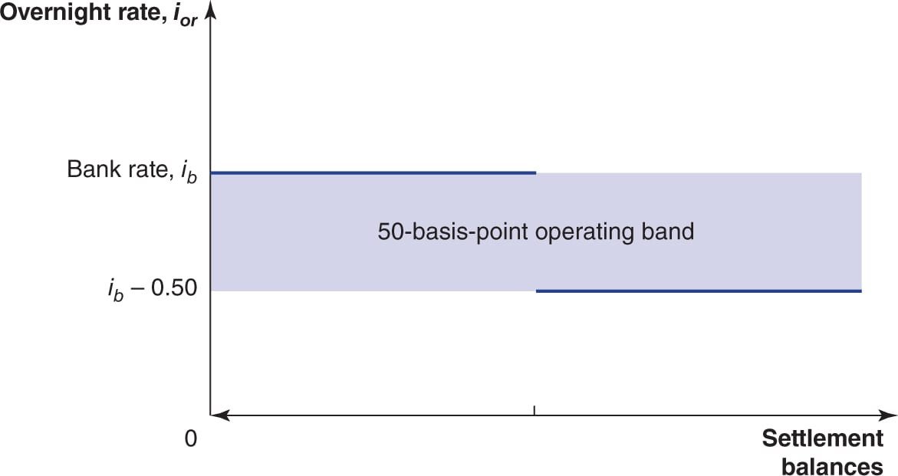  
  
  
  
Figure 10.4:  
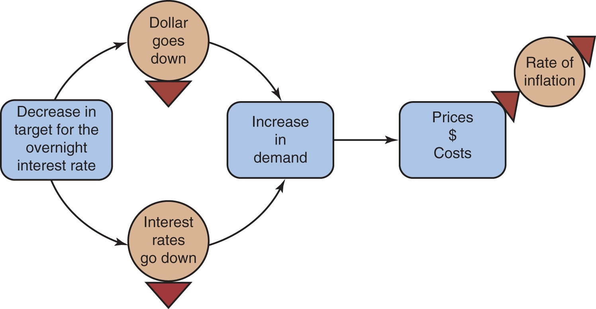  
Figure 10.5:  
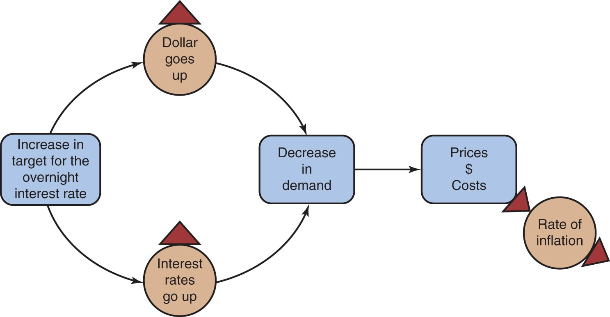  
Figure 10.6:  
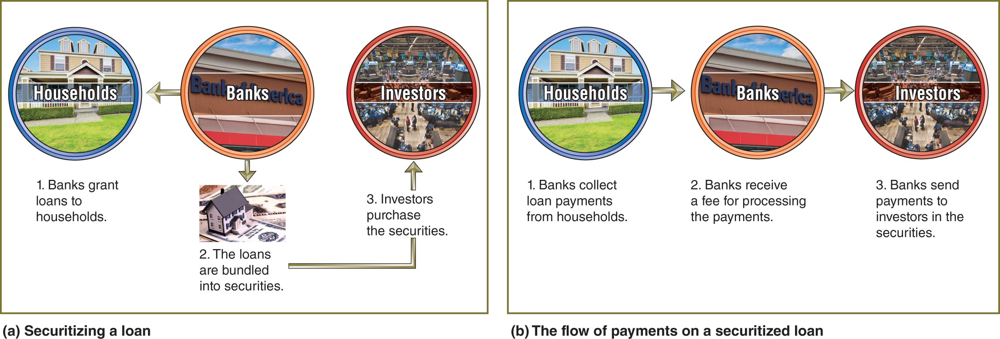  
  
___  
  
  
# The Quantity Theory of Money  
**LO 10.5** **Explain the quantity theory of money and use it to explain how high rates of inflation occur.**  
People have been aware of the connection between increases in the money supply and inflation for centuries. In the sixteenth century, the Spanish conquered Mexico and Peru and shipped large quantities of gold and silver from those countries back to Spain. The gold and silver were minted into coins and spent across Europe to further the political ambitions of the Spanish kings. Prices in Europe rose steadily during these years, and many observers discussed the relationship between this inflation and the flow of gold and silver into Europe from the Americas.  
## Connecting Money and Prices: The Quantity Equation  
In the early twentieth century, Irving Fisher, an economist at Yale University, formalized the connection between money and prices by using the *quantity equation*:  
  
  
  
  
The quantity equation states that the money supply (*M*) multiplied by the *velocity of money* (*V*) equals the price level (*P*) multiplied by real output (*Y*). Fisher defined the **++[velocity of money](https://plus.pearson.com/epub/bronte/BRNT-SITHABGCXI/v12/OPS/xhtml/glossary.xhtml#key-ddbb9551-d11b-5a30-bd9d-b01c0ebc5a92)++**, often called simply “velocity,” as the average number of times each dollar of the money supply is used to purchase goods and services included in GDP. Rewriting the original equation by dividing both sides by *M*, we have the equation for velocity:  
  
  
  
  
We can use  
to measure the money supply, the GDP deflator to measure the price level, and real GDP to measure real output. If we multiply real GDP by the GDP deflator, we get nominal GDP and can calculate the value for velocity for September 2021:  
  
  
  
  
This result tells us that each dollar of  
was on average spent 1.7 times on goods or services included in GDP.  
Because velocity is defined as being equal to  
, we know that the quantity equation must always hold true: The left side of the equation *must* be equal to the right side. A theory is a statement about the world that might possibly be false. Therefore, the quantity equation is not a theory. Irving Fisher turned the quantity equation into the **++[quantity theory of money](https://plus.pearson.com/epub/bronte/BRNT-SITHABGCXI/v12/OPS/xhtml/glossary.xhtml#key-55335b35-c536-566b-9424-b2c0b78fbd32)++** by maintaining that velocity is constant. He argued that the average number of times a dollar is spent depends on factors that do not change often, such as how often people get paid, how often they do their grocery shopping, and how often businesses send out bills. Because this assertion may be true or false, the quantity theory of money is, in fact, a theory.  
## The Quantity Theory Explanation of Inflation  
The quantity equation gives us a way of showing the relationship between changes in the money supply and changes in the price level, or inflation. To see this relationship more clearly, we can use a handy mathematical rule that states that an equation in which variables are multiplied together is equal to an equation in which the *growth rates* of these variables are *added* together. So, we can transform the quantity equation from  
  
  
  
  
  
to  
  
  
  
  
This way of writing the quantity equation is more useful for investigating the effect of changes in the money supply on the inflation rate. Remember that the growth rate for any variable is the percentage change in the variable from one year to the next. The growth rate of the price level is the inflation rate, so we can rewrite the quantity equation to help understand the factors that determine inflation:  
  
  
  
  
If Irving Fisher was correct that velocity is constant, then the growth rate of velocity will be zero. For example, if velocity is always equal to 1.7, then its percentage change from one year to the next will always be zero. This assumption allows us to rewrite the equation one last time:  
  
  
  
  
This equation leads to the following predictions:  
1. If the money supply grows at a faster rate than real GDP, there will be inflation.  
2. If the money supply grows at a slower rate than real GDP, there will be deflation. (Recall that *deflation* is a decline in the price level.)  
3. If the money supply grows at the same rate as real GDP, the price level will be stable, and there will be neither inflation nor deflation.  
It turns out that Irving Fisher was wrong in asserting that the velocity of money is constant. From year to year, there can be significant fluctuations in velocity. As a result, the predictions of inflation based on the quantity theory of money do not hold every year, but most economists agree that the quantity theory provides useful insight into the long-run relationship between the money supply and inflation: *In the long run, inflation results from the money supply growing at a faster rate than real GDP*.  
## How Accurate Are Forecasts of Inflation Based on the Quantity Theory?  
Note that the accuracy of the quantity theory depends on whether the key assumption that velocity is constant is correct. If velocity is not constant, there may not be a tight link between increases in the money supply and increases in the price level. For example, an increase in the quantity of money might be offset by a decline in velocity, leaving the price level unaffected. Because velocity can move erratically in the short run, we would not expect the quantity equation to provide good forecasts of inflation in the short run. Over the long run, however, there is a strong link between changes in the money supply and inflation. Panel (a) of ++[Figure 10.7](https://plus.pearson.com/epub/bronte/BRNT-SITHABGCXI/v12/OPS/xhtml/0406ce30-7c31-11ed-8dbb-774339d6f076.xhtml#95740f0c37b3f998cd8dbb344da51dd6)++ shows by decade the relationship in Canada between the growth of the M2 measure of the money supply and the inflation rate. Each diamond represents the combination of the average annual growth rate of the money supply and the average inflation rate for that decade. Because of variations in the rate of growth of real GDP and in velocity, there is not an exact relationship between the growth rate of M2 and the inflation rate. But there is a clear pattern: Decades with higher growth rates in the money supply were also decades with higher inflation rates.  
  
**Figure 10.7 The Relationship between Money Growth and Inflation over Time and around the World**  
  
Panel (a) shows that, by and large, the rate of inflation in Canada has been highest during the decades in which the money supply has increased most rapidly, and the rate of inflation has been lowest during the decades in which the money supply has increased least rapidly. Panel (b) shows the relationship between money supply growth and inflation for 129 countries between 2002 and 2018. There is not an exact relationship between money supply growth and inflation, but countries such as Angola, Belarus, and Sudan that had high rates of money supply growth had high inflation rates, and countries such as the United States and Israel had low rates of money supply growth and low inflation rates.  
**SOURCES:** Panel (a): Data for 1870 to 1960, M. C. Urquhart, “Canadian Economic Growth 1870–1985,” Institute for Economic Research, Queens University, Kingston, Ontario, Discussion Paper No. 734; and since 1961, Statistics Canada, CANSIM II series V3860248 and V41552796; Panel (b): International Monetary Fund, *Money and Financial Statistics.*.  
  
Panel (b) provides further evidence consistent with the quantity theory by looking at rates of growth of the money supply and rates of inflation across 129 countries for the years 2002–2018. Each diamond represents the combination of the average annual growth rate of the money supply and the average inflation rate for those years. Although there is not an exact relationship between rates of growth of the money supply and rates of inflation across countries, panel (b) shows that countries where the money supply grew rapidly tended to have high inflation rates, while countries where the money supply grew more slowly tended to have much lower inflation rates. Not included in panel (b) are data for Zimbabwe, which experienced the most extreme case of inflation in recent years. From 2002 to 2007, the money supply in Zimbabwe grew at an average annual rate of more than 10 000 percent. The result was an accelerating rate of inflation that eventually reached 15 billion percent during 2008. Zimbabwe was suffering from *hyperinflation*—that is, a rate of inflation that exceeds 50 percent per month. Venezuela also suffers from hyperinflation. Although the Venezuelan government no longer issues data on inflation, the International Monetary Fund estimates that the inflation rate in Venezuela rose from 494 percent in 2017 to 929 790 percent in 2018 to 2 million percent in 2019. The easing of foreign exchange controls by the government helped to bring the inflation rate down to about 4 percent by mid-2022.  
## High Rates of Inflation  
The quantity theory can help us understand the reasons for very high rates of inflation. Hyperinflation is caused by central banks increasing the money supply at a rate far in excess of the growth rate of real GDP. A high rate of inflation causes money to lose its value so rapidly that households and firms avoid holding it. If, as happened in Zimbabwe and Venezuela, the inflation rate becomes high enough, people stop using paper currency, so it no longer serves the important functions of money discussed earlier in this chapter. Economies suffering from high inflation usually also suffer from very slow growth, if not severe recession.  
  
Given the dire consequences that follow from high inflation, why do governments cause it by expanding the money supply so rapidly? The main reason is that governments often want to spend more than they are able to raise through taxes. Developed countries, such as Canada and the United States, can usually bridge gaps between spending and taxes by borrowing through selling bonds to the public. Developing countries can have difficulty selling bonds because investors are skeptical about their ability to pay back the money. If they are unable to sell bonds to the public, governments in developing countries will force their central banks to purchase the bonds. As we discussed previously, when a central bank buys government bonds, the money supply increases. In Canada, the Bank of Canada always buys government securities from banks rather than directly from the government. This procedure helps ensure that the government only issues bonds in amounts that private investors—rather than the central bank—are willing to buy.  
## Apply the Concept  
**The German Hyperinflation of the Early 1920s**  
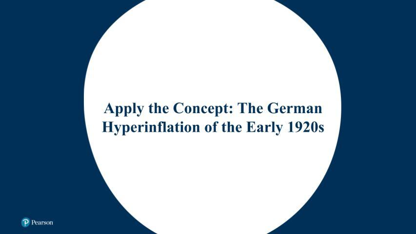  
  
Play  
  
  
  
For more practice, do related ++[Problem 5.9](https://plus.pearson.com/epub/bronte/BRNT-SITHABGCXI/v12/OPS/xhtml/043669b0-7c31-11ed-8dc6-975bddb38225.xhtml#1cd4cd06ebcf93a3b8176ec458f2b9f7)++ at the end of this chapter.  
## Economics in Your Life and Career  
## SHOULD YOUR BUSINESS ACCEPT CASH?  
At the beginning of this chapter, we asked you to suppose that you had started a juice bar with a partner who proposes that you not accept payments in cash. We asked you to consider whether this strategy is likely to increase or decrease your firm’s profit.  
We saw in the chapter that there is no law that requires you to accept cash as payment. We also saw in the *Apply the Concept: Your Money Is No Good Here!* that some stores now refuse to accept cash in order to speed up the processing of orders and to reduce the risk of robberies. Refusing to accept cash means that you will lose customers who don’t have a credit card or Apple Pay or a similar app. At some stores, the fraction of customers paying with cash has fallen to less than 10 percent. If your juice bar is in a similar situation, the gains from refusing cash may more than offset your loss of some customers, and your profit may increase. But if a large fraction of your customers prefer to use cash, then losing them may reduce your profit, particularly because you have to pay transaction fees to credit card companies.  
  
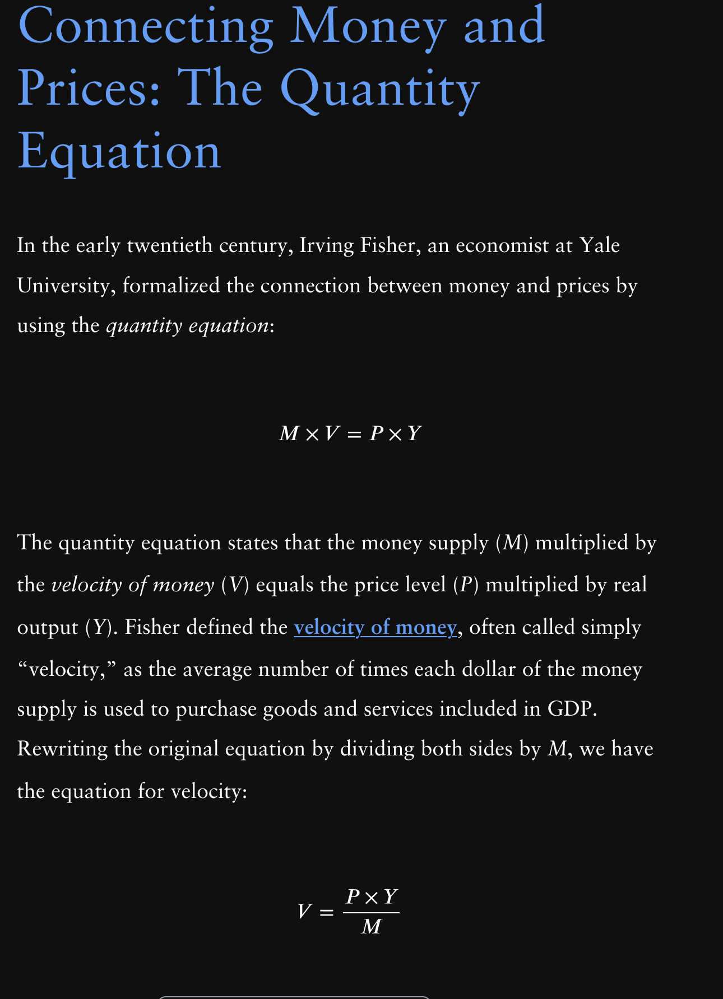  
  
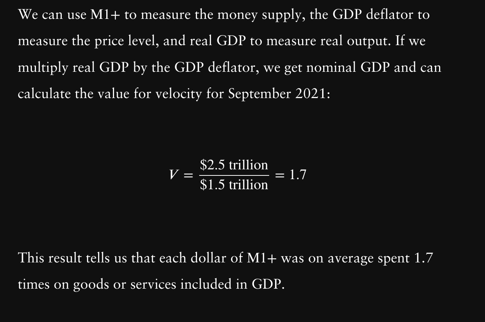  
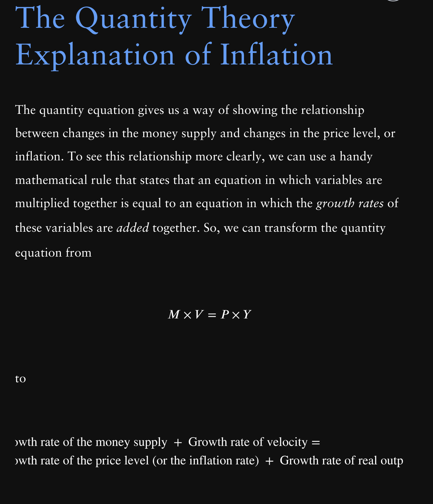  
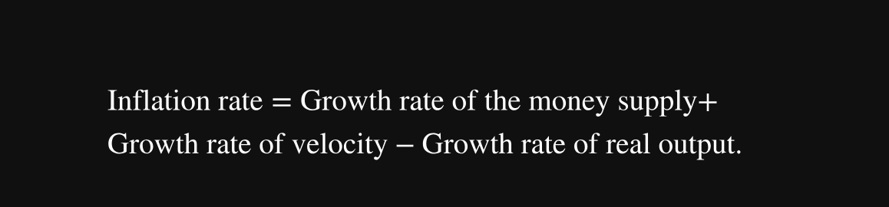  
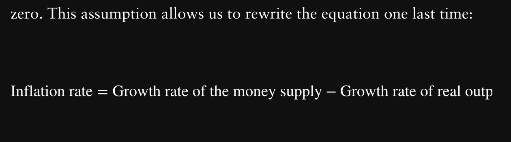  
  
Figure 10.7:  
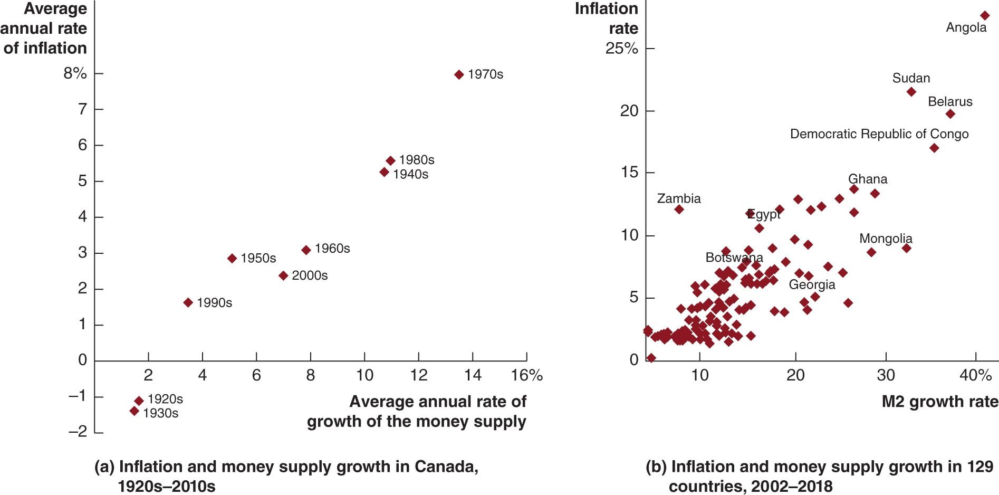  
