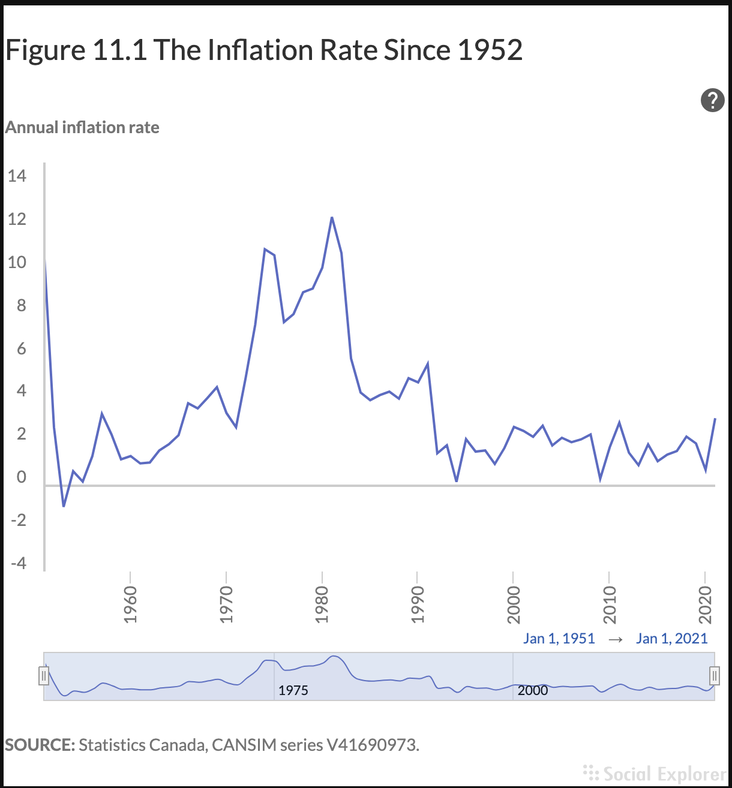
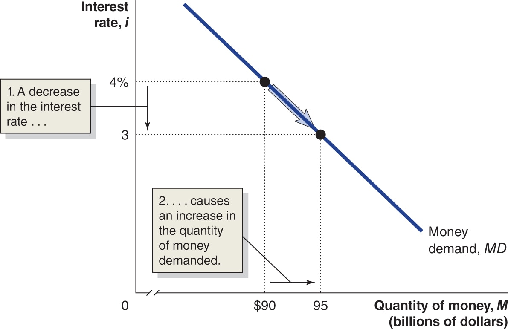
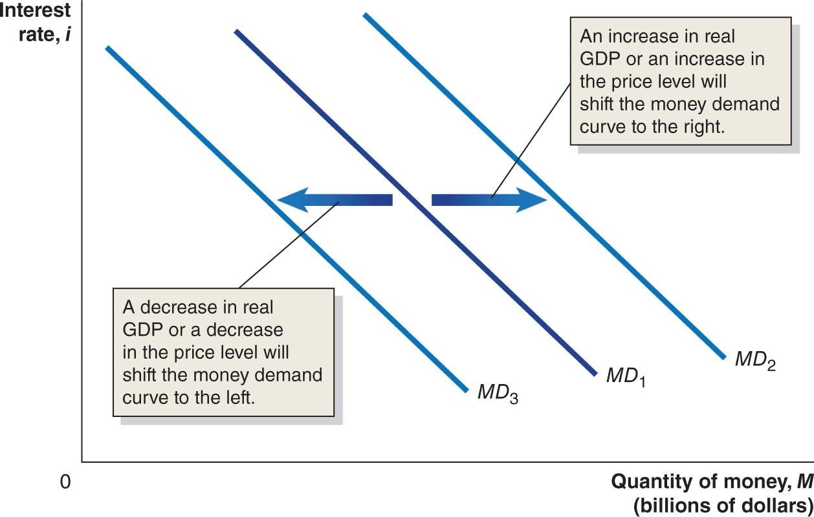
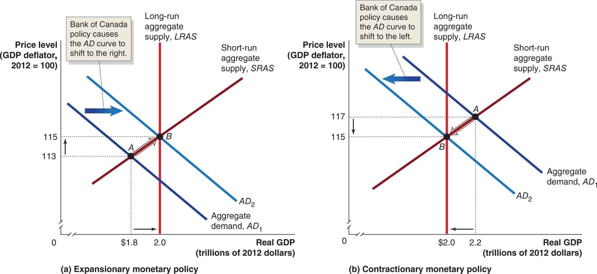
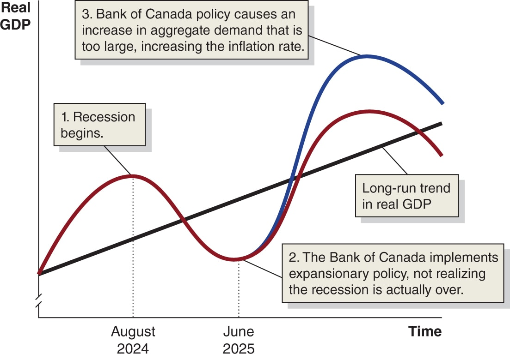
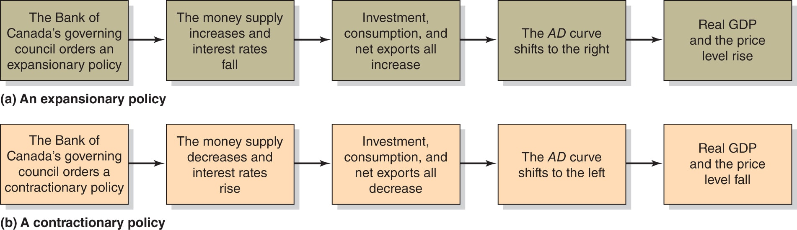
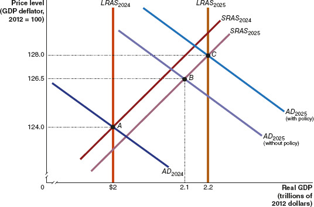
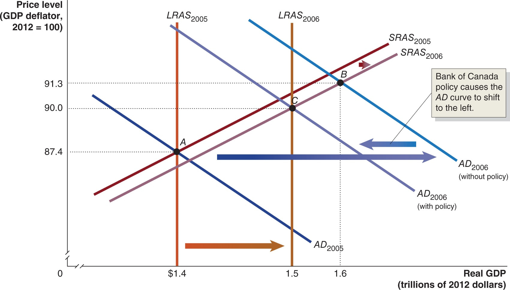
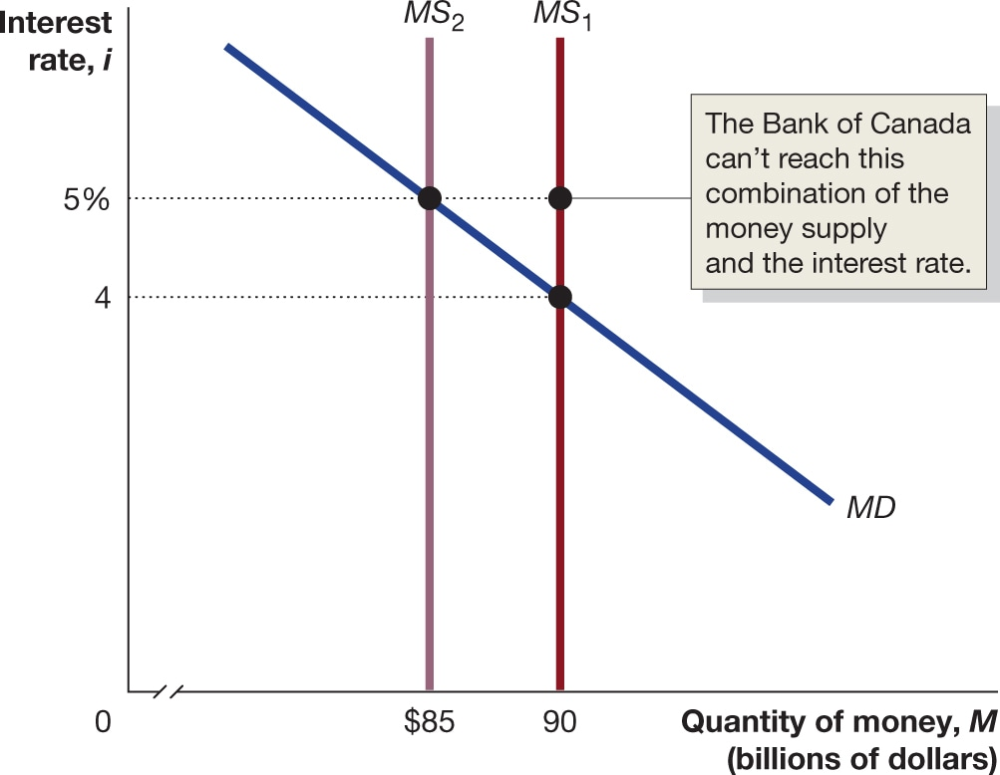
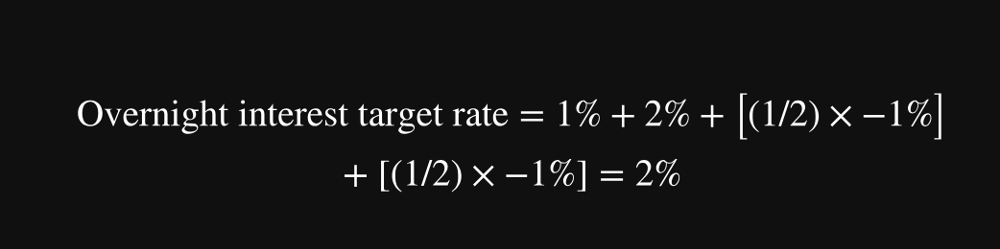

# Chapter 11 Economics  
  
# What Is Monetary Policy?  
**LO 11.1** **Define monetary policy and describe the Bank of Canada’s monetary policy goals.**  
The devastation of the Great Depression was fundamentally important to the creation of the Bank of Canada. Because the depth of the Great Depression was blamed on the operation of the country’s financial system, the federal Conservative government established the Royal Commission on Banking and Currency in 1933 to study the country’s banking and monetary system. Based on the commission’s recommendation, Parliament passed the Bank of Canada Act in 1934, and the newly founded Bank of Canada started operations on March 11, 1935. The main responsibility of the Bank of Canada is to conduct monetary policy “in the best interests of the economic life of the nation.”  
  
Since World War II, the Bank of Canada has carried out active *monetary policy*. **++[Monetary policy](https://plus.pearson.com/epub/bronte/BRNT-SITHABGCXI/v12/OPS/xhtml/glossary.xhtml#key-f658eba0-194e-5c91-bb32-e2bf148f2495)++** refers to the actions the Bank of Canada takes to manage the money supply and interest rates to achieve its macroeconomic policy objectives.  
## The Goals of Monetary Policy  
The Bank of Canada has four main *monetary policy goals* that are intended to promote a well-functioning economy:  
1. Price stability  
2. High employment  
3. Stability of financial markets and institutions  
4. Economic growth  
We briefly consider each of these goals.  
## Price Stability  
Rising prices reduce the usefulness of money as a medium of exchange and a store of value. Especially after inflation rose dramatically and unexpectedly during the 1970s, policymakers in most industrial countries have had price stability as a key policy goal. ++[Figure 11.1](https://plus.pearson.com/epub/bronte/BRNT-SITHABGCXI/v12/OPS/xhtml/047f0b70-7c31-11ed-8b11-13da99296288.xhtml#efce34c6dd990f0121d4ca00ab378298)++ shows that, from the early 1950s until 1968, the inflation rate remained below 4 percent per year. Inflation was above 4 percent for most of the 1970s. In 1974–1975 and early 1979, the inflation rate increased to more than 12 percent, where it remained until late 1982, when it began to rapidly fall back to the 4 percent range. After 1992, the inflation rate was usually below 4 percent. The 2007–2009 recession caused several months of deflation—a falling price level—during the second half of 2009.  
  
The inflation rates in 1974 and 1981 were the highest Canada has ever experienced during peacetime. After following a disinflationary monetary policy in the early 1980s, the Bank of Canada continued to focus on inflation, arguing that if inflation is low over the long run, the price system will do a better job of efficiently allocating resources, and the Bank of Canada will have the flexibility it needs to increase aggregate demand to fight recessions. Although in the following decades the Bank of Canada was successful in keeping inflation rates low, in 2021, some economists and policymakers worried that Bank of Canada policies might be contributing to an acceleration in inflation. We will discuss this debate further later in this chapter.  
  
## High Employment  
In addition to price stability, high employment (or a low rate of unemployment) is an important monetary policy goal. Unemployed workers and underused factories and office buildings reduce gross domestic product (GDP) below its potential level. Unemployment can cause workers who lack jobs to suffer financial distress and lower self-esteem. The goal of high employment extends beyond the Bank of Canada to other branches of the federal government.  
## Stability of Financial Markets and Institutions  
Firms often need to borrow funds as they design, develop, produce, and market their products. Savers look to financial investments to increase the value of their savings as they prepare to buy homes, pay for the education of their children, and provide for their retirement. The Bank of Canada promotes the stability of financial markets and institutions so that an efficient flow of funds from savers to borrowers will occur. As we saw in Chapter 10, Section 10.4, the events of 2007–2009 and 2020 brought the issue of stability in financial markets to the forefront.  
The financial crisis of 2007–2009 also affected investment banks and other financial firms in the *shadow banking system*. Investment banks, money market mutual funds, and other financial firms can be subject to *liquidity problems* because they often borrow short term—sometimes as short as overnight—and invest the funds in long-term securities. Just as a crisis can occur in commercial banks if depositors begin to withdraw funds, investment banks and other financial firms can experience a crisis if investors stop providing them with short-term loans. In 2008, the Bank of Canada and other central banks around the world took several steps to ease the liquidity problems of these financial firms because the Bank of Canada believed these problems were increasing the severity of the recession. In Section 11.6, we will discuss the new policies the Bank of Canada used during the 2020 COVID-19 pandemic.  
## Economic Growth  
In Chapters 6 and 7, we discussed the importance of economic growth to raising living standards. Policymakers aim to encourage *stable* economic growth, which allows households and firms to plan accurately and encourages firms to engage in the investment that is needed to sustain growth. Policy can spur economic growth by providing incentives for saving to ensure a large pool of investment funds, as well as by providing direct incentives for business investment. The government, however, may be better able to increase saving and investment than the Bank of Canada. For example, the government can change the tax laws to increase the return to saving and investing. In fact, some economists question whether the Bank of Canada can play a role in promoting economic growth beyond attempting to meet its goals of price stability, high employment, and financial stability.  
In the next section, we will look at how the Bank of Canada attempts to achieve its monetary policy goals. Although the Bank of Canada has multiple monetary policy goals, during most periods, its most important goal has been price stability. The turmoil in financial markets during 2007–2009 and 2020 led the Bank of Canada to put new emphasis on the goal of financial market stability.  
  
  
___  
  
  
# The Money Market and the Bank of Canada’s Choice of Monetary Policy Targets  
**LO 11.2 Describe the Bank of Canada’s monetary policy targets and explain how expansionary and contractionary monetary policies affect the interest rate.**  
  
The Bank of Canada uses its policy tools to achieve its monetary policy goals. The Bank of Canada’s key monetary policy tools are open market buyback operations and lending to financial institutions. At times, the Bank of Canada encounters conflicts between its policy goals. For example, as we will discuss later in this chapter, the Bank of Canada can raise interest rates to reduce the inflation rate. But higher interest rates typically reduce household and firm spending, which may result in slower growth and higher unemployment. So, a policy that is intended to achieve one monetary policy goal, such as reducing inflation, may make it more difficult to achieve another policy goal, such as high employment.  
## Monetary Policy Targets  
The Bank of Canada tries to keep the inflation rate between 1 and 3 percent, but it can’t affect the inflation rate directly. The Bank cannot tell firms how many people to employ or what prices to charge for their products. Instead, the Bank uses variables, called *monetary policy targets*, that it can affect directly and that, in turn, affect variables, such as real GDP, employment, and the price level, that are closely related to the Bank’s policy goals. The two main monetary policy targets are the money supply and the interest rate. As we will see, the Bank of Canada typically uses the interest rate as its policy target.  
Although the Bank of Canada has typically used the interest rate as its target, this target was not central to the Bank of Canada’s policy decisions during the global financial crisis of 2007–2009. As we will discuss later in this chapter, because financial markets suffered a degree of disruption not seen since the Great Depression of the 1930s, the Bank of Canada and other central banks around the world were forced to develop new policy tools.  
## The Demand for Money  
The Bank of Canada’s two monetary policy targets are related. To understand this relationship, we first need to examine the *money market*, which brings together the demand and supply for money. ++[Figure 11.2](https://plus.pearson.com/epub/bronte/BRNT-SITHABGCXI/v12/OPS/xhtml/048ffb60-7c31-11ed-888d-7e9458a5ebc0.xhtml#5b564c6593bf6cb85d9d06fc4ade19e4)++ shows the demand curve for money. The interest rate is on the vertical axis, and the quantity of money is on the horizontal axis. Here we are using the  
definition of money, which equals currency in circulation plus chequing account deposits. Notice that the demand curve for money is downward sloping.  
**Figure 11.2 The Demand for Money**  
  
The money demand curve slopes downward because lower interest rates cause households and firms to switch from financial assets such as Treasury bills and Canada bonds to money. All other things being equal, a fall in the interest rate from 4 percent to 3 percent will increase the quantity of money demanded from $90 billion to $95 billion. An increase in the interest rate will decrease the quantity of money demanded.  
  
**Animation: Figure 11.2 The Demand for Money**  
  
  
Play  
  
  
To understand why the demand curve for money is downward sloping, consider that households and firms have a choice between holding money and holding other financial assets, such as Canada bonds. In making the choice, households and firms take into account that  
* Money has one particularly desirable characteristic: You can use it to buy goods, services, or financial assets.  
* Money also has one undesirable characteristic: It earns either a zero interest rate or a very low interest rate.  
The currency in your wallet earns no interest, and the money in your chequing account earns either no interest or very little interest. Alternatives to money, such as Treasury bills, pay interest but have to be sold if you want to use the funds to buy something. When interest rates rise on financial assets such as Treasury bills, the amount of interest that households and firms lose by holding money increases. When interest rates fall, the amount of interest households and firms lose by holding money decreases. Remember that *opportunity cost* is what you have to forgo to engage in an activity. The interest rate is the opportunity cost of holding money.  
We now have an explanation of why the demand curve for money slopes downward: When interest rates on Treasury bills and other financial assets are low, the opportunity cost of holding money is low, so the quantity of money demanded by households and firms will be high; when interest rates are high, the opportunity cost of holding money will be high, so the quantity of money demanded will be low. In ++[Figure 11.2](https://plus.pearson.com/epub/bronte/BRNT-SITHABGCXI/v12/OPS/xhtml/048ffb60-7c31-11ed-888d-7e9458a5ebc0.xhtml#5b564c6593bf6cb85d9d06fc4ade19e4)++, a decrease in interest rates from 4 percent to 3 percent causes the quantity of money demanded by households and firms to rise from $90 billion to $95 billion.  
## Shifts in the Money Demand Curve  
We saw in Chapter 3 that the demand curve for a good is drawn holding constant all variables, other than the price, that affect the willingness of consumers to buy the good. Changes in variables other than the price cause the demand curve to shift. Similarly, the demand curve for money is drawn holding constant all variables, other than the interest rate, that affect the willingness of households and firms to hold money. Changes in variables other than the interest rate cause the demand curve to shift. The three most important variables that cause the money demand curve to shift are changes in real GDP, the price level, and technology.  
++[Figure 11.3](https://plus.pearson.com/epub/bronte/BRNT-SITHABGCXI/v12/OPS/xhtml/048ffb60-7c31-11ed-888d-7e9458a5ebc0.xhtml#2830ca7bbb2e70a2710e6a1e41471474)++ illustrates shifts in the money demand curve. An increase in real GDP means that the amount of buying and selling of goods and services will increase. This additional buying and selling increases the demand for money as a medium of exchange, so the quantity of money households and firms want to hold increases at each interest rate, shifting the money demand curve to the right. A decrease in real GDP decreases the quantity of money demanded at each interest rate, shifting the money demand curve to the left. A higher price level increases the quantity of money required for a given amount of buying and selling. Eighty years ago, for example, when the price level was much lower and someone could purchase a new car for $500 and a salary of $30 per week was typical for someone in the middle class, the quantity of money demanded by households and firms was much lower than today, even adjusting for the effect of the lower real GDP and smaller population of those years. An increase in the price level increases the quantity of money demanded at each interest rate, shifting the money demand curve to the right. A decrease in the price level decreases the quantity of money demanded at each interest rate, shifting the money demand curve to the left. We saw in Chapter 10 that countries including India, Sweden, and the United States have moved closer to being cashless economies. Rather than using currency or cheques, people are using mobile wallet apps like Apple Pay, Android Pay, and Venmo on their smartphones to purchase goods and services or to send funds to family and friends. This technological change has decreased the demand for money at each interest rate, shifting the money demand curve to the left.  
  
**Figure 11.3 Shifts in the Money Demand Curve**  
  
Changes in real GDP, the price level, or technology cause the money demand curve to shift. An increase in real GDP or an increase in the price level will cause the money demand curve to shift to the right, from M‍D‍1 to M‍D‍2. A decrease in real GDP, a decrease in the price level, or more widespread use of technology like mobile wallets will cause the money demand curve to shift to the left, from M‍D‍1 to M‍D‍3.  
  
**Animation: Figure 11.3 Shifts in the Money Demand Curve**  
  
  
Play  
  
## How the Bank of Canada Manages the Money Supply: A Quick Review  
Having discussed money demand, we now turn to money supply. In Chapter 10, we saw how the Bank of Canada manages the money supply. If the Bank of Canada decides to increase the money supply, it purchases government of Canada securities. The sellers of these government securities deposit the funds they receive from the Bank of Canada in banks, which increases bank reserves. Typically, banks loan out most of these reserves, which creates new chequing account deposits and expands the money supply. If the Bank of Canada decides to decrease the money supply, it sells Canada securities, which decreases bank reserves and contracts the money supply.  
## Equilibrium in the Money Market  
In ++[Figure 11.4](https://plus.pearson.com/epub/bronte/BRNT-SITHABGCXI/v12/OPS/xhtml/048ffb60-7c31-11ed-888d-7e9458a5ebc0.xhtml#64a71af611bbccb6635b470cf603baf7)++, we include both the money demand and money supply curves. We can use this figure to see how the Bank of Canada affects both the money supply and the interest rate. For simplicity, we assume that the Bank of Canada is able to completely control the money supply. With this assumption, the money supply curve is a vertical line, and changes in the interest rate have no effect on the quantity of money supplied. Just as with other markets, equilibrium in the *money market* occurs where the money demand curve crosses the money supply curve. If the Bank of Canada increases the money supply, the money supply curve will shift to the right, and the equilibrium interest rate will fall. In ++[Figure 11.4](https://plus.pearson.com/epub/bronte/BRNT-SITHABGCXI/v12/OPS/xhtml/048ffb60-7c31-11ed-888d-7e9458a5ebc0.xhtml#64a71af611bbccb6635b470cf603baf7)++, when the Bank of Canada increases the money supply from $90 billion to $95 billion, the money supply curve shifts to the right, from  
to  
, and the equilibrium interest rate falls from 4 percent to 3 percent.  
  
**Figure 11.4 The Effect on the Interest Rate When the Bank of Canada Increases the Money Supply**  
  
When the Bank of Canada increases the money supply, households and firms will initially hold more money than they want, relative to other financial assets. Households and firms use the money they don’t want to hold to buy short-term financial assets, such as Treasury bills, and make deposits in interest-paying bank accounts. This increase in demand allows banks and sellers of Treasury bills and similar securities to offer a lower interest rate. Eventually, the interest rate will fall enough that households and firms will be willing to hold the additional money the Bank of Canada has created. In the figure, an increase in the money supply from $90 billion to $95 billion causes the money supply curve to shift to the right, from M‍S‍1 to M‍S‍2, and causes the equilibrium interest rate to fall from 4 percent to 3 percent.  
  
**Animation: Figure 11.4 The Effect on the Interest Rate When the Fed Increases the Money Supply**  
  
  
Play  
  
In the money market, the adjustment from one equilibrium to another equilibrium is different from the adjustment in the market for a good. In ++[Figure 11.4](https://plus.pearson.com/epub/bronte/BRNT-SITHABGCXI/v12/OPS/xhtml/048ffb60-7c31-11ed-888d-7e9458a5ebc0.xhtml#64a71af611bbccb6635b470cf603baf7)++, the money market is initially in equilibrium, with an interest rate of 4 percent and a money supply of $90 billion. When the Bank of Canada increases the money supply by $5 billion, households and firms have more money than they want to hold at an interest rate of 4 percent. What do households and firms do with the extra $5 billion? They are most likely to use the money to buy short-term financial assets, such as Canada bonds, or to deposit the money in interest-paying bank accounts, such as certificates of deposit. This increase in demand for interest-paying bank accounts and short-term financial assets allows banks to offer lower interest rates on certificates of deposit, and it allows sellers of Canada bonds and similar assets to also offer lower interest rates. As the interest rates on certificates of deposit, Canada bonds, and other short-term assets fall, the opportunity cost of holding money falls. The result is a movement down the money demand curve. Eventually the interest rate falls enough that households and firms are willing to hold the additional $5 billion worth of money the Bank of Canada has created, and the money market will be back in equilibrium. To summarize: *When the Bank of Canada increases the money supply, the short-term interest rate must fall until it reaches a level at which households and firms are willing to hold the additional money*.  
++[Figure 11.5](https://plus.pearson.com/epub/bronte/BRNT-SITHABGCXI/v12/OPS/xhtml/048ffb60-7c31-11ed-888d-7e9458a5ebc0.xhtml#69720e362532bca27b3efd70fcb9e96f)++ shows what happens when the Bank of Canada decreases the money supply. The money market is initially in equilibrium, at an interest rate of 4 percent and a money supply of $90 billion. If the Bank of Canada decreases the money supply to $85 billion, households and firms will be holding less money than they would like, relative to other financial assets, at an interest rate of 4 percent. To increase their money holdings, they will sell Treasury bills and other short-term financial assets and withdraw funds from certificates of deposit and other interest-paying bank accounts. Banks will have to offer higher interest rates in order to retain depositors, and sellers of Treasury bills and similar securities will have to offer higher interest rates in order to find buyers. Rising short-term interest rates increase the opportunity cost of holding money, causing a movement up the money demand curve. Equilibrium is finally restored at an interest rate of 5 percent.  
  
**Figure 11.5 The Effect on the Interest Rate When the Bank of Canada Decreases the Money Supply**  
  
When the Bank of Canada decreases the money supply, households and firms will initially hold less money than they want, relative to other financial assets. Households and firms will sell Treasury bills and other short-term financial assets and withdraw money from interest-paying bank accounts. These actions will increase interest rates. Eventually, interest rates will rise to the point at which households and firms will be willing to hold the smaller amount of money that results from the Bank of Canada’s actions. In the figure, a reduction in the money supply from $90 billion to $85 billion causes the money supply curve to shift to the left, from M‍S‍1 to M‍S‍2, and causes the equilibrium interest rate to rise from 4 percent to 5 percent.  
  
**Animation: Figure 11.5 The Effect on the Interest Rate When the Fed Decreases the Money Supply**  
  
  
Play  
  
## A Tale of Two Interest Rates  
In Chapter 6, we discussed the loanable funds model of the interest rate. In that model, the equilibrium interest rate is determined by the demand and supply for loanable funds. So, we have two models of the interest rate:  
1. The loanable funds model is concerned with the *long-term real rate of interest*, which is the interest rate that is most relevant when savers consider purchasing a long-term financial security such as a corporate bond. It is also the interest rate that is most relevant to firms that are borrowing to finance long-term investment projects such as new factories or office buildings, or to households that are taking out mortgage loans to buy new homes.  
2. The money market model is concerned with the *short-term nominal rate of interest*. When analyzing monetary policy, economists focus on the short-term nominal interest rate because it is the interest rate most affected by Bank of Canada policy.  
Often—but not always—there is a close connection between movements in the short-term nominal interest rate and movements in the long-term real interest rate. So, when the Bank of Canada takes actions to increase the short-term nominal interest rate, usually the long-term real interest rate also increases. In other words, as we will discuss in the next section, when the interest rate on Treasury bills rises, the real interest rate on mortgage loans usually also rises, although sometimes only after a delay.  
  
## Choosing a Monetary Policy Target  
As we have seen, the Bank of Canada uses monetary policy targets to affect economic variables, such as real GDP, the price level, or technology use, that are closely related to the Bank of Canada’s policy goals. The Bank of Canada can use either the money supply or the interest rate as its monetary policy target. As ++[Figure 11.5](https://plus.pearson.com/epub/bronte/BRNT-SITHABGCXI/v12/OPS/xhtml/048ffb60-7c31-11ed-888d-7e9458a5ebc0.xhtml#69720e362532bca27b3efd70fcb9e96f)++ shows, the Bank of Canada is capable of affecting both. As we discussed in Chapter 10, the Bank of Canada has generally focused more on the interest rate than on the money supply.  
There are many different interest rates in the economy. For purposes of monetary policy, the Bank of Canada has targeted the interest rate known as the *overnight interest rate*. In the next section, we will discuss the overnight interest rate before examining how targeting the interest rate can help the Bank of Canada achieve its monetary policy goals.  
## The Importance of the Overnight Interest Rate  
Recall from Chapter 10 that every bank likes to keep a fraction of its deposits as reserves, either as currency held in the bank or as deposits (settlement balances) with the Bank of Canada. The Bank of Canada pays banks a low interest rate on their reserve deposits, which (during normal times) is the bank rate less 50 basis points,  
, so banks normally have an incentive to invest reserves above the desired amounts. During the financial crisis of 2007–2009, bank reserves soared (especially in the United States) as banks attempted to meet an increase in deposit withdrawals and as they became reluctant to lend to any borrowers except those with the most flawless credit histories. These conditions were very unusual, however. In normal times, banks keep few excess reserves, and when they need additional reserves, they borrow in the *overnight funds market* from banks that have reserves available. The **++[overnight interest rate](https://plus.pearson.com/epub/bronte/BRNT-SITHABGCXI/v12/OPS/xhtml/glossary.xhtml#key-d0c474ec-91da-56fd-85be-855dec8395fe)++** is the interest rate banks charge one another on loans in the overnight funds market. The loans in that market are usually very short term, often just overnight.  
The Bank of Canada operates under a system in which it announces the target for the overnight interest rate on eight “fixed” dates throughout the year. The Bank of Canada does not actually set the overnight interest rate. Instead, it sets an **++[operating band](https://plus.pearson.com/epub/bronte/BRNT-SITHABGCXI/v12/OPS/xhtml/glossary.xhtml#key-b774a620-53ad-57a3-a23d-77883b57d832)++** that is 50 basis points wide for the overnight interest rate, and the rate is determined by the supply of reserves relative to the demand for them. Because the Bank of Canada can increase and decrease the supply of bank reserves through open market buyback operations, it can set a *target* for the overnight interest rate and usually comes very close to reaching it. ++[Figure 11.6](https://plus.pearson.com/epub/bronte/BRNT-SITHABGCXI/v12/OPS/xhtml/048ffb60-7c31-11ed-888d-7e9458a5ebc0.xhtml#37e165b9bc64a85495aedb46c95d8e2e)++ shows how over the years the Bank of Canada has pushed the overnight interest rate up and down in its attempts to achieve its policy goals. The Bank of Canada responded to the start of the financial crisis by rapidly cutting its target for the overnight interest rate beginning in December 2007. In April 2009, the Bank of Canada also lowered the band for the overnight interest rate from 50 basis points to 25 basis points (from 0.50 percent to 0.25 percent) and instead of targeting the overnight interest rate at the midpoint of the band (as it does during normal times), it started targeting the overnight interest rate at the bottom of the operating band. On June 1, 2010, the Bank of Canada re-established the normal operating band of 50 basis points for the overnight interest rate. With the arrival of the COVID-19 pandemic in Canada in March 2020, the Bank of Canada again lowered the band for the overnight interest rate to 25 basis points and started targeting the overnight interest rate at the bottom of the operating band, at 0.25 percent. As the figure shows, the overnight interest rate in recent years has been low in comparison with most of the period since the 1950s. The low rates reflect the severity of the recessions of 2007–2009 and 2020 and the fact that most interest rates around the world have been much lower than during previous decades.  
  
**Figure 11.6 Overnight Interest Rate Targeting, July 1960–September 2022**  
  
The Bank of Canada does not actually set the overnight interest rate. However, the Bank’s ability to increase or decrease bank reserves quickly through open market buyback operations keeps the overnight interest rate close to the Bank’s target rate. The Bank has pushed the overnight interest rate up and down as it has attempted to achieve its policy goals of price stability. The shaded areas represent periods of recession.  
**SOURCE:** Bank for International Settlements, www.bis.org.  
  
Because only banks can borrow or lend in the overnight funds market, the overnight interest rate is not directly relevant for households and firms. However, changes in the overnight interest rate usually result in changes in interest rates on other short-term financial assets, such as Canada bonds, and changes in interest rates on long-term financial assets, such as corporate bonds and mortgages. A change in the overnight interest rate has a greater effect on short-term interest rates than on long-term interest rates, and its effect on long-term interest rates may occur only after a lag in time. Although a majority of economists support the Bank of Canada’s choice of the interest rate as its monetary policy target, some economists believe the Bank of Canada should concentrate on the money supply instead. We will discuss these views later in this chapter.  
  
___  
  
  
# Monetary Policy and Economic Activity  
**LO 11.3** **Use aggregate demand and aggregate supply graphs to show the effects of monetary policy on real GDP and the price level.**  
The Bank of Canada uses the overnight interest rate as a monetary policy target because the Bank can control that rate and because changes in the overnight interest rate can affect real GDP, employment, and prices. Remember the distinction between the nominal interest rate and the real interest rate: We calculate the real interest rate by subtracting the inflation rate from the nominal interest rate. The Bank of Canada can affect economic variables like real GDP and employment mainly by causing changes in long-term real interest rates like the real interest rates on mortgages and corporate bonds. Because the overnight interest rate is a short-term nominal interest rate, the Bank of Canada sometimes has difficulty affecting long-term real interest rates. Nevertheless, for purposes of the following discussion, we will assume that the Bank of Canada is able to use changes in the overnight interest rate to affect long-term real interest rates.  
  
## How Interest Rates Affect Aggregate Demand  
Changes in interest rates affect *aggregate demand*, which is the total level of spending in the economy. Recall that aggregate demand has four components: consumption, investment, government purchases, and net exports. Changes in interest rates will not affect government purchases, but they will affect the other three components of aggregate demand in the following ways:  
* **Consumption.** Many households finance purchases of consumer durables, such as automobiles and furniture, by borrowing. Lower interest rates on loans increase household spending on consumer durables by reducing the monthly payments households make. Higher interest rates reduce household spending on consumer durables. Higher interest rates also increase the return to saving, leading households to save more and spend less. Lower interest rates reduce the return to saving, leading households to save less and spend more.  
* **Investment.** Firms use their profits or borrow to finance most of their spending on machinery, equipment, research and development, and buildings. Firms borrow either in financial markets by issuing corporate bonds or by obtaining loans from banks. Higher interest rates on corporate bonds or on bank loans make it more expensive for firms to borrow, so they will undertake fewer investment projects. Lower interest rates make it less expensive for firms to borrow, so they will undertake more investment projects. Lower interest rates can also increase stock prices, which can increase firms’ investment spending. As interest rates decline, stocks become a more attractive investment relative to bonds. The increase in demand for stocks raises their prices. By issuing additional shares of stock, firms can acquire the funds they need to buy new factories and equipment, so investment increases.  
* Spending by households on new homes is also part of investment. When interest rates on mortgage loans rise, the cost of buying new homes rises, and fewer new homes will be purchased. When interest rates on mortgage loans fall, more new homes will be purchased.   
* **Net exports.** Recall that net exports equals spending by foreign households and firms on goods and services produced in Canada minus spending by Canadian households and firms on goods and services produced in other countries. The value of net exports depends partly on the exchange rate between the Canadian dollar and foreign currencies. When the value of the dollar rises, households and firms in other countries will pay more for goods and services produced in Canada, but Canadian households and firms will pay less for goods and services produced in other countries. As a result, Canada will export less and import more, so net exports will fall. When the value of the dollar falls, net exports will rise. If interest rates in Canada rise relative to interest rates in other countries, investing in Canadian financial assets will become more desirable, causing foreign investors to increase their demand for Canadian dollars, which will increase the value of the dollar. As the value of the dollar increases, net exports will fall. If interest rates in Canada decline relative to interest rates in other countries, the value of the Canadian dollar will fall, and net exports will rise.  
  
## The Effects of Monetary Policy on Real GDP and the Price Level  
In Chapter 9, we developed the *aggregate demand and aggregate supply model* to explain fluctuations in real GDP and the price level. In the basic version of the model, we assume that there is no economic growth, so the long-run aggregate supply curve does not shift. In panel (a) of ++[Figure 11.7](https://plus.pearson.com/epub/bronte/BRNT-SITHABGCXI/v12/OPS/xhtml/04e3c0b0-7c31-11ed-8b5d-869161827a38.xhtml#b83f405f86378a585fb48a48b44a9151)++, short-run equilibrium is at point *A*, where the aggregate demand  
curve intersects the short-run aggregate supply (*SRAS*) curve. Real GDP is below potential GDP, as shown by the long-run aggregate supply (*LRAS*) curve, so the economy is in a recession, with some firms operating below normal capacity and some workers having been laid off. To reach its goal of high employment, the Bank of Canada carries out an **++[expansionary monetary policy](https://plus.pearson.com/epub/bronte/BRNT-SITHABGCXI/v12/OPS/xhtml/glossary.xhtml#key-af203c89-ffd9-5c99-ade4-6bcf8a541f6d)++** by increasing the money supply and decreasing interest rates. Lower interest rates cause an increase in consumption, investment, and net exports, which shifts the aggregate demand curve to the right, from to  
. Real GDP increases from $1.8 trillion to potential GDP of $2.0 trillion, and the price level rises from 113 to 115 (point *B*). The policy successfully returns real GDP to its potential level. Rising production leads to increasing employment, allowing the Bank of Canada to achieve its goal of high employment.  
**Figure 11.7**  
**Monetary Policy**  
  
In panel (a), short-run equilibrium is at point A, with real GDP of $1.8 trillion and a price level of 113. An expansionary monetary policy causes aggregate demand to shift to the right, from A‍D‍1 to A‍D‍2, increasing real GDP from $1.8 trillion to $2.0 trillion and the price level from 113 to 115 (point B). With real GDP back at its potential level, the Bank of Canada can meet its goal of high employment. In panel (b), short-run equilibrium is at point A, with real GDP at $2.2 trillion and the price level at 117. Because real GDP is greater than potential GDP, the economy experiences rising wages and prices. A contractionary monetary policy causes aggregate demand to shift to the left, from A‍D‍1 to A‍D‍2, causing real GDP to decrease from $2.2 trillion to $2.0 trillion and the price level to decrease from 117 to 115 (point B). With real GDP back at its potential level, the Bank of Canada can meet its goal of price stability.  
  
  
Play  
  
In panel (b) of ++[Figure 11.7](https://plus.pearson.com/epub/bronte/BRNT-SITHABGCXI/v12/OPS/xhtml/04e3c0b0-7c31-11ed-8b5d-869161827a38.xhtml)++, short-run equilibrium is at point *A*, with real GDP of $2.2 trillion, which is above potential GDP of $2.0 trillion. With some firms producing beyond their normal capacity and the unemployment rate very low, wages and prices are increasing. To reach its goal of price stability, the Bank of Canada needs to carry out a **++[contractionary monetary policy](https://plus.pearson.com/epub/bronte/BRNT-SITHABGCXI/v12/OPS/xhtml/glossary.xhtml#key-8dca2114-0442-5c97-b19c-6c67364e5b90)++** by decreasing the money supply and increasing interest rates. Higher interest rates cause a decrease in consumption, investment, and net exports, which shifts the aggregate demand curve from  
to  
. Real GDP decreases from $2.2 trillion to $2.0 trillion, and the price level falls from 117 to 115 (point *B*). Why would the Bank of Canada want to intentionally cause real GDP to decline? In the long run, real GDP cannot continue to remain above potential GDP, and attempting to keep real GDP above potential GDP would result in rising inflation. As aggregate demand declines and real GDP returns to its potential level, upward pressure on wages and prices will be reduced, allowing the Bank of Canada to achieve its goal of price stability.  
  
We can conclude that the Bank of Canada can use monetary policy to affect the price level and, in the short run, the level of real GDP, allowing it to attain its policy goals of high employment and price stability.  
## Apply the Concept  
**
**  
For more practice, do related ++[Problems 3.9](https://plus.pearson.com/epub/bronte/BRNT-SITHABGCXI/v12/OPS/xhtml/05da0790-7c31-11ed-8c85-5c912302aabe.xhtml#67f55265befd3ee0565c436899cfe305)++ and ++[3.10](https://plus.pearson.com/epub/bronte/BRNT-SITHABGCXI/v12/OPS/xhtml/05da0790-7c31-11ed-8c85-5c912302aabe.xhtml#f0f4ca186a7ac71e43eda2d0f4447490)++ at the end of this chapter.  
  
## Can the Bank of Canada Eliminate Recessions?  
Panel (a) of ++[Figure 11.7](https://plus.pearson.com/epub/bronte/BRNT-SITHABGCXI/v12/OPS/xhtml/04e3c0b0-7c31-11ed-8b5d-869161827a38.xhtml)++ shows a completely successful expansionary monetary policy that shifts the *AD* curve to bring real GDP back to potential GDP. In practice, this ideal is very difficult for the Bank of Canada to achieve, as the severity of the 2007–2009 and 2020 recessions illustrates. The best the Bank can realistically do is keep recessions shorter and milder than they would otherwise be.  
If the Bank of Canada is to succeed in offsetting the effects of the business cycle, it needs to quickly recognize the need for a change in monetary policy. If the Bank of Canada is late in recognizing that a recession has begun or that the inflation rate is increasing, it may not be able to implement a new policy quickly enough to do much good. There is typically a *lag*, or delay, between a policy change and its effect on real GDP, employment, inflation, and other economic variables. The late Nobel laureate Milton Friedman famously described the lags for monetary policy as “long and variable,” meaning that it can take months or years for changes in monetary policy to affect real GDP and inflation and that the lags vary based on economic circumstances. After the Bank of Canada reduces the target overnight interest rate, it takes time for the interest rates that affect firm and household behaviour to also decline. Then it takes time for firms to identify newly profitable investment projects, obtain loans from banks or arrange to sell bonds, and start spending the borrowed funds. Similarly, it takes time for families to respond to lower mortgage interest rates by buying houses and for homebuilders to begin building the houses. As a result, the full effect of a change in monetary policy is typically spread out over several years.  
  
Implementing a policy too late may actually destabilize the economy. To see why, consider ++[Figure 11.8](https://plus.pearson.com/epub/bronte/BRNT-SITHABGCXI/v12/OPS/xhtml/04e3c0b0-7c31-11ed-8b5d-869161827a38.xhtml#f324f0c97c62cfe0d76d571c0a7994e1)++. The straight line represents the long-run growth trend in real GDP in Canada. Historically real GDP has grown about 3 percent per year, although between 2010 and 2019, annual growth in real GDP averaged only about 2 percent due to the slowing growth of both the labour force and labour productivity. The actual path of real GDP differs from the underlying trend because of the business cycle, which is shown by the red curved line. As we saw in Chapter 6, Section 6.3, the actual business cycle is more irregular than the stylized cycle shown here.  
**Figure 11.8 The Effect of a Poorly Timed Monetary Policy on the Economy**  
  
The upward-sloping straight line represents the long-run growth trend in real GDP. The curved red line represents the path real GDP takes because of the business cycle. If the Bank of Canada is too late in implementing a change in monetary policy, real GDP will follow the curved blue line. As a result of the Bank of Canada’s expansionary monetary policy, an increase in aggregate demand that is too large occurs during the next expansion, which causes an increase in the inflation rate.  
  
Suppose that a recession begins in August 2024. Because it takes months for economic statistics to be gathered by Statistics Canada and the Bank of Canada itself, there is a lag before the Bank recognizes that a recession has begun. Finally, in June 2025, the Bank concludes that the economy is in recession and begins an expansionary monetary policy. As it turns out, June 2025 is actually the trough of the recession, meaning that the recession has already ended, and an expansion has begun. In these circumstances, the Bank of Canada’s expansionary policy is not needed to end the recession. The increase in aggregate demand caused by the Bank’s lowering interest rates is likely to push the economy beyond potential GDP and cause a significant acceleration in inflation. Real GDP ends up following the path indicated by the blue curved line. The Bank of Canada has inadvertently engaged in a *procyclical policy*, which increases the severity of the business cycle, as opposed to a *countercyclical policy*, which is meant to reduce the severity of the business cycle and which is what the Bank intends to use. As we saw in Chapter 6, Section 6.3, the typical recession since 1950 has lasted less than one year, which increases the likelihood that the Bank of Canada may accidentally engage in a procyclical policy. Making this mistake is, of course, less likely in severe recessions like those of 2007–2009 and 2020.  
  
## A Summary of How Monetary Policy Works  
++[Figure 11.9](https://plus.pearson.com/epub/bronte/BRNT-SITHABGCXI/v12/OPS/xhtml/04e3c0b0-7c31-11ed-8b5d-869161827a38.xhtml#a95f8423256f7c8459b07df494621a5c)++ compares the steps involved in expansionary and contractionary monetary policies. We need to note an important qualification to this summary: At every point, we should add the phrase “relative to what would have happened without the policy.” The table isolates the effect of monetary policy, *holding constant all other factors affecting the variables involved*. In other words, we are invoking the *ceteris paribus*, or “all else equal,” condition, discussed in Chapter 3, Section 3.1. This point is important because a contractionary monetary policy, for example, does not cause the price level to fall; instead, a contractionary monetary policy causes the price level *to rise by less than it would have without the policy*. One final note on terminology: An expansionary monetary policy is sometimes called a *loose* policy, or an *easy* policy. A contractionary monetary policy is sometimes called a *tight* policy.  
**Figure 11.9 Expansionary and Contractionary Monetary Policies**  
  
Panel (a) shows that when the Bank of Canada adopts an expansionary monetary policy, it sets off a series of steps that result in real GDP and the price level being higher than they would otherwise have been. Panel (b) shows that when the Bank of Canada adopts a contractionary monetary policy, it sets off a series of steps that result in real GDP and the price level being lower than they would otherwise have been.  
  
  
  
  
## Don’t Let This Happen to You  
## REMEMBER THAT WITH MONETARY POLICY, IT’S THE INTEREST RATES—NOT THE MONEY—THAT COUNT  
It is tempting to think of monetary policy as working like this: If the Bank of Canada wants more spending in the economy, it increases the money supply, and people spend more because they now have more money. If the Bank of Canada wants less spending in the economy, it decreases the money supply, and people spend less because they now have less money. In fact, that is *not* how monetary policy works. Remember the important difference between money and income: The Bank of Canada increases the money supply by buying government securities. The sellers of the government securities have just exchanged one asset—government securities—for another asset—a cheque from the Bank of Canada; the sellers have *not* increased their income. Even though the money supply is now larger, no one’s income has increased, so no one’s spending should be directly affected.  
Spending is affected only when monetary policy lowers interest rates. When interest rates are lower, households are more likely to buy new homes and automobiles, and businesses are more likely to buy new factories and warehouses. Lower interest rates also lead to a lower value of the dollar, which reduces the prices of exports and raises the prices of imports, thereby increasing net exports. It isn’t the increase in the money supply that has brought about this additional spending; *the* *lower interest rates* have brought about the spending. To understand how monetary policy works, and to interpret news reports about the Bank of Canada’s actions, remember that it is the change in interest rates, not the change in the money supply, that is most important.  
For more practice, do related ++[Problem 3.12](https://plus.pearson.com/epub/bronte/BRNT-SITHABGCXI/v12/OPS/xhtml/05da0790-7c31-11ed-8c85-5c912302aabe.xhtml#f572df4a15acfddf1f17ae774705faca)++ at the end of this chapter.  
  
___  
  
  
# Monetary Policy in the Dynamic Aggregate Demand and Aggregate Supply Model  
**LO 11.4** **Use the dynamic aggregate demand and aggregate supply model to analyze monetary policy.**  
The overview of monetary policy we just finished contains a key idea: The Bank of Canada can use monetary policy to affect aggregate demand, thereby changing the price level and the level of real GDP. The discussion of monetary policy illustrated by ++[Figure 11.7](https://plus.pearson.com/epub/bronte/BRNT-SITHABGCXI/v12/OPS/xhtml/05401180-7c31-11ed-8bf3-a5f555e63429.xhtml)++ is simplified, however, because it ignores two important facts about the economy:  
1. The economy experiences continuing inflation, with the price level rising every year.  
2. The economy experiences long-run growth, with the *LRAS* curve shifting to the right every year.  
In Chapter 9, we developed a *dynamic aggregate demand and aggregate supply model* that takes into account these two facts. In this section, we use the dynamic model to gain a more complete understanding of monetary policy. Let’s briefly review the dynamic model. Recall that over time, the Canadian labour force and the Canadian capital stock will increase. Technological change will also occur. The result will be an increase in potential GDP, which we show by the long-run aggregate supply curve shifting to the right. These factors will also result in firms supplying more goods and services at any given price level in the short run, which we show by the short-run aggregate supply curve shifting to the right. During most years, the aggregate demand curve will also shift to the right, indicating that aggregate expenditure will be higher at every price level. Aggregate expenditure usually increases for three key reasons:  
1. As population grows and incomes rise, consumption will increase over time.  
2. As the economy grows, firms will expand capacity, and new firms will be established, increasing investment spending.  
3. An expanding population and an expanding economy require increased government services, such as more police officers and teachers, so government purchases will expand.  
## The Effects of Monetary Policy on Real GDP and the Price Level: A More Complete Account  
During certain periods, *AD* does not increase enough during the year to keep real GDP at potential GDP. This slow growth in aggregate demand may be due to households and firms becoming pessimistic about the future state of the economy, leading them to cut back their spending on consumer durables, houses, and factories. As we have seen, the global financial crisis had a negative effect on aggregate demand during the 2007–2009 recession. There are other reasons aggregate demand might grow slowly: The federal government could decide to reduce the budget deficit by cutting back its purchases and raising taxes, or recessions in other countries might cause a decline in Canadian exports. In the hypothetical situation shown in ++[Figure 11.10](https://plus.pearson.com/epub/bronte/BRNT-SITHABGCXI/v12/OPS/xhtml/05401180-7c31-11ed-8bf3-a5f555e63429.xhtml#6809ce774046d397e71958d39679b8d4)++, in the first year, equilibrium is at point *A*, with potential GDP of $2.0 trillion and a price level of 115. In the second year, *LRAS* increases to $2.4 trillion, but *AD* increases only to  
, which is not enough to keep real GDP at potential GDP. If the Bank of Canada does not intervene, the new short-run equilibrium will occur at $2.3 trillion (point *B*). The $100 billion gap between this level of real GDP and potential GDP at  
means that some firms are operating at less than their normal capacity. Incomes and profits will fall, firms will begin to lay off workers, and the unemployment rate will rise.  
  
**Figure 11.10 An Expansionary Monetary Policy**  
  
Initially, equilibrium is at point *A*, with real GDP of $2.0 trillion and a price level of 115. Without monetary policy, aggregate demand will shift from A‍D‍1 to A‍D‍2(without policy), which is not enough to keep the economy at full employment because long-run aggregate supply has shifted from L‍R‍A‍S‍1 to L‍R‍A‍S‍2. Short-run equilibrium is at point *B*, with real GDP of $2.3 trillion and a price level of 117. By lowering interest rates, the Bank of Canada increases investment, consumption, and net exports sufficiently to shift aggregate demand to A‍D‍2(with policy). Equilibrium will be at point *C*, with real GDP of $2.4 trillion, which is its full employment level, and a price level of 118. The price level is higher than it would have been if the Bank of Canada had not acted to increase spending in the economy.  
  
Play  
  
Economists at the Bank of Canada closely monitor the economy and continually update forecasts of future levels of real GDP and prices. When these economists anticipate that aggregate demand is not growing fast enough to allow the economy to remain at full employment, they present their findings to the Governing Council of the Bank of Canada, which decides whether circumstances require a change in monetary policy. For example, suppose that the Governing Council meets and considers a forecast from the staff indicating that during the following year, a gap of $100 billion will open between equilibrium real GDP and potential GDP. In other words, the macroeconomic equilibrium illustrated by point *B* in ++[Figure 11.10](https://plus.pearson.com/epub/bronte/BRNT-SITHABGCXI/v12/OPS/xhtml/05401180-7c31-11ed-8bf3-a5f555e63429.xhtml#6809ce774046d397e71958d39679b8d4)++ will occur. The Governing Council may then decide to carry out an expansionary monetary policy to lower interest rates to stimulate aggregate demand. The figure shows the results of a successful attempt to do this: *AD* has shifted to the right, and equilibrium occurs at potential GDP (point *C*). The Bank of Canada will have successfully headed off the falling incomes and rising unemployment that otherwise would have occurred. Bear in mind that we are illustrating a perfectly executed monetary policy that keeps the economy at potential GDP, which is difficult to achieve in practice for reasons discussed in the previous section.  
  
Notice in ++[Figure 11.10](https://plus.pearson.com/epub/bronte/BRNT-SITHABGCXI/v12/OPS/xhtml/05401180-7c31-11ed-8bf3-a5f555e63429.xhtml#6809ce774046d397e71958d39679b8d4)++ that the expansionary monetary policy caused the inflation rate to be higher than it would have been. Without the expansionary policy, the price level would have risen from 115 to 117, so the inflation rate for the year would have been 1.7 percent. By shifting the aggregate demand curve, the expansionary policy caused the price level to increase from 117 to 118, raising the inflation rate from 1.7 percent to 2.6 percent.  
## Using Monetary Policy to Fight Inflation  
In addition to using an expansionary monetary policy to reduce the severity of recessions, the Bank of Canada can use a contractionary monetary policy to keep aggregate demand from expanding so rapidly that the inflation rate begins to increase. ++[Figure 11.11](https://plus.pearson.com/epub/bronte/BRNT-SITHABGCXI/v12/OPS/xhtml/05401180-7c31-11ed-8bf3-a5f555e63429.xhtml#6da04ceeaf1562e155f965021f52f36d)++ shows the situation during 2005 and 2006, when the Bank of Canada faced this possibility. During 2005, real GDP was equal to potential GDP, but the Bank of Canada was concerned that the continuing boom in the commodities sector might lead aggregate demand to increase so rapidly that the inflation rate would begin to accelerate.  
**Figure 11.11 A Contractionary Monetary Policy in 2006**  
  
In 2005, equilibrium is at point *A*, with real GDP equal to potential GDP of $1.4 trillion and a price level of 87.4. From 2005 to 2006, potential GDP increased from $1.4 trillion to $1.5 trillion, as long-run aggregate supply increased from L‍R‍A‍S‍2005 to L‍R‍A‍S‍2006. The Bank of Canada raised interest rates because it believed the commodities sector was causing aggregate demand to increase too rapidly. Without the increase in interest rates, aggregate demand would have shifted from A‍D‍2005 to A‍D‍2006(without policy), and the new short-run equilibrium would have occurred at point *B*. Real GDP would have been $1.6 trillion—$100 billion greater than potential GDP—and the price level would have been 91.3. The increase in interest rates resulted in aggregate demand increasing only to A‍D‍2006(with policy). Equilibrium occurred at point *C*, with real GDP of $1.5 trillion, which was equal to potential GDP, and the price level rose only to 90.0.  
  
  
Play  
  
  
## Solved Problem 11.1  
## THE EFFECTS OF MONETARY POLICY  
The hypothetical information in the following table shows what the values for real GDP and the price level will be in 2025 if the Bank of Canada does *not* use monetary policy.  

| Year | Potential GDP | Real GDP      | Price Level |
| ---- | ------------- | ------------- | ----------- |
| 2024 | $2.0 trillion | $2.0 trillion | 124.0       |
| 2025 | 2.2 trillion  | 2.1 trillion  | 126.5       |
  
	a	If the Bank of Canada wants to keep real GDP at its potential level in 2025, should it use an expansionary policy or a contractionary policy? Will it raise its target for the overnight interest rate or lower it?  
* Suppose the Bank of Canada’s policy is successful in keeping real GDP at its potential level in 2025. State whether each of the following will be higher or lower than if the Bank of Canada had taken no action.  
    * Real GDP  
    * Potential GDP  
    * The inflation rate  
    * The unemployment rate  
* Draw an aggregate demand and aggregate supply graph to illustrate your answer. Be sure that your graph contains *LRAS* curves for 2024 and 2025; *SRAS* curves for 2024 and 2025; *AD* curves for 2024 and 2025, with and without the monetary policy action; and equilibrium real GDP and the price level in 2025, with and without the policy action.  
## Solving the Problem  
**Step 1: Review the chapter material.** This problem is about the effects of monetary policy on real GDP and the price level, so you may want to review the section “The Effects of Monetary Policy on Real GDP and the Price Level: A More Complete Account.”  
**Step 2: Answer the questions in part (a) by explaining how the Bank of Canada can keep real GDP at its potential level.** The information in the table tells us that without monetary policy, the economy will be below potential GDP in 2025. To keep real GDP at its potential level, the Bank of Canada must undertake an expansionary policy by lowering its target for the overnight interest rate. If other interest rates also decline, households and firms will increase their spending, and the exchange rate between the dollar and other currencies will fall, increasing net exports.  
**Step 3: Answer part (b) by explaining the effect of the Bank of Canada’s policy.** If the Bank of Canada’s policy is successful, real GDP in 2025 will increase from $2.1 trillion, as given in the table, to its potential level of $2.2 trillion. Potential GDP is not affected by monetary policy, so its value will not change. Because the level of real GDP will be higher, the unemployment rate will be lower than it would have been without the policy. The expansionary monetary policy shifts the *AD* curve to the right, so short-run equilibrium will move up the short-run aggregate supply (*SRAS*) curve, and the price level will be higher.  
**Step 4: Answer part (c) by drawing the graph.** Your graph should look similar to ++[Figure 11.10](https://plus.pearson.com/epub/bronte/BRNT-SITHABGCXI/v12/OPS/xhtml/05401180-7c31-11ed-8bf3-a5f555e63429.xhtml#6809ce774046d397e71958d39679b8d4)++. Equilibrium in 2024 is at point *A*, with the *AD* and *SRAS* curves intersecting along the *LRAS* curve. Real GDP is at its potential level of $2.0 trillion, and the price level is 124. Without monetary policy, the *AD* curve shifts to  
, and short-run equilibrium is at point *B*. Because potential GDP has increased from $2.0 trillion to $2.2 trillion, real GDP of $2.1 trillion is below the potential level. The price level has increased from 124.0 to 126.5. With policy, the *AD* curve shifts to  
, and equilibrium is at point *C*. Real GDP is at its potential level of $2.2 trillion. We don’t have enough information to be sure of the new equilibrium price level. We do know that it will be higher than 126.5. The graph shows the price level rising to 128.0. Therefore, without the Bank of Canada’s expansionary policy, the inflation rate in 2025 would have been about 2.0 percent. With policy, it will be 3.2 percent.  
  
  
## Extra credit  
Bear in mind that, in reality, the Bank of Canada is typically unable to use monetary policy to keep real GDP exactly at its potential level, as this problem suggests it can.  
For more practice, do related ++[Problems 4.4](https://plus.pearson.com/epub/bronte/BRNT-SITHABGCXI/v12/OPS/xhtml/05da0790-7c31-11ed-8c85-5c912302aabe.xhtml#50c689f55b6b5ed61e353639664f8d9a)++ and ++[4.5](https://plus.pearson.com/epub/bronte/BRNT-SITHABGCXI/v12/OPS/xhtml/05da0790-7c31-11ed-8c85-5c912302aabe.xhtml#6eccae8f9d19e170a4ce83da2c2ab3fb)++ at the end of this chapter.  
  
___  
  
  
# A Closer Look at the Bank of Canada’s Setting of Monetary Policy Targets  
**LO 11.5** **Describe the Bank of Canada’s setting of monetary policy targets.**  
The Bank of Canada changes its target for the overnight interest rate depending on the state of the economy. Is the Bank’s approach correct? Is using the overnight interest rate as a target the best way to conduct monetary policy? If the Bank of Canada targets the overnight interest rate, how should it decide what the target level should be? In this section, we consider these important issues concerning the Bank of Canada’s targeting policy.  
## Should the Central Bank Target the Money Supply?  
Some economists have argued that rather than use an interest rate as its monetary policy target, the Bank of Canada should use the money supply. Many of the economists who make this argument belong to a school of thought known as *monetarism*. The leader of the monetarist school was the late Nobel laureate Milton Friedman, who was skeptical about the central bank being able to correctly time changes in monetary policy.  
Friedman and his followers favoured replacing *monetary policy* with a *monetary growth rule*. Ordinarily, we expect monetary policy to respond to changing economic conditions: When the economy is in recession, the central bank reduces interest rates, and when inflation is increasing, the central bank raises interest rates. A monetary growth rule, in contrast, is a plan for increasing the money supply at a constant rate that does not change in response to economic conditions. Friedman and his followers proposed a monetary growth rule of increasing the money supply every year at a rate equal to the long-run annual growth rate of real GDP, which has been about 3 percent since 1950 (although real GDP grew at only about 2 percent per year between 2010 and 2019). If the central bank adopted this monetary growth rule, it would stick to it through changing economic conditions.  
  
Friedman argued that the central bank should stick to the rule even during recessions because he believed that active monetary policy destabilizes the economy by increasing the number and severity of recessions. By keeping the money supply growing at a constant rate, Friedman argued, the central bank would increase economic stability. During the 1970s, some economists and politicians urged the Bank of Canada to adopt a monetary growth rule. But the fairly close relationship between movements in the money supply and movements in real GDP and the price level that existed before 1980 has become much weaker. Since 1980, the growth rate of narrow money supply measures (such as  
) has been unstable. In some years, has grown more than 10 percent, while in other years, it has actually fallen. Yet despite these wide fluctuations in the growth of  
, growth in real GDP has been fairly stable, and inflation has remained low during most years. Consequently, support inside and outside the Bank of Canada for following a monetary growth rule has declined.  
## Why Doesn’t the Bank of Canada Target Both the Money Supply and the Interest Rate?  
Most economists believe that the interest rate is the best monetary policy target. But as we have just seen, other economists believe the central bank should target the money supply. Why doesn’t the Bank of Canada satisfy both groups by targeting both the money supply and the interest rate? The simple answer is that the Bank can’t target both at the same time. To see why, look at ++[Figure 11.12](https://plus.pearson.com/epub/bronte/BRNT-SITHABGCXI/v12/OPS/xhtml/057ca550-7c31-11ed-81cb-427e0d5a237e.xhtml#16aa709b0db41e0a9417abf3a3b26879)++, which shows the money market.  
**Figure 11.12 The Bank of Canada Can’t Target Both the Money Supply and the Interest Rate**  
  
The Bank of Canada is forced to choose between using either the interest rate or the money supply as its monetary policy target. In this figure, the Bank of Canada can set a target of $90 billion for the money supply or a target of 5 percent for the interest rate, but the Bank can’t hit both targets because it can achieve only combinations of the interest rate and the money supply that represent equilibrium in the money market.  
  
  
  
Play  
  
Remember that the Bank of Canada controls the money *supply*, but it does not control money *demand*. Money demand is determined by decisions of households and firms as they weigh the trade-off between the convenience of money and its low interest rate compared with other financial assets. Suppose the Bank of Canada is targeting the interest rate and decides, given conditions in the economy, that the interest rate should be 5 percent. Or, suppose the Bank of Canada is targeting the money supply and decides that the money supply should be $90 billion. ++[Figure 11.12](https://plus.pearson.com/epub/bronte/BRNT-SITHABGCXI/v12/OPS/xhtml/057ca550-7c31-11ed-81cb-427e0d5a237e.xhtml#16aa709b0db41e0a9417abf3a3b26879)++ shows that the Bank of Canada can bring about an interest rate of 5 percent or a money supply of $90 billion, but it can’t bring about both. The point representing an interest rate of 5 percent and a money supply of $90 billion is not on the money demand curve, so it can’t represent an equilibrium in the money market. The Bank of Canada can only attain combinations of the interest rate and the money supply that represent equilibrium. Therefore, the Bank of Canada has to choose between targeting an interest rate and targeting the money supply. For most of the period since World War II, the Bank of Canada has chosen the overnight interest rate as its target.  
  
## The Taylor Rule  
How does the Bank of Canada choose a target for the overnight interest rate? John Taylor of Stanford University has analyzed central bank decision making and developed the **++[Taylor rule](https://plus.pearson.com/epub/bronte/BRNT-SITHABGCXI/v12/OPS/xhtml/glossary.xhtml#key-cf4e1c9d-2d6d-54bc-b99a-4503c9c4b7db)++** to explain overnight interest rate targeting. The Taylor rule begins with an estimate of the value of the equilibrium real overnight interest rate, which is the overnight interest rate, adjusted for inflation, that would be consistent with real GDP being equal to potential GDP in the long run. Taylor believes this rate to be 2 percent. According to the Taylor rule, the Bank of Canada should set the target for the overnight interest rate so that it is equal to the sum of the inflation rate, the equilibrium real overnight interest rate, and two additional terms. The first of these additional terms is the *inflation gap*—the difference between current inflation and a target rate; the second is the *output gap*—the percentage difference between real GDP and potential GDP. The inflation gap and output gap are each given “weights” that reflect their influence on the overnight interest target rate. With weights of 1/2 for both gaps, we have the following Taylor rule:  
  
  
  
  
The Taylor rule includes expressions for the inflation gap and the output gap because the Bank of Canada is concerned about both inflation and fluctuations in real GDP. Taylor demonstrated that if the equilibrium real overnight interest rate is 2 percent and the target rate of inflation is 2 percent, the preceding equation does a good job of explaining changes in the Bank of Canada’s target for the overnight interest rate during most years. Consider an example in which the current inflation rate is 1 percent, and real GDP is 1 percent below potential GDP. In that case, the inflation gap equals  
, and the output gap is also  
. Inserting these values in the Taylor rule, we can calculate the predicted value for the overnight interest target rate:  
  
  
  
  
It should also be noted that in the Taylor rule, the coefficient on the inflation gap is greater than zero. This means that when the inflation rate increases by one percentage point, the central bank increases the overnight interest rate by more than one percentage point (in the case of the above equation, by  
) so that the real interest rate also rises. This is known as the **++[Taylor principle](https://plus.pearson.com/epub/bronte/BRNT-SITHABGCXI/v12/OPS/xhtml/glossary.xhtml#key-9e310269-56d3-5f01-805e-3cd72ff7490b)++**, and it is critical to the success of monetary policy as it ensures that monetary policy is stabilizing. For example, when the overnight interest rate increases by less than the increase in the inflation rate, then the real interest rate would decline, stimulating the level of economic activity and leading to more inflation.  
Although the Taylor rule does not account for changes in the target inflation rate or the equilibrium interest rate, many economists view the rule as a convenient tool for analyzing the overnight funds target.  
## Solved Problem 11.2  
  
**Solved Problem 11.2 Whiteboard: Applying the Taylor Rule**  
  
Play  
  
## APPLYING THE TAYLOR RULE  
An article in the *Wall Street Journal* discussed the views of John Williams, the president of the Federal Reserve Bank of New York, about the Taylor rule. According to the article, Williams argued that if the Federal Reserve had attempted to follow the Taylor rule during the recession of 2007–2009, it would have had to do “something not easily done, and that would have been for the Fed to have pushed short-term rates deeply into negative territory.” Again, as a result of the economic effects of the COVID-19 pandemic, during the second quarter of 2020, the Taylor rule indicated that the federal funds rate, which is the US equivalent of the Canadian overnight interest rate, should have been *negative* 3.1 percent when it was actually 0.1 percent.  
  
* What does it mean for an interest rate to be negative?  
* Use the equation for the Taylor rule to show how the overnight interest target rate might be negative. Assume that the equilibrium real overnight interest rate and the target rate of inflation are both 2 percent and the current inflation rate is 0 percent.  
## Solving the Problem  
* **Step 1: Review the chapter material.** This problem is about using the Taylor rule to evaluate monetary policy, so you may want to review the section “The Taylor Rule.”  
* **Step 2: Answer part (a) by explaining what it means for an interest rate to be negative.** We expect interest rates to be positive, which results in the borrower paying the lender back more than the amount of the funds borrowed. As we saw in *++[Apply the Concept: The COVID-19 Recession, Quantitative Easing and Tightening, and the Bank of Canada’s Balance Sheet](https://plus.pearson.com/epub/bronte/BRNT-SITHABGCXI/v12/OPS/xhtml/04e3c0b0-7c31-11ed-8b5d-869161827a38.xhtml#7aa248881fa402f2154adeaf1eeef280)++*, with a negative interest rate, the borrower would pay the lender back less than the amount of the funds borrowed. Note that Williams is referring to a negative *nominal* interest rate, which is very rare. A negative *real* interest rate that results from the inflation rate being higher than the nominal interest rate occurs more frequently.  
* **Step 3: Answer part (b) by constructing an example where the target overnight interest rate might be negative.** This is the equation for the Taylor rule:  
  
  
  
  
* If we substitute the values given in the problem, we have  
  
  
  
  
* or  
  
  
  
  
* So, for the overnight interest target rate to be negative, the output gap will have to be larger (in absolute value) than   
percent. For example, if the output gap is  
* percent, then  
  
  
  
  
* In fact, the output gap was as large as   
* percent during the 2007–2009 recession. So, Williams is correct that following the Taylor rule exactly would have required the overnight interest rate to be negative, which means that banks would have to have been willing to pay interest when lending to other banks in the overnight interest market rather than receive interest. This outcome is very unlikely, and as we saw in *++[Apply the Concept: The COVID-19 Recession, Quantitative Easing and Tightening, and the Bank of Canada’s Balance Sheet](https://plus.pearson.com/epub/bronte/BRNT-SITHABGCXI/v12/OPS/xhtml/04e3c0b0-7c31-11ed-8b5d-869161827a38.xhtml#7aa248881fa402f2154adeaf1eeef280)++*, during the 2020 recession, Federal Reserve chair Jerome Powell was opposed to the Fed attempting to use negative interest rates to expand the economy.  
## Extra credit  
The inability of the central bank to push the overnight interest rate to negative values is sometimes called the *zero lower bound* to monetary policy.  
For more practice, do related ++[Problems 5.4](https://plus.pearson.com/epub/bronte/BRNT-SITHABGCXI/v12/OPS/xhtml/05da0790-7c31-11ed-8c85-5c912302aabe.xhtml#bdcb8231e5d76b22555ee0723e501904)++ and ++[5.5](https://plus.pearson.com/epub/bronte/BRNT-SITHABGCXI/v12/OPS/xhtml/05da0790-7c31-11ed-8c85-5c912302aabe.xhtml#17a25e1fd8a77c0832986017f38dac6e)++ at the end of this chapter.  
  
## Inflation Targeting and the Federal Reserve’s New Monetary Policy Strategy  
Many economists and central bankers believe that *inflation targeting* provides a useful framework for carrying out monetary policy. With **++[inflation targeting](https://plus.pearson.com/epub/bronte/BRNT-SITHABGCXI/v12/OPS/xhtml/glossary.xhtml#key-3eb48ab7-346f-512d-8258-763a68aa5132)++**, a central bank publicly sets an explicit target for the inflation rate over a period of time, and the government and the public then judge the performance of the central bank on the basis of its success in hitting the target. After many years of not having an explicit inflation target, the Fed announced in 2012 that it would attempt to maintain an average inflation rate of 2 percent per year.  
With inflation targeting, the Fed can still respond to periods of recession or other economic problems without following an inflexible rule. An inflation target allows monetary policy to focus on inflation and inflation forecasts except during times of severe recession. Most economists believe that over the long run, monetary policy has a greater effect on inflation than on the growth of real GDP. An inflation target also provides an anchor for inflationary expectations. If households, firms, and participants in financial markets believe that the Fed will hit an annual inflation target of 2 percent, then they will expect that if inflation is temporarily lower or higher, it will eventually return to the target rate. Inflation targets promote accountability for the central bank by providing a yardstick against which its performance can be measured.  
Some economists and policymakers are critical of the Fed’s decision to adopt an explicit inflation target. They argue that rigid numerical targets for inflation diminish the flexibility of monetary policy to address other policy goals. They also note that because of the lag between implementation of a monetary policy and its effect on inflation, inflation targeting requires that the Fed use forecasts of future inflation, which may turn out to be inaccurate.  
In November 2018, the Fed announced that it would review its monetary policy strategy. In August 2020, the Fed announced the results of the review by releasing a “Statement on Longer-Run Goals and Monetary Policy Strategy.” In a speech that accompanied the statement, Federal Reserve chair Jerome Powell announced a key change in Fed strategy:  
We will seek to achieve inflation that averages 2 percent over time. Therefore, following periods when inflation has been running below 2 percent, appropriate monetary policy will likely aim to achieve inflation moderately above 2 percent for some time . . . . Our approach could be viewed as a flexible form of average inflation targeting.  
The policy of *average-inflation targeting* will automatically make monetary policy expansionary during recessions and contractionary during periods of unexpectedly high inflation. If households and firms accept that the central bank is following this policy, then during a recession, when the inflation rate falls below the target, they would expect the central bank to take action to increase the inflation rate. A higher inflation rate would result in a lower real interest rate, which would have an expansionary effect on the economy. Similarly, if the inflation rate were above the target, households and firms would expect future inflation rates to be lower, raising the real interest rate, which would have a contractionary effect on the economy.  
Some economists were disappointed that the Fed’s review of its monetary policy strategy didn’t result in the Fed adopting *nominal GDP targeting* rather than average-inflation targeting. Recall that nominal GDP equals the GDP price deflator multiplied by real GDP. The growth rate of nominal GDP is approximately equal to the growth rate of the price level (or the inflation rate) plus the growth rate of real GDP. If the central bank expected 3 percent annual growth in real GDP and wanted an inflation rate of 2 percent, it would set a target for nominal GDP growth of 5 percent per year. If real GDP growth slowed, as during a recession, the central bank would automatically pursue an expansionary monetary policy in an attempt to hit its nominal GDP target. If the inflation rate increased above 2 percent, the central bank would automatically pursue a contractionary policy to keep nominal GDP from rising above its target.  
  
Nominal GDP targeting has drawn support from some economists who in past years had supported a money growth rule. Critics of the proposal note that GDP is subject to sometimes large revisions, so that the central bank might be making decisions based on inaccurate data, although the same argument has been made about following a Taylor rule. Targeting nominal GDP is an unfamiliar idea to many people, so it may not be as useful as inflation targeting at signalling the central bank’s intentions to households and firms.  
In 2021, central banks around the world had adopted inflation targeting—but no central bank had yet adopted nominal GDP targeting. The Fed seems to have closed the door to a strategy of nominal GDP targeting by adopting average inflation targeting at the end of its 2018–2020 policy review.  
## Apply the Concept  
  
**Figure in Apply the Concept: Should the Bank of Canada Worry about the Prices of Food and Gasoline?**  
For more practice, do related ++[Problem 5.8](https://plus.pearson.com/epub/bronte/BRNT-SITHABGCXI/v12/OPS/xhtml/05da0790-7c31-11ed-8c85-5c912302aabe.xhtml#7c46394251cb7efb779a007b31884f33)++ at the end of this chapter.  
  
  
___  
  
**Central Bank Policies during the 2007–2009 and 2020 Recessions**  
**LO 11.6** **Describe the policies the central banks used during the 2007–2009 and 2020 recessions.**  
As we have seen, a central bank’s traditional response to a recession is to lower the target for the overnight interest rate. The severity of the recession of 2007–2009, particularly the problems in financial markets during those years, complicated the job of the Federal Reserve in the United States, the world’s largest central bank. By December 2008, the Fed had effectively lowered the target for the federal funds rate to zero, but the zero interest rate alone did not result in a sufficient increase in aggregate demand to end the recession. Economists refer to this situation as the *zero lower bound problem*. In this section, we will discuss some of the additional policy measures the Fed took during the 2007–2009 recession. We will also discuss the similar actions the Bank of Canada took in 2020 to deal with the economic effects of the COVID-19 pandemic.  
## The Inflation and Deflation of the Housing Market Bubble in the United States  
To understand the 2007–2009 recession and the financial crisis that accompanied it, we need to start by considering the housing market in the United States. The Fed lowered the target for the federal funds rate during the 2001 recession to stimulate demand for housing. The policy was successful, and most builders experienced several years of high demand. By 2005, however, many economists argued that a “bubble” had formed in the housing market. As we discussed in Chapter 6, the price of any asset reflects the returns the owner of the asset expects to receive. For example, the price of a share of stock reflects the profitability of the firm issuing the stock because the owner of a share of stock has a claim on the firm’s profits.  
There are two main explanations for bubbles:  
1. An investor may be caught up in the enthusiasm of the moment and, by failing to gather sufficient information, may overestimate the true value of the stocks.  
2. An investor may expect to profit from buying stocks at inflated prices if the investor can sell them at even higher prices before the bubble bursts.  
The price of a house should reflect the value of the housing services it provides. We would expect, then, that housing prices and rents would increase at roughly the same rate. If prices of single-family homes rise significantly relative to rents for single-family homes, it is likely that the housing market is experiencing a bubble. Between January 2000 and May 2006, housing prices in the United States nearly doubled, while rents increased by less than 25 percent. This large divergence between housing prices and rents is evidence of a bubble. In addition, in some cities, there was an increase in the number of buyers who did not intend to live in the houses they purchased but were using them as investments. Like stock investors during a stock market bubble, these housing investors were expecting to make a profit by selling houses at higher prices than they had paid for them, and they were not concerned about whether the prices of the houses were above the value of the housing services provided.  
  
During 2006 and 2007, the air was rapidly escaping from the housing bubble. New home sales rose by 60 percent between January 2000 and July 2005 and then fell by 80 percent between July 2005 and May 2010. The prices of new and existing homes also began to decline beginning in 2006. Some homebuyers began having trouble making their loan payments. When lenders foreclosed on some of these loans, the lenders sold the homes, causing housing prices to decline further. *Subprime loans* are loans granted to borrowers with flawed credit histories. Some mortgage lenders that had concentrated on making subprime loans suffered heavy losses and went out of business, and most banks and other lenders tightened the requirements for borrowers. This *credit crunch* made it more difficult for potential homebuyers to obtain mortgages, further depressing the market.  
The decline in the housing market affected other markets as well. For example, with home prices falling, consumption spending on furniture, appliances, and home improvements declined because many households found it more difficult to borrow against the value of their homes.  
## The Changing Mortgage Market in the United States  
Many economists believe that changes in the market for mortgages played a key role in the housing bubble. Until the 1970s, the commercial banks and savings and loans that granted mortgages kept the loans until the borrowers paid them off. As we saw in Chapter 10, Section 10.4, a financial asset such as a mortgage is a security only if it can be resold in a secondary market. Many members of Congress in the United States believed that home ownership could be increased by creating a secondary market in mortgages. If banks and savings and loans could resell mortgages, individual investors would in effect be able to provide funds for mortgages. The process would work like this: If a bank or savings and loan granted a mortgage and then resold the mortgage to an investor, the bank could use the funds received from the investor to grant another mortgage. In this way, banks and savings and loans could grant more mortgage loans because they would no longer depend only on their deposits for the funds needed to make the loans. One barrier to creating a secondary market in mortgages was that most investors were unwilling to buy mortgages because they were afraid of losing money if the borrower stopped making payments, or *defaulted*, on the loan.  
To reassure investors, Congress used the two government-sponsored enterprises, Fannie Mae and Freddie Mac, the equivalent of Canada’s Canada Mortgage and Housing Corporation. These two institutions stand between investors and banks that grant mortgages. Fannie Mae and Freddie Mac sell bonds called *mortgage-backed securities* to investors and use the funds to purchase mortgages from banks. By the 1990s, a large secondary market existed in mortgages, with funds flowing from investors through Fannie Mae and Freddie Mac to banks and, ultimately, to individuals and families borrowing money to buy houses.  
## The Role of Investment Banks in the United States  
By the 2000s, further changes had taken place in the US mortgage market. First, investment banks became significant participants in the secondary market for mortgages. Investment banks, such as Morgan Stanley, differ from commercial banks in that they do not take in deposits and rarely lend directly to households. Instead, investment banks concentrate on providing advice to firms issuing stocks and bonds or considering mergers with other firms. Investment banks began buying mortgages, bundling them into mortgage-backed securities, and reselling them to investors. These mortgage-backed securities proved very popular with investors because they often paid higher interest rates than other securities that investors believed had comparable default risk.  
  
Second, by the height of the housing bubble in 2005 and early 2006, lenders had greatly loosened the standards for obtaining a mortgage loan. Why would borrowers take out mortgages if it might be difficult for them to make the payments, and why would lenders grant these mortgages? Both borrowers and lenders were anticipating that housing prices would continue to rise, which would reduce the chance that borrowers would default on the mortgages and would also make it easier for borrowers to convert to more traditional mortgages in the future.  
Unfortunately, the decline in housing prices led to rising defaults. When borrowers began defaulting on mortgages, the values of many mortgage-backed securities declined sharply. Investors feared that if they purchased these securities, they would not receive the promised payments because the payments on the securities depended on borrowers making their mortgage payments, which an increasing number of borrowers were failing to do. Many commercial and investment banks owned these mortgage-backed securities, so the decline in the value of the securities caused these banks to suffer heavy losses. By mid-2007, the decline in the value of mortgage-backed securities and the large losses suffered by commercial and investment banks began to concern investors and policymakers. Many investors refused to buy mortgage-backed securities, and some investors would buy only bonds issued by the US Treasury.  
## Apply the Concept  
  
  
For more practice, do related ++[Problem 6.8](https://plus.pearson.com/epub/bronte/BRNT-SITHABGCXI/v12/OPS/xhtml/05da0790-7c31-11ed-8c85-5c912302aabe.xhtml#268116f237bfa525eed8c03dd4a0aeab)++ at the end of this chapter.  
  
## The Federal Reserve and the US Treasury Department Respond  
Because the problems in financial markets resulting from the bursting of the housing bubble were so severe, the Federal Reserve entered into an unusual partnership with the US Treasury Department to develop suitable policies. Fed chair Ben Bernanke and US Treasury secretaries Henry Paulson (in the Bush administration) and Timothy Geithner (in the Obama administration) responded to the crisis by intervening in financial markets in unprecedented ways.  
## Initial Fed and Treasury Actions  
The financial crisis significantly worsened following the bankruptcy of the investment bank Lehman Brothers on September 15, 2008. ++[Table 11.1](https://plus.pearson.com/epub/bronte/BRNT-SITHABGCXI/v12/OPS/xhtml/05bc9480-7c31-11ed-88b9-b8f0dc034abd.xhtml#2f8505139eeb4843374dcc969f5a3e38)++ shows four key actions the Federal Reserve and US Treasury took to deal with problems in the financial system before the bankruptcy.  
**Table 11.1 US Treasury and Federal Reserve Actions at the Beginning of the Financial Crisis of 2007–2009**  

| Date | Action | Goal |
| -------------- | --------------------------------------------------------------------------------------------------------------------------------------------------------------------------------------------------------------------------------------------------------------------------------------------- | ------------------------------------------------------------------------------------------------------------------------------------------------------------------------------------------------------------------------------ |
| March 2008 | Although the Fed had traditionally made discount loans only to commercial banks, the Fed announced it would temporarily make discount loans to primary dealers—firms that participate in regular open market transactions with the Fed. | Provide short-term funds to these dealers, some of which are investment banks, so they would not have to raise funds by selling securities, which might further reduce the prices of these securities. |
| March 2008 | The Fed announced that it would loan up to $200 billion of Treasury securities in exchange for mortgage-backed securities. | Make it possible for primary dealers that owned mortgage-backed securities that were difficult or impossible to sell to have access to Treasury securities that they could use as collateral for short-term loans. |
| March 2008 | The Fed and the Treasury helped JPMorgan Chase acquire the investment bank Bear Stearns, which was close to failing. | Avoid a financial panic that the Fed and the Treasury believed would result from the failure of Bear Stearns. Its failure might have caused many investors and financial firms to stop making loans to other investment banks. |
| September 2008 | The Treasury moved to have the federal government take control of Fannie Mae and Freddie Mac. Although the federal government sponsored Fannie Mae and Freddie Mac, they were actually private businesses. The firms were placed under the supervision of the Federal Housing Finance Agency. | Avoid further devastating a weak housing market. The Treasury believed that the bankruptcy of Fannie Mae and Freddie Mac would have caused a collapse in confidence in mortgage-backed securities. |
  
****Responses to the Failure of Lehman Brothers****  
Some economists and policymakers criticized the decision by the Federal Reserve and the US Treasury to help arrange the sale of Bear Stearns to JPMorgan Chase. Their main concern was with the *moral hazard problem*; that is, they thought that managers of financial firms such as Bear Stearns might make riskier investments if they believe that the federal government will save them from bankruptcy. The Treasury and the Fed acted to save Bear Stearns because they believed that the failure of a large financial firm could have wider economic repercussions. In September 2008, when the investment bank Lehman Brothers was near bankruptcy, the Fed and the US Treasury had to weigh the moral hazard problem against the possibility that the failure of Lehman Brothers would lead to further declines in asset prices and endanger the financial positions of other firms.  
  
The Fed and the US Treasury decided to allow Lehman Brothers to go bankrupt, which it did on September 15. The adverse reaction in financial markets was stronger than the Fed and the US Treasury had expected, and just two days later, the Fed agreed to provide an $85 billion loan to the American International Group (AIG)—the largest insurance company in the United States—in exchange for the federal government receiving an 80 percent ownership stake, effectively giving the government control of the company.  
The problems in the banking system resulting from the failure of Lehman Brothers led Congress to pass the *Troubled Asset Relief Program* (*TARP*), under which the US Treasury stabilized the commercial banking system by providing funds to banks in exchange for stock. Taking partial ownership positions in private commercial banks was an unprecedented action for the federal government.  
Many of the US Treasury’s and the Fed’s new approaches to policy were controversial because they involved partial government ownership of financial firms, implicit guarantees to large financial firms that they would not be allowed to go bankrupt, and unprecedented intervention in financial markets. Although the approaches were new, they were intended to achieve the traditional macroeconomic policy goals of high employment, price stability, and stability of financial markets.  
## Why Didn’t Canada Have a Housing Bubble and Banking Crisis in 2008?  
As already noted, during the subprime financial crisis, the value of mortgage-backed securities held by financial institutions in the United States plummeted. Moreover, the US government, as well as governments in some European countries, worked on full-scale banking bailouts and rescue packages in the trillions of dollars. Canada, however, did not have to bail out any banks, although Canadian banks also had their problems; their shares fell by almost 50 percent, and some of them experienced huge losses.  
One reason the Canadian economy and banks have done much better than their US and European counterparts is that Canada’s banking regulator, the Office of the Superintendent of Financial Institutions, has been more conservative than banking regulators in other countries. As a result, Canadian banks have lower leverage and more conservative lending and acquisition practices. In fact, in the aftermath of the subprime recession, Canada’s banking system has been viewed as the soundest in the world, with many countries considering Canadian-style reforms of their financial markets.  
However, the low interest rates in the aftermath of the global financial crisis created distortions in the economy, such as a household debt-to-after-tax-income ratio of over 160 percent and an overheated housing market. These distortions alarmed the Bank of Canada, the Department of Finance, and the Office of the Superintendent of Financial Institutions. But the Bank of Canada had resisted raising interest rates because of the slow economic recovery and the uncertainty in the United States, Europe, and China. But there had been some coordination between monetary policy and financial stability policy. In particular, the minister of finance has tightened the country’s mortgage insurance rules a number of times since the global financial crisis in an attempt to cool the housing market and address financial imbalances in the economy.  
## The Bank of Canada Responds to the Covid-19 Recession  
The Bank of Canada responded to the 2020 recession caused by the COVID-19 pandemic by cutting its policy rate on March 4, 2020, by 50 basis points, from 1.75 percent to 1.25 percent; by another 50 basis points to 0.75 percent on March 13, 2020; and on March 27, 2020, by another 50 basis points to 0.25 percent, which is what the Bank of Canada considers to be its **++[effective lower bound](https://plus.pearson.com/epub/bronte/BRNT-SITHABGCXI/v12/OPS/xhtml/glossary.xhtml#key-fa46ed4e-7ce4-5137-878c-2af31389065b)++.** The Bank of Canada also lowered the operating band for the overnight interest rate from 50 basis points to 25 basis points (from 0.25 percent to 0.5 percent) and switched from targeting the overnight interest rate at the midpoint of the operating band, as it does during normal times, to targeting the overnight interest rate at the bottom of the operating band (that is, at the deposit rate), as it also did for a brief period in the aftermath of the global financial crisis (from April 1, 2009, to June 1, 2010).  
  
The Bank of Canada also enhanced its standing liquidity facilities and term repo operations to provide financial institutions with ready access to funding. In particular, the Bank expanded the list of eligible financial institutions that can access lending, widened the collateral it accepts to provide lending, and lengthened the term over which it lends to financial institutions. To encourage additional borrowing, on March 31, 2020, the Bank of Canada also established a new *standing term liquidity facility* to help financial institutions better manage their liquidity risks and continue to provide loans to households and businesses.  
Moreover, the Bank of Canada also introduced various temporary lending facilities that would allow it to make loans to businesses other than the banking institutions that can borrow from the Bank of Canada’s standing lending facility. In particular, the Bank of Canada launched the *Government of Canada Bond Purchase Program* to purchase Government of Canada securities in the secondary market and the *Canada Mortgage Bond Purchase Program* to purchase Canada mortgage bonds (bonds issued by financial institutions to finance their mortgage lending) in the secondary market. The Bank also launched the *Bankers’ Acceptance Purchase Facility* to support the bankers’ acceptances market, the *Commercial Paper Purchase Program* to support the commercial paper market, the *Provincial Money Market Purchase Program* to support the market for short-term provincial borrowing, the *Provincial Bond Purchase Program* to support the provincial bond market, the *Corporate Bond Purchase Program* to support the corporate debt market, and the *Contingent Term Repo Facility* to support the stability of the financial system. ++[Table 11.2](https://plus.pearson.com/epub/bronte/BRNT-SITHABGCXI/v12/OPS/xhtml/05bc9480-7c31-11ed-88b9-b8f0dc034abd.xhtml#c541fec76f8c1d7fb8baad9a3117b018)++ shows these new programs, when they were created, and their functions.  
**Table 11.2 Bank of Canada Actions during the COVID-19 Recession**  

| Program | Date of Creation | Function |
| ------------------------------------------ | ---------------- | -------------------------------------------------------------------------------------------------------------------------------------------------------------------------------------------------------------------------------- |
| Canada Mortgage Bond Purchase Program | March 17, 2020 | To provide the means for financial institutions to renew mortgages, the Bank of Canada buys Canada mortgage bonds in the secondary market. |
| Bankers’ Acceptance Purchase Facility | March 23, 2020 | The Bank of Canada buys bankers’ acceptances (BAs) in the secondary market to support the continuous function of the BAs market, a key source of funding for small and medium-sized corporations. |
| Provincial Money Market Purchase Program | March 25, 2020 | To support the market for short-term provincial borrowing, the Bank of Canada purchases up to 20 percent (initially up to 40 percent) of directly issued provincial money market securities through the primary issuance market. |
| Standing Term Liquidity Facility | March 31, 2020 | Under this facility, the Bank of Canada lends to eligible financial institutions against a broad set of collateral that includes mortgages in order to improve their ability to fund new lending. |
| Government of Canada Bond Purchase Program | April 1, 2020 | To support market functioning and provide monetary stimulus, the Bank of Canada purchases government of Canada securities in the secondary market of at least $5 billion per week (when the program was first introduced). |
| Commercial Paper Purchase Program | April 2, 2020 | On behalf of the Bank of Canada, TD Asset Management purchases Commercial Paper (CP) to ensure the normal functioning of the CP market, a key source of short-term financing for firms and public authorities. |
| Contingent Term Repo Facility | April 6, 2020 | It is a standing repo facility offering one-month funding to eligible counterparties on a standing, bilateral basis against securities guaranteed by the government of Canada or a provincial government. |
| Provincial Bond Purchase Program | May 7, 2020 | Managed by BMO Global Asset Management, this program supplements the Provincial Money Market Purchase Program and aims to maintain a well-functioning provincial funding market. |
| Corporate Bond Purchase Program | May 26, 2020 | Managed by TD Asset Management on behalf of the Bank of Canada, this program aims to support the proper functioning of the Canadian corporate debt market. |
  
By using these facilities, the Bank of Canada was able to ensure that funds flowed to firms and to provincial and local governments that might otherwise have had difficulty borrowing. As a result, the Canadian financial system largely avoided a credit crunch.  
  
## Economics in Your Life and Career  
## SHOULD YOU BUY A HOUSE DURING A RECESSION?  
At the beginning of this chapter, we asked whether it is a good idea to buy a house during a recession. A house is the largest purchase you are likely to make in your lifetime, and you need to carefully consider a number of factors, including the price of the house relative to comparable houses in the neighbourhood; whether house prices in the neighbourhood have been rising or falling; and the location of the house relative to stores, work, and good schools. Also important is the interest rate you will have to pay on the mortgage loan you would need in order to buy the house.  
As we have seen in this chapter, during a recession, the Bank of Canada often takes actions to lower interest rates. So, mortgage rates are typically lower during a recession than at other times. You may want to take advantage of low interest rates to buy a house during a recession. But recessions are also times of rising unemployment, and you would not want to make a commitment to borrow a lot of money for 15 or more years if you were in danger of losing your job. We can conclude that if your job seems secure, buying a house during a recession may be a good idea.  
  
  
  
___  
  
  
  
  
