# Chapter 12 Economics  
# What Is Fiscal Policy?  
**LO 12.1** **Define fiscal policy.**  
Since the Great Depression of the 1930s, federal, provincial, and territorial governments have been actively engaged in keeping their economies stable. The Bank of Canada closely monitors the economy and meets eight times a year to decide on any changes in monetary policy. Any time Parliament is in session, government can take action to change taxes and/or spending to influence the economy. Changes in taxes and spending that are intended to achieve macroeconomic policy goals are called **++[fiscal policy](https://plus.pearson.com/epub/bronte/BRNT-SITHABGCXI/v12/OPS/xhtml/glossary.xhtml#key-df532ed5-d940-5b53-9898-169d71f25f1b)++**.  
  
## What Fiscal Policy Is and What It Isn’t  
In Canada, federal, provincial, territorial, and local governments all have the ability to levy taxes and spend money. Economists generally use the term *fiscal policy* to refer only to the actions of the federal government. Provincial, territorial, and local governments sometimes use their ability to tax and spend to aid their local economies, but only the federal government is focused on the economy of the whole country. The federal government also makes decisions about taxes and spending that are not related to the health of the economy. For example, a decision to tax carbon dioxide emissions is an environmental policy, not a fiscal policy. Similarly, a decision to purchase new frigates (ships) to assert sovereignty over Canadian waters is a national security policy, not a fiscal policy.  
## Automatic Stabilizers versus Discretionary Fiscal Policy  
There is an important distinction between *automatic stabilizers* and *discretionary fiscal policy*. Some types of government spending and taxes, which automatically increase and decrease to counter the business cycle, are referred to as **++[automatic stabilizers](https://plus.pearson.com/epub/bronte/BRNT-SITHABGCXI/v12/OPS/xhtml/glossary.xhtml#key-20103da0-e0cf-53fa-b983-2389fc60f0b2)++**. The word *automatic* in this case refers to the fact that changes in these types of spending and taxes happen without actions by the government. For example, when the economy is expanding and employment is increasing, government spending on Employment Insurance payments to workers who have lost their jobs will automatically decrease. During a recession, as employment declines, this type of spending will automatically increase. Similarly, when the economy is expanding and incomes are rising, the amount the government collects in taxes will increase as people pay additional taxes on their higher incomes. When the economy is in recession, the amount the government collects in taxes will fall.  
With discretionary fiscal policy, the government takes actions to change spending or taxes. The increased spending and tax cuts for 2009–2010—along with the spending cuts of 2012—are examples of discretionary fiscal policy actions.  
## An Overview of Government Spending and Taxes  
To provide a context for understanding fiscal policy, it’s important to understand the big picture of government taxing and spending.  
Since the early 1960s, the federal government’s share of total government spending has been declining, while the share of spending done at the provincial level has been rising, as ++[Figure 12.1](https://plus.pearson.com/epub/bronte/BRNT-SITHABGCXI/v12/OPS/xhtml/06468500-7c31-11ed-8778-8a66f7ea263f.xhtml#af8501c0fa50d29807a17f58f37ab32d)++ shows. The impact of the federal government’s COVID-19 support policies in 2020 stand out as the clear exception to this trend. There are two reasons for the relative decline in federal spending: The federal government has been delegating administration of some responsibilities to provincial governments (e.g., regulation of interprovincial and international highway traffic, management of forestry and natural resources), and the costs of programs defined by the Canadian Constitution as falling under provincial control have been increasing. Largest among these programs is the provision of health care (public education and social services are the other two major spending items in provincial budgets).  
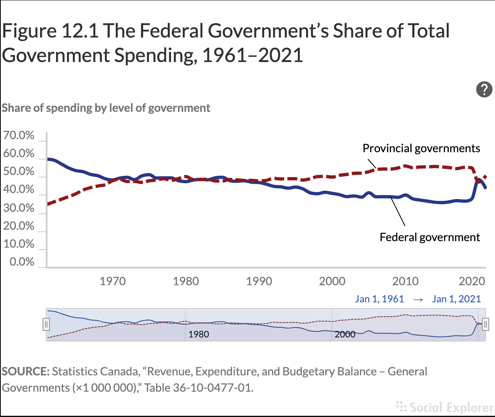  
Beginning in the late 1990s, spending on health care rose quickly. ++[Figure 12.2](https://plus.pearson.com/epub/bronte/BRNT-SITHABGCXI/v12/OPS/xhtml/06468500-7c31-11ed-8778-8a66f7ea263f.xhtml#1f1ca5c9acec0bc3b50c87aeb2a5b044)++ shows the percentage of total government spending that has gone to health care since 1976. This trend had stabilized, with health care spending beginning to fall as a share of total government spending in 2016. That is, until the COVID-19 pandemic.  
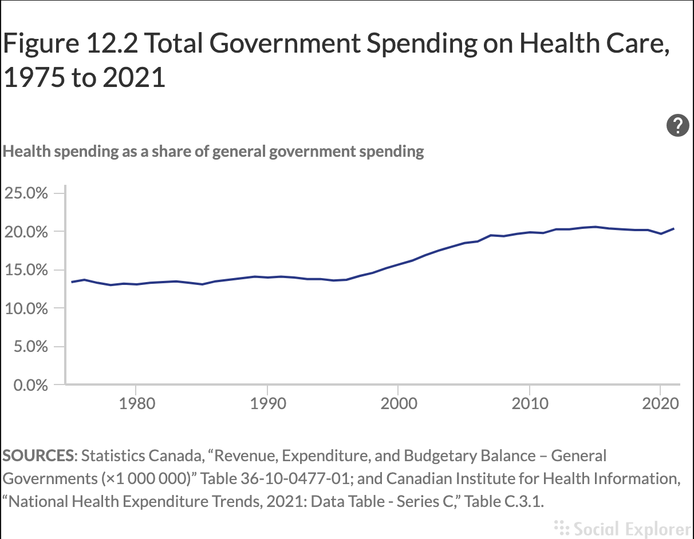  
  
Despite falling under provincial (and territorial) jurisdiction, the federal government contributes significantly to health care spending with the Canada Health Transfer, which prior to the COVID-19 pandemic accounted for more than 10 percent of the federal budget. Under the Canada Health Transfer, the federal government allocates funds that it collects through taxes to provincial and territorial governments. Even though the federal government collects the money provided through the program, provincial and territorial governments are responsible for the spending.  
  
Economists sometimes measure government spending relative to the size of the economy or relative to similar private economic activities. There is a difference between *government purchases* and *government expenditures*. When the federal government purchases new fighter jets for the Royal Canadian Air Force or hires an RCMP officer, it receives a good or service in return. Government spending also includes investment activities like building roads and schools. Government expenditures typically include transfer payments to individuals or to other levels of government. ++[Figure 12.3](https://plus.pearson.com/epub/bronte/BRNT-SITHABGCXI/v12/OPS/xhtml/06468500-7c31-11ed-8778-8a66f7ea263f.xhtml#96e64fd2fecf9300d5beeee7a410a9f1)++ shows the size of government purchases of final goods and services relative to total purchases of final goods and services from 1976 to 2021.  
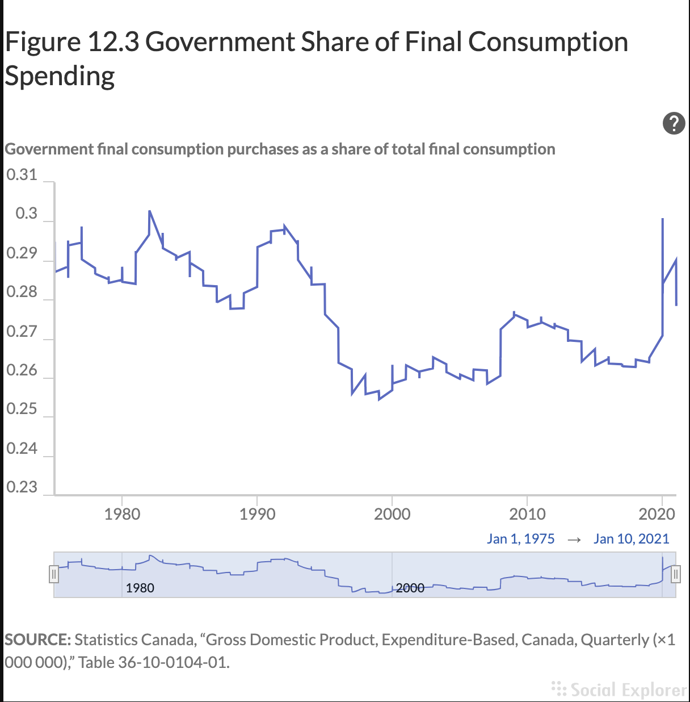  
From 1976 to the early 1990s, the share of government purchases of final goods and services relative to all spending on final goods and services fluctuated around 30 percent. In the early 1990s, the federal government cut its spending to reduce the budget deficit. Government’s share of final consumption remained around 26 percent until the recession of 2008–2009, when it rose to approximately 27.5 percent and then began to fall back toward 26 percent. The share of final consumption spending done by government jumped in 2020 in response to the COVID-19 pandemic.  
Government investment spending has also fluctuated over the years but has been subject to much less variation. Typically, government accounts for about 16 percent of total investment spending in Canada. One of the sharpest deviations from this 16 percent norm occurred in 2008–2009, when the federal government dramatically expanded its spending in an effort to stimulate the economy in the wake of the recession caused by the global financial crisis. A lot of this stimulus took the form of spending on infrastructure and other investment goods instead of transfers directly to households and firms.  
Keep in mind that ++[Figures 12.3](https://plus.pearson.com/epub/bronte/BRNT-SITHABGCXI/v12/OPS/xhtml/06468500-7c31-11ed-8778-8a66f7ea263f.xhtml#96e64fd2fecf9300d5beeee7a410a9f1)++ and ++[12.4](https://plus.pearson.com/epub/bronte/BRNT-SITHABGCXI/v12/OPS/xhtml/06468500-7c31-11ed-8778-8a66f7ea263f.xhtml#99ae681fa634ce9f544206505d5035c4)++ only consider government final consumption and investment; government transfers also play an important role in the Canadian economy.  
  
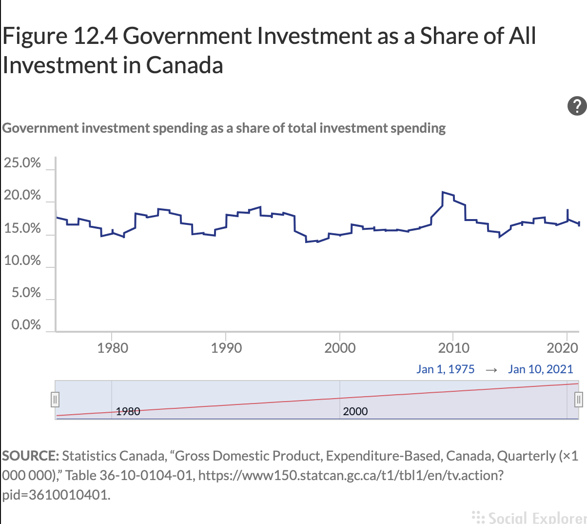  
## Where Does the Money Go?  
The federal government spends money in a variety of areas. ++[Figure 12.5](https://plus.pearson.com/epub/bronte/BRNT-SITHABGCXI/v12/OPS/xhtml/06468500-7c31-11ed-8778-8a66f7ea263f.xhtml#9e2f76ad13c8c43c492a77555767a20e)++ shows the breakdown of government spending in 2018 and 2021. In both years, transfers to people and other levels of government made up most of the federal government’s budget. In 2021, temporary COVID-19 programs accounted for more than $1 in every $5 spent by the federal government, while programs that previously accounted for large portions of federal government spending fell in relative importance. Old age security, for example, fell from 15 percent of the budget to 10 percent. Some spending increased relative to the total, as is common during recessions. Employment Insurance spending rose from 6 percent of federal government spending in 2018 to 9 percent in 2021. Despite rising in total dollar value (and as a share of revenue collected by the federal government), public debt charges, the interest the federal government must pay on money it has borrowed in the past, fell from 7 percent of spending to just 3 percent.  
**Figure 12.5 Federal Government Spending, 2018 and 2021**  
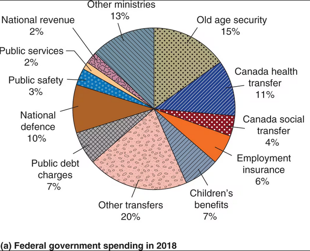  
Transfers made up the bulk of federal spending in 2018. Long established programs like the Canada Health Transfer and Old Age Security programs were the biggest items in the federal budget. In 2021, these programs were overtaken by special programs related to COVID-19. While approximately 30 percent of spending in 2018 was non-transfer spending, this fell to just 18 percent of the budget in 2021. It is important to note that spending on these programs did not fall but that total government spending rose dramatically.  
**SOURCE:** (a) Government of Canada, “Consolidated Statement of Revenues and Expenses,” November 6, 2018, https://www.tpsgc-pwgsc.gc.ca/recgen/cpc-pac/2018/vol2/s1/ecrc-csre-eng.html, (b) Public accounts of Canada 2021, Consolidated statement of revenue and expenses, https://www.tpsgc-pwgsc.gc.ca/recgen/cpc-pac/2021/vol1/s2/efc-cfs-eng.html.  
  
*   
*   
*   
*   
*   
*   
*   
*   
*   
*   
*   
*   
  
*   
*   
*   
*   
*   
*   
*   
*   
*   
  
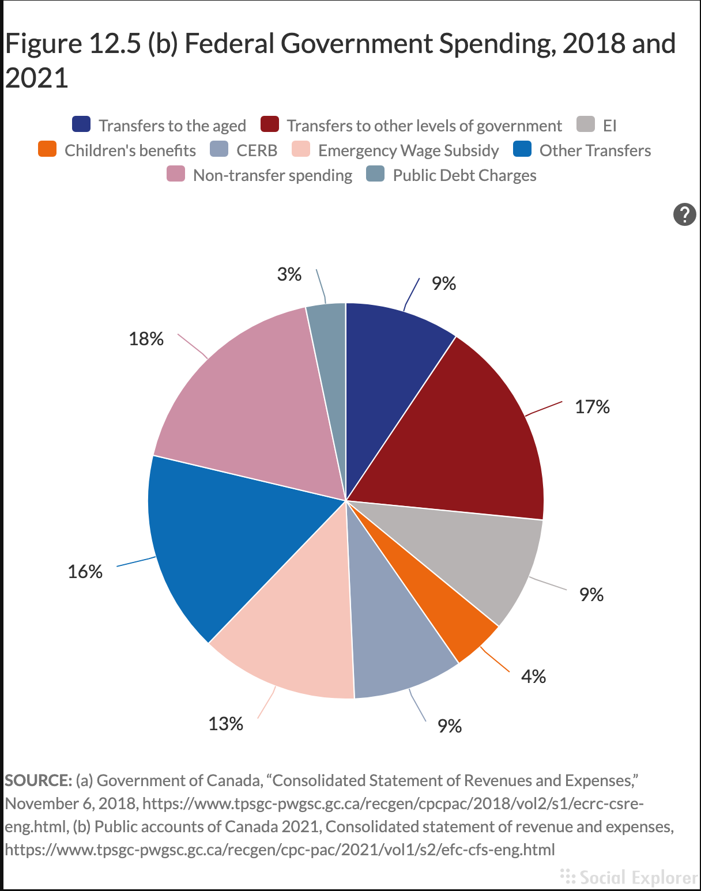  
All things considered, government spending in 2018 is more representative of typical federal government spending than the federal government’s spending in 2021. It remains to be seen if the federal government’s spending will be permanently changed by the pandemic.  
## Where Does the Money Come From?  
The short answer to this question is that the money federal government spends comes from the people of Canada. ++[Figure 12.6](https://plus.pearson.com/epub/bronte/BRNT-SITHABGCXI/v12/OPS/xhtml/06468500-7c31-11ed-8778-8a66f7ea263f.xhtml#204726621f35e68d590aeb1a1ed6e893)++ shows the sources of federal government revenue for both 2018 and 2021. Unlike the spending, the federal government’s sources of revenue changed little during the COVID-19 pandemic. The single biggest source of revenue in both years was personal income taxes, at 49 percent in 2018 and 55 percent in 2021. Corporate income tax is the second-largest source in both years (15.2 percent in 2018 and 17 percent in 2021). The GST is the final main source of federal government revenue, accounting for 11.7 percent and 11 percent in 2018 and 2021, respectively.  
**Figure 12.6 Federal Government Revenue in 2018 and 2021**  
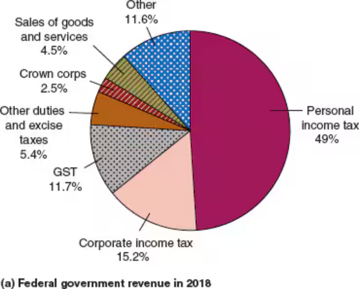  
Despite the impact of the COVID-19 pandemic on the economy, all government revenue still comes from people. The single biggest source of revenue remains personal income taxes, with corporate income taxes and the GST coming in distant second and third place, respectively.  
**SOURCES:** (a) Government of Canada, “Consolidated Statement of Revenues and Expenses,” November 6, 2018, https://www.tpsgc-pwgsc.gc.ca/recgen/cpc-pac/2018/vol2/s1/ecrc-csre-eng.html, (b) Public accounts of Canada 2021, Consolidated statement of revenue and expenses, https://www.tpsgc-pwgsc.gc.ca/recgen/cpc-pac/2021/vol2/s1/ecrc-csre-eng.html.  
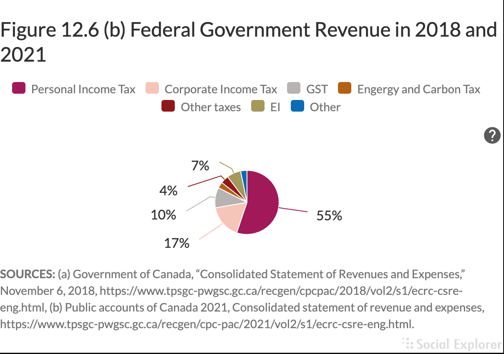  
___  
  
  
# The Effects of Fiscal Policy on Real GDP and the Price Level  
**LO 12.2** **Explain how fiscal policy affects aggregate demand and how the government can use fiscal policy to stabilize the economy.**  
The federal government uses macroeconomic policies to offset the effects of the business cycle on the economy. We saw in Chapter 11 that the Bank of Canada carries out monetary policy through changes in the money supply and interest rates. Governments carry out fiscal policy through changes in government purchases and taxes. Because changes in government purchases and taxes lead to changes in aggregate demand, they can affect the level of real GDP, employment, and the price level. When the economy is in a recession, *increases* in government purchases or *decreases* in taxes will increase aggregate demand. As we saw in Chapter 9, the inflation rate may increase when real GDP is beyond potential GDP. Decreasing government purchases or raising taxes can slow the growth of aggregate demand and reduce the inflation rate.  
## Expansionary and Contractionary Fiscal Policy  
*Expansionary fiscal policy* involves increasing government purchases or decreasing taxes. An increase in government purchases will increase aggregate demand directly because government expenditures are a component of aggregate demand. A cut in taxes has an indirect effect on aggregate demand. The income households have available to spend after they have paid their taxes is called *household disposable income*. Cutting the individual income tax will increase household disposable income and consumption spending. Cutting taxes on business income can increase aggregate demand by increasing business investment.  
  
++[Figure 12.7](https://plus.pearson.com/epub/bronte/BRNT-SITHABGCXI/v12/OPS/xhtml/06a51fc0-7c31-11ed-8e08-ac635e2a7433.xhtml#c29c4d49580cbcdb4bf733e0f4412249)++ shows the results of an expansionary fiscal policy using the basic version of the aggregate demand and aggregate supply model. In this model, there is no economic growth, so the long-run aggregate supply (*LRAS*) curve does not shift. Notice that this figure is similar to ++[Figure 11.7](https://plus.pearson.com/epub/bronte/BRNT-SITHABGCXI/v12/OPS/xhtml/06a51fc0-7c31-11ed-8e08-ac635e2a7433.xhtml)++, which shows the effects of monetary policy. The goal of both expansionary fiscal and expansionary monetary policy is to increase aggregate demand relative to what it would have been without a policy intervention.  
**Figure 12.7 Fiscal Policy**  
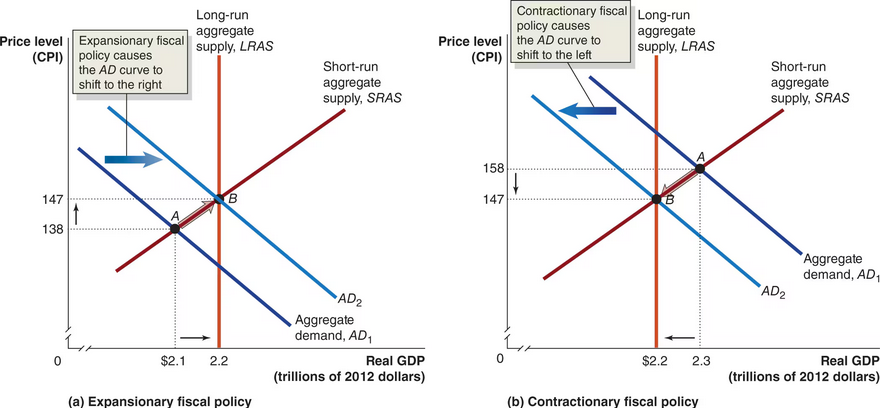  
In panel (a), the economy begins in recession at point *A*, with real GDP of $1.75 trillion and a price level of 125. An expansionary fiscal policy will cause aggregate demand to shift to the right, from A‍D‍1 to A‍D‍2, increasing real GDP from $1.75 trillion to $1.77 trillion and the price level from 125 to 127 (point *B*). In panel (b), the economy begins at point *A*, with real GDP at $1.79 trillion and the price level at 127. Because real GDP is greater than potential GDP, the economy will experience rising wages and prices. A contractionary fiscal policy will cause aggregate demand to shift to the left, from A‍D‍1 to A‍D‍2, decreasing real GDP from $1.79 trillion to $1.77 trillion and the price level from 129 to 127 (point *B*).  
  
*   
*   
*   
  
*   
*   
  
  
  
Play  
  
In panel (a) of ++[Figure 12.7](https://plus.pearson.com/epub/bronte/BRNT-SITHABGCXI/v12/OPS/xhtml/06a51fc0-7c31-11ed-8e08-ac635e2a7433.xhtml#c29c4d49580cbcdb4bf733e0f4412249)++, we assume that the economy is in short-run equilibrium at point *A*, where the aggregate demand curve  
intersects the short-run aggregate supply curve (*SRAS*). Real GDP is below potential GDP, so the economy is in recession, with some firms operating below capacity and some workers having been laid off. To bring real GDP back to potential GDP, the government can increase government purchases or decrease taxes, which will shift the aggregate demand curve to the right, from to  
. Real GDP increases from $2.1 trillion to potential GDP of $2.2 trillion, and the price level rises from 138 to 147 (point *B*). The policy has successfully returned real GDP to its potential level. Rising production will lead to increasing employment, reducing the unemployment rate.  
*Contractionary fiscal policy* involves decreasing government purchases or increasing taxes. Policymakers use contractionary fiscal policy to reduce increases in aggregate demand that seem likely to lead to inflation. In panel (b) of ++[Figure 12.7](https://plus.pearson.com/epub/bronte/BRNT-SITHABGCXI/v12/OPS/xhtml/06a51fc0-7c31-11ed-8e08-ac635e2a7433.xhtml#c29c4d49580cbcdb4bf733e0f4412249)++, the economy is in short-run equilibrium at point *A*, with real GDP of $2.3 trillion, which is above potential GDP of $2.2 trillion. With some firms producing beyond their normal capacity and the unemployment rate very low, wages and prices will be increasing. To bring real GDP back to potential GDP, the government can decrease government purchases or increase taxes, which will shift the aggregate demand curve from  
to  
. Real GDP falls from $2.3 trillion to $2.2 trillion, and the price level falls from 158 to 147 (point *B*).  
  
We can conclude that the government can attempt to stabilize the economy by using fiscal policy to affect the price level and the level of real GDP. It is, of course, extremely difficult to get the amount of fiscal expansion or contraction to exactly offset the business cycle and keep real GDP equal to potential GDP.  
## A Summary of How Fiscal Policy Affects Aggregate Demand  
++[Table 12.1](https://plus.pearson.com/epub/bronte/BRNT-SITHABGCXI/v12/OPS/xhtml/06a51fc0-7c31-11ed-8e08-ac635e2a7433.xhtml#0878f24a57dbea4320117e405ed2022a)++ summarizes how fiscal policy affects aggregate demand. Just as we did with monetary policy, we must add a very important qualification to this summary of fiscal policy: The table isolates the impact of fiscal policy *by holding everything else—including monetary policy—constant*. In other words, we are again invoking the *ceteris paribus* condition we discussed in Chapter 3. This point is important because, for example, a contractionary fiscal policy doesn’t cause the price level to fall. A contractionary fiscal policy causes the price level *to rise by less than it would have without the policy*.  
**Table 12.1 Countercyclical Fiscal Policy**  

| Problem | Type of Policy | Action by Government | Result |
| ---------------- | -------------- | ------------------------------------------- | ---------------------------------- |
| Recession | Expansionary | Increase government spending or cut taxes | Real GDP and the price level rise. |
| Rising inflation | Contractionary | Decrease government spending or raise taxes | Real GDP and the price level fall. |
  
___  
  
## Fiscal Policy in the Dynamic Aggregate Demand and Aggregate Supply Model  
**LO 12.3** **Use the dynamic aggregate demand and aggregate supply model to analyze fiscal policy.**  
The overview of fiscal policy we just finished contains a key idea: Government can use fiscal policy to affect aggregate demand, thereby changing the price level and the level of real GDP. The discussion of expansionary and contractionary fiscal policy illustrated by ++[Figure 12.7](https://plus.pearson.com/epub/bronte/BRNT-SITHABGCXI/v12/OPS/xhtml/06a51fc0-7c31-11ed-8e08-ac635e2a7433.xhtml#c29c4d49580cbcdb4bf733e0f4412249)++ is simplified, however, because it ignores two important facts about the economy: (1) The economy experiences continuing inflation, with the price level rising virtually every year, and (2) the economy experiences long-run growth, with the *LRAS* curve shifting to the right every year. In Chapter 9, we developed a *dynamic aggregate demand and aggregate supply model* that took these two facts into account. In this section, we use the dynamic model to gain a more complete understanding of fiscal policy.  
To briefly review the dynamic model, recall that over time, potential GDP increases, which we show by the *LRAS* curve shifting to the right. The factors that cause the *LRAS* curve to shift also cause firms to supply more goods and services at any given price level in the short run, which we show by shifting the *SRAS* curve to the right. Finally, during most years, the *AD* curve also shifts to the right, indicating that aggregate expenditure is higher at every price level.  
++[Figure 12.8](https://plus.pearson.com/epub/bronte/BRNT-SITHABGCXI/v12/OPS/xhtml/06be2600-7c31-11ed-8521-354561ed34d9.xhtml#eb0beb4600ac80b7f094b011a35f1216)++ shows the results of an expansionary fiscal policy using the dynamic aggregate demand and aggregate supply model. Notice that this figure is very similar to ++[Figure 11.9](https://plus.pearson.com/epub/bronte/BRNT-SITHABGCXI/v12/OPS/xhtml/04e3c0b0-7c31-11ed-8b5d-869161827a38.xhtml#a95f8423256f7c8459b07df494621a5c)++, which shows the effects of an expansionary monetary policy. The goal of both expansionary monetary policy and expansionary fiscal policy is to increase aggregate demand relative to what it would have been without the policy.  
  
**Figure 12.8 An Expansionary Fiscal Policy in the Dynamic Model**  
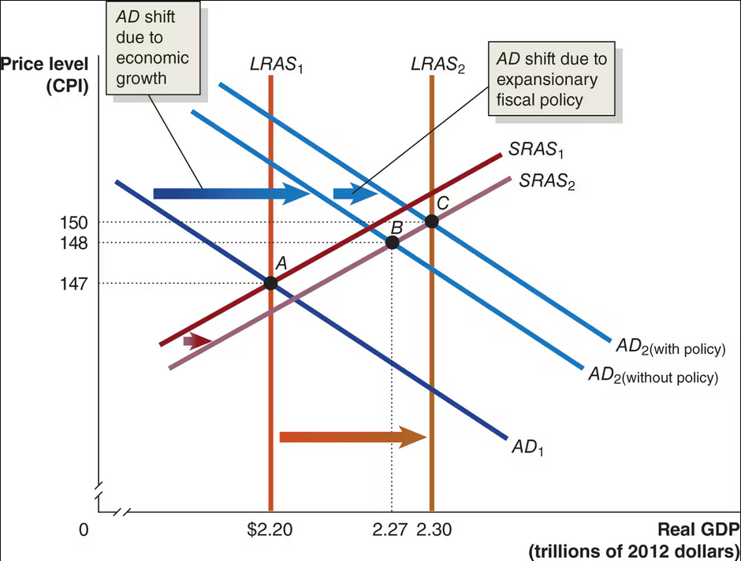  
The economy begins in equilibrium at point *A*, at potential GDP of $2.20 trillion and a price level of 147. Without an expansionary policy, aggregate demand will shift from A‍D‍1 to A‍D‍2(without policy), which is not enough to keep the economy at potential GDP because long-run aggregate supply has shifted from L‍R‍A‍S‍1 to L‍R‍A‍S‍2. The economy will be in short-run equilibrium at point *B*, with real GDP of $2.27 trillion and a price level of 148. Increasing government purchases or cutting taxes will shift aggregate demand to A‍D‍2(with policy). The economy will be in equilibrium at point *C*, with real GDP of $2.30 trillion, which is its potential level, and a price level of 150. The price level is higher than it would have been without an expansionary policy.  
*   
*   
*   
*   
**Animation: Figure 12.8 An Expansionary Fiscal Policy in the Dynamic Model**  
  
Play  
  
In the hypothetical situation shown in ++[Figure 12.8](https://plus.pearson.com/epub/bronte/BRNT-SITHABGCXI/v12/OPS/xhtml/06be2600-7c31-11ed-8521-354561ed34d9.xhtml#eb0beb4600ac80b7f094b011a35f1216)++, the economy begins in equilibrium at potential GDP of $2.20 trillion and a price level of 147 (point *A*). In the second year, *LRAS* increases to $2.30 trillion, but *AD* increases only to  
, which is not enough to keep the economy in macroeconomic equilibrium at potential GDP. Let’s assume that the Bank of Canada doesn’t react to this situation with expansionary monetary policy. In that case, without an expansionary fiscal policy of increased government spending or tax cuts, the short-run equilibrium will occur at $2.27 trillion (point *B*). The $30 billion gap between this level of real GDP and the potential level means that some firms are operating at less than their normal capacity. Incomes and profits will be falling, firms will begin to lay off workers, and the unemployment rate will rise.  
Increasing government purchases or cutting taxes can shift aggregate demand to  
. The economy will be in equilibrium at point *C*, with real GDP of $2.30 trillion, which is potential GDP, and a price level of 150. The price level is higher than it would have been if expansionary fiscal policy had not been used.  
*Contractionary fiscal policy* involves decreasing government purchases or increasing taxes. Policymakers use contractionary fiscal policy to reduce increases in aggregate demand that seem likely to lead to inflation. In ++[Figure 12.9](https://plus.pearson.com/epub/bronte/BRNT-SITHABGCXI/v12/OPS/xhtml/06be2600-7c31-11ed-8521-354561ed34d9.xhtml#a38b10208238f4a816de0b6071c3f038)++, the economy again begins at potential GDP of $2.20 trillion and a price level of 147 (point *A*). Once again *LRAS* increases to $2.30 trillion in the second year. In this scenario, the shift in aggregate demand to  
results in a short-run macroeconomic equilibrium beyond potential GDP (point *B*). If we assume that the Bank of Canada does not respond to this situation with a contractionary monetary policy, the economy will experience rising inflation. Decreasing government purchases or increasing taxes can keep real GDP from moving beyond its potential level. The result, shown in ++[Figure 12.9](https://plus.pearson.com/epub/bronte/BRNT-SITHABGCXI/v12/OPS/xhtml/06be2600-7c31-11ed-8521-354561ed34d9.xhtml#a38b10208238f4a816de0b6071c3f038)++, is that in the new equilibrium at point *C*, the inflation rate is 2 percent rather than 7.5 percent.  
  
**Figure 12.9 A Contractionary Fiscal Policy in the Dynamic Model**  
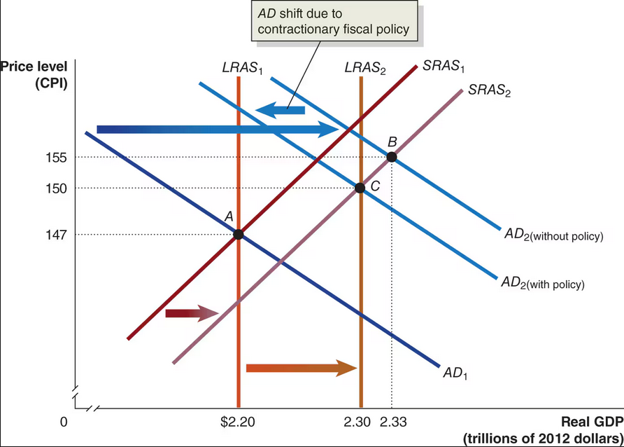  
  
The economy begins in equilibrium at point *A*, with real GDP of $2.20 trillion and a price level of 147. Without a contractionary policy, aggregate demand will shift from A‍D‍1 to A‍D‍2(without policy), which results in a short-run equilibrium beyond potential GDP at point *B*, with real GDP of $2.33 trillion and a price level of 155. Decreasing government purchases or increasing taxes can shift aggregate demand to A‍D‍2(with policy). The economy will be in equilibrium at point *C*, with real GDP of $2.30 trillion, which is its potential level, and a price level of 150. The inflation rate will be 2 percent, as opposed to the 5.4 percent it would have been without the contractionary policy.  
  
___  
  
  
# The Government Purchases and Tax Multipliers  
**LO 12.4** **Explain how government purchases and tax multipliers work.**  
Suppose that during a recession, the government decides to use discretionary fiscal policy to increase aggregate demand by spending $10 billion more on constructing roads and bridges in several cities. How much will equilibrium GDP increase as a result of this increase in government purchases? We might expect that the answer is greater than $10 billion because the initial increase in aggregate demand should lead to additional increases in income and therefore increases in consumer spending. To build the roads and bridges, the government hires private construction firms. These firms will hire more workers to carry out the new projects. Newly hired workers will increase their spending on cars, furniture, appliances, and other products. Sellers of these products will increase their production and hire more workers, and so on. At each step, real GDP and income will rise, thereby increasing consumption spending and aggregate demand.  
Economists refer to the initial increase in government purchases as *autonomous* because it is a result of a decision by the government and does not directly depend on the level of real GDP. The increases in consumption spending that result from the initial autonomous increase in government purchases are *induced* because they are caused by the initial increase in autonomous spending. Economists refer to the series of induced increases in consumption spending that results from an initial increase in autonomous expenditures as the **++[multiplier effect](https://plus.pearson.com/epub/bronte/BRNT-SITHABGCXI/v12/OPS/xhtml/glossary.xhtml#key-e10e5481-c481-5676-8750-f7b779bda211)++**.  
++[Figure 12.10](https://plus.pearson.com/epub/bronte/BRNT-SITHABGCXI/v12/OPS/xhtml/06e4e7e0-7c31-11ed-8d25-fd30bd5a38e0.xhtml#441aba7c9d6a4a8fabde3723a819fafe)++ illustrates how an increase in government purchases affects the aggregate demand curve. The initial increase in government purchases causes the aggregate demand curve to shift to the right because total spending in the economy is now higher at every price level. The shift to the right from  
to the dashed *AD* curve represents the impact of the initial increase of $10 billion in government purchases. Because this initial increase in government purchases raises incomes and leads to further increases in consumption spending, the aggregate demand curve will ultimately shift from all the way to  
.  
  
**Figure 12.10 The Multiplier Effect and Aggregate Demand**  
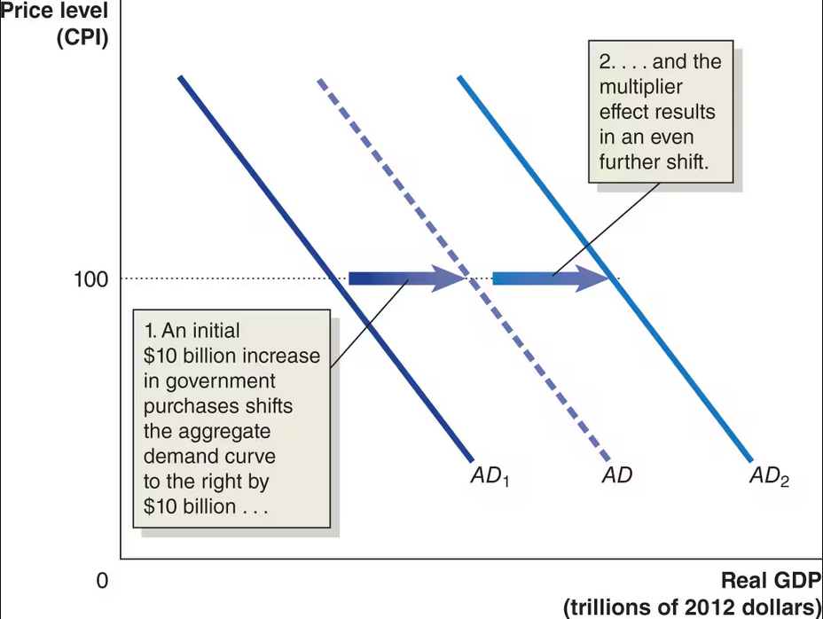  
An initial increase in government purchases of $10 billion causes the aggregate demand curve to shift to the right, from A‍D‍1 to the dashed *AD* curve, and represents the effect of the initial increase of $10 billion in government purchases. Because this initial increase raises incomes and leads to further increases in consumption spending, the aggregate demand curve will ultimately shift further to the right, to A‍D‍2.  
*   
*   
**Animation: Figure 12.10 The Multiplier Effect and Aggregate Demand**  
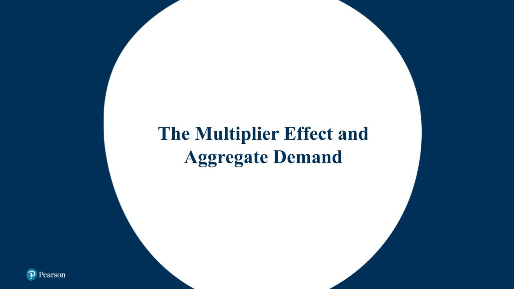  
  
Play  
  
To better understand the multiplier effect, let’s start with a simplified analysis in which we assume that the price level is constant. In other words, initially we will ignore the effect of an upward-sloping *SRAS*. ++[Figure 12.11](https://plus.pearson.com/epub/bronte/BRNT-SITHABGCXI/v12/OPS/xhtml/06e4e7e0-7c31-11ed-8d25-fd30bd5a38e0.xhtml#8b4f90af519e4e554b5844087d1d9b87)++ shows how spending and real GDP increase over a number of periods, beginning with the initial increase in government purchases in the first period. The initial spending in the first period raises real GDP and therefore total income in the economy by $10 billion. How much additional consumption will result from the $10 billion increase in incomes? We know that in addition to increasing their consumption spending on domestically produced goods, households will save some of the increase in income, use some to pay income taxes, and use some to purchase imported goods, which will have no direct effect on spending and production in the Canadian economy. In ++[Figure 12.11](https://plus.pearson.com/epub/bronte/BRNT-SITHABGCXI/v12/OPS/xhtml/06e4e7e0-7c31-11ed-8d25-fd30bd5a38e0.xhtml#8b4f90af519e4e554b5844087d1d9b87)++, we assume that in the second period, households increase their consumption spending by one-half of the increase in income from the first period on domestically produced goods and services—or by $5 billion. This spending in the second period will, in turn, increase real GDP and income by an additional $5 billion. In the third period, consumption spending will increase by $2.5 billion, or one-half of the $5 billion increase in income from the second period.  
**Figure 12.11 The Multiplier Effect of an Increase in Government Purchases**  
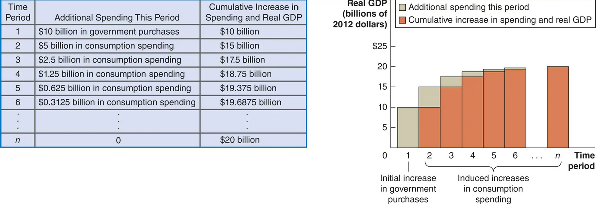  
Following an initial increase in government purchases, spending and real GDP increase over a number of periods due to the multiplier effect. The new spending and increased real GDP in each period is shown in green, and the level of spending from the previous period is shown in orange. The sum of the orange and green areas represents the cumulative increase in spending and real GDP. In total, equilibrium real GDP will increase by $20 billion as a result of an initial increase of $10 billion in government purchases.  
  

|  |  |  |
| - | - | - |
|  |  |  |
|  |  |  |
|  |  |  |
|  |  |  |
|  |  |  |
|  |  |  |
|  |  |  |
|  |  |  |
  
  
Play  
  
  
The multiplier effect will continue through a number of periods, with the additional consumption spending in each period being half of the income increase from the previous period. Eventually, the process will be complete, although we can’t say precisely how many periods it will take, so we simply label the final period *n* rather than assign it a specific number. In the graph in ++[Figure 12.11](https://plus.pearson.com/epub/bronte/BRNT-SITHABGCXI/v12/OPS/xhtml/06e4e7e0-7c31-11ed-8d25-fd30bd5a38e0.xhtml#8b4f90af519e4e554b5844087d1d9b87)++, the new spending and increased real GDP in each period is shown in green, and the level of spending from the previous period is shown in orange. The sum of the orange and green areas represents the cumulative increase in spending and real GDP.  
How large will the total increase in equilibrium real GDP be as a result of the initial increase of $10 billion in government purchases? The ratio of the change in equilibrium real GDP to the initial change in government purchases is known as the *government purchases multiplier*:  
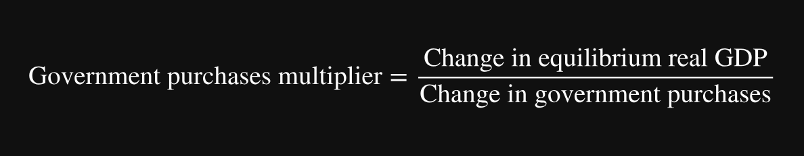  
  
  
  
If, for example, the government purchases multiplier has a value of 2, an increase in government purchases of $10 billion should increase equilibrium real GDP by  
. We show this in ++[Figure 12.11](https://plus.pearson.com/epub/bronte/BRNT-SITHABGCXI/v12/OPS/xhtml/06e4e7e0-7c31-11ed-8d25-fd30bd5a38e0.xhtml#8b4f90af519e4e554b5844087d1d9b87)++ by having the cumulative increase in real GDP equal $20 billion.  
Tax cuts also have a multiplier effect. Cutting taxes increases household disposable income. When household disposable income rises, so will consumption spending. These increases in consumption spending will set off further increases in real GDP and income, just as increases in government purchases do. Suppose we consider a change in taxes of a specific amount—say, a tax cut of $10 billion—with the tax *rate* remaining unchanged. The expression for this tax multiplier is  
  
  
  
  
The tax multiplier is a negative number because changes in taxes and changes in real GDP move in opposite directions: An increase in taxes reduces disposable income, consumption, and real GDP, and a decrease in taxes raises disposable income, consumption, and real GDP. For example, if the tax multiplier is  
, a $10 billion *cut* in taxes will increase real GDP by  
. We would expect the tax multiplier to be smaller in absolute value (i.e., a smaller number) than the government purchases multiplier. To see why, think about the difference between a $10 billion increase in government purchases and a $10 billion decrease in taxes. The whole of the $10 billion increase in government purchases results in an increase in aggregate demand initially. But households will save rather than spend some portion of the $10 billion decrease in taxes, and they will spend some portion of the extra disposable income on imported goods. The fraction of the tax cut that households save or spend on imports will not increase aggregate demand. Therefore, the first period of the multiplier will lead to a smaller increase in aggregate demand than takes place after an increase in government purchases, and the total increase in equilibrium real GDP will be smaller.  
  
## The Effect of Changes in Tax Rates  
A change in tax *rates* has a more complicated effect on equilibrium real GDP than does a tax cut of a fixed amount. To begin with, the value of the tax rate affects the size of the multiplier effect. The higher the tax rate, the smaller the multiplier effect. To see why, think about the size of the additional spending increases that take place in each period following an increase in government purchases. The higher the tax rate, the smaller the amount of an increase in income that households have available to spend, which reduces the size of the multiplier effect. So, a cut in tax rates affects equilibrium real GDP through two channels: (1) A cut in tax rates increases the disposable income of households, which leads them to increase their consumption spending, and (2) a cut in tax rates increases the size of the multiplier effect.  
## Taking into Account the Effects of Aggregate Supply  
So far we’ve assumed that the price level didn’t change when the *AD* curve shifted. However, because the *SRAS* curve is upward sloping, when the *AD* curve shifts to the right, the price level increases. As a result of the higher price level, the new equilibrium real GDP will not increase by the amount that the multiplier effect indicates. ++[Figure 12.12](https://plus.pearson.com/epub/bronte/BRNT-SITHABGCXI/v12/OPS/xhtml/06e4e7e0-7c31-11ed-8d25-fd30bd5a38e0.xhtml#3763d1bedccc2dc41f02b7168c5c22d6)++ illustrates how an upward-sloping *SRAS* curve affects the size of the multiplier. To keep the graph relatively simple, we assume that the *SRAS* and *LRAS* curves do not shift. The economy starts at point *A*, with real GDP below its potential level. An increase in government purchases shifts the aggregate demand curve from  
to the dashed *AD* curve. Just as in ++[Figure 12.10](https://plus.pearson.com/epub/bronte/BRNT-SITHABGCXI/v12/OPS/xhtml/06e4e7e0-7c31-11ed-8d25-fd30bd5a38e0.xhtml#441aba7c9d6a4a8fabde3723a819fafe)++, the multiplier effect causes a further shift in aggregate demand to  
. If the price level remained constant, real GDP would increase from $2.12 trillion at point *A* to $2.22 trillion at point *B*. However, because the *SRAS* curve is upward sloping, the price level rises from 147 to 155, reducing the total quantity of goods and services demanded in the economy. The new equilibrium occurs at point *C*, with real GDP having risen to $2.20 trillion, or by $20 billion less than if the price level had remained unchanged. We can conclude that the actual change in real GDP resulting from an increase in government purchases or a tax cut will be less than indicated by the simple multiplier effect with a constant price level.  
**Figure 12.12 The Multiplier Effect and Aggregate Supply**  
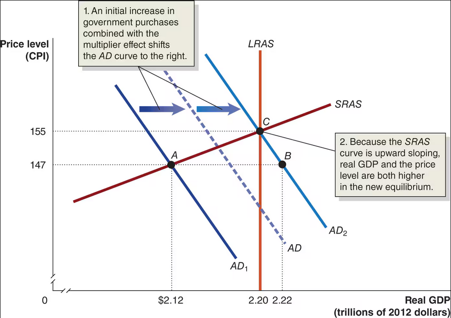  
The economy is initially at point *A*. An increase in government purchases causes the aggregate demand curve to shift to the right, from A‍D‍1 to the dashed *AD* curve. The multiplier effect results in the aggregate demand curve shifting further to the right, to A‍D‍2 (point *B*). Because of the upward-sloping supply curve, the shift in aggregate demand results in a higher price level. In the new equilibrium at point *C*, both real GDP and the price level have increased. The increase in real GDP is less than indicated by the multiplier effect with a constant price level.  
*   
*   
*   
  
  
Play  
  
  
## Don’t Let This Happen to You  
## DON’T OVERESTIMATE THE SIZE OF THE MULTIPLIER  
The size of the multiplier depends on a wide variety of factors. As the income tax rate increases, the multiplier shrinks in value. As the share of new household disposable income that is saved falls, the multiplier increases in value. The more we import from other countries, the lower the value of the multiplier. Finally, as we’ve seen, the sensitivity of price levels to changes in demand has an impact on the multiplier—the steeper the *SRAS* curve, the lower the value of the final multiplier.  
People arguing in support of specific government projects often ignore the influence of these factors when calculating the size of the multiplier for a given project in an effort to gain support for the project. In many cases, people arguing for new sports stadiums, harbours, or other large government-funded facilities claim that the multiplier associated with these projects is well over 2 or sometimes even 3. Because Canada is an open economy with moderate income taxes, these values are not reasonable for most regions in Canada. Statistics Canada estimates the multiplier size for different types of activities for different regions. These multipliers are generally below 1.5. The next time someone promotes a large project in your community using a multiplier as part of the project’s justification, ask that person how that number was determined.  
For more practice, do related ++[Problem 4.6](https://plus.pearson.com/epub/bronte/BRNT-SITHABGCXI/v12/OPS/xhtml/07b186b0-7c31-11ed-8588-91bb34bd86c7.xhtml#980c88df7d17d1ac47ebe94c8711b47c)++ at the end of this chapter.  
## The Multipliers Work in Both Directions  
Increases in government spending and cuts in taxes have a positive multiplier effect on equilibrium real GDP. Decreases in government purchases and increases in taxes also have a multiplier effect on equilibrium real GDP, but in this case, the effect is negative. For example, an increase in taxes will reduce household disposable income and consumption spending. As households buy fewer cars, furniture, refrigerators, and other products, the firms that sell these products will cut back on production and begin laying off workers. Falling incomes will lead to further reductions in consumption spending. A reduction in government spending on roads would set off a similar process of decreases in real GDP and income. The cutback would be felt first by construction contractors selling their services directly to the government, and then it would spread to other firms.  
We look more closely at the government purchases multiplier and the tax multiplier in the appendix to this chapter.  
## Solved Problem 12.1  
## FISCAL POLICY MULTIPLIERS  
Briefly explain whether you agree or disagree with the following statement: “Real GDP is currently $1.62 trillion and potential GDP is $1.64 trillion. If Parliament would increase government purchases by $20 billion ($0.02 trillion) the economy could be brought to equilibrium at potential GDP.”  
  
## Solving the Problem  
* **Step 1: Review the chapter material.** This problem is about the multiplier process, so you may want to review the section “Government Purchases and Tax Multipliers.”  
* **Step 2: Explain how the necessary increase in purchases or cut in taxes is less than $20 billion because of the multiplier effect.** The statement is incorrect because it doesn’t consider the multiplier effect. Because of the multiplier effect, an increase in government purchases or a decrease in taxes of less than $20 billion is necessary to increase equilibrium real GDP by $20 billion. For instance, assume that the government purchases multiplier is 2 and the tax multiplier is   
* . We can then calculate the necessary increase in government purchases as follows:  
  
  
  
  
* And the necessary change in taxes  
  
___  
  
  
# The Limits of Fiscal Policy as a Stimulus  
**LO 12.5** **Discuss the difficulties that can arise in implementing fiscal policy.**  
Poorly timed fiscal policy, like poorly timed monetary policy, can do more harm than good. As we discussed in Chapter 11, it takes time for policymakers to collect statistics and identify changes in the economy. If the government decides to increase spending or cut taxes to fight a recession that is about to end, the effect may be to increase the inflation rate. Similarly, cutting spending or raising taxes to slow down an economy that has actually passed the peak of the business cycle can make the recession that follows longer and deeper.  
Getting the timing right can be more difficult with fiscal policy than with monetary policy for two main reasons. First, control over monetary policy is concentrated in the hands of the Bank of Canada, which can change monetary policy at any of its regularly scheduled meetings or by calling a special meeting. By contrast, the prime minister and a majority of the members of Parliament have to agree on changes in fiscal policy. The delays caused by the legislative process can be very long.  
Second, even after a change in fiscal policy has been approved, it takes time to implement the policy. Suppose the federal government decides to fund the building of new roads in several cities. It will probably take at least several months to prepare detailed plans for the construction. Local government will then ask for bids from private construction companies. Once winning bidders have been selected, they will usually need several months to begin the project. Only then will significant amounts of spending actually take place. This delay may push the spending beyond the end of the recession that the spending was intended to fight.  
  
## Does Government Spending Reduce Private Spending?  
In addition to the problem of timing, using increases in government purchases to increase aggregate demand presents another potential problem. We have been assuming that when the federal government increases its purchases by $30 billion, the multiplier effect will cause the increase in aggregate demand to be greater than $30 billion. However, the size of the multiplier effect may be limited if the increase in government purchases causes one of the non-government, or private, components of aggregate expenditures—consumption, investment, or net exports—to fall. A decline in private expenditures as a result of an increase in government purchases is called **++[crowding out](https://plus.pearson.com/epub/bronte/BRNT-SITHABGCXI/v12/OPS/xhtml/glossary.xhtml#key-6ba4cbdd-021f-51e1-bbfe-d5241236f3af)++**.  
## Crowding Out in the Short Run  
Consider the case of a temporary increase in government purchases. Suppose the federal government decides to fight a recession by spending $30 billion more this year on road construction. When the $30 billion has been spent, the program will end, and government spending will drop back to its previous level. As the spending takes place, income and real GDP will increase. These increases in income and real GDP will cause households and firms to increase their demand for currency and chequing account balances to accommodate the increased buying and selling. ++[Figure 12.13](https://plus.pearson.com/epub/bronte/BRNT-SITHABGCXI/v12/OPS/xhtml/072ffaa0-7c31-11ed-821c-6a09e128eae3.xhtml#821f948a1bd981cf4a5899c496863633)++ shows the result, using the money market graph introduced in Chapter 11.  
**Figure 12.13 An Expansionary Fiscal Policy Increases Interest Rates**  
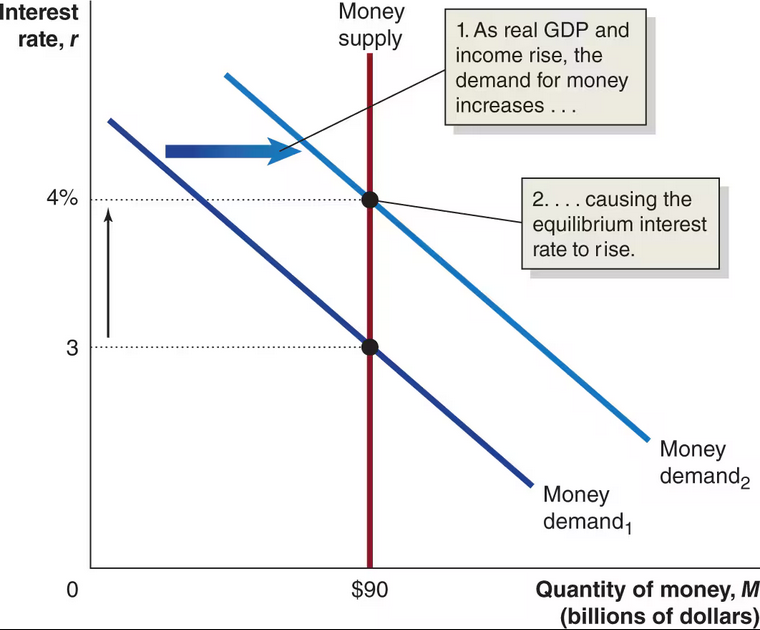  
If the federal government increases spending, the demand for money will increase from Money demand‍1 to Money demand‍2 as real GDP and income rise. With the supply of money constant at $90 billion, the result is an increase in the equilibrium interest rate from 3 percent to 4 percent, which crowds out some consumption, investment, and net exports.  
*   
  
  
Play  
  
At higher levels of real GDP and income, households and firms demand more money at every interest rate. When the demand for money increases, the equilibrium interest rate will rise. Higher interest rates will result in a decline in each component of private expenditures. Consumption spending and investment spending will decline because households and firms will borrow less to purchase consumer durables and to make investments. Net exports will fall as the higher interest rates will attract foreign savers. German, Japanese, and American savers will want to exchange their currencies to Canadian dollars to purchase bonds and other Canadian financial assets. This increased demand for Canadian dollars will cause the exchange rate between the dollar and other currencies to rise. When the dollar increases in value, the prices of Canadian products in foreign countries rise, causing a reduction in Canadian exports. At the same time, the prices of foreign products in Canada fall, causing an increase in Canadian imports. Falling exports and rising imports mean that net exports are falling.  
  
The greater the sensitivity of consumption, investment, and net exports to changes in interest rates, the more crowding out will occur. In a deep recession, many firms may be so pessimistic about the future and have so much excess capacity that investment spending will fall to very low levels and will be unlikely to fall much further, even if interest rates rise. In this case, crowding out is unlikely to be much of a problem. If the economy is close to potential GDP, however, and firms are optimistic about the future, then an increase in interest rates may result in a significant decline in investment spending.  
++[Figure 12.14](https://plus.pearson.com/epub/bronte/BRNT-SITHABGCXI/v12/OPS/xhtml/072ffaa0-7c31-11ed-821c-6a09e128eae3.xhtml#f9c5e5a635d95f7a496c68fea4807707)++ shows that crowding out may reduce the effectiveness of an expansionary fiscal policy. The economy begins in short-run equilibrium at point *A*, with real GDP of $2.20 trillion. Real GDP is below potential GDP, so the economy is in recession. Suppose that the government decides to increase government purchases to bring the economy back to potential GDP. In the absence of crowding out, the increase in government purchases will shift aggregate demand to  
and bring the economy to equilibrium at real GDP of $2.17 trillion, which is the potential level of GDP (point *B*). But the higher interest rate resulting from the increased government purchases will reduce consumption, investment, and net exports, causing aggregate demand to shift back to  
. The result is a new short-run equilibrium at point *C*, with real GDP of $2.17 trillion, which is $30 billion short of potential GDP.  
**Figure 12.14 The Effect of Crowding Out in the Short Run**  
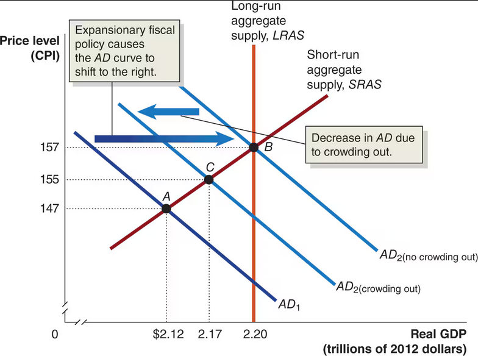  
The economy begins in a recession, with real GDP of $2.12 trillion (point *A*). In the absence of crowding out, an increase in government purchases will shift aggregate demand to A‍D‍2(no crowding out) and bring the economy to equilibrium at potential GDP of $2.20 trillion (point *B*). But the higher interest rate resulting from the increased government purchases will reduce consumption, investment, and net exports, causing aggregate demand to shift to A‍D‍2(crowding out). The result is a new short-run equilibrium at point *C*, with real GDP of $2.17 trillion, which is $10 billion short of potential GDP.  
*   
*   
*   
  
  
Play  
  
## Crowding Out in the Long Run  
  
Most economists agree that in the short run, an increase in government spending results in partial, but not complete, crowding out. What is the long-run effect of a *permanent* increase in government spending? In this case, many economists agree that the result is complete crowding out. In the long run, the decline in investment, consumption, and net exports exactly offsets the increase in government purchases, and aggregate demand remains unchanged. To understand crowding out in the long run, recall from Chapter 9 that *in the long run, the economy returns to potential GDP*. Suppose that the economy is currently at potential GDP and that government purchases account for 35 percent of GDP. In that case, private expenditures—the sum of consumption, investment, and net exports—will make up the other 65 percent of GDP. If government purchases are increased permanently to 37 percent of GDP, in the long run, private expenditures must fall to 63 percent of GDP. There has been complete crowding out: Private expenditures have fallen by the same amount that government purchases have increased. If government spending is taking up a larger share of GDP, then private spending must take a smaller share.  
## Apply the Concept  
**Job Loss and Health**  
  
  
Play  
  
  
For more practice, do related ++[Problem 5.6](https://plus.pearson.com/epub/bronte/BRNT-SITHABGCXI/v12/OPS/xhtml/07b186b0-7c31-11ed-8588-91bb34bd86c7.xhtml#0264fc9714dd4ec5a9621617d3d11da2)++ at the end of this chapter.  
An expansionary fiscal policy doesn’t have to cause complete crowding out in the short run. If the economy is below potential GDP, it is possible for both government purchases and private expenditures to increase. But in the long run, a permanent increase in government purchases must come at the expense of private expenditures. Keep in mind, however, that we don’t know how long it will take to arrive at this long-run outcome. It may take several—possibly many—years to arrive at the new equilibrium.  
  
___  
  
# Deficits, Surpluses, and Federal Government Debt  
**LO 12.6** **Define federal budget deficit and federal government debt and explain how the federal budget can serve as an automatic stabilizer.**  
The federal government’s budget shows the relationship between its expenditures and its tax revenue. When the federal government’s current expenditures are greater than its current tax revenue, a **++[budget deficit](https://plus.pearson.com/epub/bronte/BRNT-SITHABGCXI/v12/OPS/xhtml/glossary.xhtml#key-3109a124-1fcb-5f72-af71-7c25d732b4c9)++** results. If the federal government’s current expenditures are less than its current tax revenue, a **++[budget surplus](https://plus.pearson.com/epub/bronte/BRNT-SITHABGCXI/v12/OPS/xhtml/glossary.xhtml#key-23f5c3de-90da-5dec-a487-529838b97598)++** results. As with many other macroeconomic variables, it is useful to consider the size of the surplus or deficit relative to the size of the economy.  
++[Figure 12.15](https://plus.pearson.com/epub/bronte/BRNT-SITHABGCXI/v12/OPS/xhtml/075e3690-7c31-11ed-8c11-de2a969e032d.xhtml#b4accc27c4ba5cb36037a02e83393984)++ shows that the federal government has tended to run a budget deficit since the 1970s. During the 1970s and 1980s, it was common for governments around the world to run large budget deficits to finance a wide variety of government spending programs. The budget balance of the federal government began to improve in the late 1980s, but the deficit became larger in the early 1990s, as the Canadian economy entered a recession. In the late 1990s, the federal government began to run a surplus for the first time in decades.  
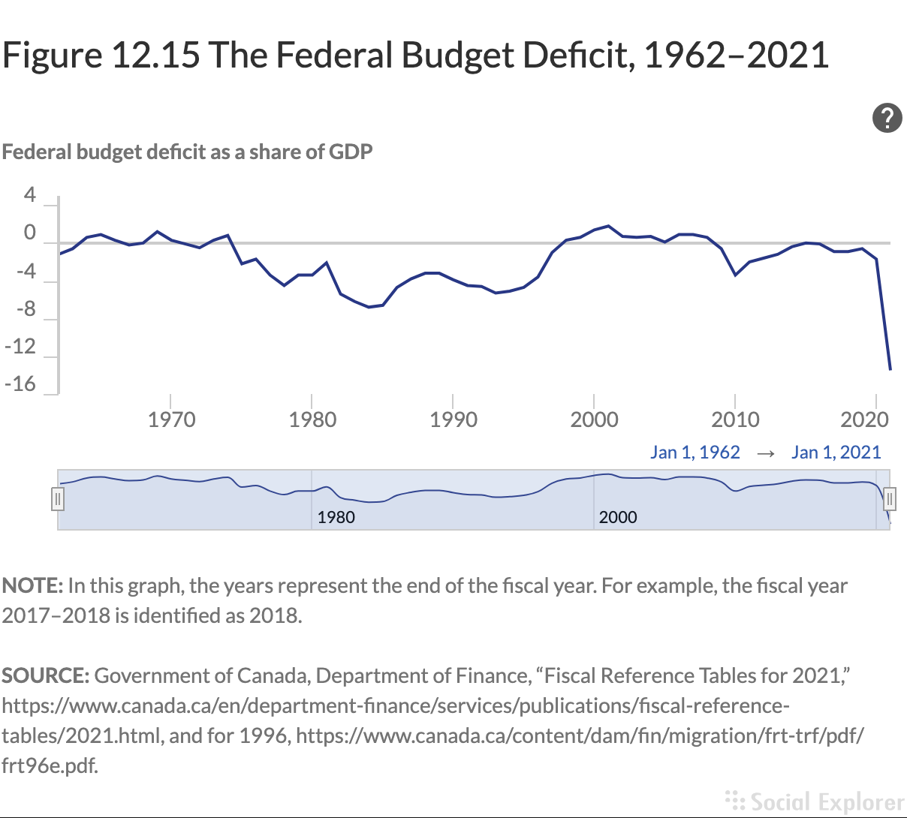  
You can clearly see the impact of global recessions and Canada’s Economic Action Plan on the federal budget balance in ++[Figure 12.15](https://plus.pearson.com/epub/bronte/BRNT-SITHABGCXI/v12/OPS/xhtml/075e3690-7c31-11ed-8c11-de2a969e032d.xhtml#b4accc27c4ba5cb36037a02e83393984)++. The federal budget switches from surplus in 2008 to deficit in 2009, and the deficit grows to 3.6 percent of GDP in 2010. Remember that this increase in government spending was intended to stimulate the economy in the face of the global recession. The problem with a large deficit is that it can make funding new government initiatives difficult. The federal budget returned to balance briefly in 2015. Since 2015, the federal government has run a deficit in every year. The federal deficits were particularly large in 2020 through 2022. During the COVID-19 pandemic, the federal and provincial governments saw their revenues fall dramatically and chose to rapidly increase expenditures, particularly transfers to businesses and households. The impact was record deficits and increases in government debt.  
  
## How the Federal Budget Can Serve as an Automatic Stabilizer  
Discretionary fiscal policy actions can increase the federal budget deficit during recessions by increasing spending or cutting taxes to increase aggregate demand. Although the federal government delivered a fiscal stimulus package to counteract the effects of both the 2008–2009 recession and the COVID-19 recession, in many milder recessions it takes no significant fiscal policy actions. In fact, most of the increase in the federal budget deficit during a small slowdown takes place without the federal government taking any deliberate action but is instead due to the effects of the *automatic stabilizers* we mentioned earlier in this chapter.  
Deficits occur automatically during recessions for two reasons. First, during a recession, wages and profits fall, causing government tax revenues to fall. Second, the government automatically increases its spending on transfer payments when the economy moves into recession. The government’s contribution to the Employment Insurance program will increase as unemployment rises. Spending will also increase on programs to aid low-income people. These spending increases take place without the government taking any action. Existing laws already specify who is eligible for Employment Insurance and other programs. As the number of eligible persons increases during a recession, so does government spending on these programs.  
Because budget deficits automatically increase during recessions and decrease during expansions, economists often look at the *cyclically adjusted budget deficit or surplus* (sometimes referred to as the *structural budget balance*), which can provide a more accurate measure of the effects on the economy of the government’s spending and tax policies than can the actual budget deficit or surplus. The **++[cyclically adjusted budget deficit or surplus](https://plus.pearson.com/epub/bronte/BRNT-SITHABGCXI/v12/OPS/xhtml/glossary.xhtml#key-adab324a-c512-59c0-9e57-c12f33961df3)++** measures what the deficit or surplus would be if the economy were at potential GDP. An expansionary fiscal policy should result in a cyclically adjusted budget deficit, and a contractionary fiscal policy should result in a cyclically adjusted budget surplus.  
Automatic budget surpluses and deficits can help stabilize the economy. When the economy moves into a recession, wages and profits fall, which reduces the taxes that households and firms pay to the government. In effect, households and firms have received an automatic tax cut, which keeps their spending higher than it otherwise would have been. In a recession, workers who have been laid off receive Employment Insurance payments, and households whose incomes have dropped below a certain level become eligible for government transfer programs. By receiving this extra income, households are able to spend more than they otherwise would have. This extra spending helps reduce the length and severity of the recession. Many economists argue that the absence of an employment insurance system and other government transfer programs contributed to the severity of the Great Depression of the 1930s and helps explain why the Canadian recession of 2008–2009 was not a lot worse. During the Great Depression, workers who lost their jobs saw their labour market incomes drop to zero and had to rely on their savings, what they could borrow, or what they received from private charities. As a result, many cut back their spending drastically, which made the downturn worse.  
  
When GDP increases above its potential level, households and firms have to pay more taxes to the federal government, and the federal government makes fewer transfer payments. Higher taxes and lower transfer payments cause total spending to rise by less than it otherwise would have, which helps reduce the chance that the economy will experience high inflation.  
## Solved Problem 12.2  
**Solved Problem 12.2 Whiteboard: The Italian Government Confronts a Budget Deficit**  
  
## THE ITALIAN GOVERNMENT CONFRONTS A BUDGET DEFICIT  
Italy is a member of the European Union (EU), and like other countries in the EU, it has agreed to limits on the size of its budget deficit. An article in the *Wall Street Journal* in 2019, before the beginning of the COVID-19 pandemic, noted the following points: (1) Italy’s government budget “deficit will be 2.4 percent of gross domestic product, rather than 2 percent as agreed with the EU in December,” and (2) “Italy’s economy has been in recession since late 2018.”  
* Is there a connection between the two points? Briefly explain.  
* If the Italian government had taken steps to abide by its agreement with the EU on the size of its budget deficit, what would have been the likely effect on the country’s economy? (*Note:* In 2020, the European Union suspended the limits on the budget deficits member countries could run, given the depth of the recession caused by the COVID-19 pandemic.)  
## Solving the Problem  
* **Step 1: Review the chapter material.** This problem is about the effects of a government attempting to reduce its budget deficit during a recession, so you may want to review the sections “How the Federal Budget Can Serve as an Automatic Stabilizer” and “Should the Federal Budget Always Be Balanced?”  
* **Step 2: Answer part (a) by explaining the connection between the Italian government running a budget deficit and the Italian economy being in recession.** Deficits occur automatically during recessions because falling wages and profits cause government tax revenues to fall and because government spending on transfer payments, such as Employment Insurance payments, increases. So, it’s not surprising that when the Italian economy is in recession, the government’s’ budget deficit would be increasing.  
* **Step 3: Answer part (b) by explaining the likely effect on the Italian economy if the government had taken steps to abide by its budget agreement with the EU.** To abide by its agreement with the EU to run a smaller budget deficit, the Italian government would have had to reduce spending and increase taxes. We have seen that reductions in government spending and increases in taxes reduce aggregate demand. A reduction in aggregate demand will likely reduce real GDP and employment, making the recession in Italy worse.  
For more practice, do related ++[Problem 6.9](https://plus.pearson.com/epub/bronte/BRNT-SITHABGCXI/v12/OPS/xhtml/07b186b0-7c31-11ed-8588-91bb34bd86c7.xhtml#f65a55fe9a6e0ebede2fdc29e7d2d618)++ at the end of this chapter.  
## Should the Federal Budget Always Be Balanced?  
Although many economists believe that it is a good idea for the federal government to have a balanced budget when the economy is at potential GDP, few economists believe that the federal government should attempt to balance its budget every year. To see why economists take this view, consider what the government would have to do to keep the budget balanced during a recession, when the federal budget automatically moves into deficit. To bring the budget back into balance, the government would have to raise taxes or cut spending, but these actions would reduce aggregate demand, thereby making the recession worse. Similarly, when GDP increases above its potential level, the budget automatically moves into surplus. To eliminate this surplus, the government would have to cut taxes or increase government spending. But these actions would increase aggregate demand, thereby pushing GDP even further beyond potential GDP and increasing the risk of higher inflation. To balance the budget every year, the government might have to take actions that would destabilize the economy.  
  
Some economists argue that the federal government should normally run a budget deficit, even when the economy is at potential GDP. When the federal budget is in deficit, the government sells bonds to investors to raise the funds necessary to pay the government’s bills. Borrowing to pay the bills is a bad idea for a household, a firm, or a government when the bills are for current expenses, but it isn’t necessarily a bad policy if the bills are for long-lived capital goods. For instance, most households pay for a home by taking a 15- to 25-year mortgage. Because houses last many years, it makes sense to pay for a house out of the income the household earns over a long period of time rather than out of the income received in the year the house is bought. Businesses often borrow the funds to buy machinery, equipment, and factories by selling long-term corporate bonds. Because these capital goods generate profits for the businesses over many years, it makes sense to pay for them over a period of years as well. By similar reasoning, when the federal government contributes to the building of a new highway, bridge, or subway, it may want to borrow funds by selling bonds. The alternative is to pay for these long-lived capital goods out of the tax revenues received in the year the goods were purchased. But that means that the taxpayers in that year have to bear the whole burden of paying for the projects, even though taxpayers for many years in the future will get to enjoy the benefits.  
## The Federal Government Debt  
Every time the federal government runs a budget deficit, the government must borrow funds from investors by selling bonds. When the federal government runs a budget surplus, it pays off some existing bonds. ++[Figure 12.15](https://plus.pearson.com/epub/bronte/BRNT-SITHABGCXI/v12/OPS/xhtml/075e3690-7c31-11ed-8c11-de2a969e032d.xhtml#b4accc27c4ba5cb36037a02e83393984)++ shows that there are many more years of federal budget deficits than years of federal budget surpluses. As a result, the total number of bonds outstanding has grown over the years. The total value of bonds outstanding, which is equal to the sum of past budget deficits, is referred to as the **++[federal government debt](https://plus.pearson.com/epub/bronte/BRNT-SITHABGCXI/v12/OPS/xhtml/glossary.xhtml#key-8dcd0e8a-4d3c-55ff-944a-e010941c499c)++**. Each year the federal budget is in deficit, the federal government debt grows. Each year the federal budget is in surplus, the debt shrinks.  
++[Figure 12.16](https://plus.pearson.com/epub/bronte/BRNT-SITHABGCXI/v12/OPS/xhtml/075e3690-7c31-11ed-8c11-de2a969e032d.xhtml#5b31743c02c397e20bc987b66e5d2406)++ shows federal government debt since 1962. The debt has been increasing over virtually the entire period. The exception is the period from 1998 to 2008, during which the debt either fell or increased very little. You can see major increases in debt from the 1980s to 1998, from 2009 to 2013, and again from 2020. While there were rapid increases in debt during the recessions of 2008–2009 and 2020, for much of the period debt was growing even as the economy was growing. When we consider the gross federal government debt, it’s important to keep a couple of points in mind. First, we haven’t controlled for changes in the value of the dollar: The total debt was fewer dollars in the 1960s, but those dollars bought a lot more. Second, the Canadian economy has been growing over much of the time the debt has been growing, which makes debt easier to deal with.  
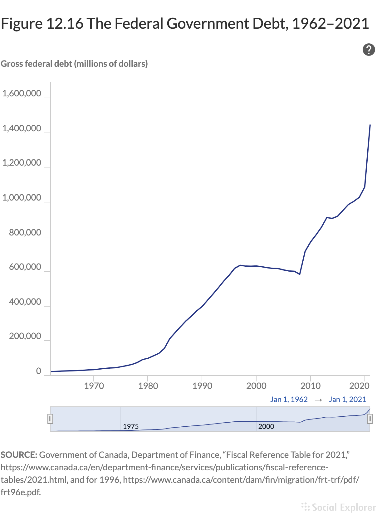  
## Is Government Debt a Problem?  
Debt can be a problem for a government for the same reasons that debt can be a problem for a household or a business. If a household has difficulty making the monthly mortgage payment, it will have to cut back on spending for other things. If the household is unable to make payments, it will have to default on the loan and will probably lose its house. The federal government is in no danger of defaulting on its debt. Ultimately, the government can raise the funds it needs through taxes to make the interest payment on the debt. If the debt becomes very large relative to the economy, however, the government may have to raise taxes to higher levels or cut back on many other types of spending to make the interest payments on the debt. Interest payments are currently about 1 percent of GDP and were projected to rise to 1.4 percent of GDP by 2027. This debt service may well have been sustainable. However, these projections did not take into account the recent interest rate increases by the Bank of Canada. Rising interest rates make servicing the federal debt more expensive.  
  
In the long run, a debt that increases in size relative to GDP, as was happening after 2009, can pose a problem. As we discussed previously, crowding out of investment spending may occur if an increasing debt drives up interest rates. Lower investment spending means a lower capital stock in the future and a lower capacity of the economy to produce goods and services. This effect is somewhat offset if some of the government debt was incurred to finance improvements in *infrastructure*, such as bridges, roads, and ports; to finance education; or to finance research and development. Improvements in infrastructure, a better-educated labour force, and additional research and development can add to the productive capacity of the economy.  
  
___  
  
  
# The Effects of Fiscal Policy in the Long Run  
**LO 12.7** **Discuss the effects of fiscal policy in the long run.**  
Some fiscal policy actions are intended to meet short-run goals of stabilizing the economy. Other fiscal policy actions are intended to have long-run effects by expanding the productive capacity of the economy and increasing the rate of economic growth. Because these policy actions primarily affect aggregate supply rather than aggregate demand, they are sometimes referred to as *supply-side economics*. Most fiscal policy actions that attempt to increase aggregate supply do so by changing taxes to increase the incentives to work, save, invest, or start a business.  
  
## The Long-Run Effects of Tax Policy  
The difference between the pretax and posttax return to an economic activity is known as the **++[tax wedge](https://plus.pearson.com/epub/bronte/BRNT-SITHABGCXI/v12/OPS/xhtml/glossary.xhtml#key-25c9f890-8f58-57b4-9d75-83baba637a1d)++**. The tax wedge applies to the *marginal tax rate*, which is the fraction of each additional dollar of income that must be paid in taxes. For example, the Canadian income tax has several tax brackets, which are the income ranges within which a tax rate applies. In 2021, the federal personal income tax rate on the first $49 020 of income was 15 percent. The tax rate rose for higher income brackets until it reached 33 percent of income earned above $216 511. Suppose that you are paid a wage of $20 per hour. If your marginal income tax rate is 25 percent, then the after-tax wage is $15, and the tax wedge is $5. When discussing the model of demand and supply in Chapter 3, we saw that increasing the price of a good or service increases the quantity supplied. So, we would expect that reducing the tax wedge by cutting the marginal tax rate on income would result in a larger quantity of labour supplied because the after-tax wage would be higher. Similarly, we saw in Chapter 6 that a reduction in the income tax would increase the after-tax return to saving, causing an increase in the supply of loanable funds, a lower equilibrium interest rate, and an increase in investment spending. In general, economists believe that the smaller the tax wedge for any economic activity—such as working, saving, investing, or starting a business—the more of that economic activity will occur.  
We can look briefly at the effects on aggregate supply of cutting each of the following taxes:  
* **Individual income tax.** As we’ve seen, reducing the marginal tax rates on individual income will reduce the tax wedge faced by workers, thereby increasing the quantity of labour supplied. Most households are taxed on their returns from savings at the individual income tax rates. Reducing marginal income tax rates, therefore, also increases the return to saving. Tax-free savings accounts allow households to earn small amounts of interest, tax-free.  
* **Corporate income tax.** The federal government taxes the profits earned by corporations under the corporate income tax. In January 2012, the corporate income tax rate fell to 15 percent. Cutting the marginal corporate income tax rate may encourage investment spending by increasing the return corporations receive from new investments in equipment, factories, and office buildings. Because innovations are often embodied in new investment goods, cutting the corporate income tax can potentially increase the pace of technological change.  
* **Taxes on dividends and capital gains.** Corporations distribute some of their profits to shareholders in the form of payments known as *dividends*. Shareholders may also benefit from higher corporate profits by receiving *capital gains*. A capital gain is the change in the price of an asset, such as a share of a stock. Rising profits usually result in rising stock prices and capital gains to shareholders. Individuals pay taxes on both dividends and capital gains (only half of dividend and capital gains are taxed, and they are taxed in the same way as other income). As a result, the same earnings are, in effect, taxed twice: once when corporations pay the corporate income tax on their profits and a second time when the profits are received by individual investors in the form of dividends or capital gains. Economists debate the cost and benefits of a separate tax on corporate profits. With the corporate income tax remaining in place, one way to reduce the “double taxation” problem is to reduce the taxes on dividends and capital gains. Lowering the tax rates on dividends and capital gains may increase the supply of loanable funds from households to firms, increasing saving and investment and lowering the equilibrium real interest rate.  
  
## Tax Simplification  
In addition to the potential gains from cutting individual taxes, there are also gains from tax simplification. The complexity of the Canadian tax system has created an entire industry of tax preparation services such as H&R Block. Sean Speer estimates that it costs Canadians between $5.84 billion and $6.96 billion annually to comply with personal income tax regulations.++[1](https://plus.pearson.com/epub/bronte/BRNT-SITHABGCXI/v12/OPS/xhtml/07b186b0-7c31-11ed-8588-91bb34bd86c7.xhtml#a6818473-67d3-412d-92f8-2ea4ffccaf14)++ There are costs to complying with the corporate income tax, and even the GST has costs associated with collecting, calculating net tax owed, and remitting the GST. The complexity of the tax code makes it unsurprising that over half of Canadians paid someone else to prepare their income taxes.  
If the tax code were greatly simplified, the economic resources currently used by the tax preparation industry would be available to produce other goods and services. In addition to wasting resources, the complexity of the tax code may also distort the decisions made by households and firms. A simplified tax code would increase economic efficiency by reducing the number of decisions households and firms make solely to reduce their tax payments.  
## The Economic Effect of Tax Reform  
We can analyze the economic effects of tax reduction and simplification by using the aggregate demand and aggregate supply model. ++[Figure 12.17](https://plus.pearson.com/epub/bronte/BRNT-SITHABGCXI/v12/OPS/xhtml/078ee380-7c31-11ed-8037-fcac40f6d8d3.xhtml#619ccb4cbee2d49540a1d19a3b3b51dd)++ shows that without tax changes, the aggregate supply curve will shift from LRAS1  
to LRAS2. This shift represents the increases in the labour force and the capital stock and the technological change that would occur even without tax reduction and simplification. To focus on the impact of tax changes on aggregate supply, we will ignore any shifts in the short-run aggregate supply curve, and we will assume that the aggregate demand curve remains unchanged at . In this case, equilibrium moves from point *A* to point *B*, with real GDP increasing from Y1 to Y2 and the price level decreasing from P1 TO P2  
.  
**Figure 12.17 The Supply-Side Effects of a Tax Change**  
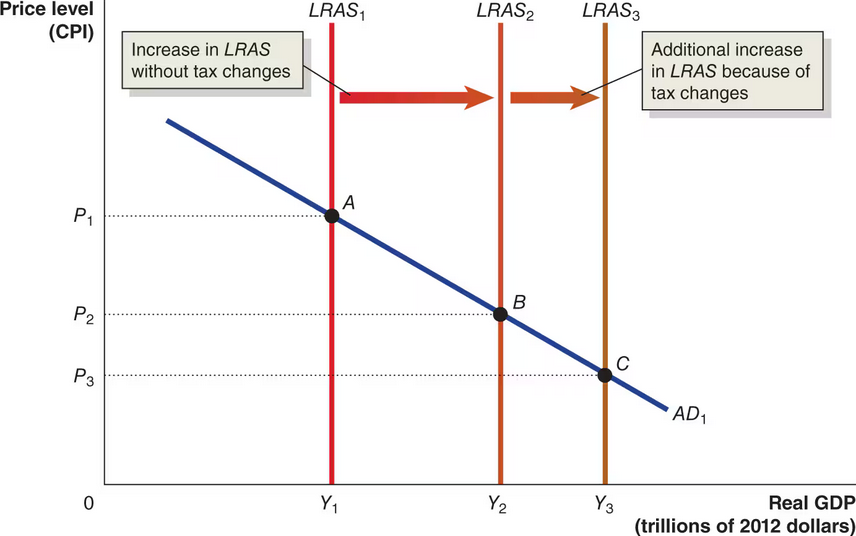  
The economy’s initial equilibrium is at point *A*. With no tax change, the long-run aggregate supply curve shifts to the right, from L‍R‍A‍S‍1 to L‍R‍A‍S‍2. Equilibrium moves to point *B*, with the price level falling from P‍1 to P‍2 and real GDP increasing from Y‍1 to Y‍2. With tax reductions and simplifications, the long-run aggregate supply curve shifts further to the right, to L‍R‍A‍S‍3, and equilibrium moves to point *C*, with the price level falling to P‍3 and real GDP increasing to Y‍3.  
*   
*   
*   
  
  
Play  
  
  
If tax reduction and simplification are effective, the economy will experience increases in labour supply, saving, investment, and the formation of new firms. Economic efficiency will also be improved. Together, these factors will result in an increase in the quantity of real GDP supplied at every price level. We show the effects of the tax changes in ++[Figure 12.17](https://plus.pearson.com/epub/bronte/BRNT-SITHABGCXI/v12/OPS/xhtml/078ee380-7c31-11ed-8037-fcac40f6d8d3.xhtml#619ccb4cbee2d49540a1d19a3b3b51dd)++ by a shift in the long-run aggregate supply curve to  
. With aggregate demand remaining the same, the equilibrium in the economy moves from point *A* to point *C* (rather than to point *B*, which is the equilibrium without tax changes), with real GDP increasing from to , and the price level decreasing from to  
. An important point to notice is that compared with the equilibrium without tax changes (point *B*), the equilibrium with tax changes (point *C*) occurs at a lower price level and a higher level of real GDP. We can conclude that the tax changes have benefited the economy by increasing output and employment while at the same time reducing the price level.  
Clearly, our analysis is unrealistic because we have ignored the changes in aggregate demand and short-run aggregate supply that will occur. How would a more realistic analysis differ from the simplified one in ++[Figure 12.17](https://plus.pearson.com/epub/bronte/BRNT-SITHABGCXI/v12/OPS/xhtml/078ee380-7c31-11ed-8037-fcac40f6d8d3.xhtml#619ccb4cbee2d49540a1d19a3b3b51dd)++? The change in real GDP would be the same because in the long run, real GDP is equal to its potential level, which is represented by the long-run aggregate supply curve. The results for price level would be different, however, because we would expect both aggregate demand and short-run aggregate supply to shift to the right. The likeliest case is that the price level would end up higher in the new equilibrium than in the original equilibrium. However, because the position of the long-run aggregate supply curve is further to the right as a result of the tax changes, the increase in the price level will be smaller; that is, the price level at point *C* is likely to be lower than at point *B*, even if it is higher than at point *A*, although—as we will discuss in the next section—not all economists would agree. We can conclude that a successful policy of tax reductions and simplifications will benefit the economy by increasing output and employment while reducing inflation (increases in the price level) at the same time.  
## How Big Are Supply-Side Effects?  
Most economists would agree that there are supply-side effects to reducing taxes: Decreasing marginal income tax rates will increase the quantity of labour supplied, cutting the corporate income tax rates will increase investment spending, and so on. The magnitude of the effects is the subject of ongoing debate. For example, some economists argue that the increase in the quantity of labour supplied following a tax cut will be limited because many people work a number of hours set by their employers and lack the opportunity to work additional hours. Similarly, some economists believe that tax changes have only a small effect on saving and investment. In this view, saving and investment are affected much more by changes in expectations of future profitability of new investment due to technological change or improving macroeconomic conditions than they are by tax changes.  
Economists who are skeptical of the magnitude of supply-side effects believe that tax cuts have the greatest impact on aggregate demand rather than on aggregate supply. In their view, focusing on the impact of tax cuts on aggregate demand, while ignoring any impact on aggregate supply, yields accurate forecasts of future movements in real GDP and the price level, which indicates that the supply-side effects must be small. If tax changes have only small effects on aggregate supply, it is unlikely that they will reduce the size of price increases to the extent shown in the analysis in ++[Figure 12.17](https://plus.pearson.com/epub/bronte/BRNT-SITHABGCXI/v12/OPS/xhtml/078ee380-7c31-11ed-8037-fcac40f6d8d3.xhtml#619ccb4cbee2d49540a1d19a3b3b51dd)++.  
Ultimately, the debate over the size of the supply-side effects of tax policy can be resolved only through careful study of the effects of differences in tax rates on labour supply and on saving and investment decisions. Recent US studies have arrived at conflicting conclusions. For example, a study by Edward Prescott concludes that differences between the United States and Europe with respect to the average number of hours worked per week and the average number of weeks worked per year are due to differences in taxes. The lower marginal tax rates in the United States compared with Europe increase the return to working American workers and result in a higher supply of labour. But another study by Alberto Alesina, Edward Glaeser, and Bruce Sacerdote argues that the more restrictive labour market regulations in Europe explain the shorter work weeks and longer vacations of European workers and that differences in taxes have only a small effect.  
  
As in other areas of economics, differences among economists in their estimates of the supply-side effects of tax changes may narrow over time as additional studies are conducted.  
## Economics in Your Life and Career  
## WHAT WOULD YOU DO WITH $1200 MORE?  
At the beginning of the chapter, we asked how you would respond if the government gave you an extra $1200 and what effect this extra money would have on equilibrium GDP in the short run. This chapter has shown that tax rebates increase disposable income and that when there is a permanent increase in disposable income, consumption spending increases. So, you will likely respond to an extra $1200 transfer from the government by increasing your spending. How much your spending increases depends in part on your overall financial situation. As mentioned in the chapter, people usually try to smooth out their spending over time and don’t usually increase spending much in response to a one-time increase in income. However, if you’re a struggling student, you’re likely to spend most or all of the extra $1200. This chapter has also shown that government spending and transfers (like tax rebates) have a multiplier effect on the economy. That is, an increase in consumption spending sets off further increases in real GDP and income. Thus, this tax rebate is likely to increase equilibrium GDP in the short run.  
  
  
  
  
  
  
