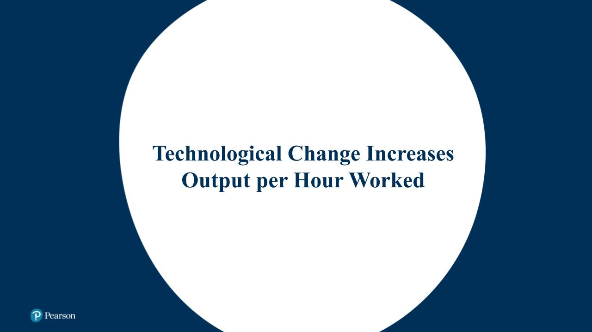
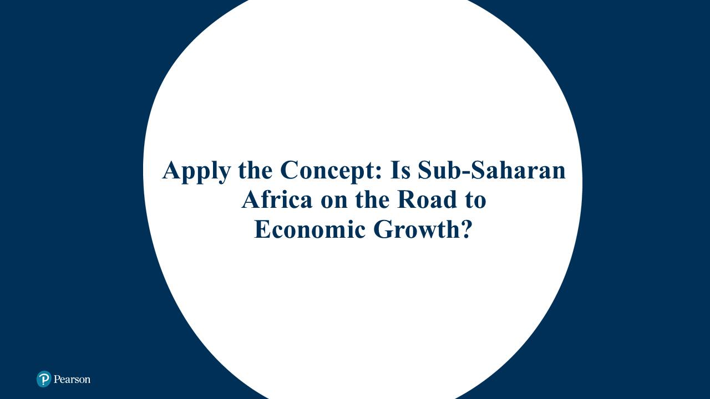

# Chapter 7 Economics  
  
  
# **Economic Growth over Time and around the World**  
**LO 7.1** **Define economic growth, calculate economic growth rates, and describe global trends in economic growth.**  
You live in a world that is very different from the world as it was when your grandparents were young. You can listen to music on an iPhone that fits in your pocket; your grandparents played vinyl records on large stereo systems. You can send a text message to someone in another city, province, or country; your grandparents mailed letters that took days or weeks to arrive. More importantly, you have access to health care and medicines that have prolonged life and improved its quality. In many poorer countries, however, people endure grinding poverty and have only the bare necessities of life, just as their parents, grandparents, and great-grandparents did.  
The difference between you and people in poor countries is that you live in a country that has experienced substantial economic growth. A growing economy produces both increasing quantities of goods and services and better goods and services. It is only through economic growth that living standards can increase, but through most of human history, no economic growth took place. Even today, billions of people are living in countries where economic growth occurs very slowly.  
## **Economic Growth from 1 000 000 BCE to the Present**  
In 1 000 000 BCE our ancestors survived by hunting animals and gathering edible plants. Farming was many years in the future, and production was limited to food, clothing, shelter, and simple tools. Bradford DeLong, an economist at the University of California, Berkeley, estimates that in those primitive circumstances, GDP per capita was about $150 per year in 2021 dollars, which was the minimum amount necessary to sustain life. DeLong estimates that real GDP per capita worldwide was still $150 in the year 1300. In other words, no sustained economic growth occurred between 1 000 000 BCE and CE 1300. A peasant toiling on a farm in France in the year 1300 was no better off than his ancestors thousands of years before. In fact, for most of human existence, most people had only the bare minimum of food, clothing, and shelter necessary to sustain life. Economist Robert Allen of New York University Abu Dhabi has described the diet of the typical person in most countries around the year 1500: “Boiled grain or unleavened bread provide most of the calories, legumes [such as peas or beans] are a protein-rich complement, and butter or vegetable oil provides a little fat.” Few people survived beyond age 40, and most people suffered from debilitating illnesses.  
  
Sustained economic growth did not begin until the **++[Industrial Revolution](https://plus.pearson.com/epub/bronte/BRNT-SITHABGCXI/v12/OPS/xhtml/glossary.xhtml#key-1b5dc39d-5ef4-5760-b812-c763a8a2afb8)++**, which started in England around the year 1750. The production of cotton cloth in factories using machinery powered by steam engines marked the beginning of the Industrial Revolution. Before that time, production of goods had relied almost exclusively on human or animal power. The use of mechanical power spread to the production of many other goods, greatly increasing the quantity of goods each worker could produce. First England and then other countries, such as the United States, France, and Germany, experienced *long-run economic growth*, with sustained increases in real GDP per capita that eventually raised living standards in those countries to the high levels of today.  
## **Apply the Concept**  
  
For more practice, do related ++[Problem 1.3](https://plus.pearson.com/epub/bronte/BRNT-SITHABGCXI/v12/OPS/xhtml/fdfd8c40-7c30-11ed-8c1f-f8a9cb6e7a27.xhtml#194f5b95af2b5f92bbcf1ec03cd4c571)++ at the end of this chapter.  
  
++[Figure 7.1](https://plus.pearson.com/epub/bronte/BRNT-SITHABGCXI/v12/OPS/xhtml/fca1ccd0-7c30-11ed-8df2-0e3634e0c731.xhtml#87e4c532dfc02595e6a0690d69409f5d)++ shows how growth rates of real GDP per capita for the entire world have changed over long periods. Prior to CE 1300, there were no sustained increases in real GDP per capita. Over the next 500 years, to 1800, there was very slow growth. Significant growth began in the nineteenth century, as a result of the Industrial Revolution. A further acceleration in growth occurred during the twentieth century, as the average growth rate increased from 1.3 percent per year to 2.3 percent per year. The first 19 years of the twenty-first century saw a deceleration of growth, with the average growth rate falling to 1.7 percent per year. That slow growth reflects the severity of the worldwide recession of 2007–2009 and the weak recovery that followed. Growth was negative during 2020 because of the effects of the COVID-19 pandemic.  
**Figure 7.1**  
**Average Annual Growth Rates for the World Economy**  
  
World economic growth was essentially zero in the years before 1300, and it was very slow—an average of only 0.2 percent per year—between 1300 and 1800. The Industrial Revolution made possible the sustained increases in real GDP per capita that have allowed some countries to attain high standards of living. Growth accelerated during the twentieth century before slowing during the first years of the twenty-first century.  
**SOURCES: J. Bradford DeLong, “Estimates of World GDP, One Million B.C.–Present,” working paper, University of California, Berkeley; and World Bank national accounts data.worldbank.org.**  
  
## **Small Differences in Growth Rates Are Important**  
The difference between 1.7 percent and 2.3 percent may seem trivial, but over long periods, small differences in growth rates can have a large effect. Suppose you have $100 in a savings account earning an interest rate of 1.7 percent, which means you will receive an interest payment of $1.70 this year. If the interest rate on the account is 2.3 percent, you will earn $2.30. The difference of an extra $0.60 interest payment seems insignificant. But if you leave the interest as well as the original $100 in your account for another year, the difference becomes greater because now the higher interest rate is applied to a larger amount—$102.30—and the lower interest rate is applied to a smaller amount—$101.70. This process, known as *compounding,* magnifies even small differences in interest rates over long periods of time. Over a period of 50 years, your $100 would grow to $312 at an interest rate of 2.3 percent but to only $232 at an interest rate of 1.7 percent.  
The principle of compounding applies to economic growth rates as well as to interest rates. For example, consider these three countries: Ghana, Mexico, and Türkiye. As the second column in ++[Table 7.1](https://plus.pearson.com/epub/bronte/BRNT-SITHABGCXI/v12/OPS/xhtml/fca1ccd0-7c30-11ed-8df2-0e3634e0c731.xhtml#2b946480040a8318dc735fda93997315)++ shows, in 1960, their levels of real GDP per capita measured in US dollars at constant 2017 prices were roughly similar. Over the following 59 years, the growth rates of these three countries might seem only slightly different. But as the last column in the table shows, these small differences in growth rates, compounded over several decades, have resulted in sharply different outcomes. Real GDP per capita in Türkiye went from being lower than in Mexico and only $600 higher than in Ghana to being nearly five times higher than in Ghana and more than one-third higher than in Mexico.  
  
**Table 7.1 The Effects of Different Growth Rates on Living Standards**  

| Country | Real GDP per Capita, 1960 (2017 US dollars) | Growth in Real GDP per Capita, 1960–2019 | Real GDP per Capita, 2019 (2017 US dollars) |
| ------- | ------------------------------------------- | ---------------------------------------- | ------------------------------------------- |
| Ghana | $4408 | 0.4% | $5 546 |
| Mexico | 6072 | 1.9 | 19 308 |
| Türkiye | 5051 | 2.9 | 26 700 |
  
**SOURCES:** Authors’ calculation from data in Robert C. Feenstra, Robert Inklaar, and Marcel P. Timmer, “The Next Generation of the Penn World Table,” *American Economic Review* 105, no. 10 (October 2015): 3150–3182 (data available at www.ggdc.net/pwt).  
In other words, relatively small differences in the growth rates among these economies resulted in dramatic differences in the standard of living of a typical person living in them. Here is the key point to keep in mind: *In the long run, small differences in economic growth rates result in big differences in living standards*.  
## **The Problem with Slow Economic Growth**  
We’ve just seen that economic growth rates matter because an economy that grows too slowly fails to raise living standards. In some countries in Africa and Asia, very little economic growth has occurred in the past 50 years, and many people remain in severe poverty. In high-income countries, only 6 or fewer out of every 1000 babies die before they are one year old. In the poorest countries, 50 or more out of every 1000 babies die before they are one year old, and millions of children die annually from diseases that could be avoided by having access to clean water or that could be cured by using medicines that cost only a few dollars.  
Although their problems are less dramatic, countries that experience slow growth have also missed opportunities to improve the lives of their citizens. For example, the failure of Ghana to grow as rapidly as other countries that had similar levels of GDP per capita in 1960 has left many of its people in poverty. Life expectancy in Ghana is 10 years less than in the United States and other high-income countries, and the infant mortality rate is more than six times higher.  
## **Don’t Let This Happen to You**  
## **DON’T CONFUSE THE AVERAGE ANNUAL PERCENTAGE CHANGE WITH THE TOTAL PERCENTAGE CHANGE**  
When economists talk about growth rates over a period of more than one year, the numbers are always *average annual percentage changes* and *not* total percentage changes. For example, in the United States, real GDP per capita was $15 092 in 1950 and $55 802 in 2020. The percentage change in real GDP per capita between these two years is  
  
  
  
  
However, this is *not* the growth rate between the two years. The growth rate between these two years is the rate at which $15 902 in 1950 would have to grow on average *each year* to end up as $55 802 in 2020, which is 1.9 percent.  
For more practice, do related ++[Problem 1.6](https://plus.pearson.com/epub/bronte/BRNT-SITHABGCXI/v12/OPS/xhtml/fdfd8c40-7c30-11ed-8c1f-f8a9cb6e7a27.xhtml#24a3d9961a81d66db648af859d6280f0)++ at the end of this chapter.  
  
## **The Variation in per Capita Income around the World**  
We can divide the world’s economies into two groups:  
1. The *high-income countries*, sometimes called the *industrial countries* or the *developed countries*, including Australia, Canada, Japan, New Zealand, the United States, and the countries of Western Europe  
2. The lower-income countries, or *developing countries*, which include most of the countries of Africa, Asia, and Latin America  
In the 1980s and 1990s, a small group of countries, mostly East Asian countries such as Singapore and South Korea, began to experience high rates of growth. These countries are sometimes called the *newly industrializing countries*.  
++[Figure 7.2](https://plus.pearson.com/epub/bronte/BRNT-SITHABGCXI/v12/OPS/xhtml/fca1ccd0-7c30-11ed-8df2-0e3634e0c731.xhtml#806f0377379ce96b3f7a8649999356dc)++ shows the levels of real GDP per capita around the world in 2020. GDP is measured in current US dollars (as of 2022). In 2020, GDP per capita ranged from a high of $173 688 in the European country of Monaco to a low of $238 in the African country of Burundi. To understand why the gap between rich and poor countries exists, in the next section we look at what causes economies to grow.  
**Figure 7.2 GDP per Capita, 2020**  
  
GDP per capita is measured in US dollars, corrected for differences across countries in the cost of living. China and Taiwan are coloured differently in the world map as Taiwan's status is in dispute.  
  
  
  
  
  
  
## **Is Income All That Matters?**  
Most economists argue that unless the incomes of the very poor increase significantly, they will be unable to attain a higher standard of living. In some countries—primarily those coloured yellow in ++[Figure 7.2](https://plus.pearson.com/epub/bronte/BRNT-SITHABGCXI/v12/OPS/xhtml/fca1ccd0-7c30-11ed-8df2-0e3634e0c731.xhtml#806f0377379ce96b3f7a8649999356dc)++—the growth in average income has been very slow, or even negative, over a period of decades.  
Some economists argue, though, that if we look beyond income to other measures of the standard of living, we can see that even the poorest countries have made significant progress in recent decades. Charles Kenny, an economist with the Center for Global Development, argues, “Those countries with the lowest quality of life are making the fastest progress in improving it—across a range of measures including health, education, and civil and political liberties.” For example, since 1960, deaths among children have declined, often by more than 50 percent, in nearly all countries, including most of those with the lowest incomes. Even in sub-Saharan Africa, where growth in incomes has been very slow, the percentage of children dying before age five has decreased by more than 30 percent over the past 50 years. Similarly, the percentage of people able to read and write has more than doubled in sub-Saharan Africa since 1970. Many more people now live in democracies where basic civil rights are respected than at any other time in world history. Although some countries, such as Somalia, the Democratic Republic of the Congo, Syria, and Afghanistan, have suffered from civil wars, improved political stability in many countries has reduced the likelihood of dying from violence.  
These increases in living standards do not require significant increases in income. The key factors in raising living standards in low-income countries have been increases in technology and knowledge—such as the development of inexpensive vaccines that reduce epidemics and the use of mosquito-resistant netting that reduces the prevalence of malaria—that are inexpensive enough to be widely available. Changes in attitudes, such as placing a greater value on education, particularly for girls, and increasing support for political freedoms, have also played a role in improving conditions in low-income countries.  
There are limits, of course, to how much living standards can increase if incomes stagnate. Ultimately, much higher rates of economic growth will be necessary for low-income countries to significantly close the gap in living standards with high-income countries.  
  
  
  
  
# **What Determines How Fast Economies Grow?**  
**LO 7.2** **Use the economic growth model to explain why growth rates differ across countries.**  
To explain changes in economic growth rates over time within countries and differences in growth rates among countries, we need to develop an *economic growth model*. An **++[economic growth model](https://plus.pearson.com/epub/bronte/BRNT-SITHABGCXI/v12/OPS/xhtml/glossary.xhtml#key-37cb3210-7bbb-5ff4-9d18-700977883e4a)++** explains growth rates in real GDP per capita over the long run. As we have seen, the average person can buy more goods and services only if the average worker produces more goods and services. Recall that **++[labour productivity](https://plus.pearson.com/epub/bronte/BRNT-SITHABGCXI/v12/OPS/xhtml/glossary.xhtml#key-21f92d2d-a15e-54ee-b4a2-1c2349295d37)++** is the quantity of goods and services that can be produced by one worker or by one hour of work. Because of the importance of labour productivity in explaining economic growth, the economic growth model focuses on the causes of long-run increases in labour productivity.  
How can a country’s workers become more productive? Economists believe two key factors determine labour productivity:  
1. The quantity of capital available to workers  
2. The level of technology  
  
Therefore, to explain changes in real GDP per capita, the economic growth model focuses on technological change and changes over time in the quantity of capital available to workers. Recall that **++[technological change](https://plus.pearson.com/epub/bronte/BRNT-SITHABGCXI/v12/OPS/xhtml/glossary.xhtml#key-eddb2d39-ea66-5b7f-b52b-a030bd044c8a)++** is a change in the quantity of output firms can produce using a given quantity of inputs.  
There are three main sources of technological change:  
1. **Better machinery and equipment.** Beginning with the steam engine during the Industrial Revolution, the invention of new machinery has been an important source of rising labour productivity. Today, continuing improvements in computers, robots, factory machine tools, electric generators, and many other machines contribute to increases in labour productivity.  
2. **Increases in human capital.** Capital refers to *physical capital*, including computers, factory buildings, machine tools, warehouses, and trucks. The more physical capital workers have available, the more output they can produce. **++[Human capital](https://plus.pearson.com/epub/bronte/BRNT-SITHABGCXI/v12/OPS/xhtml/glossary.xhtml#key-93833a1c-d506-5cce-ab14-aa71c949c96e)++** is the accumulated knowledge and skills that workers acquire from education and training or from their life experiences. As workers increase their human capital through education or on-the-job training, their productivity also increases. The more educated workers are, the greater is their human capital.  
3. **Better means of organizing and managing production.** Labour productivity increases if managers do a better job of organizing production. For example, the *just-in-time system*, first developed by Toyota Motor Corporation, involves assembling goods from parts that arrive at the factory at exactly the time workers need them. With this system, firms require fewer workers to store and keep track of parts in the factory, so the quantity of goods produced per hour worked increases.  
Note that technological change is *not* the same thing as more physical capital. New capital can *embody* technological change, as when a faster computer chip is embodied in a new laptop. But simply adding more capital that is the same as existing capital is not technological change. To summarize: A country’s standard of living will be higher the more capital workers have available on their jobs, the better the capital, the more human capital workers have, and the better the job managers do in organizing production.  
## **The Per-Worker Production Function**  
Often when analyzing economic growth, we look at increases in real GDP *per hour worked* and increases in capital *per hour worked*. We use measures of GDP per hour and capital per hour rather than per person so that we can analyze changes in the underlying ability of an economy to produce more goods with a given amount of labour without having to worry about changes in the fraction of the population working or in the length of the workday. We can illustrate the economic growth model by using the **++[per-worker production function](https://plus.pearson.com/epub/bronte/BRNT-SITHABGCXI/v12/OPS/xhtml/glossary.xhtml#key-afd6caf7-dd4b-5477-b6c1-59df24c3a09e)++**, which is the relationship between real GDP per hour worked and capital per hour worked, *holding the level of technology constant*. For simplicity, from now on we will shorten “per-worker production function” to just “production function.” ++[Figure 7.3](https://plus.pearson.com/epub/bronte/BRNT-SITHABGCXI/v12/OPS/xhtml/fcdf4b00-7c30-11ed-8475-a9f002d03bb8.xhtml#72ed2721ffeabef3a5612eb17624c111)++ shows the production function as a graph. We measure capital per hour worked along the horizontal axis and real GDP per hour worked along the vertical axis. Letting *K* stand for capital, *L* stand for *l*abour, and *Y* stand for real GDP, real GDP per hour worked is  
, and capital per hour worked is  
. The curve represents the production function. Notice that we do not explicitly show technological change in the figure. We assume that as we move along the production function, the level of technology remains constant. As we will see, we can illustrate technological change using this graph by *shifting up* the curve representing the production function.  
  
**Figure 7.3 The Per-Worker Production Function**  
  
The per-worker production function shows the relationship between capital per hour worked and real GDP per hour worked, holding technology constant. Increases in capital per hour worked increase output per hour worked but at a diminishing rate. For example, an increase in capital per hour worked from $75 to $100 increases real GDP per hour worked from $48 to $53. An increase in capital per hour worked from $100 to $125 increases real GDP per hour worked by a smaller amount, from $53 to $57. Each additional $25 increase in capital per hour worked results in a progressively smaller increase in output per hour worked.  
  
The figure shows that increases in the quantity of capital per hour worked result in movements up along the production function, increasing the quantity of output each worker produces. When *we hold technology constant*, however, equal increases in the amount of capital per hour worked lead to *diminishing* increases in output per hour worked. For example, increasing capital per hour worked from $75 to $100 increases real GDP per hour worked from $48 to $53, an increase of $5. Another $25 increase in capital per hour worked, from $100 to $125, increases real GDP per hour worked from $53 to $57, an increase of only $4. Each additional $25 increase in capital per hour worked results in progressively smaller increases in real GDP per hour worked. In fact, at very high levels of capital per hour worked, further increases in capital per hour worked will not result in any increase in real GDP per hour worked. This effect results from the *law of diminishing returns*, which states that as we add more of one input—in this case, capital—to a fixed quantity of another input—in this case, labour—output increases by smaller additional amounts.  
Why are there diminishing returns to capital? Consider a simple example in which you own a pizza restaurant. At first you have 10 employees but only 1 oven, so each of your workers is able to produce relatively few pizzas per day. When you buy and install a second oven, your employees will be able to produce more pizzas. Adding additional ovens will continue to increase your output—but by increasingly smaller amounts. For example, adding a twentieth oven to the 19 you already have will not increase the pizzas each worker is able to make by nearly as much as adding a second oven did. Eventually, adding additional ovens won’t increase your output at all.  
## **Which Is More Important for Economic Growth: More Capital or Technological Change?**  
Technological change helps economies avoid diminishing returns to capital. Let’s consider two simple examples of the effects of technological change. First, suppose you have three ovens in your restaurant. Each oven can produce 20 pizzas per hour. You don’t believe that adding a fourth oven identical to the three you already have will significantly increase the number of pizzas your employees can produce in a day. Then you find out that a new oven has become available that cooks pizzas more quickly, making it possible to produce 30 pizzas per hour. If you replace your existing ovens with the new ovens, the productivity of your workers will increase. The replacement of existing capital with more productive capital is an example of technological change.  
  
Or suppose you realize that the layout of your restaurant could be improved. Maybe the pizza dough is on shelves that are at the other end of the kitchen from the ovens, and your employees must spend time walking back and forth when preparing pizzas. By placing the pizza dough closer to the ovens, you can improve the productivity of your workers. Reorganizing how production takes place so as to increase output is also an example of technological change.  
## **Technological Change: The Key to Sustaining Economic Growth**  
++[Figure 7.4](https://plus.pearson.com/epub/bronte/BRNT-SITHABGCXI/v12/OPS/xhtml/fcdf4b00-7c30-11ed-8475-a9f002d03bb8.xhtml#4bbb61da7b3b031089e1cc5f80b356e3)++ shows that technological change shifts up the production function and allows an economy to produce more real GDP per hour worked with the same quantity of capital per hour worked. For example, if the current level of technology puts the economy on Production  
, when capital per hour worked is $150, real GDP per hour worked is $60. Technological change that shifts the economy to Production  
makes it possible to produce $65 in goods and services per hour worked with the same level of capital per hour worked. Further increases in technology that shift the economy to higher production functions result in further increases in real GDP per hour worked. Because of diminishing returns to capital, continuing increases in real GDP per hour worked can be sustained only if there is technological change. Remember that a country will experience increases in its standard of living only if it experiences increases in real GDP per hour worked. Therefore, we can draw the following important conclusion: *In the long run, a country will experience an increasing standard of living only if it experiences continuing technological change*.  
**Figure 7.4 Technological Change Increases Output per Hour Worked**  
  
Technological change shifts up the production function and allows more output per hour worked with the same amount of capital per hour worked. For example, along Production function‍1 with $150 in capital per hour worked, the economy can produce $60 in real GDP per hour worked. However, an increase in technology that shifts the economy to Production function‍2 makes it possible to produce $65 in real GDP per hour worked with the same level of capital per hour worked.  
  
**Animation: Figure 7.4 Technological Change Increases Output per Hour Worked**  
  
  
Play  
  
  
## **Apply the Concept**  
**What Explains the Economic Failure of the Soviet Union?**  
  
  
Play  
  
  
For more practice, do related ++[Problems 2.7](https://plus.pearson.com/epub/bronte/BRNT-SITHABGCXI/v12/OPS/xhtml/fdfd8c40-7c30-11ed-8c1f-f8a9cb6e7a27.xhtml#8e66b51578eac38b33f50d6ac9893175)++ and ++[2.8](https://plus.pearson.com/epub/bronte/BRNT-SITHABGCXI/v12/OPS/xhtml/fdfd8c40-7c30-11ed-8c1f-f8a9cb6e7a27.xhtml#265098df99ff2f36dd6240980d2d50b8)++ at the end of this chapter.  
  
## **Solved Problem 7.1**  
**"Solved Problem 7.1 Whiteboard: Using the Economic Growth Model to Analyze the
Failure of the Soviet Economy"**  
  
  
Play  
  
## **USING THE ECONOMIC GROWTH MODEL TO ANALYZE THE FAILURE OF THE SOVIET ECONOMY**  
Use the economic growth model and the information in the *Apply the Concept: What Explains the Economic Failure of the Soviet Union?* to analyze the economic problems the Soviet Union encountered.  
## **Solving the Problem**  
* **Step 1: Review the chapter material.** This problem is about using the economic growth model to explain the failure of the Soviet economy, so you may want to review the *Apply the Concept: What Explains the Economic Failure of the Soviet Union?*  
* **Step 2: Draw a graph like ++[Figure 7.3](https://plus.pearson.com/epub/bronte/BRNT-SITHABGCXI/v12/OPS/xhtml/fcdf4b00-7c30-11ed-8475-a9f002d03bb8.xhtml#72ed2721ffeabef3a5612eb17624c111)++ to illustrate the economic problems of the Soviet Union.** For simplicity, assume that the Soviet Union experienced no technological change. The Soviet Union experienced rapid increases in capital per hour worked from 1950 through the 1980s, but its failure to implement new technology meant that output per hour worked grew at a slower and slower rate.  
  
  
**Extra credit**  
The Soviet Union hoped to raise the standard of living of its citizens above that enjoyed in the United States and other high-income countries by making continuous increases in the quantity of capital available to its workers. The economic growth model helps us understand the flaws in this policy for achieving economic growth.  
For more practice, do related ++[Problems 2.9](https://plus.pearson.com/epub/bronte/BRNT-SITHABGCXI/v12/OPS/xhtml/fdfd8c40-7c30-11ed-8c1f-f8a9cb6e7a27.xhtml#ec7fba4ba0c968f83dd06766c15581e6)++, ++[2.10](https://plus.pearson.com/epub/bronte/BRNT-SITHABGCXI/v12/OPS/xhtml/fdfd8c40-7c30-11ed-8c1f-f8a9cb6e7a27.xhtml#265daf8f6f2de850d47ac98dcaa58444)++, and ++[2.11](https://plus.pearson.com/epub/bronte/BRNT-SITHABGCXI/v12/OPS/xhtml/fdfd8c40-7c30-11ed-8c1f-f8a9cb6e7a27.xhtml#85e80885b7658ff3fd01b356afc611d8)++ at the end of this chapter.  
## **New Growth Theory**  
The economic growth model we have been using was first developed in the 1950s by Nobel laureate Robert Solow of MIT. According to this model, productivity growth is the key factor in explaining long-run growth in real GDP per capita. Some economists believe that the model is incomplete because it does not explain the factors that determine productivity growth. Nobel laureate Paul Romer of New York University developed the **++[new growth theory](https://plus.pearson.com/epub/bronte/BRNT-SITHABGCXI/v12/OPS/xhtml/glossary.xhtml#key-e1393605-5ac8-513b-b5fd-0eaa34666018)++** to provide a more complete explanation of the sources of technological change that underlie productivity growth. Romer argues that how individuals and firms respond to economic incentives affects the rate of technological change. Earlier accounts of economic growth did not explain technological change or attributed it to factors such as chance scientific discoveries.  
  
Romer argues that the accumulation of *knowledge capital* is a key determinant of economic growth. He notes that the accumulated knowledge, or stock of knowledge, is more important to countries than are their natural resources, as shown by the rapid economic growth of Japan and Singapore despite their having very limited natural resources. Firms add to an economy’s stock of knowledge capital when they engage in research and development or otherwise contribute to technological change. We have seen that accumulation of physical capital is subject to diminishing returns: Increases in capital per hour worked lead to increases in real GDP per hour worked but at a decreasing rate.  
In Romer’s view, the same is true of knowledge capital *at the firm level*. As firms add to their stock of knowledge capital, they increase their output but at a decreasing rate. At the level of the entire economy, however, Romer argues that knowledge capital is subject to *increasing returns*. Increasing returns can exist because knowledge, once discovered, becomes available to everyone. The use of physical capital, such as a computer or machine tool, is *rival* because if one firm uses it, other firms cannot, and it is *excludable* because the firm that owns the capital can keep other firms from using it. The use of knowledge capital, such as the chemical formula for a vaccine against COVID-19, is non-rival however, because one firm’s using that knowledge does not prevent another firm from using it. Knowledge capital is also non-excludable because once known, it becomes widely available for everyone to use (unless, as we discuss shortly, the government gives the firm that invents a new product the legal right to its exclusive use). Here’s one of Romer’s examples, which is directly relevant to economic growth: In 1968, Richard Cash of the Harvard School of Public Health and David Nalin of Albany Medical College developed oral rehydration solution. Once the simple formula for this mixture of water, sugar, and salt became known, it was very widely adopted by doctors, particularly in developing countries, to treat children suffering from severe diarrhea. Oral rehydration solution has been credited with saving the lives of millions of children *each year*.  
Because knowledge capital is non-rival and non-excludable, firms can *free ride* on the research and development of other firms. Firms free ride when they benefit from the results of research and development they did not pay for. For example, transistors were first developed at Western Electric’s Bell Laboratories in the 1950s and served as the basic technology of the information revolution. Bell Laboratories, however, received only a tiny fraction of the immense profits that were eventually made by all the firms that used this technology. Romer notes that firms are unlikely to invest in research and development up to the point where the marginal cost of the research equals the marginal return from the knowledge gained because *other* firms gain much of the marginal return. Therefore, there is likely to be an inefficiently small amount of research and development, slowing the accumulation of knowledge capital and economic growth.  
Government policy can help increase the accumulation of knowledge capital in three ways:  
  
1. **Protecting intellectual property with patents and copyrights.** Governments can increase the incentive to engage in research and development by giving firms the exclusive rights to their discoveries for a period of time. The Canadian government grants patents to inventors—often firms—that develop new products or new ways of making existing products. A **++[patent](https://plus.pearson.com/epub/bronte/BRNT-SITHABGCXI/v12/OPS/xhtml/glossary.xhtml#key-6612af2e-d3b6-5197-92a7-340f894f4612)++** gives a firm the exclusive legal right to a new product for a period of 20 years from the date the patent application is filed with the government. For example, a pharmaceutical firm that develops a drug can secure a patent on the drug, thereby keeping other firms from manufacturing the drug without permission. The profit earned during the period the patent is in force provides firms with an incentive for undertaking research and development. The patent system has drawbacks, however. In filing for a patent, a firm must disclose information about the product or process. This information enters the public record and may help competing firms develop products or processes that are similar but that do not infringe on the patent. To avoid this problem, a firm may try to keep the results of its research a *trade secret* without patenting it. (A famous example of a trade secret is the formula for Coca-Cola.) Tension also arises between the government’s objectives of providing patent protection that gives firms the incentive to engage in research and development and making sure that the knowledge gained through the research is widely available, which increases the positive effect of the knowledge on the economy. Economists debate the features of an ideal patent system.  
2. **Supporting research and development.** The government can help increase the quantity of research and development that takes place. In Canada, the federal government conducts some research directly. The government also subsidizes research by providing grants and other payments to researchers in universities through a number of agencies. Finally, the government provides tax benefits to firms that invest in research and development.  
3. **Subsidizing education.** People with technical training carry out research and development. If firms are unable to capture all the profit from research and development, they will pay lower wages and salaries to technical workers. These lower wages and salaries reduce the incentive to workers to receive this training. If the government subsidizes education, it can increase the number of workers who have technical training. In Canada, the government subsidizes education by directly providing free education from grades kindergarten through 12 and by providing support for public colleges and universities. The government also provides student loans at reduced interest rates.  
These government policies can bring the accumulation of knowledge capital closer to the optimal level.  
## **Joseph Schumpeter and Creative Destruction**  
The new growth theory has revived interest in the ideas of Joseph Schumpeter. Born in Austria in 1883, Schumpeter became an economics professor at Harvard University in 1932. He developed a model of growth that emphasized his view that new products unleash a “gale of creative destruction” that drives older products—and, often, the firms that produced them—out of the market. According to Schumpeter, the key to rising living standards is not small changes to existing products but, rather, new products that meet consumer wants in qualitatively better ways. For example, in the early twentieth century, the automobile displaced the horse-drawn carriage by meeting consumer demand for personal transportation in a way that was qualitatively better. In the early twenty-first century, the DVD and the DVD player displaced the VHS tape and the VCR by better meeting consumer demand for watching films at home. Downloading or streaming movies from the internet displaced the DVD just as the DVD displaced the VHS tape. As we saw in the chapter opener, this process of creative destruction has driven many once large and profitable firms into bankruptcy because they failed to adapt quickly enough to new technologies and to changes in consumer tastes. That Netflix drove Blockbuster into bankruptcy would come as no surprise to Schumpeter.  
  
To Schumpeter, the entrepreneur is central to economic growth: “The function of entrepreneurs is to reform or revolutionize the pattern of production by exploiting an invention or, more generally, an untried technological possibility for producing new commodities or producing an old one in a new way.” This description fits Reed Hastings, founder of Netflix, very well. He realized that people would be willing to rent DVDs by mail if they arrived quickly and there were no late fees. As successful as that approach was, Hastings also realized that as more people had access to fast internet connections, they would prefer to stream movies rather than use physical discs. By having Netflix concentrate on offering movie streaming rather than renting DVDs, Hastings was able to greatly increase the firm’s sales by quickly responding to this shift in consumer preferences. The profit an entrepreneur hopes to earn provides the incentive for bringing together the factors of production—labour, capital, and natural resources—to start new firms and introduce new goods and services. Successful entrepreneurs can use their profits to finance the development of new products and are better able to attract funds from investors.  
  
  
  
  
# **Economic Growth in Canada**  
**LO 7.3** **Discuss fluctuations in productivity growth in Canada.**  
The economic growth model can help us understand the record of growth in Canada. ++[Figure 7.5](https://plus.pearson.com/epub/bronte/BRNT-SITHABGCXI/v12/OPS/xhtml/fd39ee20-7c30-11ed-8d11-53134773c167.xhtml#fd699cf8d2bc2d6958222236478ba26a)++ shows average annual growth rates in real GDP per hour worked since 1870. As Canada experienced the Industrial Revolution during the nineteenth century, Canadian firms increased the quantity of capital per hour worked. New technologies such as the steam engine, the railroad, and the telegraph also became available. Together, these factors resulted in an average annual growth rate of real GDP per worker of 1.8 percent from 1800 to 1900. At this growth rate, real GDP per capita would double about every 40 years, which means that living standards were growing steadily but relatively slowly.  
**Figure 7.5 Average Annual Growth Rates in Real GDP per Person in Canada**  
  
The growth rate in Canada increased from 1870 through the mid-1970s. Then growth slowed considerably.  
**SOURCE:** Jorda-Schularick-Taylor, Macrohistory Database, accessed June 20, 2022, https://www.macrohistory.net/data/.  
  
By the twentieth century, technological change had been institutionalized. Many large corporations created research and development facilities to improve the quality of their products and the efficiency with which they produced them. Universities also began to conduct research that had business applications. After World War II, many corporations began to provide significant funds to universities to help pay for research. In the late 1970s, the federal government created the Social Sciences and Humanities Research Council and the Natural Sciences and Engineering Research Council, whose main goal is to support university researchers. The accelerating rate of technological change led to more rapid growth rates.  
  
## **Economic Growth in Canada since 1950**  
Continuing technological change allowed the Canadian economy to avoid the diminishing returns to capital that stifled growth in the Soviet economy. In fact, until the 1970s, the growth rate of the Canadian economy accelerated over time. As ++[Figure 7.5](https://plus.pearson.com/epub/bronte/BRNT-SITHABGCXI/v12/OPS/xhtml/fd39ee20-7c30-11ed-8d11-53134773c167.xhtml#fd699cf8d2bc2d6958222236478ba26a)++ shows, growth in the first half of the twentieth century was faster than growth during the nineteenth century, and growth in the immediate post–World War II period from 1950 to 1973 was faster yet. Then the unexpected happened: For more than 20 years, from 1974 to 1995, the growth rate of real GDP per hour worked slowed. The growth rate during these years was more than one percentage point per year lower than during the 1950–1973 period. Beginning in the mid-1990s, the growth rate picked up again, and many economists argued that the effects of the revolution in *information technology* (*IT*), including increased use of computers, software, cellphones, and related innovations, were causing a return to higher rates of long-run growth. But beginning in 2006, growth again slowed.  
## **Is Canada Headed for a Long Period of Slow Growth?**  
Economists have not reached a consensus on explaining the swings in Canadian productivity growth since the mid-1970s. Broadly speaking, economists’ views fall into two camps:  
1. **The optimistic view.** Some economists argue that although productivity has become more difficult to measure, Canada is likely to experience high rates of productivity growth in the long run, which will significantly increase the standard of living of the average person in the decades ahead.  
2. **The pessimistic view.** Other economists believe that productivity growth entered a long-run decline in the mid-1970s that was overcome for only a brief period of time by the initial effects of the revolution in information technology. These economists argue that future productivity growth rates are likely to remain low and, therefore, the standard of living of the average person in Canada will increase only slowly.  
* We can briefly discuss some of the key issues involved in this debate.   
## **Measurement Issues**  
Some economists argue that recent productivity growth rates may appear worse than they are because of problems in measuring output. If growth in real GDP understates the true growth rate of output, then measured productivity growth will also understate the true growth rate of productivity. After 1970, services—such as haircuts and financial advice—became a larger fraction of GDP, and goods—such as automobiles and hamburgers—became a smaller fraction. It is more difficult to measure increases in the output of services than to measure increases in the output of goods. For example, before banks began using automated teller machines (ATMs) in the 1980s, you could withdraw money only by going to a bank before closing time—which was usually 3:00 p.m. Once ATMs became available, you could withdraw money at any time of the day or night at a variety of locations. This increased convenience from ATMs does not show up in GDP. Similarly, when people post to Instagram, Snapchat, or Twitter or search Google for information, they pay a zero price yet receive substantial consumer surplus that is not captured in the GDP statistics.  
  
## **The Role of Information Technology**  
Some economists argue that the development of IT caused the higher productivity growth that began in the mid-1990s. As computers became less expensive and faster, they made it possible for people and organizations to communicate and process data more efficiently. Faster data processing has had a major effect on nearly every firm. Business record keeping, once done slowly by hand, is now done more quickly and accurately by computers. During the 1990s, firms used the internet to market and sell products. Smartphones, tablets, laptops, and wireless internet access allow people to work at home and while travelling. These developments in IT have significantly increased labour productivity.  
Despite the wonders of IT, productivity growth since 2006 has fallen to an even lower rate than during the period of slow growth from the mid-1970s to the mid-1990s. Is IT no longer a productivity booster, or are the data not capturing some of IT’s benefits? What insight do the answers to these questions give us about how rapid growth will be in the coming decades?  
As already noted, some economists believe that developments in IT have improved the delivery of services to both consumers and firms in ways that the GDP statistics fail to capture. In recent years, the use of apps to arrange for car rides, make short-term room rentals, locate friends, post to social media, look up information, and stream movies and television shows has benefited consumers in ways that are either not measured or are only partially measured by GDP. Similarly, a store manager can quickly check on available warehouse inventory using a dedicated smartphone or tablet app.  
Economists who believe that IT is having large but difficult-to-measure effects on the economy are usually also optimistic about future growth rates. They believe that continuing advances in semiconductor technology—which underlie progress in IT—will result in substantial gains in labour productivity. The gains will come from higher productivity in the IT sector itself and in other sectors of the economy as a result of progress made possible by advances in IT. For example, ever more rapid and inexpensive computing lowers the cost and speeds the adoption of existing products, such as 3D printers, and helps innovators develop new products, which, in turn, raise productivity growth above its current levels. In addition, these economists argue that some firms have not adopted innovations arising from IT because rates of investment spending were low during the years immediately after the 2007–2009 recession. Larger firms, particularly those that operate globally, have generally experienced high rates of labour productivity growth, while smaller firms and those that sell primarily to the domestic market have experienced much slower—or no—productivity growth. As the economy continues to expand and investment spending increases, the effect of IT innovations will spread to more firms, and measured productivity may increase.  
A somewhat different version of this argument has been made by Erik Brynjolfsson and Daniel Rock of MIT and Chad Syverson of the University of Chicago. They argue that artificial intelligence (AI) is an example of a *general-purpose technology* that has the potential to affect many sectors of the economy. When a general-purpose technology is introduced, productivity may initially decline because businesses need time to develop new processes to integrate the technology into their operations. Once these processes have been worked out, businesses can take full advantage of the technology, and productivity will increase. The result is a productivity J-curve, with productivity first falling—the downward part of the J—before rising—the upward part of the J.  
  
Other economists doubt that the unmeasured benefits of the IT revolution are any greater than the unmeasured benefits of earlier innovations. Robert J. Gordon of Northwestern University has argued that productivity increases from the IT revolution were in fact much smaller than increases resulting from earlier innovations, such as the railroad, electrification of homes and businesses, indoor plumbing, petroleum refining, and the automobile. Moreover, Gordon and some other economists argue that most of the productivity gains from the IT revolution occurred in the 1990s, as a result of the development of the World Wide Web, Windows 95, and computerized inventory control systems. These innovations increased labour productivity because they changed how businesses operated. By the first decade of the 2000s, the IT revolution was having a greater effect on consumer products, such as smartphones and tablets, than on labour productivity. Gordon identifies other factors—such as an aging population (productivity peaks for the typical worker in their 40s), declining educational achievement, and the consequences of increased regulations and higher taxes—that will lead to lower productivity growth rates. Gordon forecasts an extended period of productivity growth rates of 0.5 percent or less.  
## **“Secular Stagnation”. . .**  
In the late 1930s, toward the end of the Great Depression, Alvin Hansen of Harvard University predicted that the US economy would experience an extended period of slow growth, or *secular stagnation*. The rapid growth rates the US economy experienced beginning in 1950 indicate that Hansen’s analysis was incorrect. Recently, however, Lawrence Summers, also of Harvard University, and some other economists have revived the term in arguing that growth rates are likely to remain low in future years. These economists do not focus on potentially slow rates of technological progress. Instead, they believe that real GDP may grow slowly because of insufficient demand for investment spending.  
In Chapter 6, Section 6.2, we saw that in the loanable funds model, the equilibrium level of saving and investment is determined at the level of the real interest rate where the quantity of loanable funds demanded equals the quantity of loanable funds supplied. Economists who forecast a future of secular stagnation believe that the demand for loanable funds may be low in coming years for three main reasons:  
1. Slowing population growth in Canada will reduce the demand for housing.  
2. Modern information technology firms, such as Twitter, Google, and Facebook, require much less capital than older industrial firms, such as General Motors and Whirlpool.  
3. The price of capital, particularly information technology goods such as computers, has been falling relative to the prices of other goods. Accordingly, firms can meet their needs for capital with lower levels of expenditure.  
As a result of these factors, the real interest rate that brings equality to the loanable funds market may be very low—possibly even negative. So, investment spending will be very low. With this component of GDP growing slowly, GDP will itself grow only slowly.  
## **. . . Or a Return to Faster Growth?**  
Critics of the secular stagnation view believe that the severity of the recession of 2007–2009 and the relatively slow recovery from that recession temporarily reduced the demand for investment. They note that higher levels of investment beginning in 2018 persisted into early 2021, despite the effects of the COVID-19 pandemic. In addition, they argue that economic growth in other countries may increase the demand for Canadian goods, allowing exports to increase, thereby offsetting the effects on GDP of lower demand for investment goods.  
The debate over future growth rates is important. If the optimistic forecasts are correct, then in future decades, the Canadian standard of living will be much higher than if the pessimistic forecasts are correct. A large increase in the standard of living would have an enormous effect on nearly every aspect of life in Canada, including the extent of poverty, the ability of individuals and the government to finance increasing medical costs, and the ability of the country to deal with the effects of an aging population.  
  
  
  
# **Why Isn’t the Whole World Rich?**  
**LO 7.4 Explain economic catch-up and discuss why many poor countries have not experienced rapid economic growth.**  
The economic growth model tells us that economies grow when the quantity of capital per hour worked increases and when technological change occurs. This model seems to provide a good blueprint for developing countries to become rich:  
1. Increase the quantity of capital per hour worked.  
2. Use the best available technology.  
There are economic incentives for both of these things to happen in poor countries. The profitability of using additional capital or better technology is generally greater in a developing country than in a high-income country. For example, replacing an existing computer with a new, faster computer will generally have a relatively small payoff for a firm in Canada. In contrast, installing a new computer in a Zambian firm where records have been kept by hand is likely to have an enormous payoff.  
This observation leads to an important conclusion: *The economic growth model predicts that poor countries will grow faster than rich countries*. If this prediction is correct, we should observe poor countries catching up to rich countries in levels of GDP per capita (or income per capita). Has this **++[catch-up](https://plus.pearson.com/epub/bronte/BRNT-SITHABGCXI/v12/OPS/xhtml/glossary.xhtml#key-1214eab8-9282-5477-a23c-7b7a55118faa)++**—or *convergence*—actually occurred? Here we come to a paradox: If we look only at the group of countries that currently have high incomes, we see that the lower-income countries in this group have been catching up to the higher-income countries, but the developing countries as a group have not been catching up to the high-income countries as a group.  
## **Catch-up: Sometimes But Not Always**  
We can construct a graph that makes it easier to see whether catch-up is happening. In ++[Figure 7.6](https://plus.pearson.com/epub/bronte/BRNT-SITHABGCXI/v12/OPS/xhtml/fd4c64b0-7c30-11ed-8541-e7174be19c35.xhtml#474115a52eb833d57228dfe25e36ab29)++, the horizontal axis shows the initial level of real GDP per capita, and the vertical axis shows the rate at which real GDP per capita is growing. We can then plot points on the graph for rich and poor countries. Each point represents the combination of a country’s initial level of real GDP per capita and its growth rate over the following years. The catch-up line in the figure shows the situation where the catch-up prediction holds exactly: Low-income countries should be on the upper-left section of the line because they would have low initial levels of real GDP per capita but fast growth rates. High-income countries should be in the lower-right section of the line because they would have high initial levels of real GDP per capita but slow growth rates. When we plot the actual observations for each country, the closer the points for each country are to the line, the more accurate the catch-up prediction.  
  
**Figure 7.6 The Catch-up Predicted by the Economic Growth Model**  
  
According to the economic growth model, countries that start with lower levels of real GDP per capita should grow faster (points near the upper-left section of the line) than countries that start with higher levels of real GDP per capita (points near the lower-right section of the line).  
  
**Animation: Figure 7.6 The Catch-up Predicted by the Economic Growth Model**  
  
  
Play  
  
## **Catch-Up among the High-Income Countries**  
If we look at only the countries that currently have high incomes, we can see the catch-up predicted by the economic growth model. ++[Figure 7.7](https://plus.pearson.com/epub/bronte/BRNT-SITHABGCXI/v12/OPS/xhtml/fd4c64b0-7c30-11ed-8541-e7174be19c35.xhtml#268bab1387c441efdeb57015532c8799)++ shows that the high-income countries that had the lowest incomes in 1960, such as Korea, Taiwan, Singapore, and Hong Kong (Hong Kong is part of China, and Taiwan’s status is in dispute), grew the fastest between 1960 and 2019 (which is the most recent year for which comprehensive data are available). Countries that had the highest incomes in 1960, such as Switzerland, New Zealand, and the United States, grew the slowest.  
**Figure 7.7 There Has Been Catch-up among High-Income Countries**  
  
If we look only at countries that currently have high incomes, we see that countries such as Korea and Singapore that had the lowest incomes in 1960 grew the fastest between 1960 and 2019. Countries such as Switzerland, New Zealand, and the United States that had the highest incomes in 1960 grew the slowest. *Note:* Data are real GDP per capita in 2017 dollars. Each point in the figure represents one high-income country.  
**SOURCE:** Authors’ calculations from data in Robert C. Feenstra, Robert Inklaar, and Marcel P. Timmer, “The Next Generation of the Penn World Table,” *American Economic Review* 105, no. 10 (October 2015): 3150–3182 (data available at www.ggdc.net/pwt).  
  
  
## **Are the Developing Countries Catching Up to the High-Income Countries?**  
If we expand our analysis to include every country for which statistics are available, it becomes more difficult to find the catch-up predicted by the economic growth model. ++[Figure 7.8](https://plus.pearson.com/epub/bronte/BRNT-SITHABGCXI/v12/OPS/xhtml/fd4c64b0-7c30-11ed-8541-e7174be19c35.xhtml#4fe9cb867f2483e3451b1978e32acd63)++, which includes data for 109 countries, does not show a consistent relationship between the level of real GDP per capita in 1960 and growth from 1960 to 2019. Some countries that had low levels of real GDP per capita in 1960, such as the Democratic Republic of the Congo and Venezuela, actually experienced *negative* economic growth: They had *lower* levels of real GDP per capita in 2019 than in 1960. Other countries that started with low levels of real GDP per capita, such as China and Korea, grew rapidly. Some middle-income countries in 1960, such as Jamaica, grew slowly between 1960 and 2019, while others, such as Ireland, grew much more rapidly.  
**Figure 7.8 Most of the World Hasn’t Been Catching Up**  
  
If we look at all countries for which statistics are available, we do not see the catch-up predicted by the economic growth model. Some countries that had low levels of real GDP per capita in 1960, such as the Democratic Republic of the Congo and Venezuela, actually experienced *negative* economic growth. Other countries that started with low levels of real GDP per capita, such as Thailand and China, grew rapidly. Some middle-income countries in 1960, such as Jamaica, grew slowly between 1960 and 2019, while others, such as Ireland, experienced significant growth. *Note:* Data are real GDP per capita in 2017 dollars. Each point in the figure represents one country.  
**SOURCE:** Authors’ calculations from data in Robert C. Feenstra, Robert Inklaar, and Marcel P. Timmer, “The Next Generation of the Penn World Table,” *American Economic Review* 105, no. 10 (October 2015): 3150–3182. Federal Reserve Bank of St. Louis.  
  
  
## **Solved Problem 7.2**  
**"Solved Problem 7.2 Whiteboard: The Economic Growth Model’s Prediction
of Catch-up"**  
  
  
Play  
  
## **THE ECONOMIC GROWTH MODEL’S PREDICTION OF CATCH-UP**  
The economic growth model makes a prediction about an economy’s initial level of real GDP per capita relative to other economies and how fast the economy will grow in the future.  
* Consider the statistics in the following table:  

| Country | Real GDP per Capita, 1960 (2017 US dollars) | Annual Growth in Real GDP per Capita, 1960–2019 |
| ------------ | ------------------------------------------- | ----------------------------------------------- |
| Taiwan | $2554 | 5.13% |
| Panama | 2977 | 3.97 |
| Colombia | 3763 | 2.23 |
| Ecuador | 4261 | 1.66 |
| South Africa | 6526 | 1.15 |
  
	•	Are these statistics consistent with the economic growth model? Briefly explain.  
* Now consider the statistics in the following table:  

| Country | Real GDP per Capita, 1960 (2017 US dollars) | Annual Growth in Real GDP per Capita, 1960–2019 |
| -------------- | ------------------------------------------- | ----------------------------------------------- |
| Japan | $5 821 | 3.30% |
| Belgium | 11 293 | 2.59 |
| United Kingdom | 12 861 | 2.19 |
| Australia | 15 438 | 2.04 |
  
	•	Are these statistics consistent with the economic growth model? Briefly explain.  
* Construct a new table that lists all nine countries, from the lowest real GDP per capita in 1960 to the highest, along with their growth rates. Are the statistics in your new table consistent with the economic growth model?  
## **Solving the Problem**  
* **Step 1: Review the chapter material.** This problem is about catch-up in the economic growth model, so you may want to review the section “Why Isn’t the Whole World Rich?”  
* **Step 2: Explain whether the statistics in the table in part (a) are consistent with the economic growth model.** These statistics are consistent with the economic growth model. The countries with the lowest levels of real GDP per capita in 1960 had the fastest growth rates between 1960 and 2019, and the countries with the highest levels of real GDP per capita had the slowest growth rates.  
* **Step 3: Explain whether the statistics in the table in part (b) are consistent with the economic growth model.** These statistics are also consistent with the economic growth model. Once again, the countries with the lowest levels of real GDP per capita in 1960 had the fastest growth rates between 1960 and 2019, and the countries with the highest levels of real GDP per capita had the slowest growth rates.  
* **Step 4: Construct a table that includes all nine countries from the tables in parts (a) and (b) and discuss the results.**  

| Country | Real GDP per Capita, 1960 (2017 US dollars) | Annual Growth in Real GDP per Capita, 1960–2019 |
| -------------- | ------------------------------------------- | ----------------------------------------------- |
| Taiwan | $2 554 | 5.13% |
| Panama | 2 977 | 3.97 |
| Colombia | 3 763 | 2.23 |
| Ecuador | 4 261 | 1.66 |
| Japan | 5 821 | 3.30 |
| South Africa | 6 526 | 1.15 |
| Belgium | 11 293 | 2.59 |
| United Kingdom | 12 861 | 2.19 |
| Australia | 15 438 | 2.04 |
  
	•	The statistics in the new table are *not* consistent with the predictions of the economic growth model. For example, Australia and the United Kingdom had higher levels of real GDP per capita in 1960 than did Ecuador and South Africa. The economic growth model predicts that Australia and the United Kingdom should, therefore, have grown more slowly than Ecuador and South Africa. The data in the table show, however, that Australia and the United Kingdom grew faster. Similarly, Belgium grew faster than Colombia, even though its real GDP per capita was already much higher than Colombia’s in 1960.  
**Extra credit**  
The statistics in these tables confirm what we saw in ++[Figures 7.7](https://plus.pearson.com/epub/bronte/BRNT-SITHABGCXI/v12/OPS/xhtml/fd4c64b0-7c30-11ed-8541-e7174be19c35.xhtml#268bab1387c441efdeb57015532c8799)++ and ++[7.8](https://plus.pearson.com/epub/bronte/BRNT-SITHABGCXI/v12/OPS/xhtml/fd4c64b0-7c30-11ed-8541-e7174be19c35.xhtml#4fe9cb867f2483e3451b1978e32acd63)++: There has been catch-up among the high-income countries. But if we include in the analysis all the countries of the world, lower-income countries have not been consistently catching up with higher-income countries.  
For more practice, do related ++[Problems 4.4](https://plus.pearson.com/epub/bronte/BRNT-SITHABGCXI/v12/OPS/xhtml/fdfd8c40-7c30-11ed-8c1f-f8a9cb6e7a27.xhtml#1906d88c4d73d361d2006429b29055e0)++ and ++[4.5](https://plus.pearson.com/epub/bronte/BRNT-SITHABGCXI/v12/OPS/xhtml/fdfd8c40-7c30-11ed-8c1f-f8a9cb6e7a27.xhtml#e28ed3dfdc200c8b8b61b7676cec74f7)++ at the end of this chapter.  
  
## **Why Haven’t Most Western European Countries, Canada, and Japan Caught Up to the United States?**  
++[Figure 7.7](https://plus.pearson.com/epub/bronte/BRNT-SITHABGCXI/v12/OPS/xhtml/fd4c64b0-7c30-11ed-8541-e7174be19c35.xhtml#268bab1387c441efdeb57015532c8799)++ indicates that there has been catch-up among the high-income countries over the past 57 years. If we look at the catch-up of other high-income countries to the United States during the most recent period, we discover a surprising fact: Over the past 25 years, most other high-income countries have actually fallen further behind the United States rather than catching up to it. ++[Figure 7.9](https://plus.pearson.com/epub/bronte/BRNT-SITHABGCXI/v12/OPS/xhtml/fd4c64b0-7c30-11ed-8541-e7174be19c35.xhtml#b264e3da296013b5f88f4d42d48c57c5)++ shows real GDP per capita in Canada, Japan, and the five largest economies in Western Europe relative to real GDP per capita in the United States. The blue bars show real GDP per capita in 1990 relative to the United States, and the red bars show real GDP per capita in 2019 relative to the United States. In no case did the relative level of real GDP per capita of these countries increase between 1990 and 2019. All of these countries experienced significant catch-up to the United States between 1960 and 1990, but they have experienced no catch-up since 1990.  
**Figure 7.9 Other High-Income Countries Have Stopped Catching Up to the United States**  
  
The blue bars show real GDP per capita in 1990 relative to the United States, and the red bars show real GDP per capita in 2019 relative to the United States. In no case did the relative level of real GDP per capita increase between 1990 and 2019, which means that these countries are no longer catching up to the United States.  
**SOURCE:** Authors’ calculations from data in Organisation for Economic Co-operation and Development, stat.oecd.org.  
  
**Animation: Figure 7.9 Other High-Income Countries Have Stopped Catching Up to the United States**  
  
  
Play  
  
Why have other high-income countries had trouble completely closing the gap in real GDP per capita with the United States? Many economists believe there are two main explanations:  
1. The greater flexibility of US labour markets  
2. The greater efficiency of the US financial system  
## **Flexibility of the US Labour Market**  
US labour markets are more flexible than labour markets in other countries for several reasons. In many European countries, government regulations make it difficult for firms to fire workers and thereby make firms reluctant to hire workers in the first place. As a result, many younger workers have difficulty finding jobs, and once a job is found, a worker tends to remain in it even if their skills and preferences are not a good match for the characteristics of the job. In the United States, by contrast, government regulations are less restrictive, workers have an easier time finding jobs, and workers change jobs fairly frequently. This high rate of job mobility ensures a better match between workers’ skills and preferences and the characteristics of jobs, which increases labour productivity. Many European countries also have restrictive work rules that limit the ability of firms to implement new technologies. These rules restrict the tasks firms can ask workers to perform and the hours they work. The rules reduce the ability of firms to use new technologies that may require workers to learn new skills, perform new tasks, or work during the night or early mornings.  
  
Workers in the United States tend to enter the labour force earlier, retire later, and experience fewer long spells of unemployment than workers in Europe. Unemployed workers in the United States typically receive smaller government payments for a shorter period of time than unemployed workers in Canada and most of the countries of Western Europe. Because the opportunity cost of being unemployed is lower in those countries, the unemployment rate tends to be higher, and the fraction of the labour force that is unemployed for more than one year also tends to be higher. Studies have shown that workers who are employed for longer periods tend to have greater skills, greater productivity, and higher wages. Many economists believe that the design of the US unemployment insurance program has contributed to the greater flexibility of US labour markets and to higher rates of growth in labour productivity and real GDP per capita.  
## **Efficiency of the US Financial System**  
As we have seen, technological change is essential for rapid productivity growth. To obtain the funds needed to implement new technologies, firms turn to the financial system. It is important that funds for investment be not only available but also allocated efficiently. Large corporations can raise funds by selling stocks and bonds in financial markets. US corporations benefit from the efficiency of US financial markets. The level of legal protection of investors is relatively high in US financial markets, which encourages both US and foreign investors to buy stocks and bonds issued by US firms. The volume of trading in US financial markets also ensures that investors will be able to quickly sell the stocks and bonds they buy. This *liquidity* serves to attract investors to US markets.  
Smaller firms that are unable to issue stocks and bonds often obtain funding from banks. Entrepreneurs founding new firms—“startups”—particularly firms that are based on new technologies, generally find that investors are unwilling to buy their stocks and bonds because the firms lack records of profitability. Banks are also reluctant to lend to new firms founded to introduce new and unfamiliar technologies. In the United States, some technology startups obtain funds from *venture capital firms*, which raise funds from institutional investors, such as pension funds, and from wealthy individuals. The owners of venture capital firms closely examine the business plans of startup firms, looking for those that appear most likely to succeed. In exchange for providing funding, a venture capital firm often becomes part owner of the startup and may even play a role in managing the firm. A successful venture capital firm is able to attract investors who would not otherwise be willing to provide funds to startups because the investors lack enough information about the startup. A number of well-known US high-technology firms, such as Google, Uber, Twitter, and Snapchat, relied on venture capital firms to fund their early expansion. The ability of venture capital firms to finance technology-driven startup firms may be giving the United States an advantage in bringing new products and new processes to market.  
The US financial system suffered severe problems between 2007 and 2009. But, over the long run, it has succeeded in efficiently allocating investment funds.  
## **Why Don’t More Low-Income Countries Experience Rapid Growth?**  
The economic growth model predicts that the countries that were very poor in 1960 should have grown rapidly over the next 60 years. As we have just seen, some did, but many did not. Why are many low-income countries growing so slowly? There is no single answer, but most economists point to four key factors:  
1. Failure to enforce the rule of law  
2. Wars and revolutions  
3. Poor public education and health  
4. Low rates of saving and investment  
  
## **Failure to Enforce the Rule of Law**  
In the years since 1960, increasing numbers of developing countries, including China, have abandoned centrally planned economies in favour of more market-oriented economies. For entrepreneurs in a market economy to succeed, however, the government must guarantee private **++[property rights](https://plus.pearson.com/epub/bronte/BRNT-SITHABGCXI/v12/OPS/xhtml/glossary.xhtml#key-f0b66070-83fd-5df9-9a1d-4415316c43be)++** and enforce contracts. Unless entrepreneurs feel secure in their property, they will not risk starting a business. Business owners also have difficulty succeeding unless they can use an independent court system to enforce contracts. The **++[rule of law](https://plus.pearson.com/epub/bronte/BRNT-SITHABGCXI/v12/OPS/xhtml/glossary.xhtml#key-97c1735c-8da0-5440-9cad-61639b582bab)++** refers to the ability of a government to enforce the laws of the country, particularly with respect to protecting private property and enforcing contracts. The failure of many developing countries to guarantee property rights and to enforce contracts has hindered their economic growth.  
Consider, for example, the production of shoes. Suppose the owner of a shoe factory signs a contract with a leather tannery to deliver a specific quantity of leather on a particular date for a particular price. On the basis of this contract, the owner of the shoe factory signs a contract to deliver shoes to a shoe wholesaler. This contract states the quantity of shoes to be delivered, the quality of the shoes, the delivery date, and the price. The owner of the leather tannery uses the contract with the shoe factory to enter into a contract with cattle ranchers for the delivery of hides. The shoe wholesaler enters into contracts to deliver shoes to retail stores, where they are sold to consumers. For the flow of goods from cattle ranchers to shoe customers to operate efficiently, each business must carry out the terms of the contract it has signed. In developed countries, such as Canada and the United States, businesses know that if they fail to carry out a contract, they may be sued in court and forced to compensate the other party for economic damages.  
Many developing countries do not have functioning, independent court systems. Even if a court system does exist, a case may not be heard for many years. In some countries, bribery of judges and political favouritism in court rulings are common. If firms cannot enforce contracts through the court system, they may insist on carrying out only face-to-face cash transactions. For example, the shoe manufacturer will wait until the leather producer brings the hides to the factory and will then buy the hides for cash. The wholesaler will wait until the shoes have been produced before making plans for sales to retail stores. Production still takes place, but it is carried out more slowly and inefficiently. With slow and inefficient production, firms have difficulty finding investors willing to provide them with the funds they need to expand.  
## **Apply the Concept**  
**Why Hasn’t Mexico Grown as Fast as China?**  
  
  
Play  
  
  
  
For more practice, do related ++[Problems 4.8](https://plus.pearson.com/epub/bronte/BRNT-SITHABGCXI/v12/OPS/xhtml/fdfd8c40-7c30-11ed-8c1f-f8a9cb6e7a27.xhtml#6c0032a8b64a1029704a9cc82496305e)++ and ++[4.9](https://plus.pearson.com/epub/bronte/BRNT-SITHABGCXI/v12/OPS/xhtml/fdfd8c40-7c30-11ed-8c1f-f8a9cb6e7a27.xhtml#903c042aa46019054e02337efdc5f162)++ at the end of this chapter.  
  
## **Wars and Revolutions**  
Many of the countries that were very poor in 1960 have experienced extended periods of war or violent changes of government since then. These wars have made it very difficult for countries such as Afghanistan to accumulate capital or adopt new technologies. In fact, conducting any kind of business has been very difficult. Ending war has a positive effect on growth. For example, Sri Lanka suffered a long period of slow growth made worse by a civil war that began in the 1980s between the government and the Tamil minority in the northeast of the country. In 1991, real GDP per capita in Sri Lanka was at the same level as in 1969. The end of the civil war enabled Sri Lanka to experience a strong 4.5 percent annual growth rate in real GDP per capita between 2009 and 2019.  
## **Poor Public Education and Health**  
We have seen that human capital is one of the determinants of labour productivity. Many low-income countries have weak public school systems, and many of their workers are unable to read and write. Few workers acquire the skills necessary to use the latest technology.  
People in many low-income countries suffer from diseases that are either nonexistent or easily treated in high-income countries. For example, few people in developed countries suffer from malaria, but more than 350 000 Africans die from it each year. Treatments for AIDS have greatly reduced deaths from this disease in Canada, the United States, and Europe. But in low-income countries, nearly 700 000 people per year continue to die from AIDS. These countries often lack the resources—and their governments are often too ineffective—to provide even routine medical care, such as childhood vaccinations.  
People who are sick work less and are less productive when they do work. Poor nutrition or exposure to certain diseases in childhood can leave people permanently weakened and can affect their intelligence as adults. Poor health has a significant negative effect on the human capital of workers in developing countries.  
## **Low Rates of Saving and Investment**  
To invest in factories, machinery, and computers, firms need funds. Some of the funds can come from the owners of the firm and from their friends and families, but firms in high-income countries raise most of their funds from bank loans and the sale of stocks and bonds in financial markets. In most developing countries, stock and bond markets do not exist, and often the banking system is very weak. In high-income countries, the funds that banks lend to businesses come from the savings of households. In developing countries, many households barely survive on their incomes and, therefore, have little or no savings.  
The low saving rates in developing countries can contribute to a *vicious cycle of poverty*. Because households have low incomes, they save very little. Because households save very little, few funds are available for firms to borrow. Lacking funds, firms do not invest in the new factories, machinery, and equipment needed for economic growth. Because the economy does not grow, household incomes remain low, as do their savings, and so on.  
## **The Benefits of Globalization**  
One way for a developing country to break out of the vicious cycle of low saving and investment and slow growth is through foreign investment. **++[Foreign direct investment](https://plus.pearson.com/epub/bronte/BRNT-SITHABGCXI/v12/OPS/xhtml/glossary.xhtml#key-2085c82e-7b9d-5bb6-a951-67fdca5d451a)++** (FDI) occurs when a firm builds or purchases a facility in a foreign country. **++[Foreign portfolio investment](https://plus.pearson.com/epub/bronte/BRNT-SITHABGCXI/v12/OPS/xhtml/glossary.xhtml#key-9d707cea-d1aa-566d-a391-41825506c4b0)++** occurs when an individual or a firm buys stocks or bonds issued in another country. Foreign direct investment and foreign portfolio investment can give a low-income country access to technology and funds that otherwise would not be available.  
  
From the 1940s through the 1970s, many developing countries closed themselves off from the global economy. During the 1930s and early 1940s, the global trading and financial system collapsed as a result of the Great Depression and World War II. Developing countries that relied on exporting to high-income countries were hurt economically. Also, many countries in Africa and Asia achieved independence from the colonial powers of Europe during the 1950s and 1960s and were afraid of being dominated by them economically. As a result, many developing countries imposed high tariffs on foreign imports and strongly discouraged or even prohibited foreign investment. These policies made it difficult to break out of the vicious cycle of poverty.  
The policies of erecting high tariff barriers and avoiding foreign investment failed to produce much growth, so by the 1980s, many developing countries began to change policies. The result was **++[globalization](https://plus.pearson.com/epub/bronte/BRNT-SITHABGCXI/v12/OPS/xhtml/glossary.xhtml#key-f9e66824-4243-5271-a071-e697ed377eb5)++**, which is the process of countries becoming more open to foreign trade and investment. Developing countries that are more globalized have grown faster than developing countries that are less globalized. Globalization has benefited developing countries by making it easier for them to obtain technology and investment funds.  
  
  
  
  
  
  
  
# **Growth Policies**  
**LO 7.5** **Discuss government policies that foster economic growth.**  
What can governments do to promote long-run economic growth? We have seen that even small differences in growth rates compounded over the years can lead to major differences in standards of living. Therefore, there is potentially a very high payoff to government policies that increase growth rates. We have already discussed some of these policies in this chapter. In this section, we explore additional policies.  
## **Enhancing Property Rights and the Rule of Law**  
A market system cannot work well unless property rights are enforced. Entrepreneurs are unlikely to risk their own funds, and investors are unlikely to lend their funds to entrepreneurs, if property is not protected from being arbitrarily seized. We have seen that in many developing countries, the rule of law and property rights are undermined by government *corruption*. In some developing countries, it is impossible for an entrepreneur to obtain a permit to start a business without paying bribes, often to several different government officials. Is it possible for a country to reform a corrupt government bureaucracy?  
Property rights are unlikely to be secure in countries that are afflicted by wars and civil strife. For a number of countries, increased political stability is a prerequisite to economic growth.  
## **Apply the Concept**  
**Will China’s Standard of Living Ever Exceed That of the United States?**  
  
  
Play  
  
  
  
For more practice, do related ++[Problems 5.4](https://plus.pearson.com/epub/bronte/BRNT-SITHABGCXI/v12/OPS/xhtml/fdfd8c40-7c30-11ed-8c1f-f8a9cb6e7a27.xhtml#bdf27dc50584a75c92cb2001d0fe47e6)++ and ++[5.5](https://plus.pearson.com/epub/bronte/BRNT-SITHABGCXI/v12/OPS/xhtml/fdfd8c40-7c30-11ed-8c1f-f8a9cb6e7a27.xhtml#32d255c58cf2b2d108c702b0a0afcacd)++ at the end of this chapter.  
## **Improving Health and Education**  
Recently, many economists have become convinced that poor health is a major impediment to growth in some countries. The research of the late Nobel laureate Robert Fogel emphasized the important interaction between health and economic growth (see Chapter 6). As people’s health improves and they become stronger and less susceptible to diseases, they also become more productive. Recent initiatives in developing countries to increase vaccinations against infectious diseases, to improve access to treated water, and to improve sanitation have begun to reduce rates of illness and death.  
  
In Section 7.2, we discussed Paul Romer’s argument that there are increasing returns to knowledge capital. Nobel laureate Robert Lucas of the University of Chicago has similarly argued that there are increasing returns to *human* capital. Lucas has argued that productivity increases as the total stock of human capital increases but that these productivity increases are not completely captured by individuals as they decide how much education to purchase. Therefore, the market may produce an inefficiently low level of education and training unless the government subsidizes education. Some researchers have been unable to find evidence of increasing returns to human capital, but many economists believe that government subsidies for education have played an important role in promoting economic growth.  
In many countries, girls have fewer opportunities to receive an education than boys. A study by the World Bank, an international organization focused on promoting economic development, indicates that more than 100 countries, predominantly in the developing world, have laws banning women from holding certain jobs. Removing restrictions on educating girls and on employing women would help promote economic growth.  
The rising incomes that result from economic growth can help developing countries deal with the *brain drain*, which refers to highly educated and successful individuals leaving developing countries for high-income countries. This migration occurs when successful individuals believe that economic opportunities are very limited in the domestic economy. Rapid economic growth in India and China in recent years has resulted in more entrepreneurs, engineers, and scientists deciding to remain in those countries rather than migrate to Canada, the United States, or other high-income countries.  
## **Policies That Promote Technological Change**  
One of the lessons of the economic growth model is that technological change is more important than increases in capital in explaining long-run growth. Government policies that facilitate access to technology are crucial for low-income countries. The easiest way for developing countries to gain access to technology is through foreign direct investment, where foreign firms are allowed to build new facilities or to buy domestic firms. Recent economic growth in India has been greatly aided by the Indian government’s relaxation of regulations on foreign investment. Relaxing these regulations made it possible for India to gain access to the technology of multinational corporations, such as Dell and Microsoft.  
In high-income countries, government policies can aid the growth of technology by subsidizing research and development. As we noted previously, in Canada, the federal government conducts some research and development on its own and also provides grants to researchers in universities. Tax breaks to firms undertaking research and development also facilitate technological change.  
## **Policies That Promote Saving and Investment**  
Firms turn to the loanable funds market to finance expansion and research and development (see Chapter 6). Policies that increase the incentives to save and invest will increase the equilibrium level of loanable funds and may increase the level of real GDP per capita. For instance, governments can use tax incentives to increase saving. In Canada, many workers are able to save for retirement by placing funds in Registered Retirement Savings Plans (RRSPs). Income placed in these accounts is not taxed until it is withdrawn during retirement. Because the funds are allowed to accumulate tax free, the return on the funds is increased, which raises the incentive to save.  
Governments also increase incentives for firms to engage in investment in physical capital by using *investment tax credits*, which allow firms to deduct from their taxes some fraction of the funds they have spent on investment. Reductions in the taxes firms pay on their profits also increase the after-tax return on investments.  
  
## **Apply the Concept**  
**Is Sub-Saharan Africa on the Road to Economic Growth?**  
  
  
Play  
  
  
For more practice, do related ++[Problems 5.7](https://plus.pearson.com/epub/bronte/BRNT-SITHABGCXI/v12/OPS/xhtml/fdfd8c40-7c30-11ed-8c1f-f8a9cb6e7a27.xhtml#7b075f61df4e8193116aee46facb78bb)++ and ++[5.8](https://plus.pearson.com/epub/bronte/BRNT-SITHABGCXI/v12/OPS/xhtml/fdfd8c40-7c30-11ed-8c1f-f8a9cb6e7a27.xhtml#7e8c1e9b040e3b54f04ccf2357084793)++ at the end of this chapter.  
  
## **Is Economic Growth Good or Bad?**  
Although we didn’t state so explicitly, in this chapter we have assumed that economic growth is desirable and that governments should undertake policies that will increase growth rates. It seems undeniable that increasing the growth rates of very low-income countries would help relieve the daily suffering that many people in those countries endure. But some people are unconvinced that, at least in the high-income countries, further economic growth is desirable.  
The arguments against further economic growth reflect concern about the effects of growth on the environment or concern about the effects of the globalization process that has accompanied economic growth. In 1972, the Club of Rome published a controversial book titled *The Limits to Growth*, which predicted that economic growth would likely grind to a halt in high-income countries because of increasing pollution and the depletion of natural resources, such as oil. Although these dire predictions have not yet come to pass, many people remain concerned that economic growth may be contributing to global warming, the destruction of rain forests, and other environmental problems.  
Some people believe that globalization has undermined the distinctive cultures of many countries, as imports of food, clothing, movies, and other goods have displaced domestically produced goods. We have seen that allowing foreign direct investment is an important way in which low-income countries can gain access to the latest technology. Some people, however, believe multinational firms behave unethically in low-income countries because they claim the firms pay very low wages and fail to follow the same safety and environmental regulations the firms are required to follow in high-income countries.  
## **Economics in Your Life and Career**  
## **WOULD YOU BE BETTER OFF ECONOMICALLY WITHOUT CHINA?**  
At the beginning of the chapter, we asked you to imagine that you could choose to live and work in a world with the Chinese economy growing very rapidly or in a world with the Chinese economy as it was before 1978—very poor and growing slowly. In which world would you choose to live? How does the current high-growth, high-export Chinese economy affect you as a consumer? How does it affect you as someone about to start a career?  
It’s impossible to walk into most stores in Canada without seeing products imported from China. Many of these products were at one time made in North America. Imports from China replace domestically produced goods when the imports are either priced lower or have higher quality than the domestic goods they replace. Therefore, the rapid economic growth that has enabled Chinese firms to be competitive with firms in Canada and the United States has benefited you as a consumer: You have lower-priced goods and better goods available for purchase than you would have if China had remained very poor.  
As you begin your career, because of competition from Chinese firms, some Canadian industries will have fewer jobs to offer. As we saw when discussing international trade, expanding trade changes the types of products each country makes and, therefore, the types of jobs available, but it does not affect the total number of jobs. So, the economic rise of China will affect the mix of jobs available to you in Canada but will not make finding a job any more difficult. (Note that we are leaving aside political issues involved with China’s increased economic and global political power.)  
As with many other normative questions, economic analysis can contribute to the ongoing political debate over the consequences of economic growth, but it cannot settle the issue.  
  
  
