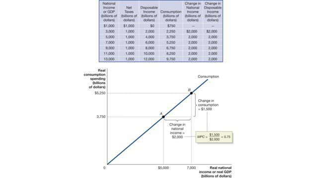
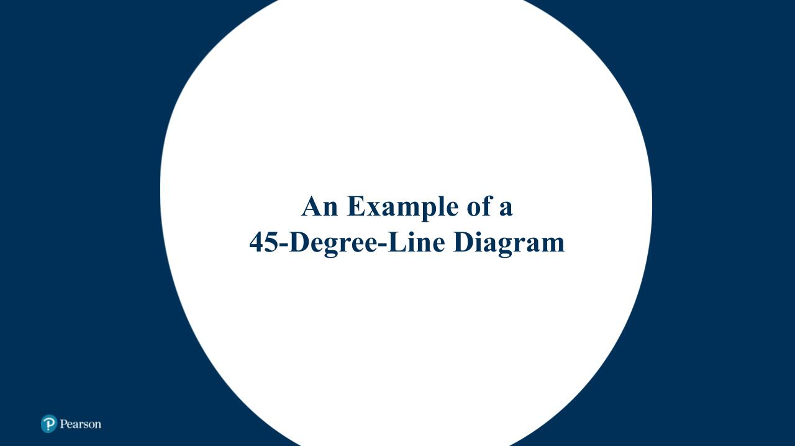
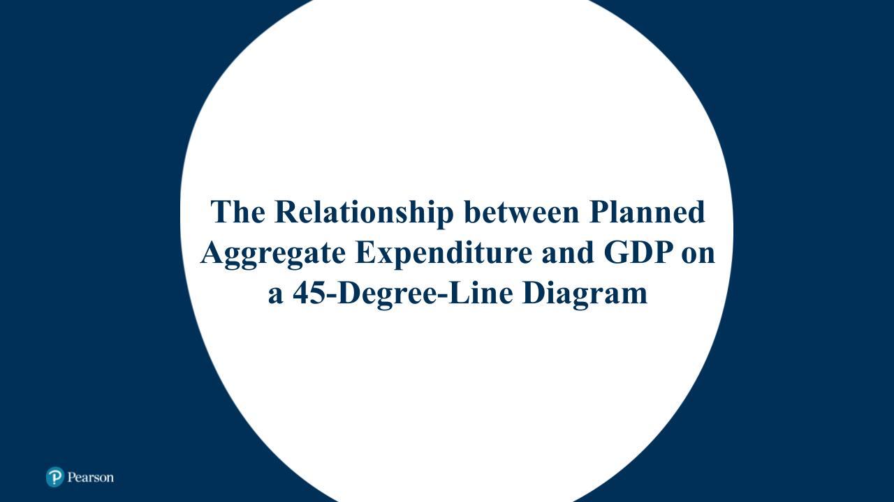
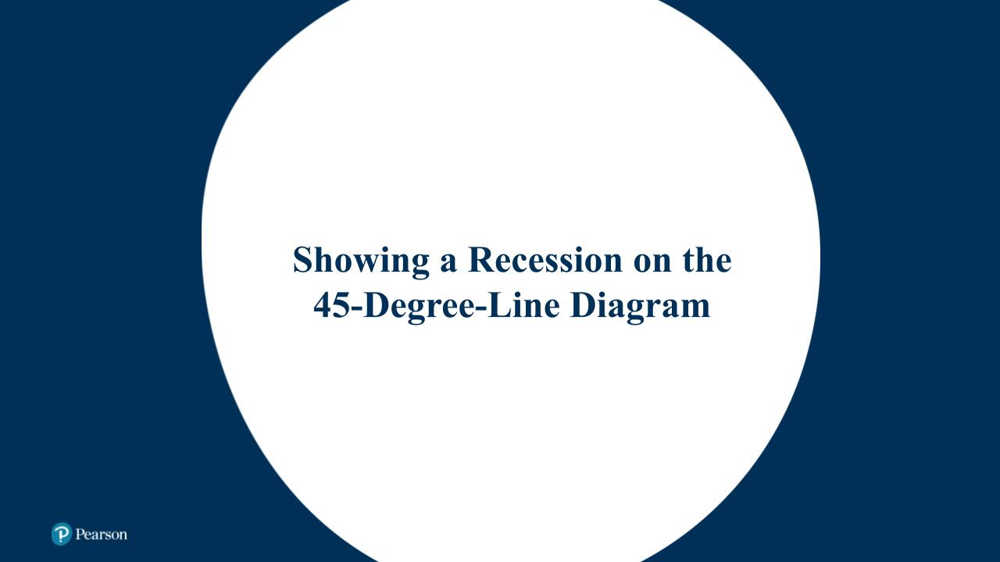

# Chapter 8 Economics  
  
  
# **The Aggregate Expenditure Model**  
**LO 8.1** **Understand how macroeconomic equilibrium is determined in the aggregate expenditure model.**  
The business cycle involves the interaction of many different economic variables. A simple model called the *aggregate expenditure model* can help us understand the relationships among some of these variables. Recall from Chapter 6 that nominal GDP is the current market value of all final goods and services produced in a country in a year. Real GDP corrects nominal GDP for the effects of inflation. The **++[aggregate expenditure model](https://plus.pearson.com/epub/bronte/BRNT-SITHABGCXI/v12/OPS/xhtml/glossary.xhtml#key-954ae6c2-2b99-5a04-b419-56bae3e260d8)++** focuses on the short-run relationship between total spending and real GDP. A central assumption of this model is that the price level doesn’t change. This means we don’t have to worry about a difference between real GDP and nominal GDP. In Chapter 9, we will develop a more complete model of the business cycle that relaxes the assumption of constant prices.  
The key idea of the aggregate expenditure model is that *in any particular year, the level of real GDP is determined mainly by the level of aggregate expenditure*. To understand the relationship between aggregate expenditure and real GDP, we need to look more closely at the components of aggregate expenditure.  
## **Aggregate Expenditure**  
Economists first began to study the relationship between changes in aggregate expenditure and changes in GDP during the Great Depression of the 1930s. Canada, the United States, the United Kingdom, and other industrial countries suffered declines in real GDP of 25 percent or more during the early part of the 1930s. In 1936, British economist John Maynard Keynes published one of the most important books in economics, *The General Theory of Employment, Interest, and Money*, that systematically analyzed the relationship between changes in aggregate expenditure and changes in GDP. Keynes identified four components of aggregate expenditure (which we discussed in Chapter 4), that together equal GDP: consumption, investment, government purchases, and net exports. The four components that make up planned aggregate expenditure (*AE*) are very similar:  
* **Consumption (*C*):** This is spending by households on goods and services; it includes everything from food to haircuts to snowmobiles.  
* **Planned Investment **𝐼***
***  
* **:** This is the planned spending by firms on capital goods, such as factories, office buildings, and machines, and by households on new homes.  
* **Government Purchases (*G*):** This is spending by local, provincial, and federal governments on goods and services, such as the armed forces, bridges and roads, and the salaries of RCMP officers.  
* **Net Exports (*NX*):** This is spending by foreign firms and households on goods and services produced in Canada minus the spending by Canadian firms and households on goods and services produced in other countries.  
In this chapter, we use the term *planned aggregate expenditure* for the most part because we are focusing on the desired (rather than the actual) spending of an economy in a given period, which is represented by the following equation:  
  
  
  
  
Or,  
  
  
  
  
Governments around the world gather statistics on aggregate expenditure based on these four components. Economists and business analysts usually explain changes in GDP in terms of changes in these four components of spending.  
  
## **The Difference between Planned Investment and Actual Investment**  
As you likely know, not everything goes as planned. This is true for businesses as well as university students. You likely noticed that we included “planned investment” rather than “investment” in the equation above. How can the amount businesses plan to spend on investment be different from the amount they actually end up spending?  
Understanding how the difference can arise begins with thinking about how firms go about selling goods. In many cases, firms don’t wait for a customer to purchase something before they produce it. Instead they produce it, and hold it in *inventory*, while waiting for a customer to make a purchase. **++[Inventories](https://plus.pearson.com/epub/bronte/BRNT-SITHABGCXI/v12/OPS/xhtml/glossary.xhtml#key-207329c1-5458-54d6-992a-f80a898bda61)++** are simply products that have been produced but not yet sold to the consumer. Changes in inventories are included as part of investment spending, along with spending on machinery, equipment, office buildings, and factories.  
In the case of Tim Hortons, actual investment would include its bakeries and stores as well as any doughnuts or cans of coffee it hadn’t sold yet. For a retailer, all of the products in the store are part of inventory. Businesses need some inventory in order to sell to consumers. A difference between planned and actual investment arises when firms don’t sell the amount of a product they were planning to.  
For example, a Chapters bookstore may want to have 5 copies of *The Wealth of Nations* on its shelves at all times. Assume that it already has 5 copies. If it expects to sell 95 more copies, it would then order 95 copies of the book. If it sells 95 copies, its inventory remains unchanged at 5 copies of the book. If it only sells 90 copies of the book, it has an unplanned increase in inventory of 5 books, leaving it with a total of 10. In short, changes in inventories often depend on sales of goods, which firms can’t usually predict with perfect accuracy.  
For the economy as a whole, we can say that actual investment spending will be greater than planned investment spending when there is an unplanned increase in inventories. Actual investment spending will be less than planned investment spending when there is an unplanned decrease in inventories. *Therefore, actual investment will equal planned investment only when there is no unplanned change in inventories*. In this chapter, we use  
to represent planned investment. We will also assume that the government data on investment spending (not including inventories) compiled by Statistics Canada represent planned spending. This is a simplification because some of the spending on inventories would be planned by firms.  
## **Macroeconomic Equilibrium**  
Macroeconomic equilibrium is similar to microeconomic equilibrium. In a microeconomic equilibrium, such as in the market for apples, neither buyers nor sellers have any incentive to change their plans. Equilibrium in the market for apples occurs when the quantity of apples demanded is equal to the quantity of apples supplied, and thus neither producers nor consumers have an incentive to change their behaviour. This means apple producers are selling the amount they planned to. When equilibrium in the apple market is achieved, the quantity of apples produced and sold will not change unless the demand for apples or the supply of apples changes. For the economy as a whole, macroeconomic equilibrium occurs where total spending, or planned aggregate expenditure, equals total production, or GDP:++^[1](https://plus.pearson.com/epub/bronte/BRNT-SITHABGCXI/v12/OPS/xhtml/ff2ae8b0-7c30-11ed-8180-bc5d25f2e362.xhtml#173c3672-e455-46f1-b17e-b904f27f9ee2)^++  
  
  
  
  
As we saw in Chapter 7, in the long run, real GDP in Canada grows, and the standard of living rises over time. In this chapter, we are interested in understanding why GDP fluctuates in the short run. To simplify the analysis of macroeconomic equilibrium, we assume that the economy is not growing. In Chapter 9, we discuss the more realistic case of macroeconomic equilibrium in a growing (or shrinking) economy. If we assume that the economy is not growing, equilibrium GDP will not change unless planned aggregate expenditure changes.  
  
## **Getting to Macroeconomic Equilibrium**  
In Chapter 3, where we discussed equilibrium in the market for a single good, we assumed that price would adjust so that the quantity demanded would equal the quantity supplied. In the macroeconomic equilibrium model, we assume that the price level is constant, so price adjustments can’t cause the market to move to equilibrium. Instead, firms’ responses to unplanned inventory investment will lead to equilibrium.  
The easiest way to show that the economy will move toward an output level that is equal to planned aggregate expenditure is to consider what would happen if the two were not equal. As an example, let’s look at how a manager at a Chapters store might respond to different levels of sales of *The Wealth of Nations*.  
If planned aggregate expenditure is greater than GDP, firms have sold more than they expected to sell. For our Chapters example, the store may have planned to sell 95 copies of *The Wealth of Nations* but actually sold 100. It has seen a reduction in its inventories of 5 books. As a result, Chapters has an unplanned investment in inventories of  
(meaning that inventories have fallen by 5—the minus sign tells you that inventories have decreased). How would the manager respond to such a change in inventories? The manager would likely order more copies of *The Wealth of Nations* this time, say 100 copies. If stores and producers in the economy are experiencing similar unplanned drops in inventories, everyone will increase their orders, and the output of the economy (GDP) will increase. To increase production, firms have to hire more workers, and employment rises. In summary, *when planned aggregate expenditure is greater than GDP, inventories will decline, and (as a result of firms’ reactions to the drop in inventories) GDP and total employment will increase.*  
If planned aggregate expenditure is less than GDP, firms have not sold as much as they expected to sell. For our Chapters example, the store may have planned to sell 95 copies of *The Wealth of Nations* but instead only sold 90. It has seen an unplanned increase in its inventories of 5 books (it now has 10 in stock when it wanted only 5). How would the manager respond to such an unplanned increase in inventories? The manager would likely order fewer copies of *The Wealth of Nations* say 85 copies, in hopes of selling all of the copies ordered this time. If many other stores and producers throughout the economy have experienced similar unplanned increases in inventories, they too will decrease their orders. In response to the decrease in orders, firms will cut back production and GDP will decrease. To decrease production, firms generally have to lay off workers, leading to lower employment. Managers of small-town Tim Hortons may have to take such actions when major employers in the area close. In summary, *when planned aggregate expenditure is less than GDP, inventories will increase, and (as a result of firms’ reactions to the increase in inventories) GDP and total employment will decrease.*  
Only when planned aggregate expenditure is equal to GDP will firms sell what they expected to sell. In that case, their unplanned inventory investments are zero, and they won’t have an incentive to increase or decrease their production. The economy will be in macroeconomic equilibrium. ++[Table 8.1](https://plus.pearson.com/epub/bronte/BRNT-SITHABGCXI/v12/OPS/xhtml/fe722000-7c30-11ed-8eab-870b4cc99949.xhtml#406a5cf9cec56f6a3ccb52159a6cbe0b)++ summarizes the relationship between planned aggregate expenditure and GDP.  
**Table 8.1 The Relationship between Planned Aggregate Expenditure and GDP**  

| If . . . | then . . . | and . . . |
| -------------------------------------------------- | ------------------------ | -------------------------------------------- |
| planned aggregate expenditure equals GDP, | inventories don’t change | the economy is in macroeconomic equilibrium. |
| planned aggregate expenditure is less than GDP, | inventories rise | GDP and employment decrease. |
| planned aggregate expenditure is greater than GDP, | inventories fall | GDP and employment increase. |
  
This process of increasing and decreasing planned aggregate expenditure causes the year-to-year changes we see in GDP. Economists devote a lot of time and energy to forecasting what will happen to each component of planned aggregate expenditure. Those who are really good at it can make a lot of money working for business or government. When economists forecast that planned aggregate expenditure will decline in the future, that is equivalent to forecasting that GDP will decline and that the economy will enter a recession. Individuals and firms closely watch these forecasts because changes in GDP can have dramatic consequences. When GDP increases, wages, profits, and job opportunities also tend to increase. When GDP declines, it can be bad news for a lot of workers, firms, and job seekers.  
When economists forecast that planned aggregate expenditure is likely to decline and the economy is headed for a recession, the federal and provincial governments may implement *macroeconomic policies* in an attempt to head off the decrease in expenditure and keep the economy from falling into recession. We discuss macroeconomic policies in Chapters 11 and 12.  
  
___  
  
  
# **Determining the Level of Aggregate Expenditure in the Economy**  
**LO 8.2** **Discuss the determinants of the four components of aggregate expenditure and define marginal propensity to consume and marginal propensity to save.**  
To better understand how macroeconomic equilibrium is determined in the aggregate expenditure model, we look more closely at the components of planned aggregate expenditure. ++[Table 8.2](https://plus.pearson.com/epub/bronte/BRNT-SITHABGCXI/v12/OPS/xhtml/fe7c3220-7c30-11ed-85b6-b7d3d7cc2445.xhtml)++ lists the four components of aggregate expenditure for 2021. Each component is measured in *real* terms, meaning that it is corrected for inflation by being measured in millions of 2012 dollars. Consumption is clearly the largest component of aggregate expenditure. Government purchases, including some items considered government investment, is the second-largest component, followed closely by planned investment (not including inventories). Net exports are negative because in 2021, unlike most years before the mid-2000s, Canada imported more goods and services than it exported. Next we consider the variables that determine each of the four components of aggregate expenditure.  
**Table 8.2**  
**Components of Aggregate Expenditure, 2021**  

| Expenditure Category | Real Expenditure (millions of 2012 dollars) |
| -------------------- | ------------------------------------------- |
| Consumption          | 1 227 356                                   |
| Investment           | 378 117                                     |
| Government Spending  | 530 077                                     |
| Net Exports          |                                             |
  

|   |
| - |
  
SOURCE: Statistics Canada, “Gross Domestic Product, Expenditure-Based, Canada, Quarterly (×1‍000‍000), Table 36-10-0104-01.  
  
## **Consumption**  
++[Figure 8.1](https://plus.pearson.com/epub/bronte/BRNT-SITHABGCXI/v12/OPS/xhtml/fe7c3220-7c30-11ed-85b6-b7d3d7cc2445.xhtml#ee9f79e1cddb8240f2df15774c853d66)++ shows real consumption from 1981 to 2021. Notice that consumption generally follows a smooth, upward trend. Only during periods of recession does consumption decline. You can see this as drops in consumption between 1981 and 1982, as well as between 1991 and 1992, and a plateau between 2008 and 2009 before shrinking between 2009 and 2010. Consumption drops dramatically in 2020 as the COVID-19 pandemic and the associated public health measures took hold. The Canadian economy was in or recovering from a recession during these periods.  
  
The following are the five most important variables that determine the level of consumption:  
* Current disposable income  
* Household wealth  
* Expected future income  
* The price level  
* The interest rate  
We will discuss how changes in each of these variables affect consumption in turn.  
## **Current Disposable Income**  
The most important determinant of consumption is the current disposable income of households. Recall from Chapter 4 that disposable income is the income remaining to households after they have paid the personal income tax and received government *transfer payments*, such as social security payments. For most households, the higher their disposable income the more they spend, and the lower their disposable income the less they spend. Macroeconomic consumption is the total of all consumption by Canadian households. So, we would expect consumption to increase when the current disposable income of households increases and to decrease when current disposable income decreases. As was discussed in Chapter 4, total income in Canada increases in most years. Only during recessions, which have not occurred that often in the last 30 years, does total income decline. The main reason why consumption in ++[Figure 8.1](https://plus.pearson.com/epub/bronte/BRNT-SITHABGCXI/v12/OPS/xhtml/fe7c3220-7c30-11ed-85b6-b7d3d7cc2445.xhtml#ee9f79e1cddb8240f2df15774c853d66)++ shows such a strong upward trend is that incomes have been rising over the same period of time.  
## **Household Wealth**  
Consumption depends in part on the wealth of households. A household’s *wealth* is the value of its *assets* minus the value of its *liabilities*. An **++[asset](https://plus.pearson.com/epub/bronte/BRNT-SITHABGCXI/v12/OPS/xhtml/glossary.xhtml#key-05fac943-80a7-5241-b237-80e7aef62b19)++** is anything of value owned by a person or a firm, and a **++[liability](https://plus.pearson.com/epub/bronte/BRNT-SITHABGCXI/v12/OPS/xhtml/glossary.xhtml#key-cf7a5bd0-1910-5114-9203-3e1ed4d18de9)++** is any debt or obligation owed by a person or firm. A household’s assets include its home, stock and bond holdings, bank accounts, and cars. A household’s liabilities include any loans that must be paid back, such as student loans, mortgages, and car loans. A household with $10 million in wealth is likely to spend more than a household with $10 000 in wealth, even if both have the same disposable income. Therefore, when the wealth of households increases, consumption is likely to increase, and when the wealth of households decreases, consumption is likely to decrease.  
The value of stocks held by households is an important indicator of household wealth. When stock prices increase, household wealth increases, and so should consumption. For example, a family whose stock holdings have increased in value from $50 000 to $100 000 may be willing to spend a larger portion of their disposable income because that household will be less concerned with saving for the future. A decline in stock prices is likely to lead to a decline in consumption. Economists who have studied the determinants of consumption have concluded that permanent increases in wealth have a larger impact than temporary increases. A recent estimate of the effect of changes in wealth on consumption spending indicates that for a permanent $1 increase in household wealth, consumption spending increases by $0.04 to $0.05 per year.  
  
## **Expected Future Income**  
Consumption depends in part on expected future income. Most people prefer to keep their consumption fairly stable from year to year, even if their income changes a lot. Some salespeople, for example, earn most of their income from commissions (fixed percentages of the price) on the products they sell. A salesperson might have high income in some years and much lower income in other years. Most people in this situation keep their consumption steady and do not increase it much in good years and do not reduce it much in bad years.  
The same can be said of most students in Canada. Canadian students generally spend much more of their income than people who are not students with the same income. In fact, many students even borrow to improve their consumption possibilities. This may be because students believe their future incomes will be much higher than their current incomes.  
If we looked only at the current income of people in the early stages of their lives, we might have difficulty estimating people’s current consumption. Instead, we need to take people’s expected future income into account.  
## **The Price Level**  
Recall from Chapter 5 that the *price level* is a measure of the average prices of goods and services in the economy. Consumption is affected by changes in the price level. It is tempting to assume that an increase in prices will reduce consumption by making goods and services less affordable. In fact, the effect of an increase in the price of one product on the quantity demanded of that product is different from the effect of an increase in the price level on *total* spending by households on goods and services. Changes in the price level affect consumption through the impact on real household wealth. An increase in price level leads to a reduction in the *real* value of wealth. For example, if you have $2000 in a chequing account, the higher the price level, the fewer goods you can buy with that $2000. If the price level falls, the more you can buy. Therefore, as the price level rises, the *real* value of your wealth falls, and so will your consumption. Conversely, if the price level falls, which almost never happens in Canada, your real wealth and thus your consumption will increase.  
## **The Interest Rate**  
Finally, consumption also depends on the interest rate. When the interest rate is high, the reward for saving is increased, and households are likely to save more and spend less. In Chapter 5, we discussed the difference between the *nominal interest rate* and the *real interest rate*. The **++[nominal interest rate](https://plus.pearson.com/epub/bronte/BRNT-SITHABGCXI/v12/OPS/xhtml/glossary.xhtml#key-1f14aea9-896c-52cc-b2f4-0da5962ae93b)++** is the stated interest rate on a loan or a financial asset such as a bond. The **++[real interest rate](https://plus.pearson.com/epub/bronte/BRNT-SITHABGCXI/v12/OPS/xhtml/glossary.xhtml#key-b060595f-2fe0-5bc5-8da4-f15ce8e9d2d1)++** corrects the nominal interest rate for the impact of inflation and is equal to the nominal interest rate minus the expected or ex-ante inflation rate.++^[2](https://plus.pearson.com/epub/bronte/BRNT-SITHABGCXI/v12/OPS/xhtml/ff2ae8b0-7c30-11ed-8180-bc5d25f2e362.xhtml#9fe5e672-b5d0-4591-8169-f1ea00500c8e)^++ Households are concerned with the payments they will make or receive after the effects of inflation are taken into account. As a result, consumption spending depends on the real interest rate.  
Consumption spending is divided into three categories: spending on *services*, such as education and haircuts; spending on *non-durable goods*, such as food and clothing; and spending on *durable goods*, such as cars and furniture. Spending on durable goods is most likely to be affected by changes in the interest rate because a high real interest rate increases the cost of borrowing to purchase durable goods. The monthly payments on a four-year car loan will be higher if the real interest rate is 4 percent than if the real interest rate is 2 percent. *You can check this out for yourself at *++[www4.bmo.com/popup/loans/Calculator.html](http://www4.bmo.com/popup/loans/Calculator.html)++.  
  
## **Apply the Concept**  
**Do Changes in Consumer Confidence Affect Consumption Spending?**  
  
  
Play  
  
  
**Figure in Apply the Concept: Do Changes in Consumer Confidence Affect Consumption Spending?**  
For more practice, do related ++[Problem 2.8](https://plus.pearson.com/epub/bronte/BRNT-SITHABGCXI/v12/OPS/xhtml/fe7c3220-7c30-11ed-85b6-b7d3d7cc2445.xhtml)++ at the end of this chapter.  
  
## **The Consumption Function**  
Panel (a) in ++[Figure 8.2](https://plus.pearson.com/epub/bronte/BRNT-SITHABGCXI/v12/OPS/xhtml/fe7c3220-7c30-11ed-85b6-b7d3d7cc2445.xhtml#74863ef3985bdaa3bc9a604baf2c2549)++ shows the relationship between consumption spending and disposable income from the years 1981 to 2020, where both consumption and disposable income are measured in billions of 2012 dollars. Each of the dots represents a combination of consumption spending and disposable income for a given year. The straight line in panel (b) shows the estimated relationship between consumption and disposable income. The fact that most of the points lie almost on the line means we can say *consumption is a function of disposable income*. The relationship between consumption and disposable income is called the **++[consumption function](https://plus.pearson.com/epub/bronte/BRNT-SITHABGCXI/v12/OPS/xhtml/glossary.xhtml#key-f0e767c2-b53b-5a88-9b56-c337a46ef8eb)++**.  
  
  
One of the first things you likely noticed is that consumption will never be zero. Even if disposable income is zero, consumption will be positive. This is because people always have to consume something—even if you have no income, you still need a place to live and food to eat. The consumption that takes place even when disposable income is zero is called **++[autonomous consumption](https://plus.pearson.com/epub/bronte/BRNT-SITHABGCXI/v12/OPS/xhtml/glossary.xhtml#key-79054a79-bfa9-546a-aa31-8d20d4590695)++**. It’s called autonomous because it occurs automatically or isn’t linked to income at all. Graphically, you can think of autonomous consumption as the intercept of the consumption function.  
How is autonomous consumption paid for? It’s typically paid for out of past savings. The easiest way to think about this is to think about someone who is out of work or retired. They may not be earning any income right now, but they usually have savings that they can spend to meet their basic needs.  
The slope of the consumption function is particularly important. It is called the **++[marginal propensity to consume](https://plus.pearson.com/epub/bronte/BRNT-SITHABGCXI/v12/OPS/xhtml/glossary.xhtml#key-9d665165-ee73-5b5c-8961-3c8d0af5794c)++** (*MPC*). It is calculated as the change in consumption divided by the change in disposable income. Using the Greek letter delta, Δ, to represent “change in,” *C* to represent consumption, and Y*D* to represent disposable income, we can write the formula for *MPC* as follows:  
  
  
  
  
  
For example, between 2016 and 2017, consumption spending increased by $39.7 billion, while disposable income increased by $51.9 billion. The marginal propensity to consume was, therefore  
  
  
  
  
The value for the *MPC* tells us the part of an extra dollar of disposable income that households spend. Between 2016 and 2017, households spent $0.764 out of every additional dollar of disposable income. As the relationship is very close to a straight line, we can apply the *MPC* to determine how consumption will change as disposable income changes. For example, if disposable income were to increase by $10 000, consumption spending would increase by  
, or $7640. This can be expressed by the formula  
  
  
  
  
You likely noticed a single combination of real consumption expenditure and disposable income doesn’t fit with the others. This represents household disposable income and consumption expenditure during the COVID-19 pandemic in 2020. During this period, the federal government dramatically increased transfers to households, but consumption spending opportunities were limited as many retail and service businesses were closed due to public health measures. The result was high disposable income (overall) but relatively low consumption spending. It is important to remember that things other than disposable income can have a large impact on consumption spending.  
## **The Relationship between Consumption and National Income**  
We have seen that consumption spending by households depends on disposable income. We now shift our attention slightly to the similar relationship that exists between consumption spending and GDP. We make this shift because we are interested in using the aggregate expenditure model to explain changes in real GDP rather than changes in disposable income. The first step in examining the relationship between consumption and GDP is to recall from Chapter 4 that the differences between GDP and national income are small and can be ignored without affecting our analysis. In fact, in this and the following chapters, we will use the terms *GDP* and *national income* interchangeably. Also recall that disposable income is equal to national income plus government transfer payments minus taxes. Taxes minus government transfer payments are referred to as *net taxes*. So, we can write the following:  
  
  
  
  
We can rearrange the equation like this:  
  
  
  
  
The table in ++[Figure 8.3](https://plus.pearson.com/epub/bronte/BRNT-SITHABGCXI/v12/OPS/xhtml/fe7c3220-7c30-11ed-85b6-b7d3d7cc2445.xhtml#246593d14681fee13b68d38ea77e5ba2)++ shows hypothetical values for national income (GDP), net taxes, disposable income, and consumption spending. Notice that national income and disposable income differ by a constant amount, which is equal to net taxes of $1000 billion. In reality, net taxes are not a constant amount because they are affected by changes in income. As income rises, net taxes rise because some taxes, such as personal income tax, increase and some government transfer payments, such as employment insurance payments, fall. None of the results presented in this section is dramatically affected by this simplifying assumption.  
  
**Figure 8.3 The Relationship between Consumption and National Income**  
  
Because national income differs from disposable income only by net taxes—which, for simplicity, we assume are constant—we can graph the consumption function using national income rather than disposable income. We can also calculate the *MPC*, which is the slope of the consumption function, using either the change in national income or the change in disposable income and always get the same value. The slope of the consumption function between point *A* and point *B* is equal to the change in consumption—$1500 billion—divided by the change in national income—$2000 billion—or 0.75.  
  
*   
*   
*   
*   
*   
*   
*   
  
**Animation: Figure 8.3 The Relationship between Consumption and National Income**  
  
  
Play  
  
The graph in ++[Figure 8.3](https://plus.pearson.com/epub/bronte/BRNT-SITHABGCXI/v12/OPS/xhtml/fe7c3220-7c30-11ed-85b6-b7d3d7cc2445.xhtml#246593d14681fee13b68d38ea77e5ba2)++ shows a line similar to the consumption function shown in ++[Figure 8.2](https://plus.pearson.com/epub/bronte/BRNT-SITHABGCXI/v12/OPS/xhtml/fe7c3220-7c30-11ed-85b6-b7d3d7cc2445.xhtml#74863ef3985bdaa3bc9a604baf2c2549)++. We defined the marginal propensity to consume (*MPC*) as the change in consumption divided by the change in disposable income, which is the slope of the consumption function. In fact, notice that if we calculate the slope of the line in ++[Figure 8.3](https://plus.pearson.com/epub/bronte/BRNT-SITHABGCXI/v12/OPS/xhtml/fe7c3220-7c30-11ed-85b6-b7d3d7cc2445.xhtml#246593d14681fee13b68d38ea77e5ba2)++ between points *A* and *B*, we get a result that will not change whether we use the values for national income or the values for disposable income. Using the values for national income  
  
  
  
  
Using the corresponding values for disposable income from the table  
  
  
  
  
  
It should not be surprising that we get the same result in either case. National income (real GDP) and disposable income differ by a constant amount, so changes in the two numbers always give the same value, as shown in the last columns of the table in ++[Figure 8.3](https://plus.pearson.com/epub/bronte/BRNT-SITHABGCXI/v12/OPS/xhtml/fe7c3220-7c30-11ed-85b6-b7d3d7cc2445.xhtml#246593d14681fee13b68d38ea77e5ba2)++. Therefore we can graph the consumption function using national income rather than using disposable income. We can also calculate the *MPC* using either the change in real GDP or the change in disposable income and always get the same value.  
## **Income, Consumption, and Saving**  
To complete our discussion of consumption, we can look briefly at the relationships among income, consumption, and saving. Households either spend their income, save it, or use it to pay taxes. For the economy as a whole, we can write the following:  
  
  
  
  
When national income increases, there must be some combination of an increase in consumption, an increase in saving, and an increase in taxes:  
  
  
  
  
Using symbols, where *Y* represents national income (GDP), *C* represents consumption, *S* represents saving, and *T* represents taxes, we can write the following:  
  
  
  
  
And,  
  
  
  
  
To simplify, we can assume that taxes are always a constant amount, in which case  
, so the following is also true:  
  
  
  
  
We have already seen that the marginal propensity to consume equals the change in consumption divided by the change in income. We can define the **++[marginal propensity to save](https://plus.pearson.com/epub/bronte/BRNT-SITHABGCXI/v12/OPS/xhtml/glossary.xhtml#key-fb517031-7e9e-5a95-9e88-ebea301af7a0)++** (*MPS*) as the amount by which saving increases when disposable income increases. We can measure the *MPS* as the change in saving divided by the change in disposable income. In calculating the *MPS*, as in calculating *MPC*, we can safely ignore the difference between national income and disposable income.  
If we divide the last equation above by the change in income,  
, we get an equation that shows the relationship between the marginal propensity to consume and the marginal propensity to save:  
  
  
  
  
Or,  
  
  
  
  
This equation tells us that when taxes are constant, the marginal propensity to consume plus the marginal propensity to save must always equal 1. Think of *MPC* and *MPS* as what people do with an additional dollar of income. If you get an extra dollar of income, and you spend $0.75, what did you do with the remaining $0.25? You must have saved it!  
  
## **Solved Problem 8.1**  
## **CALCULATING THE MARGINAL PROPENSITY TO CONSUME AND THE MARGINAL PROPENSITY TO SAVE**  
Fill in the blanks in the following table. For simplicity, assume that taxes are zero. Show that *MPC* plus *MPS* equals 1.  

| Real GDP (Y) | Consumption (C) | Saving (S) | Marginal Propensity to Consume (MPC) | Marginal Propensity to Save (MPS) |
| ------------ | --------------- | ---------- | ------------------------------------ | --------------------------------- |
| $900 | $800 |  | — | — |
| 1000 | 860 |  |  |  |
| 1100 | 920 |  |  |  |
| 1200 | 980 |  |  |  |
| 1300 | 1040 |  |  |  |
  
****Solving the Problem****  
* **Step 1: Review the chapter material.** This problem is about the relationships among income, consumption, and saving, so you may want to review the section “Income, Consumption, and Saving.”  
* **Step 2: Fill in the table.** We know that   
. With taxes equal to zero, this equation becomes  
* . We can use this equation to fill in the “Saving” column. We can use the equation for *MPC* and *MPS* to fill in the other two columns.  
  
  
  
  
* For example, to calculate the value of *MPC* in the second row of the table, we have  
  
  
  
  
* To calculate the value of *MPS* in the second row of the table, we have  
  
  
  
  

| Real GDP (Y) | Consumption (C) | Saving (S) | Marginal Propensity to Consume (MPC) | Marginal Propensity to Save (MPS) |
| ------------ | --------------- | ---------- | ------------------------------------ | --------------------------------- |
| $900 | $800 | $100 | — | — |
| 1000 | 860 | 140 | 0.6 | 0.4 |
| 1100 | 920 | 180 | 0.6 | 0.4 |
| 1200 | 980 | 220 | 0.6 | 0.4 |
| 1300 | 1040 | 260 | 0.6 | 0.4 |
  
**	•	Step 3: Show that *MPC* plus *MPS* equals 1.** At every level of national income, the *MPC* is 0.6 and *MPS* is 0.4. Therefore, the *MPC* plus *MPS* is always equal to 1.  
For more practice, do related ++[Problem 2.9](https://plus.pearson.com/epub/bronte/BRNT-SITHABGCXI/v12/OPS/xhtml/fe7c3220-7c30-11ed-85b6-b7d3d7cc2445.xhtml)++ at the end of this chapter.  
  
## **Planned Investment**  
++[Figure 8.4](https://plus.pearson.com/epub/bronte/BRNT-SITHABGCXI/v12/OPS/xhtml/fe7c3220-7c30-11ed-85b6-b7d3d7cc2445.xhtml)++ shows movements in real private-sector investment spending from 1981 to 2021. Notice that while investment generally does have an upward trend, it is not as smooth as consumption. Investment declined significantly in 1982, from 1991 to 1994, and in 2009. As you might have guessed, the Canadian economy was in or recovering from a recession during these periods. Investment spending fell dramatically beginning in 2015, despite Canada not experiencing the two consecutive quarters of negative GDP growth commonly associated with a recession. Total investment spending has not returned to the peak of 2014, even as of 2021.  
  
The four most important variables that determine the level of investment are as follows:  
* Expectations of future profits  
* Interest rate  
* Taxes  
* Cash flow  
## **Expectations of Future Profits**  
Investment goods, such as factories, office buildings, and machinery, are long-lived. A firm is unlikely to build a new factory unless it believes demand for its product will remain strong for at least several years. When the economy moves into a recession, many firms delay buying investment goods, even if the demand for their own product is strong, because they fear the recession may become worse. During an expansion, some firms may become optimistic and begin to increase spending on investment goods even before the demand for their own product has increased. The key point is this: *The optimism or pessimism of firms is an important determinant of investment spending*.  
Residential construction (the building of houses) is included in investment spending. Since 1990, residential construction in Canada has averaged about 32.5 percent of total investment spending. The swings in residential construction can be substantial, ranging from a high of 54 percent to a low of 32 percent of total investment spending. The decline in spending on residential construction in 2008 contributed to the recession, and the increase in spending contributed to the recovery.++^[3](https://plus.pearson.com/epub/bronte/BRNT-SITHABGCXI/v12/OPS/xhtml/ff2ae8b0-7c30-11ed-8180-bc5d25f2e362.xhtml#b3a06f87-af48-4265-bffc-aa2536bd65f7)^++  
The year 2015 marked a change in the path of investment spending in Canada. Investment peaked at the end of 2014 at $400 billion but fell dramatically the next year, in part as investment in oil production fell in response to falling oil prices. Investment continued to decline until mid-2016, after which it returned to growth. This growth was interrupted by a drop in 2020, as firms dealt with the implications of the COVID-19 pandemic.  
  
## **Interest Rate**  
Some business investment is financed by borrowing, which takes the form of issuing corporate bonds or receiving loans from banks. Households also borrow to finance most of their spending on new homes. The higher the interest rate, the more expensive it is for firms and households to borrow. Firms and households are interested in the cost of borrowing after taking inflation into account, meaning it is the real interest rate that influences investment spending. The higher the real interest rate, the more interest has to be repaid, which means borrowing is more expensive. Therefore, holding everything else that affects investment constant, there is an inverse relationship between investment spending and the real interest rate. *A higher real interest rate results in less investment spending, while a lower real interest rate results in more investment spending.* As we will discuss in Chapter 12, the ability of households to borrow money at very low real interest rates helps explain the rapid increase in American spending on residential construction from 2002 to 2006.++^[4](https://plus.pearson.com/epub/bronte/BRNT-SITHABGCXI/v12/OPS/xhtml/ff2ae8b0-7c30-11ed-8180-bc5d25f2e362.xhtml#68fa3c27-83f2-4d3b-9899-55e69c0e8036)^++  
## **Taxes**  
Taxes affect the level of investment spending. Firms focus on the profits that remain after they have paid taxes. Federal and provincial governments impose a *corporate income tax* on the profits of firms. This tax will have an impact on the benefit firms receive, or get to keep, from any investment they make. A reduction in corporate income tax increases the after-tax profitability (the amount of money the firm gets to keep) of investment spending. An increase in the corporate income tax rate decreases the after-tax profitability of investment spending. An *investment tax incentive* provides firms with a tax reduction when they spend on new investment goods, which can increase investment spending.  
## **Cash Flow**  
Many firms do not borrow to finance spending on new factories, machinery, and other investments. Instead, they use their own funds. **++[Cash flow](https://plus.pearson.com/epub/bronte/BRNT-SITHABGCXI/v12/OPS/xhtml/glossary.xhtml#key-1bf09d31-58f1-5c21-bc2f-4538590559a2)++** is the difference between the cash revenues received by a firm and the cash spending by the firm. Neither non-cash receipts nor non-cash spending is included in cash flow. For example, tax laws allow firms to count depreciation to replace worn-out or obsolete machinery as a cost, even when new machinery that has not been purchased would represent non-cash spending. The depreciation of existing equipment does not count toward cash flow. The largest contributor to cash flow is profit. The more profitable a firm is, the greater its cash flow and the greater its ability to finance investment. During periods of recession, many firms experience reduced profits, which in turn reduces their ability to finance spending on new factories or machines.  
  
## **Apply the Concept**  
**Housing Prices Are Just Too High!**  
**Figure in Apply the Concept: Apply the Concept: Housing Prices Are Just Too High!**  
For more practice, do related ++[Problem 2.10](https://plus.pearson.com/epub/bronte/BRNT-SITHABGCXI/v12/OPS/xhtml/fe7c3220-7c30-11ed-85b6-b7d3d7cc2445.xhtml)++ at the end of this chapter.  
## **Government Purchases**  
Total government purchases includes all the money spent by federal, provincial, and local governments for goods and services. We include government spending on things that might be classed as investment by government, such as construction of new buildings or roads, as government spending decisions are not made in the same way that private business investment decisions are. Recall from Chapter 4 that government purchases do not include transfer payments, such as welfare payments or pension payments to retired civil servants, because the government does not receive a good or service in return for these payments.  
  
++[Figure 8.5](https://plus.pearson.com/epub/bronte/BRNT-SITHABGCXI/v12/OPS/xhtml/fe7c3220-7c30-11ed-85b6-b7d3d7cc2445.xhtml#97927b46beb91b8d6cdd74e2d061402f)++ shows levels of real government spending from 1981 to 2021. Government purchases grew for most of this period with two notable exceptions. From 1993 to 1997, the federal Liberal government under Jean Chrétien undertook a series of spending cuts to reduce Canada’s federal budget deficit. As a result of these cuts, the federal government started to take in more taxes than it spent, and the country’s debt started to fall. In 2009, the Conservative government of Stephen Harper greatly increased federal government spending to stimulate the economy in the aftermath of the global recession. From 2011 to 2015, the Conservative government held spending relatively constant or cut it, in an effort to return the federal government budget to balance. After the election of the Justin Trudeau Liberal government in 2015, the approach of the federal government changed to become less concerned with running a balanced budget. It is important to remember that the definition of government spending used here does not include transfers, only government purchases of final goods and services and government investment. Accordingly, the large budget deficits of 2020 to 2022 are not entirely reflected in the government spending data.  
  
Government purchases have grown steadily in real terms from 1981 until 2021 with two exceptions. In the mid-1990s, concern about the federal budget deficit caused real government purchases to fall from 1992 to 1997. Real government purchases also fell briefly during 2020 as government operations closed and the federal government focused its activities on transfers to support those who lost work due to the public health measures intended to slow the spread of COVID-19.  
**SOURCE:** Statistics Canada, “Gross Domestic Product, Expenditure-Based, Canada, Quarterly,  
,” Table 36-10-0104-01.  
## **Net Exports**  
Net exports equal exports minus imports. We can calculate net exports by taking the value of spending by foreign firms and households on goods and services produced in Canada and *subtracting* the value of spending by Canadian firms and households on goods and services produced in other countries. ++[Figure 8.6](https://plus.pearson.com/epub/bronte/BRNT-SITHABGCXI/v12/OPS/xhtml/fe7c3220-7c30-11ed-85b6-b7d3d7cc2445.xhtml#2029678d36e04ab68ee62189bfa61ab9)++ illustrates movements in real net exports from 1981 through 2021.  
  
  
For most of this period, net exports were positive. This means foreign firms and households bought more from Canada than Canadian firms and households bought from them. For Canada, a fall in net exports is often associated with a recession *in the United States!* This is because the United States is Canada’s biggest trading partner, with between 70 and 80 percent of our exports going to American firms and households. When the United States enters a recession, the demand for Canadian products and services decreases. This lower demand makes it hard for Canadian firms to sell products in the United States, causing our exports to fall. Canadian imports don’t follow the same decreasing pattern as exports do when the United States is in recession, so a drop in net exports is the result. We will explore the behaviour of net exports further in Chapter 14.  
The following are the three most important variables that determine the level of net exports:  
* The price level in Canada relative to the price levels in other countries  
* The growth rate of GDP in Canada relative to growth rates in other countries  
* The exchange rate between the Canadian dollar and other currencies  
## **The Price Level in Canada Relative to the Price Level in Other Countries**  
If inflation in Canada is lower than inflation in other countries, prices of Canadian products increase more slowly than the prices of products in other countries. This slower increase in the Canadian price level increases the demand for Canadian products. The relative rise in prices of foreign-made products makes Canadian demand for foreign products fall. So, Canadian exports increase and Canadian imports decrease, which increases net exports. The reverse happens during periods when the inflation rate in Canada is higher than the inflation rates in other countries: Canadian exports decrease and Canadian imports increase, which decreases net exports.  
  
## **The Growth Rate of GDP in Canada Relative to Growth Rates in Other Countries**  
As GDP rises in Canada, the incomes of households rise, leading them to increase their purchases of all goods and services, including goods and services produced in other countries. As a result, imports rise. When incomes in other countries rise, their households will increase their purchases of goods and services, including some goods and services made in Canada. As a result, Canadian exports (which are other countries’ imports) rise. When incomes in Canada rise faster than in other countries, Canadian imports rise more than exports. As a result, Canada’s net exports fall.  
## **The Exchange Rate between the Canadian Dollar and Other Currencies**  
As the value of the Canadian dollar rises, the foreign currency price of Canadian products sold in other countries rises, and the dollar price of foreign products sold in Canada falls. For example, suppose the exchange rate between the Japanese yen and the Canadian dollar is 100 Japanese yen for 1 Canadian dollar, or  
. At this exchange rate, someone in Canada could buy ¥100 for $1, or someone in Japan could buy $1 for . Leaving aside transportation costs, an item that sells for $10 in Canada will sell for ¥1000 in Japan, and a Japanese product that sells for ¥1000 in Japan will sell for $10 in Canada. If the exchange rate changes to  
, the value of the dollar has risen, as it takes more yen to buy $1. Under the new exchange rate, a product that still sells for $10 in Canada will now cost ¥1500 in Japan, reducing the quantity demanded by Japanese consumers. The Japanese product that sells in Japan for ¥1000 will now sell in Canada for $6.67, increasing the quantity demanded by Canadian consumers. An increase in the value of the dollar will reduce exports and increase imports, so net exports will fall. A decrease in the value of the dollar will increase exports and reduce imports, so net exports will rise.  
  
  
  
  
  
  
  
  
  
  
  
  
  
  
  
  
  
  
___  
  
  
# **Graphing Macroeconomic Equilibrium**  
**LO 8.3 Use a**  
**-line diagram to illustrate macroeconomic equilibrium.**  
Having examined the components of aggregate expenditure, we can now look more closely at macroeconomic equilibrium. We saw earlier in the chapter that macroeconomic equilibrium occurs when GDP is equal to aggregate expenditure. We can use a graph called the  
-*line diagram* to illustrate macroeconomic equilibrium. (The -line diagram is also sometimes referred to as the *Keynesian cross* because it is based on the analysis of John Maynard Keynes.) To become familiar with this diagram, consider ++[Figure 8.7](https://plus.pearson.com/epub/bronte/BRNT-SITHABGCXI/v12/OPS/xhtml/ff2ae8b0-7c30-11ed-8180-bc5d25f2e362.xhtml#86745ce4c5f5950ddee568debc2fc003)++, which is a  
-line diagram that shows the relationship between the quantity of cups of coffee sold (on the vertical axis) and the quantity of cups of coffee produced (on the horizontal axis).  
  
**Figure 8.7**  
**An Example of the 45°-Line Diagram**  
  
The 45° line shows all the points that are at equal distances from both axes. Points such as *A* and *B*, at which the quantity produced equals the quantity sold, are on the 45° line. Points such as *C*, at which the quantity sold is greater than the quantity produced, lie above the line. Points such as *D*, at which the quantity sold is less than the quantity produced, lie below the line.  
  
**Animation: Figure 8.7 An Example of the 45-Degree-Line Diagram**  
  
  
Play  
  
The line on the diagram forms an angle of  
with the horizontal axis. The line represents all the points that are at equal distances from both axes. So, points such as *A* and *B*, where the number of cups of coffee sold equals the number of cups of coffee produced, lie on the  
line. Points such as *C*, where the quantity sold is greater than the quantity produced, lie above the line. Points such as *D*, where the quantity sold is less than the quantity produced, lie below the line.  
++[Figure 8.8](https://plus.pearson.com/epub/bronte/BRNT-SITHABGCXI/v12/OPS/xhtml/ff2ae8b0-7c30-11ed-8180-bc5d25f2e362.xhtml#972576e13b1114037e18f04286827e80)++ is similar to ++[Figure 8.7](https://plus.pearson.com/epub/bronte/BRNT-SITHABGCXI/v12/OPS/xhtml/ff2ae8b0-7c30-11ed-8180-bc5d25f2e362.xhtml#86745ce4c5f5950ddee568debc2fc003)++, except that it measures real national income, or real GDP (*Y*),++^[5](https://plus.pearson.com/epub/bronte/BRNT-SITHABGCXI/v12/OPS/xhtml/ff2ae8b0-7c30-11ed-8180-bc5d25f2e362.xhtml#9098482f-149a-49e2-b2da-2f672d1636d8)^++ on the horizontal axis and planned real aggregate expenditure (*AE*) on the vertical axis. Because macroeconomic equilibrium occurs where planned aggregate expenditure equals GDP, *we know that all points of macroeconomic equilibrium must lie along the*  
*line*. For all points above the line, planned aggregate expenditure will be greater than GDP. For all points below the  
line, planned aggregate expenditure will be less than GDP.  
**Figure 8.8**  
**The Relationship between Planned Aggregate Expenditure and GDP in a 45°-Line Diagram**  
  
Every point of macroeconomic equilibrium is on the 45° line, where planned aggregate expenditure equals GDP. At points above the line, planned aggregate expenditure is greater than GDP. At points below the line, planned aggregate expenditure is less than GDP.  
  
**"Animation: Figure 8.8 The Relationship between Planned Aggregate Expenditure and GDP in
a 45-Degree-Line Diagram"**  
  
  
Play  
  
  
The  
line shows many potential points of macroeconomic equilibrium. During any particular year, only one of these points will represent the actual level of equilibrium real GDP, given the actual level of planned real expenditure. To determine this point, we need to draw a line on the graph to show the *aggregate expenditure function.* The aggregate expenditure function shows us the amount of planned aggregate expenditure that will occur at every level of national income, or GDP.  
Changes in GDP have a much greater impact on consumption than on planned investment, government purchases, or net exports. We assume for simplicity that the variables that determine planned investment, government purchases, and net exports all remain constant, as do the variables other than GDP that affect consumption. For example, we assume that a firm’s level of planned investment at the beginning of the year will not change during the year, even if the level of GDP changes.  
++[Figure 8.9](https://plus.pearson.com/epub/bronte/BRNT-SITHABGCXI/v12/OPS/xhtml/ff2ae8b0-7c30-11ed-8180-bc5d25f2e362.xhtml#f9ec599e18169f51ca90bd3a2fad7afa)++ shows the aggregate expenditure function on the  
-line diagram. The lowest upward-sloping line (the dark blue one), *C*, represents the consumption function, as shown in ++[Figure 8.2](https://plus.pearson.com/epub/bronte/BRNT-SITHABGCXI/v12/OPS/xhtml/fe7c3220-7c30-11ed-85b6-b7d3d7cc2445.xhtml#74863ef3985bdaa3bc9a604baf2c2549)++. The quantities of planned investment, government purchases, and net exports are constant because we assume the variables they depend on are constant. So, the level of planned aggregate expenditure at any level of GDP is the amount of consumption spending at that level of GDP plus the sum of the constant amounts of planned investment, government purchases, and net exports. In ++[Figure 8.9](https://plus.pearson.com/epub/bronte/BRNT-SITHABGCXI/v12/OPS/xhtml/ff2ae8b0-7c30-11ed-8180-bc5d25f2e362.xhtml#f9ec599e18169f51ca90bd3a2fad7afa)++, we add each component of spending successively to the consumption function line to arrive at the line representing planned aggregate expenditure (*AE*). The line (the red one) is higher than the *C* line by the constant amount of planned investment. The line (the light blue one) is higher than the line by the constant amount of government purchases. The line (the pink one) is higher than the line by the constant amount of net exports. (In some years, such as 2010, *NX* is negative and the will be *lower* than the line.) The line shows all four components of expenditure and is the aggregate expenditure (*AE*) function. At the point where the *AE* line crosses the  
line, planned aggregate expenditure is equal to GDP, and the economy is in macroeconomic equilibrium.  
**Figure 8.9**  
**Macroeconomic Equilibrium on the 45°-Line Diagram**  
  
Macroeconomic equilibrium occurs where the *AE* line crosses the 45° line. The lowest upward-sloping line, *C*, represents the consumption function. The quantities of planned investment, government purchases, and net exports are constant because we assume that the variables they depend on are constant. So, the total of planned aggregate expenditure at any level of GDP is the amount of consumption at that level of GDP plus the sum of the constant amounts of planned investment, government purchases, and net exports. We successively add each component of spending to the consumption function line to arrive at the line representing aggregate expenditure.  
  
*   
*   
*   
*   
*   
**Animation: Figure 8.9 Macroeconomic Equilibrium on the 45-Degree-Line Diagram**  
  
  
Play  
  
  
++[Figure 8.10](https://plus.pearson.com/epub/bronte/BRNT-SITHABGCXI/v12/OPS/xhtml/ff2ae8b0-7c30-11ed-8180-bc5d25f2e362.xhtml#4bf34c4400a39cb2bdd87245876746d6)++ makes the relationship between planned aggregate expenditure and GDP clearer by showing only the  
line and the *AE* line. The figure shows that the *AE* line intersects the line at a level of GDP of $2.2 trillion. Therefore, $2.2 trillion represents the equilibrium level of real GDP. To see why this is true, consider what would happen if real GDP were only $1.6 trillion. By moving vertically from trillion on the horizontal axis up to the *AE* line, we see that planned aggregate expenditure will be greater than $1.6 trillion at this level of real GDP. Whenever total spending is greater than total production, firms’ inventories will fall. The fall in inventories is equal to the vertical distance between the *AE* line, which shows the level of total spending, and the line, which shows the $1.6 trillion in total production. Unplanned declines in inventories lead firms to increase their production.++^[6](https://plus.pearson.com/epub/bronte/BRNT-SITHABGCXI/v12/OPS/xhtml/ff2ae8b0-7c30-11ed-8180-bc5d25f2e362.xhtml#b3c842c9-4ebd-472c-aa39-75b3c7e59c1b)^++ As real GDP increases from $1.6 trillion, so will total income and, therefore, consumption. The economy will move up the *AE* line as consumption increases. The gap between total spending and total production will fall, but so long as the *AE* line is above the  
line, inventories will continue to decline, and firms will continue to expand production. When real GDP rises to $2.2 trillion, inventories stop falling, and the economy will be in macroeconomic equilibrium.  
**Figure 8.10 Macroeconomic Equilibrium**  
  
Macroeconomic equilibrium occurs where the *AE* line crosses the 45° line. In this case, that occurs at GDP of $2.2 trillion. If GDP is less than $2.2 trillion, the corresponding point on the *AE* line is above the 45° line, planned aggregate expenditure is greater than total production, firms will experience an unplanned decrease in inventories, and GDP will increase. If GDP is greater than $2.2 trillion, the corresponding point on the *AE* line is below the 45° line, planned aggregate expenditure is less than total production, firms will experience an unplanned increase in inventories, and GDP will decrease.  
  
*   
*   
**Animation: Figure 8.10 Macroeconomic Equilibrium**  
  
  
Play  
  
  
As ++[Figure 8.10](https://plus.pearson.com/epub/bronte/BRNT-SITHABGCXI/v12/OPS/xhtml/ff2ae8b0-7c30-11ed-8180-bc5d25f2e362.xhtml#4bf34c4400a39cb2bdd87245876746d6)++ shows, if GDP is initially $2.4 trillion, planned aggregate expenditure will be less than GDP, and firms will experience an unplanned increase in inventories. Rising inventories lead firms to decrease production. As GDP falls from $2.4 trillion, consumption will also fall, which causes the economy to move down the *AE* line. The gap between planned aggregate expenditure and GDP will fall, but as long as the *AE* line is below the  
line, inventories will continue to rise and firms will continue to cut production. When GDP falls to $2.2 trillion, inventories will stop rising, and the economy will be in macroeconomic equilibrium.  
## **Showing a Recession on the 45°-Line Diagram**  
Notice that *macroeconomic equilibrium can occur at any point on the*  
*line*. Ideally, we would like equilibrium to occur at *potential real GDP*. At potential real GDP, firms will be operating at the normal level of capacity, and the economy will be at the *natural rate of unemployment*. As we saw in Chapter 5, at the natural rate of unemployment, the economy will be at *full employment*: Everyone in the labour force who wants a job will have a job, except the structurally and frictionally unemployed. However, for equilibrium to occur at the level of potential GDP, planned aggregate expenditure must be high enough. As ++[Figure 8.11](https://plus.pearson.com/epub/bronte/BRNT-SITHABGCXI/v12/OPS/xhtml/ff2ae8b0-7c30-11ed-8180-bc5d25f2e362.xhtml#316da44cb67ce287e3ec92bbc3e6cf80)++ shows, if there is insufficient total spending, equilibrium will occur at a lower level of real GDP. Many firms will be operating below their normal capacity, and the unemployment rate will be above the natural rate of unemployment.  
  
**Figure 8.11**  
**Showing a Recession on the 45°-Line Diagram**  
  
When the *AE* line intersects the 45° line at a level of GDP below potential GDP, the economy is in recession. The figure shows that potential GDP is $2.4 trillion, but because planned aggregate expenditure is too low, the equilibrium level of GDP is only $2.2 trillion, where the *AE* line intersects the 45° line. As a result, some firms will be operating below their normal capacity, and unemployment will be above the natural rate of unemployment. We can measure the shortfall in planned aggregate expenditure as the vertical distance between the *AE* line and the 45° line at the level of potential GDP.  
*   
*   
**Animation: Figure 8.11 Showing a Recession on the 45-Degree-Line Diagram**  
  
  
Play  
  
  
Suppose the level of potential real GDP is $2.4 trillion. As ++[Figure 8.11](https://plus.pearson.com/epub/bronte/BRNT-SITHABGCXI/v12/OPS/xhtml/ff2ae8b0-7c30-11ed-8180-bc5d25f2e362.xhtml#316da44cb67ce287e3ec92bbc3e6cf80)++ shows, when GDP is $2.4 trillion, planned aggregate expenditure is below $2.4 trillion, perhaps because firms have become pessimistic about their future profitability and have reduced their investment spending. For example, when firms are worried about future revenues, they might not update their computers as often. The shortfall in planned aggregate expenditure that leads to the recession can be measured as the vertical distance between the *AE* line and the  
line at the level of potential real GDP. This shortfall is equal to the unplanned increase in inventories that would occur if the economy was initially at a level of GDP of $2.4 trillion. The unplanned increase in inventories measures the amount by which current planned aggregate expenditure is too low for the current level of production to be the equilibrium level. Or, put another way, if any of the four components of aggregate expenditure increased by this amount, the *AE* line would shift upward and intersect the  
line at a GDP of $2.4 trillion, and the economy would be in macroeconomic equilibrium at full employment.  
++[Figure 8.11](https://plus.pearson.com/epub/bronte/BRNT-SITHABGCXI/v12/OPS/xhtml/ff2ae8b0-7c30-11ed-8180-bc5d25f2e362.xhtml#316da44cb67ce287e3ec92bbc3e6cf80)++ shows that macroeconomic equilibrium will occur where GDP is $2.2 trillion. This is almost 10 percent below the potential real GDP of $2.4 trillion. As a result, many firms will be operating below their normal capacity, and the unemployment rate will be well above the natural rate of unemployment. The economy will remain at this level of real GDP until there is an increase in one or more of the components of aggregate expenditure.  
## **The Important Role of Inventories**  
Whenever planned aggregate expenditure is less than real GDP, some firms will experience unplanned increases in inventories. If firms do not cut back their production promptly when spending declines, they will accumulate inventories. If firms accumulate excess inventories, then even if spending quickly returns to normal levels, firms will have to sell their excess inventories before they can return to producing at normal levels.  
## **A Numerical Example of Macroeconomic Equilibrium**  
In forecasting real GDP, economists rely on quantitative models of the economy. We can increase our understanding of the causes of changes in real GDP by considering a simple numerical example of macroeconomic equilibrium. Although simplified, this example captures some of the key features contained in the sort of quantitative models that economic forecasters use. ++[Table 8.3](https://plus.pearson.com/epub/bronte/BRNT-SITHABGCXI/v12/OPS/xhtml/ff2ae8b0-7c30-11ed-8180-bc5d25f2e362.xhtml#01ea8c3bffcee9b9bb2f9d204ed018dd)++ shows several hypothetical combinations of real GDP and planned aggregate expenditure. The first column lists real GDP. The next four columns list levels of the four components of planned aggregate expenditure that occur at the corresponding level of real GDP. We assume that planned investment, government purchases, and net exports do not change as GDP changes. Because consumption depends on GDP, it increases as GDP increases.  
**Table 8.3 Macroeconomic Equilibrium**  

| Real GDP (Y) | Consumption (C) | Planned Investment |
| ------------ | --------------- | ------------------ |
  

|  | Government Purchases (G) | Net Exports (NX) | Planned Aggregate Expenditure (AE) | Unplanned Inventory Investment | Real GDP Will . . . |
| ---- | ------------------------ | ---------------- | ---------------------------------- | ------------------------------ | ------------------- |
| $800 | $740 | $125 | $125 |  |  |
  

|  | $960 |  |
| - | ---- | - |
  

|      | increase |     |     |  |
| ---- | -------- | --- | --- | - |
| 1200 | 1060     | 125 | 125 |  |
  

|  | 1280 |  |
| - | ---- | - |
  

|      | increase |     |     |  |
| ---- | -------- | --- | --- | - |
| 1600 | 1380     | 125 | 125 |  |
  

|      | 1600 | 0   | be in equilibrium |  |
| ---- | ---- | --- | ----------------- | - |
| 2000 | 1700 | 125 | 125               |  |
  

|      | 1920 | 80  | decrease |  |
| ---- | ---- | --- | -------- | - |
| 2400 | 2020 | 125 | 125      |  |
  

|  | 2240 | 160 | decrease |
| - | ---- | --- | -------- |
  
**NOTE:** The values are in billions of 2012 dollars.  
  
In the first row, GDP of $800 billion (or $0.8 trillion) results in consumption of $740 billion. Adding consumption, planned investment, government purchases, and net exports across the row gives planned aggregate expenditure of $960 billion, which is shown in the sixth column. In this row, planned aggregate expenditure is more than GDP, so inventories will fall by $160 billion. This unplanned decline in inventories will lead firms to increase production, and GDP will increase. GDP will continue to increase until it reaches $1600 billion. At that level of GDP, planned aggregate expenditure is also $1600 billion, unplanned changes in inventories are zero, and the economy has reached a macroeconomic equilibrium.  
In the last row of ++[Table 8.3](https://plus.pearson.com/epub/bronte/BRNT-SITHABGCXI/v12/OPS/xhtml/ff2ae8b0-7c30-11ed-8180-bc5d25f2e362.xhtml#01ea8c3bffcee9b9bb2f9d204ed018dd)++, GDP of $2400 billion results in consumption of $2020 billion and planned aggregate expenditure of $2240 billion. Now planned aggregate expenditure is less than GDP, so inventories increase by $160 billion. This unplanned increase in inventories will lead firms to decrease production, and GDP will decrease. GDP will continue to decrease until it reaches $1600 billion, unplanned inventory investment is zero, and the economy is in a macroeconomic equilibrium.  
Only when real GDP equals $1600 billion will the economy be in macroeconomic equilibrium. At other levels of real GDP, planned aggregate expenditure will be higher or lower than GDP, and the economy will be expanding or contracting.  
  
  
  
  
  
  
  
  
  
  
  
___  
  
  
# **The Multiplier Effect**  
**LO 8.4** **Describe the multiplier effect and use the multiplier formula to calculate changes in equilibrium GDP.**  
To this point, we have seen that aggregate expenditure determines real GDP in the short run, and we have seen how the economy adjusts if it is not in equilibrium. We have also seen that whenever aggregate expenditure changes, there will be a new level of equilibrium real GDP. In this section, we will look more closely at the effects of changes in aggregate expenditure on equilibrium real GDP. We begin the discussion with ++[Figure 8.12](https://plus.pearson.com/epub/bronte/BRNT-SITHABGCXI/v12/OPS/xhtml/ff99fe30-7c30-11ed-82c8-ad5f3397635b.xhtml#e8ea8a2182d23a808232d4ff3fece646)++, which illustrates the effects of an increase in planned investment spending. We assume that the economy starts in equilibrium at point *A*, at which real GDP is $2.2 trillion. Remember that there are no unplanned changes in inventories at this level of output under current conditions. Now assume that firms become more optimistic about their future profitability and increase spending on factories, machinery, and equipment by $80 billion. This increase in planned investment shifts the *AE* line up by $80 billion from  
to  
. (Notice the vertical distance between the two *AE* curves is $80 billion.) The new equilibrium occurs at point *B*, at which real GDP is $2.6 trillion, which is also potential real GDP in this story.  
  
**Figure 8.12**  
**The Multiplier Effect**  
  
The economy begins at point A, at which equilibrium real GDP is $2.2 trillion. An $80 billion increase in planned investment shifts up aggregate expenditure from A‍E‍1 to A‍E‍2. The new equilibrium is at point B, where real GDP is $2.6 trillion, which is potential real GDP. Because of the multiplier effect, an $80 billion increase in investment results in a $400 billion increase in equilibrium real GDP.  
*   
*   
*   
*   
Notice that the initial $80 billion increase in planned investment results in a $400 billion increase in equilibrium real GDP. The increase in planned investment has had a *multiplied effect* on equilibrium real GDP. It is not only planned investment that will have this multiplied effect; any increase in *autonomous expenditure* will shift the aggregate expenditure function upward and lead to a multiplied increase in equilibrium GDP. **++[Autonomous expenditure](https://plus.pearson.com/epub/bronte/BRNT-SITHABGCXI/v12/OPS/xhtml/glossary.xhtml#key-267f3298-c800-5a89-8f2b-1f4a60976af8)++** does not depend on the level of GDP. In the aggregate expenditure model we have been using, planned investment spending, government purchases, and net exports are all autonomous expenditures. Consumption actually has both an autonomous component, which does not depend on the level of GDP, and a non-autonomous (also known as *induced*) component that does depend on the level of GDP. For example, if households decide to spend more of their incomes, which also means saving less, at every level of income, there will be an autonomous increase in consumption spending. The increase in autonomous consumption spending will cause the aggregate expenditure function to shift up, just like the increase in planned investment did. If, however, it is an increase in real GDP that causes households to increase their spending, as indicated in the consumption function, the economy will move up along the aggregate expenditure function, and the increase in consumption spending will be non-autonomous.  
The ratio of the increase in equilibrium real GDP to the increase in autonomous expenditure is called the **++[multiplier](https://plus.pearson.com/epub/bronte/BRNT-SITHABGCXI/v12/OPS/xhtml/glossary.xhtml#key-12ba618b-bb4f-523b-bd35-bc965f9067fe)++**. The series of induced increases in consumption spending that result from an initial increase in autonomous expenditure is called the **++[multiplier effect](https://plus.pearson.com/epub/bronte/BRNT-SITHABGCXI/v12/OPS/xhtml/glossary.xhtml#key-e10e5481-c481-5676-8750-f7b779bda211)++**. The multiplier effect occurs because an initial increase in autonomous expenditure sets off a series of increases in real GDP.  
We can look more closely at the multiplier effect shown in ++[Figure 8.12](https://plus.pearson.com/epub/bronte/BRNT-SITHABGCXI/v12/OPS/xhtml/ff99fe30-7c30-11ed-82c8-ad5f3397635b.xhtml)++. Suppose the whole $80 billion increase in investment spending shown in the figure consists of firms building additional factories and office buildings. Initially, this additional spending will cause the construction of factories and office buildings to increase by $80 billion, so GDP will also increase by $80 billion. Remember that increases in production result in equal increases in national income. So, this increase in real GDP of $80 billion is also an increase in national income of $80 billion. In this example, the income is received as wages and salaries by the employees of the construction firms, as profits by the owners of the firms, and so on. After receiving this additional income, these workers, managers, and owners will increase their consumption of cars, appliances, furniture, and many other products (such as Tim Hortons coffee). If the marginal propensity to consume (*MPC*) is 0.8, we know the increase in consumption spending will be $64 billion. This additional $64 billion in spending will cause the firms making cars, appliances, coffee, and other products to increase production by $64 billion, so GDP will rise by $64 billion. This increase in GDP means national income will increase by another $64 billion. This increase in income will be received by the workers, managers, and owners of the firms producing the cars, appliances, coffee, and other products. These workers, managers, and owners will, in turn, increase their consumption spending, and the process of increasing production, income, and consumption will continue.  
  
Eventually, the total increase in consumption will be $320 billion (the equilibrium change in real GDP is $400 billion and the marginal propensity to consume is 0.8, so consumer spending is $320 billion higher in the new equilibrium). This $320 billion increase in consumption combined with the initial $80 billion increase in investment spending will result in a total change in equilibrium GDP of $400 billion. We can think of the multiplier effect occurring in rounds of spending. In round 1, there is an increase of $80 billion in autonomous expenditure—the $80 billion in planned investment spending in our example—which causes GDP to rise by $80 billion. In round 2, induced expenditure rises by $64 billion (which equals the $80 billion in increase in real GDP in round 1 multiplied by the *MPC*). The $64 billion in induced expenditure in round 2 causes a $64 billion increase in real GDP, which leads to a $51.2 billion increase in induced expenditure in round 3, and so on. The final column sums up the total increases in expenditure, which equal the total increase in GDP. In each round, the additional induced expenditure becomes smaller because the *MPC* is less than 1. By round 10, additional induced expenditure is only $10.74 billion, and the total increase in GDP from the beginning of the process is $357.05 billion. By round 20, the process is almost complete: Additional induced expenditure is only $1.15 billion, and the total increase in GDP is $395.39 billion. Eventually, the process will be finished, although we can’t say precisely how many rounds of spending it will take, so we just label the last round “*n*” instead of giving it a specific number.  
We can calculate the value of the multiplier in our example by dividing the increase in equilibrium real GDP by the increase in autonomous expenditure:  
  
  
  
  
With a multiplier of 5, each increase in autonomous expenditure of $1 will result in an increase in equilibrium GDP of $5.  
## **A Formula for the Multiplier**  
++[Table 8.4](https://plus.pearson.com/epub/bronte/BRNT-SITHABGCXI/v12/OPS/xhtml/ff99fe30-7c30-11ed-82c8-ad5f3397635b.xhtml#366d6ac8e3542e4a049698be095f6e5b)++ shows that during the multiplier process, each round of increases in consumption is smaller than the previous round, so, eventually, the increases will come to an end, and we will have a new macroeconomic equilibrium. But how do we know that when we add all the increases in GDP, the total will be $400 billion? We can show this is true by first writing out the total change in equilibrium GDP:  
**Table 8.4 The Multiplier Effect in Action**  

|  |  | Additional Autonomous Expenditure | Additional Induced Expenditure (C) |  |
| - | - | --------------------------------- | ---------------------------------- | - |
  

|          |   |             |               |                |
| -------- | - | ----------- | ------------- | -------------- |
| Round 1  |   | $80 billion | $0            | $80.00 billion |
| Round 2  |   | 0           | 64.00 billion | 144.00 billion |
| Round 3  |   | 0           | 51.20 billion | 195.20 billion |
| Round 4  |   | 0           | 40.96 billion | 236.16 billion |
| Round 5  |   | 0           | 32.77 billion | 268.93 billion |
|          | . | .           |               | .              |
|          | . | .           |               | .              |
|          | . | .           |               | .              |
| Round 10 |   | 0           | 10.74 billion | 357.05 billion |
|          | . | .           |               | .              |
|          | . | .           |               | .              |
|          | . | .           |               | .              |
| Round 20 |   | .           | 1.15 billion  | 395.39 billion |
|          | . | .           |               | .              |
| Round n  |   | 0           | 0             | 400.00 billion |
  
The total change in equilibrium GDP equals the initial increase in planned  
  
  
  
  
  
  
  
  
  
And so on . . .  
Equivalently,  
   
   
   
  
The ellipses  
indicate the pattern continues on for an infinite number of similar terms. If we factor out the $80 billion from each term in the expression, we have  
  
   
  
  
Mathematicians have shown an expression like the one in parentheses above sums to  
  
  
  
  
In this case, the *MPC* is equal to 0.8. So, we can calculate the change in equilibrium  
. We have also arrived at a general formula for the multiplier:  
  
  
  
  
In this case, the multiplier is  
, or 5, which means that for each additional $1 of autonomous spending, equilibrium GDP will increase by $5. An $80 billion increase in planned investment spending results in a $400 billion increase in equilibrium GDP. Notice that the value of the multiplier depends on the value of the *MPC*. In particular, the larger the value of the *MPC*, the larger the value of the multiplier will be. For example, if the *MPC* were 0.9 instead of 0.8, the multiplier would increase from 5 to  
.  
## **Summarizing the Multiplier Effect**  
You should note four key points about the multiplier effect:  
1. The multiplier effect occurs both when autonomous expenditure increases and when it decreases. For example, with an *MPC* of 0.8, a *decrease* in planned investment of $80 billion will cause a *decrease* in equilibrium income of $400 billion.  
2. The multiplier effect makes the economy more sensitive to changes in autonomous expenditure than it would be otherwise. The recent declines in exports have set off a series of declines in production, income, and spending. These declines have caused firms that clearly do not export, like barbers, to experience declines in sales. The multiplier effect means a decline in spending in one sector will cause declines in spending and production in other sectors of the economy.  
3. The larger the *MPC* (all else equal), the larger the value of the multiplier. With an *MPC* of 0.8, the multiplier is 5, but with an *MPC* of 0.5, the multiplier is only 2. This direct relationship between the value of the *MPC* and the value of the multiplier holds true because the larger the *MPC*, the more additional consumption takes place after each rise (or fall) in the multiplier process.  
4. The formula for the multiplier,   
5. , is oversimplified because it ignores many real-world complications, such as the effect of increased GDP on imports, inflation, interest rates, and income taxes. These effects combine to cause the simple formula we’ve presented to overstate the true value of the multiplier. Beginning in Chapter 12, we will start to take these real-world complications into account.  
  
## **Solved Problem 8.2**  
## **USING THE MULTIPLIER FORMULA**  
Use the information in the table to answer the questions on the right.  

| Real GDP (Y) | Consumption (C) | Planned Investment |
| ------------ | --------------- | ------------------ |
  

|      | Government Purchases (G) | Net Exports (NX) |      |  |
| ---- | ------------------------ | ---------------- | ---- | - |
| $800 | $690                     | $100             | $100 |  |
  

|     |     |     |     |  |
| --- | --- | --- | --- | - |
| 900 | 770 | 100 | 100 |  |
  

|      |     |     |     |  |
| ---- | --- | --- | --- | - |
| 1000 | 850 | 100 | 100 |  |
  

|      |     |     |     |  |
| ---- | --- | --- | --- | - |
| 1100 | 930 | 100 | 100 |  |
  

|      |      |     |     |  |
| ---- | ---- | --- | --- | - |
| 1200 | 1010 | 100 | 100 |  |
  

|  |
| - |
  
**NOTE:** The values are in billions of 2012 dollars.  
What is the equilibrium level of real GDP?  
* What is the *MPC*?  
* Suppose government purchases increase by $20 billion. What will the new equilibrium level of real GDP be? Use the multiplier formula to determine your answer.  
## **Solving the Problem**  
* **Step 1: Review the chapter material.** This problem is about the multiplier process, so you may want to review the section “The Multiplier Effect.”  
* **Step 2: Determine equilibrium GDP.** Just as in Solved Problem 8.1, we can find macroeconomic equilibrium by calculating the level of planned aggregate expenditure for each level of real GDP.  

| Real GDP (Y) | Consumption (C) | Planned Investment |
| ------------ | --------------- | ------------------ |
  

|  | Government Purchases (G) | Net Exports (NX) | Planned Aggregate Expenditure (AE) |  |
| ---- | ------------------------ | ---------------- | ---------------------------------- | - |
| $800 | $690 | $100 | $100 |  |
  

|     | $840 |     |     |  |
| --- | ---- | --- | --- | - |
| 900 | 770  | 100 | 100 |  |
  

|      | 920 |     |     |  |
| ---- | --- | --- | --- | - |
| 1000 | 850 | 100 | 100 |  |
  

|      | 1000 |     |     |  |
| ---- | ---- | --- | --- | - |
| 1100 | 930  | 100 | 100 |  |
  

|      | 1080 |     |     |  |
| ---- | ---- | --- | --- | - |
| 1200 | 1010 | 100 | 100 |  |
  

|  | 1160 |
| - | ---- |
  
**NOTE:** The values are in billions of 2012 dollars.  
* **Step 3: Calculate the *MPC*.**  
  
  
  
  
* In this example,  
  
  
  
  
* **Step 4: Use the multiplier formula to calculate the new equilibrium level of real GDP.** We could find the new level of equilibrium real GDP by constructing a new table with government purchases at the new ($120 billion) level. This would take a lot more time than the multiplier method, however.  
  
  
  
  
* So,  
  
  
  
  
* Or,  
  
  
  
  
* Therefore,  
  
  
  
  
For more practice, do related ++[Problem 4.5](https://plus.pearson.com/epub/bronte/BRNT-SITHABGCXI/v12/OPS/xhtml/00006120-7c31-11ed-8a78-1371bb500f8b.xhtml#9d4776ed98fd386e125744b85ae1277c)++ at the end of this chapter.  
  
## **The Paradox of Thrift**  
We saw in Chapters 6 and 7 that an increase in savings can increase the rate of economic growth in the long run by providing funds for investment. In the short run, if households save more of their income and spend less of it, aggregate expenditure and real GDP will decline. In discussing the aggregate expenditure model, John Maynard Keynes argued that if many households decide at the same time to increase their saving and reduce their spending, they may make themselves worse off by causing aggregate expenditure to fall, thereby pushing the economy into a recession. The lower incomes in the recession might mean that total saving does not increase, despite the attempt by many individuals to increase their own saving. Keynes referred to this outcome as the *paradox of thrift* because what appears to be something favourable for the long-run performance of the economy might be counterproductive in the short run.  
The paradox is sometimes observed at the beginning of recessions. Households that expect negative economic times reduce their spending in case they lose their jobs and thus their incomes. As households switch from spending to saving, the aggregate expenditure in the economy falls. Firms respond to the fall in aggregate spending by reducing their production. A reduction in production means laying off workers. In some cases, people trying to protect themselves from a recession end up contributing to one.  
## **Don’t Let This Happen to You**  
## **UNDERSTAND WHY PROTECTIONISM DOESN’T RAISE THE MULTIPLIER**  
We have seen that there is a link between net exports and real GDP in this chapter. When net exports increase, autonomous expenditure increases, and the result is an increase in real GDP. As you learned, net exports are equal to exports minus imports. Net exports will increase whenever exports rise or imports fall. Increasing exports can be very difficult; this is what various trade missions attempt to do. Another way to make net exports rise is to restrict imports, which can be done with the imposition of tariffs. Tariffs are taxes on imports, which increase the cost of imports to domestic consumers. The desired result is an increase in net exports and an increase in real GDP.  
Tariffs are a tempting option for governments looking to stimulate an economy in a recession. Instead of increasing government spending (which often means more government borrowing), a government could restrict imports, expecting that GDP will increase as citizens substitute domestically produced goods for imported ones. In this situation, the multiplier tells us that GDP will rise by more than imports fell.  
The problem with this strategy is that it only works if your country alone uses it. If other countries impose tariffs on the products your country exports, your net exports will fall. When one country imposes tariffs on the exports of another, the situation usually ends with both countries imposing tariffs. This situation is sometimes called a *trade war*.  
For example, the Smoot–Hawley Tariff Act, a US tariff law passed in 1930, caused problems for the world economy. The act increased the tariffs on more than 20 000 goods imported into the United States to record levels. Most countries that traded with the United States, including Canada, responded by imposing their own tariffs on US-produced goods. In fact, Canada acted before the bill was passed, adding tariffs to 16 products that made up about 30 percent of US exports to Canada. The increase in tariffs around the world resulted in a reduction in global trade of about 66 percent. Not only did many economies shrink as a result of the tariffs, but consumers around the world faced much higher prices for many products. Tariffs may seem like a good way to improve the domestic economy at first, but they usually lead to a decrease in exports and GDP as well as imports.  
For more practice, do related ++[Problem 4.11](https://plus.pearson.com/epub/bronte/BRNT-SITHABGCXI/v12/OPS/xhtml/00006120-7c31-11ed-8a78-1371bb500f8b.xhtml#0da8d1eb80f182fcffdc97f451385bba)++ at the end of this chapter.  
  
  
  
  
  
  
  
  
___  
  
  
# **The Aggregate Demand Curve**  
**LO 8.5** **Understand the relationship between the aggregate demand curve and aggregate expenditure.**  
When demand for a product increases, firms usually respond by increasing production, but they are also likely to increase prices. Similarly, when demand falls, production falls, but often prices do as well. We would expect, then, that an increase or a decrease in aggregate expenditure would affect not just real GDP but the *price level* as well. Will a change in price level, in turn, affect the components of aggregate expenditure? In fact, as we will see, increases in the price level cause aggregate expenditure to fall, and decreases in the price level cause aggregate expenditure to rise. There are three main reasons for this relationship. We discussed the first two reasons earlier in this chapter, when considering the factors that determine consumption and net exports:  
* A rising price level decreases consumption by decreasing the real value of household wealth; a falling price level has the reverse effect.  
* If the price level in Canada rises relative to the price levels of other countries, Canadian exports become relatively more expensive, and foreign imports become less expensive, causing net exports to fall. A falling price level in Canada has the opposite effect.  
* When prices rise, firms and households need more money to finance buying and selling. If the central bank (the Bank of Canada) does not increase the money supply, the result will be an increase in the interest rate. In Chapter 11 we will analyze this result in more detail. As we discussed earlier in this chapter, a higher rate of interest means lower investment spending, as firms borrow less to finance the building of factories or the purchase of new machines. Even households borrow less to finance the purchase of new homes. A falling price level has the opposite effect: Other things being equal, lower interest rates mean a higher level of investment spending.  
We can now incorporate the effect of a change in the price level into the basic aggregate expenditure model, in which equilibrium real GDP is determined by the intersection of the aggregate expenditure (*AE*) line and the  
line. Remember that we measure the price level as an index number with a value of 100 in the base year. If the price level rises from, say, 100 to 103, consumption, planned investment, and net exports will all fall, causing the *AE* line to shift down on the  
-line diagram. The *AE* line shifts down because with higher prices, less spending will occur in the economy at every level of GDP. Panel (a) of ++[Figure 8.13](https://plus.pearson.com/epub/bronte/BRNT-SITHABGCXI/v12/OPS/xhtml/ffd7a370-7c30-11ed-8619-c5a4acc593d7.xhtml#6ffce8dab5f1639d879c484265376908)++ shows that the downward shift of the *AE* line results in a lower level of equilibrium real GDP.  
**Figure 8.13**  
**The Effect of a Change in the Price Level on Real GDP**  
  
In panel (a), an increase in the price level results in declining consumption, planned investment, and net exports and causes the aggregate expenditure line to shift down from A‍E‍1 to A‍E‍2. As a result, equilibrium real GDP declines from $2.6 trillion to $2.2 trillion. In panel (b), a decrease in the price level results in rising consumption, planned investment, and net exports and causes the aggregate expenditure line to shift up from A‍E‍1 to A‍E‍2. As a result, equilibrium real GDP increases from $2.2 trillion to $2.6 trillion.  
*   
*   
*   
*   
*   
  
## **Economics in Your Life and Career**  
## **WHEN CONSUMER CONFIDENCE FALLS, IS YOUR JOB AT RISK?**  
At the beginning of this chapter, we asked you to suppose that you work part time at a local Tim Horton's. You have learned that consumer confidence in the economy has fallen and that many households expect their future income to be dramatically lower than their current income. Should you be concerned about losing your job? We have seen that if consumers expect their future incomes to decline (see *++[Apply the Concept: Do Changes in Consumer Confidence Affect Consumption Spending?](https://plus.pearson.com/epub/bronte/BRNT-SITHABGCXI/v12/OPS/xhtml/fe7c3220-7c30-11ed-85b6-b7d3d7cc2445.xhtml#40087793fb05f45d2a0e887b4d27abcd)++*++[)](https://plus.pearson.com/epub/bronte/BRNT-SITHABGCXI/v12/OPS/xhtml/fe7c3220-7c30-11ed-85b6-b7d3d7cc2445.xhtml#40087793fb05f45d2a0e887b4d27abcd)++, they will cut their consumption spending. Consumption spending is about 63 percent of total expenditure in the economy. So if the decline in consumer confidence is correct in forecasting the decline in consumption, then aggregate expenditure and real GDP are likely to decline as well. If the economy moves into a recession, spending at Tim Horton's is likely to fall; this could reduce your location’s sales and possibly cost you a job. Before you panic, though, keep in mind surveys of consumer confidence are not always accurate predictors of recessions, so you may not end up in your parents’ basement after all.  
If the price level falls from, say, 100 to 97, then planned investment, consumption, and net exports will all rise. As panel (b) of ++[Figure 8.13](https://plus.pearson.com/epub/bronte/BRNT-SITHABGCXI/v12/OPS/xhtml/ffd7a370-7c30-11ed-8619-c5a4acc593d7.xhtml)++ shows, the *AE* line will shift up, which will cause equilibrium real GDP to increase.  
++[Figure 8.14](https://plus.pearson.com/epub/bronte/BRNT-SITHABGCXI/v12/OPS/xhtml/ffd7a370-7c30-11ed-8619-c5a4acc593d7.xhtml#480e7b258a41af146970f5a8ff758b86)++ summarizes the effect of changes in the price level on real GDP. The table shows the combinations of price level and real GDP from ++[Figure 8.13](https://plus.pearson.com/epub/bronte/BRNT-SITHABGCXI/v12/OPS/xhtml/ffd7a370-7c30-11ed-8619-c5a4acc593d7.xhtml)++. The graph plots the numbers from the table. In the graph, the price level is measured on the vertical axis, and real GDP is measured on the horizontal axis. The relationship shown in ++[Figure 8.14](https://plus.pearson.com/epub/bronte/BRNT-SITHABGCXI/v12/OPS/xhtml/ffd7a370-7c30-11ed-8619-c5a4acc593d7.xhtml#480e7b258a41af146970f5a8ff758b86)++ between the price level and the level of planned aggregate expenditure is known as the **++[aggregate demand curve](https://plus.pearson.com/epub/bronte/BRNT-SITHABGCXI/v12/OPS/xhtml/glossary.xhtml#key-4742fd09-1a11-5ac6-8353-c8b7eec7d665)++**.  
**Figure 8.14 The Aggregate Demand Curve**  
  
The aggregate demand (*AD*) curve shows the relationship between the price level and the level of planned aggregate expenditure in the economy. When the price level is 105, real GDP is $2 trillion. An increase in the price level to 120 causes consumption, planned investment, and net exports to fall, which reduces real GDP to $1.6 trillion.  
  
*   
*   
*   
  
*   
*   
*   
  
  
  
  
  
